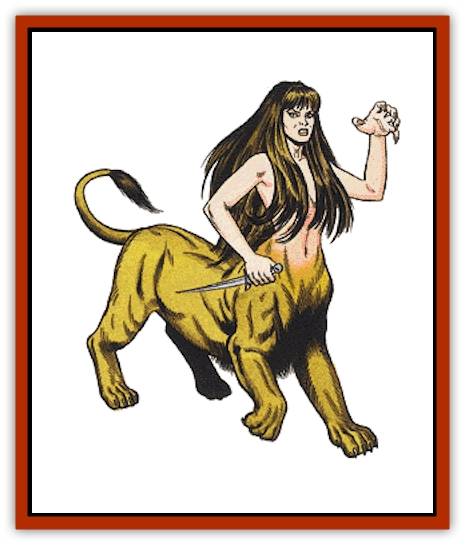

# Lamia

| Statistic | **Lamia** | **Lamia Noble** |
| --- | --- | --- |
| **Activity Cycle:** | Any | Any |
| **Alignment:** | Chaotic evil | Chaotic evil |
| **Armor Class:** | 3 | 3 |
| **Climate/Terrain:** | Deserts, caves, and ruined cities | Deserts, caves, and ruined cities |
| **Damage/Attack:** | 1-4 (weapon) | 1-6 (weapon) |
| **Diet:** | Carnivore | Carnivore |
| **Frequency:** | Very rare | Very rare |
| **Hit Dice:** | 9 | 10+1 |
| **Intelligence:** | High (13-14) | High (13-14) |
| **Magic Resistance:** | Nil | 30% |
| **Morale:** | Elite (14) | Elite (14) |
| **Movement:** | 24 | 9 |
| **No. Appearing:** | 1 | 1 |
| **No. of Attacks:** | 1 | 1 |
| **Organization:** | Solitary | Solitary |
| **Size:** | M | M |
| **Special Attacks:** | See below | See below |
| **Special Defenses:** | Nil | Nil |
| **THAC0:** | 11 | 11 |
| **Treasure:** | D | D |
| **XP Value:** | 3,000 | 4,000 |

Of all the hazards that the desert presents, few can compare with the cruel race of flesh-eating creatures known as lamias. These half-human, half-quadruped beast hybrids use deceit, speed, and spells to entrap the foolhardy adventurer who dares wander into their ruins.

Their upper torsos, arms, and heads resemble those of beautiful human women, while their lower bodies are those of beasts, such as goats, deer, or [[Cat_Great|lions]], with the appropriate coloration. This hybrid configuration makes lamias very fast and powerful. They are usually armed with daggers, which they use to carve up their prey for the feast. Lamias sometimes smell like perfume flowers, so as to attract unwary victims. They wear no clothing or jewelry. In communicating, they use the common tongue.

**Combat:** A lamia is able to use the following spells once per day: *charm person*, *mirror image*, *suggestion*, and *illusion* (as a wand). For purposes of duration, effect, etc. assume that the lamia casts its spells at 9th-level spell ability. These spells are typically used to lure persons to the lamia and then hold them there for the creature to devour at its leisure.

The lamia's touch permanently drains 1 point of Wisdom from a victim, and when his Wisdom drops below 3, he willingly does whatever the lamia tells him do. These orders often involve having the victim attack his compatriots while it continues whittling down their ranks. If it has a chance to drain the Wisdom of more than one victim, it will certainly do so. It may even use its *charm* spell to supplement its control over party members.

Among a lamia's favorite illusions to cast upon itself are the following: a lovely damsel in distress, a tough but beautiful female ranger, or an elf maiden. At times, it simply may cast an illusion of a lost child in distress or a group of peasants being attacked by a large beast, while hiding itself, awaiting the right moment to attack from the rear.

**Habitat/Society:** Lamias dwell in ruined cities or caves, places situated in desert or wasteland areas. These evil creatures are solitary beasts, sustaining themselves on the flesh of those who walk too close to their territories. During lean times, they supplement their diet by stalking game animals. Lamias hardly ever venture more than 10 miles from their lairs.

**Ecology:** Lamias are legendary monsters that prey upon travelers or guard hidden places or objects of power. They are mysterious creatures that seem devoted to the spreading of chaos and evil in their dwelling places.

**Lamia Noble**

  These beings rule over the lamias and the wild, lonely areas they inhabit. They differ from the normal lamias in that the lamia nobles' lower bodies are those of giant serpents and their upper bodies can be either male or female. It is rumored that the normal female lamia is born from the union of two nobles.

The males wield short swords and have 1d6 levels of wizard spells, plus the inherent spells *charm person*, *mirror image*, *suggestion*, and *illusion*. The females are unarmed and only attack with magic; they are more experienced magically and have 2d4 levels of wizard spells plus the usual inherent spells.

Like normal lamia, lamia nobles have the Wisdom-draining touch.

All lamia nobles are able to assume human form. In this guise they attempt to penetrate human society and wreak evil. They speak all of the languages of humans and demihumans. When in human form, they are recognizable as lamias by humans and demihumans only if the characters are of 7th level or higher, with a 5% cumulative chance per level above 6th. Priests and paladins receive an additional 15% chance (i.e., a 10th-level priest has a 35% chance). Lamia nobles are given to outbursts of senseless violence.

---
## Discovery & Documentation

**Source Publication:** MC2 Volume II (1993)
**Campaign Setting:** Advanced Dungeons & Dragons 2nd Edition
**Author(s):** Jay Batista, Scott Bennie, Grant Boucher, William W. Connors, Steve Gilbert, Heike Kubasch, James Lowder, David Edward Martin, Bruce Nesmith, Jean Rabe, Rick Swan, John J. Terra, Gary L. Thomas

### Other Creatures Found in This Source Book
   * [[Ant|Ant]]
   * [[Ant_Lion_Giant|Ant Lion, Giant]]
   * [[Ape_Carnivorous|Ape, Carnivorous]]
   * [[Baboon|Baboon]]
   * [[Badger|Badger]]
   * [[Barracuda|Barracuda]]
   * [[Beetle_Giant|Beetle, Giant]]
   * [[Bulette|Bulette]]
   * [[Bullywug|Bullywug]]
   * [[Dwarf_Duergar|Dwarf, Duergar]]
   * [[Dwarf_Gully|Dwarf, Gully]]
   * [[Eagle|Eagle]]
   * [[Eel|Eel]]
   * [[Elemental_Air_Kin|Elemental, Air Kin]]
   * [[Elemental_Water_Kin|Elemental, Water Kin]]
   * [[Elemental_Water_Kin_Water_Weird|Elemental, Water Kin, Water Weird]]
   * [[Firestar|Firestar]]
   * [[Firetail|Firetail]]
   * [[Fish_Giant|Fish, Giant]]
   * [[Frog|Frog]]
   * [[Gorgon|Gorgon]]
   * [[Hawk|Hawk]]
   * [[Heucuva|Heucuva]]
   * [[Hippocampus|Hippocampus]]
   * [[Hippogriff|Hippogriff]]
   * [[Kelpie|Kelpie]]
   * [[Kenku|Kenku]]
   * [[Killmoulis|Killmoulis]]
   * [[Kuo-Toa|Kuo-Toa]]
   * [[Lammasu|Lammasu]]
   * [[Lamprey|Lamprey]]
   * [[Leech|Leech]]
   * [[Leprechaun|Leprechaun]]
   * [[Leucrotta|Leucrotta]]
   * [[Locathah|Locathah]]
   * [[Lycanthrope_Wereboar|Lycanthrope, Wereboar]]
   * [[Lycanthrope_Werefox|Lycanthrope, Werefox]]
   * [[Mammal_Minimal|Mammal, Minimal]]
   * [[Mammal_Small|Mammal, Small]]
   * [[Mimic|Mimic]]
   * [[Morkoth|Morkoth]]
   * [[Muckdweller|Muckdweller]]
   * [[Myconid|Myconid]]
   * [[Naga|Naga]]
   * [[Obliviax|Obliviax]]
   * [[Octopus_Giant|Octopus, Giant]]
   * [[Otyugh|Otyugh]]
   * [[Piranha|Piranha]]
   * [[Plant_Dangerous_I|Plant, Dangerous I]]
   * [[Plant_Intelligent|Plant, Intelligent]]
   * [[Poltergeist|Poltergeist]]
   * [[Porcupine|Porcupine]]
   * [[Rat_Osquip|Rat, Osquip]]
   * [[Roc|Roc]]
   * [[Roper|Roper]]
   * [[Rot_Grub|Rot Grub]]
   * [[Rust_Monster|Rust Monster]]
   * [[Sahuagin|Sahuagin]]
   * [[Sea_Lion|Sea Lion]]
   * [[Sea_Horse_Giant|Sea Horse, Giant]]
   * [[Shambling_Mound|Shambling Mound]]
   * [[Shark|Shark]]
   * [[Sphinx|Sphinx]]
   * [[Squid_Giant|Squid, Giant]]
   * [[Stirge|Stirge]]
   * [[Swanmay|Swanmay]]
   * [[Tarrasque|Tarrasque]]
   * [[Tasloi|Tasloi]]
   * [[Triton|Triton]]
   * [[Troglodyte|Troglodyte]]
   * [[Urchin|Urchin]]
   * [[Urd|Urd]]
   * [[Weasel|Weasel]]
   * [[Wolverine|Wolverine]]
   * [[Yellow_Musk_Creeper|Yellow Musk Creeper]]
