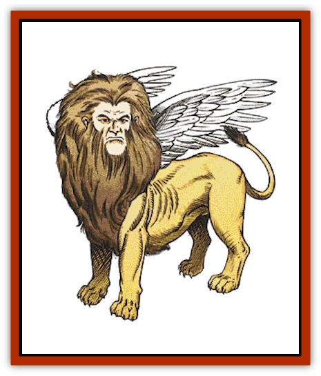

# Lammasu

| Statistic | **Greater** | **Lesser** |
| --- | --- | --- |
| **Activity Cycle:** | Day | Day |
| **Alignment:** | Lawful good | Lawful good |
| **Armor Class:** | 3 | 6 |
| **Climate/Terrain:** | Warm, with visits to other climes | Warm, with visits to other climes |
| **Damage/Attack:** | 2-12/2-12 | 1-6/1-6 |
| **Diet:** | Herbivore | Herbivore |
| **Frequency:** | Very rare | Rare |
| **Hit Dice:** | 12+7 | 7+7 |
| **Intelligence:** | Supra-genius (19-20) | Genius (17-18) |
| **Magic Resistance:** | 40% | 30% |
| **Morale:** | Champion (16) | Elite (14) |
| **Movement:** | 15, Fl 30 (B) | 12, Fl 24 (C) |
| **No. Appearing:** | 1-2 | 2-8 |
| **No. of Attacks:** | 2 | 2 |
| **Organization:** | Solitary (Pride) | Pride |
| **Size:** | L (5' high at shoulder) | L |
| **Special Attacks:** | See below | See below |
| **Special Defenses:** | See below | See below |
| **THAC0:** | 7 | 13 |
| **Treasure:** | Nil | R,S,T |
| **XP Value:** | 8,000 | 4,000 |

The lammasu, a winged leonine figure with a human head, aids and protects lawful good persons. They are generally kind and friendly to all good creatures.

Lammasu resemble golden-brown [[Cat_Great|lions]] with the wings of [[Eagle|eagles]] and the heads of men with shaggy hair and beards. Their formidable appearance is softened by their regal, compassionate, and beneficent expressions. They communicate in their own tongue, in common, and through a limited form of telepathy.

**Combat:** Since lammasu are concerned for the welfare and safety of good beings, they almost always enter combat if they see good creatures being threatened, in the way least likely to cause harm to the good beings.

Lammasu are able to become *invisible* or *dimension door* at will. They radiate a *protection from evil, 10' radius* (-2 penalty to all evil attacks, +2 bonus to saving throws against evil attacks). Additionally, they are able to use priest spells up to 4th level, at 7th-level proficiency. Lammasu can employ four 1st-level spells, three 2nd-level spells, two 3rd-level spells, and one 4th-level spell. They have *cure serious wounds* (4d8+2) and *cure critical wounds* (6d8+6), and 10% of lammasu can speak a *holy word* as well.

If all else fails, lammasu can attack with their two razor-sharp front claws, inflicting 1d6 points of damage each. If they choose to swoop down from the sky on a target, this damage is doubled.

**Habitat/Society:** The lammasu have a very structured and lawful society, reflecting their alignment. They are organized in prides, just like lions. They dwell in old, abandoned temples situated in warm regions. These temples have not lost their consecration, and in some way, the lammasu are the self-appointed resident guardians of these high and holy places. As a rule, only one pride of lammasu is ever found in a 25-mile area; they spread themselves out so they can respond quickly to any evil outburst.

Lammasu females fight as effectively as the males; for every four lammasu encountered, one is a female. When found in their lair, there are young equal to 25% of the adult population. Female lammasu have the heads of women, with long, hair.

Once a month, the pride leaders gather together to consort about how the war on evil goes. This grouping is called the Whitemoon, since it takes place on the first night of the full moon. There are usually 6d6 lammasu and 2d4 greater lammasu, with the latter presiding over the meeting. Such a gathering of lawful good causes the entire temple where they meet to glow in a pure light, until it breaks up at dawn. There is perhaps no safer place in all the world that night.

Though they dwell in warm areas, they occasionally visit every clime. They speak their own tongue as well as common. At times they use a limited form of telepathy.

Good-aligned strangers are always well received. Neutrals are watched carefully, but are treated politely unless the outsiders begin causing trouble. Evil beings are firmly asked to leave, and if they fail to do so, they are attacked by the pride. In case of trouble, there is a cumulative 10% chance per turn that a neighboring pride picks up a telepathic summons and come to help out the original pride. Lammasu harbor an especially strong dislike for [[Lamia|lamias]] and [[Manticore|manticores]]. Some foolish people confuse lammasu for manticores, which does little to improve the lammasu disposition toward them.

**Ecology:** Lammasu keep the wastelands from being completely overrun by evil creatures. Their aid to frontier settlements is beyond measurable value.

**Greater Lammasu**

  These creatures are slightly larger than a lesser lammasu and one or two may be found dwelling with a pride of six or more lesser lammasu. Greater lammasu can travel the Astral and Ethereal Planes, become *invisible*, *teleport without error* and *dimension door*, all at will. They radiate *protection from evil in a 20' radius* (-4 penalty to evil attacks and +4 bonus to saving throws) and have the curative powers of their lesser cousins. Their priest spells consist of five 1st-level, four 2nd-level, three 3rd-level, two 4th-level, and one 5th-level spell. Fifty percent of greater lammasu can speak a holy word as well. They cast spells as 12th-level priests.

Greater lammasu have empathy, telepathic communication, and speak their racial speech and the common tongue. Despite their greater stature, these lammasu are just as gentle and humble as their lesser brethren.

---
## Discovery & Documentation

**Source Publication:** MC2 Volume II (1993)
**Campaign Setting:** Advanced Dungeons & Dragons 2nd Edition
**Author(s):** Jay Batista, Scott Bennie, Grant Boucher, William W. Connors, Steve Gilbert, Heike Kubasch, James Lowder, David Edward Martin, Bruce Nesmith, Jean Rabe, Rick Swan, John J. Terra, Gary L. Thomas

### Other Creatures Found in This Source Book
   * [[Ant|Ant]]
   * [[Ant_Lion_Giant|Ant Lion, Giant]]
   * [[Ape_Carnivorous|Ape, Carnivorous]]
   * [[Baboon|Baboon]]
   * [[Badger|Badger]]
   * [[Barracuda|Barracuda]]
   * [[Beetle_Giant|Beetle, Giant]]
   * [[Bulette|Bulette]]
   * [[Bullywug|Bullywug]]
   * [[Dwarf_Duergar|Dwarf, Duergar]]
   * [[Dwarf_Gully|Dwarf, Gully]]
   * [[Eagle|Eagle]]
   * [[Eel|Eel]]
   * [[Elemental_Air_Kin|Elemental, Air Kin]]
   * [[Elemental_Water_Kin|Elemental, Water Kin]]
   * [[Elemental_Water_Kin_Water_Weird|Elemental, Water Kin, Water Weird]]
   * [[Firestar|Firestar]]
   * [[Firetail|Firetail]]
   * [[Fish_Giant|Fish, Giant]]
   * [[Frog|Frog]]
   * [[Gorgon|Gorgon]]
   * [[Hawk|Hawk]]
   * [[Heucuva|Heucuva]]
   * [[Hippocampus|Hippocampus]]
   * [[Hippogriff|Hippogriff]]
   * [[Kelpie|Kelpie]]
   * [[Kenku|Kenku]]
   * [[Killmoulis|Killmoulis]]
   * [[Kuo-Toa|Kuo-Toa]]
   * [[Lamia|Lamia]]
   * [[Lamprey|Lamprey]]
   * [[Leech|Leech]]
   * [[Leprechaun|Leprechaun]]
   * [[Leucrotta|Leucrotta]]
   * [[Locathah|Locathah]]
   * [[Lycanthrope_Wereboar|Lycanthrope, Wereboar]]
   * [[Lycanthrope_Werefox|Lycanthrope, Werefox]]
   * [[Mammal_Minimal|Mammal, Minimal]]
   * [[Mammal_Small|Mammal, Small]]
   * [[Mimic|Mimic]]
   * [[Morkoth|Morkoth]]
   * [[Muckdweller|Muckdweller]]
   * [[Myconid|Myconid]]
   * [[Naga|Naga]]
   * [[Obliviax|Obliviax]]
   * [[Octopus_Giant|Octopus, Giant]]
   * [[Otyugh|Otyugh]]
   * [[Piranha|Piranha]]
   * [[Plant_Dangerous_I|Plant, Dangerous I]]
   * [[Plant_Intelligent|Plant, Intelligent]]
   * [[Poltergeist|Poltergeist]]
   * [[Porcupine|Porcupine]]
   * [[Rat_Osquip|Rat, Osquip]]
   * [[Roc|Roc]]
   * [[Roper|Roper]]
   * [[Rot_Grub|Rot Grub]]
   * [[Rust_Monster|Rust Monster]]
   * [[Sahuagin|Sahuagin]]
   * [[Sea_Lion|Sea Lion]]
   * [[Sea_Horse_Giant|Sea Horse, Giant]]
   * [[Shambling_Mound|Shambling Mound]]
   * [[Shark|Shark]]
   * [[Sphinx|Sphinx]]
   * [[Squid_Giant|Squid, Giant]]
   * [[Stirge|Stirge]]
   * [[Swanmay|Swanmay]]
   * [[Tarrasque|Tarrasque]]
   * [[Tasloi|Tasloi]]
   * [[Triton|Triton]]
   * [[Troglodyte|Troglodyte]]
   * [[Urchin|Urchin]]
   * [[Urd|Urd]]
   * [[Weasel|Weasel]]
   * [[Wolverine|Wolverine]]
   * [[Yellow_Musk_Creeper|Yellow Musk Creeper]]
