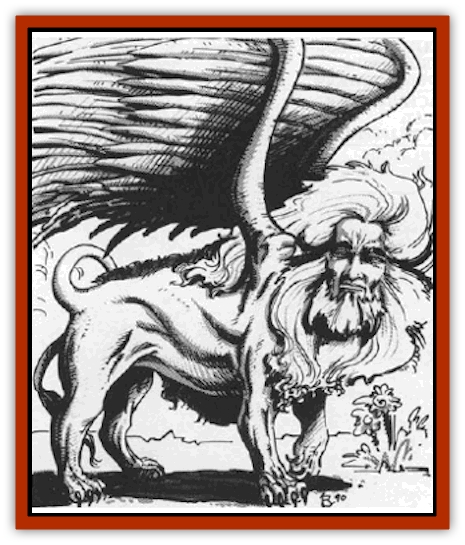

# Lammasu - Celestial

| Statistic | **Lammasu, Celestial** |
| --- | --- |
| **Activity Cycle:** | Any |
| **Alignment:** | Any good |
| **Armor Class:** | 3 |
| **Climate/Terrain:** | Olympus |
| **Damage/Attack:** | 2-12/2-12 |
| **Diet:** | See below |
| **Frequency:** | Rare |
| **Hit Dice:** | 20 (144 hp) |
| **Intelligence:** | Supra-genius (19-20) |
| **Magic Resistance:** | 70% |
| **Morale:** | Champion (15-16) |
| **Movement:** | 15, Fl 26 (C) |
| **No. Appearing:** | 1 |
| **No. of Attacks:** | 2 |
| **Organization:** | Solitary |
| **Size:** | L (12' long) |
| **Special Attacks:** | Dive attack, spell use |
| **Special Defenses:** | Spell use, regeneration, +3 or better weapons to hit |
| **THAC0:** | 5 |
| **Treasure:** | Nil |
| **XP Value:** | 108,500 |

Celestial lammasu are close relatives of the [[Lammasu|lammasu]] native to the Prime Material plane. These, however, make their homes among the wilderlands of Olympus. Celestial lammasu are sometimes also known as the "lions of the Mount", referring to Mount Olympus, in whose shadow they so often are found.

As might be expected, a celestial Lammasu has the body of a large, powerful <a href=\/appendix/catgreat">lion</a>. Extending from its back are great wings with long, beautiful feathers. Its head has the face of a human with keen, intelligent eyes and a long, flowing mane. Each individual has a very majestic appearance, projecting its power and belief in ultimate goodness.

Celestial lammasu pride themselves on the number of languages they speak - they will use their *tongues* ability if necessary.

**Combat:** Celestial lammasu are creatures of tremendous power and prowess in battle. They will readily enter any combat where creatures of good alignment are being threatened by evil. At times, the Lions of the Mount will even come to the aid of nonevil neutrals warring against evil,

The celestial lammasu's physical attack consists of two huge, raking paws that inflict 2-12 points of damage per hit. Due to the nature of the celestial lammasu, their claw attacks can damage creatures normally only hit by magical weapons. A celestial lammasu can also - when flying - dive down on its opponent with two claw attacks gaining +2 on its attack roll and inflicting double damage (4-24 per claw).

These outer planer denizens also have considerable spell power. They may cast priest spells as if they were 15th-level priests with major access to all spheres. In addition, they have the spell casting ability of a 12th-level wizard. They need not maintain spell lists as does a mortal wizard. Instead, they request their wizard spells daily from any school except necromantic.

In addition to their spell casting abilities, celestial lammasu have the following spell-like powers that can be used once per melee round, one at a time, at 20th level effect:

<ul><li>*cure light wounds*</li><li>*cure serious wounds*</li><li>*dispel evil*</li><li>*dispel magic*, 7 times per day</li><li>*holy word*, 3 times per day</li><li>*plane shift*</li><li>*protection from evil*, triple normal strength, extends around all good creatures within sight of the celestial lammasu</li><li>*teleport without error*</li><li>*tongues*, always active</li><li>wish, 1 time per day, only in times of dire need</li></ul>Celestial lammasu are immune to damage from nonmagical weapons and magical weapons of +3 or lesser enchantment. They naturally regenerate 4 hit points per melee round.

Celestial lammasu dwell in the layers of Olympus from which they wage constant war on evil throughout the outer and inner planes. They take special interest in lammasu on the Prime Material plane - the celestial lammasu provide guidance and occasional support to their mortal cousins. There are 36 celestial lammasu known to exist, each with its own true name.

Once every 10 years, one of the celestial lammasus will attend a special meeting, called a Whitemoon, with certain lammasu of the Prime Material plane. In attendance are the leaders of all the lammasu prides for hundreds of miles around. The leaders discuss their efforts against evil with each other and with the celestial lammasu. During the night of this Whitemoon, the lammasu temple glows a brilliant white that can be seen for many miles - it becomes a scintillating focus of goodness. Any evil creature that comes within one mile of the temple is destroyed outright and any nonevil neutral that approaches within one mile of the temple is put magically to sleep for the duration of the night.

One important note is that celestial lammasu do not directly serve a deity or power like the [[Aasimon_General_Information|aasimons]] do. Although their actions serve the interests of the powers of good alignment, they are concerned only with their own personal wars on evil.

**Ecology:** Celestial lammasu are above and outside the normal ecological cycle. They have absolutely no natural predatorial enemies. Too, they never feed on other life forms for sustenance; rather they draw nutrients directly from the goodness of the upper planes.

---
## Discovery & Documentation

**Source Publication:** MC8 Outer Planes Appendix (1990)
**Campaign Setting:** Planescape
**Author(s):** Timothy B. Brown, Jamie LaFountain

### Other Creatures Found in This Source Book
   * [[Aasimon_Agathinon|Aasimon, Agathinon]]
   * [[Aasimon_Deva|Aasimon, Deva]]
   * [[Aasimon_Light|Aasimon, Light]]
   * [[Aasimon_General_Information|Aasimon, General Information]]
   * [[Aasimon_Planetar|Aasimon, Planetar]]
   * [[Aasimon_Solar|Aasimon, Solar]]
   * [[Air_Sentinel|Air Sentinel]]
   * [[Animal_Lord|Animal Lord]]
   * [[Archon|Archon]]
   * [[Baatezu_Lesser_Abishai|Baatezu, Lesser, Abishai]]
   * [[Baatezu_Greater_Amnizu|Baatezu, Greater, Amnizu]]
   * [[Baatezu_Lesser_Barbazu|Baatezu, Lesser, Barbazu]]
   * [[Baatezu_Greater_Cornugon|Baatezu, Greater, Cornugon]]
   * [[Baatezu_Lesser_Erinyes|Baatezu, Lesser, Erinyes]]
   * [[Baatezu_General_Information|Baatezu, General Information]]
   * [[Baatezu_Greater_Gelugon|Baatezu, Greater, Gelugon]]
   * [[Baatezu_Lesser_Hamatula|Baatezu, Lesser, Hamatula]]
   * [[Baatezu_Lemure|Baatezu, Lemure]]
   * [[Baatezu_Least_Nupperibo|Baatezu, Least, Nupperibo]]
   * [[Baatezu_Lesser_Osyluth|Baatezu, Lesser, Osyluth]]
   * [[Baatezu_Greater_Pit_Fiend|Baatezu, Greater, Pit Fiend]]
   * [[Baatezu_Least_Spinagon|Baatezu, Least, Spinagon]]
   * [[Balaena|Balaena]]
   * [[Bariaur|Bariaur]]
   * [[Bebilith|Bebilith]]
   * [[Bodak|Bodak]]
   * [[Dog_Moon|Dog, Moon]]
   * [[Dragon_Adamantite|Dragon, Adamantite]]
   * [[Einheriar|Einheriar]]
   * [[Gehreleth|Gehreleth]]
   * [[Githyanki|Githyanki]]
   * [[Githzerai|Githzerai]]
   * [[Hordling|Hordling]]
   * [[Larva|Larva]]
   * [[Maelephant|Maelephant]]
   * [[Marut|Marut]]
   * [[Mediator|Mediator]]
   * [[Mortai|Mortai]]
   * [[Night_Hag|Night Hag]]
   * [[Nightmare|Nightmare]]
   * [[Noctral|Noctral]]
   * [[Per|Per]]
   * [[Phoenix|Phoenix]]
   * [[Slaad|Slaad]]
   * [[Tanar'ri_Greater_Babau|Tanar'ri, Greater, Babau]]
   * [[Tanar'ri_Greater_Chasme|Tanar'ri, Greater, Chasme]]
   * [[Tanar'ri_Greater_Nabassu|Tanar'ri, Greater, Nabassu]]
   * [[Tanar'ri_Least_Dretch|Tanar'ri, Least, Dretch]]
   * [[Tanar'ri_Least_Manes|Tanar'ri, Least, Manes]]
   * [[Tanar'ri_Least_Rutterkin|Tanar'ri, Least, Rutterkin]]
   * [[Tanar'ri_Lesser_Alu-Fiend|Tanar'ri, Lesser, Alu-Fiend]]
   * [[Tanar'ri_Lesser_Bar-Lgura|Tanar'ri, Lesser, Bar-Lgura]]
   * [[Tanar'ri_Lesser_Cambion|Tanar'ri, Lesser, Cambion]]
   * [[Tanar'ri_Lesser_Succubus|Tanar'ri, Lesser, Succubus]]
   * [[Tanar'ri_Guardian_Molydeus|Tanar'ri, Guardian, Molydeus]]
   * [[Tanar'ri_General_Information|Tanar'ri, General Information]]
   * [[Tanar'ri_True_Balor|Tanar'ri, True, Balor]]
   * [[Tanar'ri_True_Glabrezu|Tanar'ri, True, Glabrezu]]
   * [[Tanar'ri_True_Hezrou|Tanar'ri, True, Hezrou]]
   * [[Tanar'ri_True_Marilith|Tanar'ri, True, Marilith]]
   * [[Tanar'ri_True_Nalfeshnee|Tanar'ri, True, Nalfeshnee]]
   * [[Tanar'ri_True_Vrock|Tanar'ri, True, Vrock]]
   * [[Titan|Titan]]
   * [[Translator|Translator]]
   * [[T'uen-rin|T'uen-rin]]
   * [[Vaporighu|Vaporighu]]
   * [[Warden_Beast|Warden Beast]]
   * [[Yugoloth_Greater_Arcanaloth|Yugoloth, Greater, Arcanaloth]]
   * [[Yugoloth_Lesser_Dergoloth|Yugoloth, Lesser, Dergoloth]]
   * [[Yugoloth_Lesser_Hydroloth|Yugoloth, Lesser, Hydroloth]]
   * [[Yugoloth_General_Information|Yugoloth, General Information]]
   * [[Yugoloth_Lesser_Mezzoloth|Yugoloth, Lesser, Mezzoloth]]
   * [[Yugoloth_Greater_Nycaloth|Yugoloth, Greater, Nycaloth]]
   * [[Yugoloth_Lesser_Piscoloth|Yugoloth, Lesser, Piscoloth]]
   * [[Yugoloth_Greater_Ultroloth|Yugoloth, Greater, Ultroloth]]
   * [[Yugoloth_Lesser_Yagnoloth|Yugoloth, Lesser, Yagnoloth]]
   * [[Zoveri|Zoveri]]
