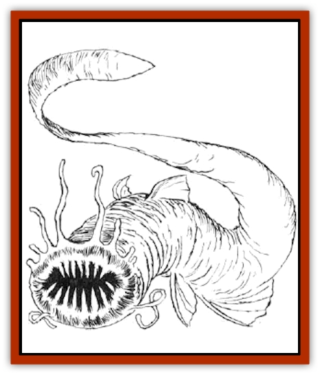

# Lamprey

| Statistic | **Giant** | **Land** | **Normal** |
| --- | --- | --- | --- |
| **Activity Cycle:** | Any | Any | Any |
| **Alignment:** | Neutral | Neutral | Neutral |
| **Armor Class:** | 6 | 7 | 7 |
| **Climate/Terrain:** | Deep waters | Any | Deep waters |
| **Damage/Attack:** | 1-6 | 1 hp/round | 1-2 |
| **Diet:** | Carnivore | Carnivore | Carnivore |
| **Frequency:** | Rare | Uncommon | Uncommon |
| **Hit Dice:** | 5 | 1+2 | 1+2 |
| **Intelligence:** | Non- (0) | Non- (0) | Non- (0) |
| **Magic Resistance:** | Nil | Nil | Nil |
| **Morale:** | Average (9) | Unsteady (7) | Unsteady (7) |
| **Movement:** | Sw 9 | 12 | Sw 12 |
| **No. Appearing:** | 1-4 | 2-12 | 1-2 |
| **No. of Attacks:** | 1 | 1 | 1 |
| **Organization:** | Solitary | Pack | Solitary |
| **Size:** | M (6' long) | S (3' long) | S (2' long) |
| **Special Attacks:** | Drain blood | See below | Drain blood |
| **Special Defenses:** | Nil | Nil | Nil |
| **THAC0:** | 15 | 18 | 18 |
| **Treasure:** | Nil | Nil | Nil |
| **XP Value:** | 270 | 120 | 65 |

Lampreys are [[Leech|leech]]-like [[Eel|eels]] that dwell in deep fresh and salt water. They feed by biting their victims, fastening on with their teeth, and draining blood from their prey.

These disgusting creatures are characterized by their sphincter like mouths ringed with sharp teeth. The average lamprey has a sickly brown-green-grayish coloring, with the salt water dwellers having a greater amount of gray.

**Combat:** They feed by biting their victims, fastening themselves by their sphincter-like mouths. Once attached and the initial damage is inflicted upon the victim, the lamprey begins to drain blood on the next and successive rounds. The rate of blood drain is equivalent to 2 hit points per Hit Die of the lamprey. Thus, a normal lamprey drains blood for 2 points of damage per round.

Sea lampreys are especially susceptible to fire, making their saving throws against fire-based attacks with a -2 penalty. Of course, any fire-based spell aimed at a lamprey attached to a victim means that he, too, must make a saving throw!

Once a lamprey attaches itself to a victim, the only way to remove it is by killing it. As a rule of thumb, a lamprey sucks blood equivalent to its hit points, then detaches itself. The victim of a giant lamprey, however, continues to bleed at a rate of 2 hit points worth of blood loss per round until the wound is bandaged.

**Habitat/Society:** Lampreys inhabit deep water areas and dwell in natural caves or coral formations. Lampreys have an unerring homing instinct that enables them to range up to two miles away from its lair,

A lamprey lair is notoriously devoid of treasure since they do not take their victims back to these places, preferring to suck the blood immediately upon encountering their prey.

Lampreys live to eat and reproduce. They are savage, nasty-tempered creatures. They are territorial and vigorously defend their lairs. Usually, 4d6 lamprey eggs can be found in a lair.

**Ecology:** In salt water environs, [[Shark|sharks]] enjoy feeding on giant lampreys. It could be argued that the presence of these sea lampreys keeps down the number of shark attacks on coastal communities.

**Land Lamprey**

  A land lamprey is only about three feet long but fairly thick and heavy. Coloration ranges from light green to blackish green. This color scheme enables the land lamprey to hide in greenery such as bushes or tall grass with a 75% chance of suscess.

Land lampreys are mutated versions of sea lampreys. They breathe air and move in a snake-like fashion. Land lampreys may be found in almost any climate except desert or extreme cold. They prefer dark and damp environments; like their aquatic counterparts, they favor small caves for lairs.

Land lampreys feed as do aquatic ones. Once attached (a hit for 1 point of damage), a land lamprey drains blood for three consecutive rounds, unless killed or removed, for 1 point of damage per round.

In addition, while attached to a character, each lamprey encumbers an individual; this is equivalent to a loss of 1 point of Dexterity per lamprey attached. Land lampreys can be removed only by killing them or exposing them to fire, whereupon they release their hold in an effort to avoid the flames.

---
## Discovery & Documentation

**Source Publication:** MC2 Volume II (1993)
**Campaign Setting:** Advanced Dungeons & Dragons 2nd Edition
**Author(s):** Jay Batista, Scott Bennie, Grant Boucher, William W. Connors, Steve Gilbert, Heike Kubasch, James Lowder, David Edward Martin, Bruce Nesmith, Jean Rabe, Rick Swan, John J. Terra, Gary L. Thomas

### Other Creatures Found in This Source Book
   * [[Ant|Ant]]
   * [[Ant_Lion_Giant|Ant Lion, Giant]]
   * [[Ape_Carnivorous|Ape, Carnivorous]]
   * [[Baboon|Baboon]]
   * [[Badger|Badger]]
   * [[Barracuda|Barracuda]]
   * [[Beetle_Giant|Beetle, Giant]]
   * [[Bulette|Bulette]]
   * [[Bullywug|Bullywug]]
   * [[Dwarf_Duergar|Dwarf, Duergar]]
   * [[Dwarf_Gully|Dwarf, Gully]]
   * [[Eagle|Eagle]]
   * [[Eel|Eel]]
   * [[Elemental_Air_Kin|Elemental, Air Kin]]
   * [[Elemental_Water_Kin|Elemental, Water Kin]]
   * [[Elemental_Water_Kin_Water_Weird|Elemental, Water Kin, Water Weird]]
   * [[Firestar|Firestar]]
   * [[Firetail|Firetail]]
   * [[Fish_Giant|Fish, Giant]]
   * [[Frog|Frog]]
   * [[Gorgon|Gorgon]]
   * [[Hawk|Hawk]]
   * [[Heucuva|Heucuva]]
   * [[Hippocampus|Hippocampus]]
   * [[Hippogriff|Hippogriff]]
   * [[Kelpie|Kelpie]]
   * [[Kenku|Kenku]]
   * [[Killmoulis|Killmoulis]]
   * [[Kuo-Toa|Kuo-Toa]]
   * [[Lamia|Lamia]]
   * [[Lammasu|Lammasu]]
   * [[Leech|Leech]]
   * [[Leprechaun|Leprechaun]]
   * [[Leucrotta|Leucrotta]]
   * [[Locathah|Locathah]]
   * [[Lycanthrope_Wereboar|Lycanthrope, Wereboar]]
   * [[Lycanthrope_Werefox|Lycanthrope, Werefox]]
   * [[Mammal_Minimal|Mammal, Minimal]]
   * [[Mammal_Small|Mammal, Small]]
   * [[Mimic|Mimic]]
   * [[Morkoth|Morkoth]]
   * [[Muckdweller|Muckdweller]]
   * [[Myconid|Myconid]]
   * [[Naga|Naga]]
   * [[Obliviax|Obliviax]]
   * [[Octopus_Giant|Octopus, Giant]]
   * [[Otyugh|Otyugh]]
   * [[Piranha|Piranha]]
   * [[Plant_Dangerous_I|Plant, Dangerous I]]
   * [[Plant_Intelligent|Plant, Intelligent]]
   * [[Poltergeist|Poltergeist]]
   * [[Porcupine|Porcupine]]
   * [[Rat_Osquip|Rat, Osquip]]
   * [[Roc|Roc]]
   * [[Roper|Roper]]
   * [[Rot_Grub|Rot Grub]]
   * [[Rust_Monster|Rust Monster]]
   * [[Sahuagin|Sahuagin]]
   * [[Sea_Lion|Sea Lion]]
   * [[Sea_Horse_Giant|Sea Horse, Giant]]
   * [[Shambling_Mound|Shambling Mound]]
   * [[Shark|Shark]]
   * [[Sphinx|Sphinx]]
   * [[Squid_Giant|Squid, Giant]]
   * [[Stirge|Stirge]]
   * [[Swanmay|Swanmay]]
   * [[Tarrasque|Tarrasque]]
   * [[Tasloi|Tasloi]]
   * [[Triton|Triton]]
   * [[Troglodyte|Troglodyte]]
   * [[Urchin|Urchin]]
   * [[Urd|Urd]]
   * [[Weasel|Weasel]]
   * [[Wolverine|Wolverine]]
   * [[Yellow_Musk_Creeper|Yellow Musk Creeper]]
