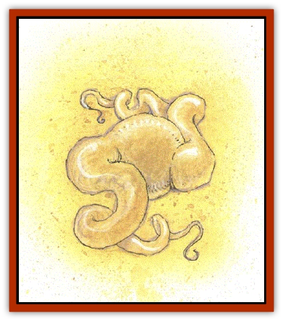

# Laraken

| Statistic | **Laraken** |
| --- | --- |
| **Activity Cycle:** | Any |
| **Alignment:** | Neutral Evil |
| **Armor Class:** | 6 |
| **Climate/Terrain:** | Swamp |
| **Damage/Attack:** | 2-5 (1d4+1) |
| **Diet:** | Magic |
| **Frequency:** | Very Rare |
| **Hit Dice:** | 15 |
| **Intelligence:** | Low (5-7) |
| **Magic Resistance:** | Special |
| **Morale:** | Champion (15-16) |
| **Movement:** | 12 |
| **No. Appearing:** | 1 |
| **No. of Attacks:** | 1 + absorbtion |
| **Organization:** | Solitary |
| **Size:** | L (10' diameter sphere) |
| **Special Attacks:** | Drain magic, spell use |
| **Special Defenses:** | See below |
| **THAC0:** | 5 |
| **Treasure:** | Nil |
| **XP Value:** | 15,000 |

A laraken, also known as a magic-drainer, appears as a shining yellow sphere. It can wink out at will, reappearing elsewhere in a moment. Laraken are distant relatives of nishruu, and are for the most part confined to the swamplands, for their yellow bodies must stay wet or they become very uncomfortable. They have a pair of yellow tentacles which protrude from opposite points on the sphere.

**Combat:** The laraken is capable of lashing out with one tentacle once per round, which inflicts 1d4+1 points of damage per hit. The hit also drains a spell from any spellcaster, or a charge or a plus from a magical item. As it drains these, it gains the power it has absorbed.

A laraken feeds on magical energy. It is capable of absorbing any spell energy directed at it. It also gains the power of whatever the tentacle has drained. If it hits a magical sword, and drains a plus, it receives a +1 bonus to hit and damage. If it drains a spell from a mage, it is able to cast that spell. The laraken prefers to drain memorized spells, then charges from magical items with spell-like effects, then pluses from magical items. The laraken drains the highest-level spell that a spellcaster has memorized. If the victim possesses two or more spells of the same level, the spell drained is randomly chosen. The spellcaster must make a saving throw versus death magic, adjusted for wisdom, or fall unconscious for 1d10 turns.

The laraken's tentacles can each take ten percent of the total hit points of the creature before being severed. A weapon which hits the tentacle is subject to the effects of the touch. These tentacles can be regenerated. To do so, the laraken redirects one spell level per hit point of the tentacle that it has absorbed. The laraken does not receive any bonuses, or spell effects for the levels it has redirected to regeneration.

Laraken hate all intelligent life, and always attack when they sense a party that possesses spellcasters or magic. They will not follow a party onto dry land.

**Habitat/Society:** Laraken were brought here when a great conjurer, Akhlaur, summoned them from their alternate prime material plane. On their own plane, they lived in a very wet, swamp country. They are uncomfortable in humidity of less than 95%, so even the Shining South is a very dry place to a laraken. Since the laraken feed off magic, the gate to the elemental plane of water, with its enchanted water gushing through and spreading the Akhlaur swamp, provides perfect food.

**Ecology:** Laraken feed only on magic. They attack merely because of the intense hatred for those who summoned them, which they consider to be anything of roughly humanoid shape.

Laraken reproduce by absorbing a *regenerate* spell; this allows them to grow a new laraken from a severed tentacle. It is thought that they had other means of reproducing on their own plane, but those conditions do not exist here. This means, thankfully, that laraken are very rare, and are likely to remain so. Laraken need to absorb the equivalent of three spell levels per day. A laraken can also use three spell levels to regenerate 1 hp of damage.

---
## Discovery & Documentation

**Source Publication:** Monstrous Compendium, 1994 Annual, Volume 1 (1995)
**Campaign Setting:** Advanced Dungeons & Dragons 2nd Edition
**Author(s):** David Wise

### Other Creatures Found in This Source Book
   * [[Abyss_Ant|Abyss Ant]]
   * [[Achaierai|Achaierai]]
   * [[Afanc|Afanc]]
   * [[Al-Jahar|Al-Jahar]]
   * [[Baelnorn|Baelnorn]]
   * [[Baneguard|Baneguard]]
   * [[Banelar|Banelar]]
   * [[Bird_Talking|Bird, Talking]]
   * [[Blazing_Bones|Blazing Bones]]
   * [[Campestri|Campestri]]
   * [[Caniquine|Caniquine]]
   * [[Cat_Winged|Cat, Winged]]
   * [[Crypt_Servant|Crypt Servant]]
   * [[Death's_Head_Tree|Death's Head Tree]]
   * [[Dog_Saluqi|Dog, Saluqi]]
   * [[Dragon_Electrum|Dragon, Electrum]]
   * [[Dragon_Fang|Dragon, Fang]]
   * [[Dragon_Linnorm_Corpse_Tearer|Dragon, Linnorm, Corpse Tearer]]
   * [[Dragon_Linnorm_Dread|Dragon, Linnorm, Dread]]
   * [[Dragon_Linnorm_Flame|Dragon, Linnorm, Flame]]
   * [[Dragon_Linnorm_Forest|Dragon, Linnorm, Forest]]
   * [[Dragon_Linnorm_Frost|Dragon, Linnorm, Frost]]
   * [[Dragon_Linnorm_Gray|Dragon, Linnorm, Gray]]
   * [[Dragon_Linnorm_Land|Dragon, Linnorm, Land]]
   * [[Dragon_Linnorm_Midgard|Dragon, Linnorm, Midgard]]
   * [[Dragon_Linnorm_Rain|Dragon, Linnorm, Rain]]
   * [[Dragon_Linnorm_Sea|Dragon, Linnorm, Sea]]
   * [[Dragon_Neutral_Jacinth|Dragon, Neutral, Jacinth]]
   * [[Dragon_Neutral_Jade|Dragon, Neutral, Jade]]
   * [[Dragon_Neutral_Pearl|Dragon, Neutral, Pearl]]
   * [[Dread|Dread]]
   * [[Dragon-kin|Dragon-kin]]
   * [[Elemental_Earth_Kin_Chrysmal|Elemental, Earth Kin, Chrysmal]]
   * [[Elemental_Earth_Kin_Earth_Weird|Elemental, Earth Kin, Earth Weird]]
   * [[Elemental_Fire_Kin_Azer|Elemental, Fire Kin, Azer]]
   * [[Elemental_Sandman|Elemental, Sandman]]
   * [[Elemental_Wind_Walker|Elemental, Wind Walker]]
   * [[Elemental_Vermin|Elemental Vermin]]
   * [[Feystag|Feystag]]
   * [[Flame_Skull|Flame Skull]]
   * [[Foulwing|Foulwing]]
   * [[Gambado|Gambado]]
   * [[Garbug|Garbug]]
   * [[Genie_Tasked_Administrator|Genie, Tasked, Administrator]]
   * [[Genie_Tasked_Deceiver|Genie, Tasked, Deceiver]]
   * [[Genie_Tasked_Harim_Servant|Genie, Tasked, Harim Servant]]
   * [[Genie_Tasked_Messenger|Genie, Tasked, Messenger]]
   * [[Genie_Tasked_Miner|Genie, Tasked, Miner]]
   * [[Genie_Tasked_Oathbinder|Genie, Tasked, Oathbinder]]
   * [[Gibbering_Mouther|Gibbering Mouther]]
   * [[Gnasher|Gnasher]]
   * [[Gnasher_Winged|Gnasher, Winged]]
   * [[Golem_Brain|Golem, Brain]]
   * [[Golem_Hammer|Golem, Hammer]]
   * [[Golem_Metagolem|Golem, Metagolem]]
   * [[Golem_Spiderstone|Golem, Spiderstone]]
   * [[Gorynych|Gorynych]]
   * [[Greelox|Greelox]]
   * [[Helmed_Horror|Helmed Horror]]
   * [[Jarbo|Jarbo]]
   * [[Lich_Psionic|Lich, Psionic]]
   * [[Living_Steel|Living Steel]]
   * [[Lock_Lurker|Lock Lurker]]
   * [[Loxo|Loxo]]
   * [[Lycanthrope_Loup_de_Noir|Lycanthrope, Loup de Noir]]
   * [[Lycanthrope_Werebadger|Lycanthrope, Werebadger]]
   * [[Lycanthrope_Werejaguar|Lycanthrope, Werejaguar]]
   * [[Lythlyx|Lythlyx]]
   * [[Magebane|Magebane]]
   * [[Marrashi|Marrashi]]
   * [[Metalmaster|Metalmaster]]
   * [[Mimic_House_Hunter|Mimic, House Hunter]]
   * [[Naga_Bone|Naga, Bone]]
   * [[Nautilus_Giant|Nautilus, Giant]]
   * [[Nightshade_Toril|Nightshade (Toril)]]
   * [[Nishruu|Nishruu]]
   * [[Noran|Noran]]
   * [[Opinicus|Opinicus]]
   * [[Ormyrr|Ormyrr]]
   * [[Parasite|Parasite]]
   * [[Pasari-Niml|Pasari-Niml]]
   * [[Plant_Vampire_Moss|Plant, Vampire Moss]]
   * [[Pteraman|Pteraman]]
   * [[Rautym|Rautym]]
   * [[Shadeling|Shadeling]]
   * [[Skum|Skum]]
   * [[Snake_Giant_Cobra|Snake, Giant Cobra]]
   * [[Snake_Stone|Snake, Stone]]
   * [[Spectral_Wizard|Spectral Wizard]]
   * [[Spell_Weaver|Spell Weaver]]
   * [[Spider_Brain|Spider, Brain]]
   * [[Suwyze|Suwyze]]
   * [[Tatalla|Tatalla]]
   * [[Tick_Heart|Tick, Heart]]
   * [[Tree_Dark|Tree, Dark]]
   * [[Tree_Singing|Tree, Singing]]
   * [[Tressym|Tressym]]
   * [[Troll_Snow|Troll, Snow]]
   * [[Tuyewera|Tuyewera]]
   * [[Ulitharid|Ulitharid]]
   * [[Undead_Dwarf|Undead Dwarf]]
   * [[Undead_Lake_Monster|Undead Lake Monster]]
   * [[Whipsting|Whipsting]]
   * [[Windghost|Windghost]]
   * [[Wolf_Dread|Wolf, Dread]]
   * [[Wolf_Stone|Wolf, Stone]]
   * [[Wolf_Vampiric|Wolf, Vampiric]]
   * [[Wraith_Shimmering|Wraith, Shimmering]]
   * [[Xantravar|Xantravar]]
   * [[Xaver|Xaver]]
