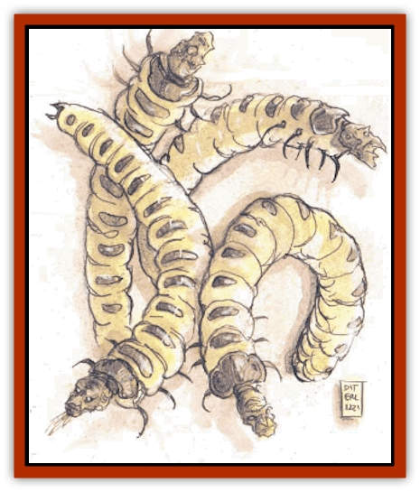

# Larva

| Statistic | **Larva** |
| --- | --- |
| **Activity Cycle:** | Any |
| **Alignment:** | Any evil |
| **Armor Class:** | 7 |
| **Climate/Terrain:** | Lower Planes |
| **Damage/Attack:** | 1d4+1 |
| **Diet:** | Unknown |
| **Frequency:** | Common |
| **Hit Dice:** | 1-1 |
| **Intelligence:** | Semi- (2-4) |
| **Magic Resistance:** | Nil |
| **Morale:** | Unreliable (2-4) |
| **Movement:** | 3 |
| **No. Appearing:** | 10-100 |
| **No. of Attacks:** | 1 |
| **Organization:** | Masses |
| **Size:** | M (5' long) |
| **Special Attacks:** | Wounding, disease |
| **Special Defenses:** | Nil |
| **THAC0:** | 20 |
| **Treasure:** | Nil |
| **XP Value:** | 35 |

Among the odder treasures of Castle Neutomas is a branding iron bearing a letter from an alphabet of the Lower Planes. Famed planar traveler Mordeia the Great tells how she got it in her *Signs and Wonders: A Planar Tour*.

"We had managed to go undetected in the Gray Wastes by disguising ourselves as a [[Lich|lich]] and its court. Our plan seemed to be working well. Then we heard a great liquid sound that brought to mind the sound of dogs retching. From across the plain came a vast herd of larvae, driven by mephit drovers at the command of three [[Night_Hag|night hags]] riding [[Nightmare|nightmares]]. The mephits flew above the (almost liquid) herd, driving them along with sprays of fire and salt. We estimated that perhaps three or four thousand of the creatures wormed their way along, covering the plains in a sticky foul smelling slime. One of the mephits spotted us and flew our way, bearing greetings from its mistress and inquiring if we were interested in buying any of the herd.

"Not wanting to give ourselves away, we expressed casual interest, but asked how we could he sure the herd belonged to these hags? The mephit whistled, and two of its kind pulled one of the great sticky worms from the mass and flew it our way. They showed us clearly that the larva had been branded.

"I said that we would indeed he interested in looking over the stock (thinking that, if need be, we could escape using our cubic gate). The hags joined us. For a time we made small talk, and I asked if I could see a branding operation. The mephits pulled forth an unmarked larva, a new arrival that had just materialized among the others. A lava mephit began to heat the iron. I walked over and picked up a cold branding iron (they had three, one for each hag). I sauntered back to my party, and we activated the cubic gate.

"That branding iron now ranks among my favorite trophies from my many travels."

Larvae, evil dead from other planes who led especially selfish lives, are now doomed to spend their wretched existences serving evil on the Lower Planes. Larvae are horrifying 5'-long worms, sickly yellow and covered with viscous, foul-smelling fluid. Instead of a worm's head, they have distorted faces resembling the mortals they were in life.

Larvae communicate with one another through instinctive body movements that cannot be interpreted by others.

**Combat:** Larvae have no will of their own and simply lie in giant, quivering masses on the grounds of the Gray Waste. However, when commanded by a greater power - that is, just about anything in the Waste - larva will attack en masse.

These foul creatures bite (1d4+1 damage) that bleeds for 1 additional hp damage per round until bound. In addition, anyone bitten by a larva must successfully save vs. poison or contract a rotting disease. Those contracting the disease develop a painful skin rot. After three weeks, they lose 4 hp a day unless they lie absolutely still. After one month, they die. A *cure disease* spell destroys the disease.

**Habitat/Society:** Night hags herd larvae to use them as bargaining chips in the Gray Waste. Lower planar powers use the larvae to form [[Imp|quasits]] and [[Imp|imps]], and in return they agree not to enter night hag territories. Powerful liches feed on larval energies to maintain their undead immortality, and in return the liches destroy creatures who refuse to trade with the hags. The complex bartering system is sustained by the growing numbers of lower planar inhabitants.

Few rumors exist of the fortress/palace of Malsheem on Baator's ninth layer. The most powerful [[Baatezu_General_Information|baatezu]] do speak of one future event: The Bringing. [[Baatezu_General_Information|The Dark Eight]] plot The Bringing to ensure the destruction of their hated enemies, the [[Tanar'ri_General_Information|tanar'ri]]. The ceremonies to invoke The Bringing will be long and dangerous (although whatever could endanger a [[Baatezu_Greater_Pit_Fiend|pit fiend]] can only be guessed at), and titanic magical energies will be released. To fuel the great spell, the life forces of a million larvae must be utterly destroyed. Although the rumor's truth is uncertain, the baatezu have been acquiring larvae from the night hags at an unusually rapid pace.

**Ecology:** Larvae are the sole means for creating imps and quasits. Because imps and quasits later advance to become greater fiends, larvae are the foundation of the population of the Lower Planes.

Because all larvae are equally lowly, fiends select them randomly to transform into other types of creatures are needed. How the larvae become higher creatures depends on the fiends that transform them. The baatezu, for example, cast the larvae into pools of flame, where the larvae suffer for 11 days before emerging as cruel new creatures. Other fiends have different ways to promote larvae.

---
## Discovery & Documentation

**Source Publication:** MC8 Outer Planes Appendix (1990)
**Campaign Setting:** Planescape
**Author(s):** Timothy B. Brown, Jamie LaFountain

### Other Creatures Found in This Source Book
   * [[Aasimon_Agathinon|Aasimon, Agathinon]]
   * [[Aasimon_Deva|Aasimon, Deva]]
   * [[Aasimon_Light|Aasimon, Light]]
   * [[Aasimon_General_Information|Aasimon, General Information]]
   * [[Aasimon_Planetar|Aasimon, Planetar]]
   * [[Aasimon_Solar|Aasimon, Solar]]
   * [[Air_Sentinel|Air Sentinel]]
   * [[Animal_Lord|Animal Lord]]
   * [[Archon|Archon]]
   * [[Baatezu_Lesser_Abishai|Baatezu, Lesser, Abishai]]
   * [[Baatezu_Greater_Amnizu|Baatezu, Greater, Amnizu]]
   * [[Baatezu_Lesser_Barbazu|Baatezu, Lesser, Barbazu]]
   * [[Baatezu_Greater_Cornugon|Baatezu, Greater, Cornugon]]
   * [[Baatezu_Lesser_Erinyes|Baatezu, Lesser, Erinyes]]
   * [[Baatezu_General_Information|Baatezu, General Information]]
   * [[Baatezu_Greater_Gelugon|Baatezu, Greater, Gelugon]]
   * [[Baatezu_Lesser_Hamatula|Baatezu, Lesser, Hamatula]]
   * [[Baatezu_Lemure|Baatezu, Lemure]]
   * [[Baatezu_Least_Nupperibo|Baatezu, Least, Nupperibo]]
   * [[Baatezu_Lesser_Osyluth|Baatezu, Lesser, Osyluth]]
   * [[Baatezu_Greater_Pit_Fiend|Baatezu, Greater, Pit Fiend]]
   * [[Baatezu_Least_Spinagon|Baatezu, Least, Spinagon]]
   * [[Balaena|Balaena]]
   * [[Bariaur|Bariaur]]
   * [[Bebilith|Bebilith]]
   * [[Bodak|Bodak]]
   * [[Dog_Moon|Dog, Moon]]
   * [[Dragon_Adamantite|Dragon, Adamantite]]
   * [[Einheriar|Einheriar]]
   * [[Gehreleth|Gehreleth]]
   * [[Githyanki|Githyanki]]
   * [[Githzerai|Githzerai]]
   * [[Hordling|Hordling]]
   * [[Lammasu_Celestial|Lammasu, Celestial]]
   * [[Maelephant|Maelephant]]
   * [[Marut|Marut]]
   * [[Mediator|Mediator]]
   * [[Mortai|Mortai]]
   * [[Night_Hag|Night Hag]]
   * [[Nightmare|Nightmare]]
   * [[Noctral|Noctral]]
   * [[Per|Per]]
   * [[Phoenix|Phoenix]]
   * [[Slaad|Slaad]]
   * [[Tanar'ri_Greater_Babau|Tanar'ri, Greater, Babau]]
   * [[Tanar'ri_Greater_Chasme|Tanar'ri, Greater, Chasme]]
   * [[Tanar'ri_Greater_Nabassu|Tanar'ri, Greater, Nabassu]]
   * [[Tanar'ri_Least_Dretch|Tanar'ri, Least, Dretch]]
   * [[Tanar'ri_Least_Manes|Tanar'ri, Least, Manes]]
   * [[Tanar'ri_Least_Rutterkin|Tanar'ri, Least, Rutterkin]]
   * [[Tanar'ri_Lesser_Alu-Fiend|Tanar'ri, Lesser, Alu-Fiend]]
   * [[Tanar'ri_Lesser_Bar-Lgura|Tanar'ri, Lesser, Bar-Lgura]]
   * [[Tanar'ri_Lesser_Cambion|Tanar'ri, Lesser, Cambion]]
   * [[Tanar'ri_Lesser_Succubus|Tanar'ri, Lesser, Succubus]]
   * [[Tanar'ri_Guardian_Molydeus|Tanar'ri, Guardian, Molydeus]]
   * [[Tanar'ri_General_Information|Tanar'ri, General Information]]
   * [[Tanar'ri_True_Balor|Tanar'ri, True, Balor]]
   * [[Tanar'ri_True_Glabrezu|Tanar'ri, True, Glabrezu]]
   * [[Tanar'ri_True_Hezrou|Tanar'ri, True, Hezrou]]
   * [[Tanar'ri_True_Marilith|Tanar'ri, True, Marilith]]
   * [[Tanar'ri_True_Nalfeshnee|Tanar'ri, True, Nalfeshnee]]
   * [[Tanar'ri_True_Vrock|Tanar'ri, True, Vrock]]
   * [[Titan|Titan]]
   * [[Translator|Translator]]
   * [[T'uen-rin|T'uen-rin]]
   * [[Vaporighu|Vaporighu]]
   * [[Warden_Beast|Warden Beast]]
   * [[Yugoloth_Greater_Arcanaloth|Yugoloth, Greater, Arcanaloth]]
   * [[Yugoloth_Lesser_Dergoloth|Yugoloth, Lesser, Dergoloth]]
   * [[Yugoloth_Lesser_Hydroloth|Yugoloth, Lesser, Hydroloth]]
   * [[Yugoloth_General_Information|Yugoloth, General Information]]
   * [[Yugoloth_Lesser_Mezzoloth|Yugoloth, Lesser, Mezzoloth]]
   * [[Yugoloth_Greater_Nycaloth|Yugoloth, Greater, Nycaloth]]
   * [[Yugoloth_Lesser_Piscoloth|Yugoloth, Lesser, Piscoloth]]
   * [[Yugoloth_Greater_Ultroloth|Yugoloth, Greater, Ultroloth]]
   * [[Yugoloth_Lesser_Yagnoloth|Yugoloth, Lesser, Yagnoloth]]
   * [[Zoveri|Zoveri]]
