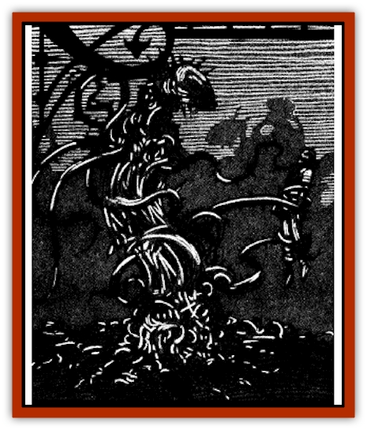

# Lashweed

| Statistic | **Lashweed** |
| --- | --- |
| **Activity Cycle:** | Night |
| **Alignment:** | Neutral |
| **Armor Class:** | 7 |
| **Climate/Terrain:** | Ravenloft |
| **Damage/Attack:** | 1d4 (&times;4) |
| **Diet:** | Blood |
| **Frequency:** | Rare |
| **Hit Dice:** | 4 |
| **Intelligence:** | Semi- (2-4) |
| **Magic Resistance:** | 20% |
| **Morale:** | Fearless (19-20) |
| **Movement:** | 9 |
| **No. Appearing:** | 2-20 (2d10) |
| **No. of Attacks:** | 4 |
| **Organization:** | Patch |
| **Size:** | M (5' tall) |
| **Special Attacks:** | Spit poison &amp; entangle |
| **Special Defenses:** | Spell immunity |
| **THAC0:** | 17 |
| **Treasure:** | Nil (I) |
| **XP Value:** | 270 |

Lashweeds spew a terrible poison into the eyes of their prey, then move in for the kill with slashing tendrils. Even those victims fortunate enough to retain their sight will have a difficult time escaping the fell plants as lashweeds can slither through the thickest vegetation as if it weren't there, easily overtaking their prey as it tumbles through the clutching brush.

Lashweeds are large plants composed of a collection of veiny stems coiled about a central stalk. The stalk is a disgusting black color with porous skin from which seeps the digested blood of the lashweed's victims. The leaves are a dark green hue with serrated edges stained a deep crimson. The plant's "feet" are a veiny mass of wiggling fibers that allow it to catch their stunned prey.

These terrible plants emit a drumlike pounding when hunting. It is highly likely that this is part of an echo location system similar to that employed by [[Bat|bats]] or [[Dolphin|dolphins]]. There are those who say that this unnerving pounding is also a means of communication, but none have survived long enough in the company of these plants to say whether that is true or not.

**Combat:** Lashweeds can sense the vibrations that animals and men make when they walk upon the earth. Any creature of small or larger size will be noticed when it comes within 20' of a patch. When this happens. the plant slowly begins to shamble toward the prey until it is within striking range.

Because they blend into any thick vegetation, lashweed plants impose a -2 penalty on their victim's surprise rolls in such environments. Alert characters can usually hear rustling in the foliage around them, negating this penalty.

Just before it strikes, the plant quickly emits its deep pounding sound several times to establish the exact position of its target.

Lashweeds always begin their attacks by spitting a poison at their opponents. Immediately after it has located its target, the plant releases a cloud of black spray that forms a cone 10 feet long and 6 feet wide at its base. Anyone within this cone must make a saving throw vs. poison or be blinded for 1d4 days. While blinded the character attacks and saves at -4. Each plant may spit only once in any three-hour period.

Once it has blinded its enemies, the plant moves in for the kill. Each lashweed has four special tendrils that strike like barbed whips. A successful hit by one of these limbs tears into the target's flesh, causing 1-4 points of damage. All four of the limbs may attack a single target or each may strike independently of the others. When the plant attacks, all other lashweeds in the patch are attracted to the melee and overcome by a desire for the victim's blood.

Should their prey attempt to flee, lashweeds are quick to pursue. No matter how dense the foliage they are moving through, lashweed plants are not slowed in any way. This is identical to the special ability that Druid characters receive at 3rd level. This, when combined with the weed's ability to cast an *entangle* spell thrice per day, makes it almost impossible to escape from the slashing tendrils of these dreadful plants.

**Habitat/Society:** Lashweeds live in patches of 2-20 individual plants. The patch spreads itself out over a wide area. usually forming a rough circle with 20 or 30 feet between each weed.

**Ecology:** [[Human_Vistana|Vistani]] claim that lashweed was created when a band of druids fought together against a powerful necromancer. The defeated druids were staked out in the fiends to die. The men chanted in unison throughout the long day, cursing the necromancer for their fate. The Dark Powers sensed their anguish and somehow transformed them into a patch of living plants to seek revenge.

---
## Discovery & Documentation

**Source Publication:** Ravenloft Appendix III (1991)
**Campaign Setting:** Ravenloft
**Author(s):** Kirk Botulla

### Other Creatures Found in This Source Book
   * [[Akikage|Akikage]]
   * [[Animator_Common|Animator, Common]]
   * [[Animator_Greater|Animator, Greater]]
   * [[Animator_Minor|Animator, Minor]]
   * [[Animator_General_Information|Animator, General Information]]
   * [[Bakhna_Rakhna|Bakhna Rakhna]]
   * [[Baobhan_Sith|Baobhan Sith]]
   * [[Beetle_Scarab|Beetle, Scarab]]
   * [[Boneless|Boneless]]
   * [[Boowray|Boowray]]
   * [[Bruja|Bruja]]
   * [[Carrionette|Carrionette]]
   * [[Carrion_Stalker|Carrion Stalker]]
   * [[Cat_Midnight|Cat, Midnight]]
   * [[Cat_Skeletal|Cat, Skeletal]]
   * [[Cloaker_Resplendent|Cloaker, Resplendent]]
   * [[Cloaker_Shadow|Cloaker, Shadow]]
   * [[Cloaker_Undead|Cloaker, Undead]]
   * [[Corpse_Candle|Corpse Candle]]
   * [[Death's_Head_Tree|Death's Head Tree]]
   * [[Doppelganger_Ravenloft|Doppelganger (Ravenloft)]]
   * [[Familiar_Pseudo-|Familiar, Pseudo-]]
   * [[Familiar_Undead|Familiar, Undead]]
   * [[Feathered_Serpent|Feathered Serpent]]
   * [[Fenhound|Fenhound]]
   * [[Figurine_Ceramic|Figurine, Ceramic]]
   * [[Figurine_Crystal|Figurine, Crystal]]
   * [[Figurine_Ivory|Figurine, Ivory]]
   * [[Figurine_Obsidian|Figurine, Obsidian]]
   * [[Figurine_Porcelain|Figurine, Porcelain]]
   * [[Figurine_General_Information|Figurine, General Information]]
   * [[Fleas_of_Madness|Fleas of Madness]]
   * [[Furies|Furies]]
   * [[Geist|Geist]]
   * [[Ghost_Animal|Ghost, Animal]]
   * [[Golem_Flesh_Ravenloft|Golem, Flesh (Ravenloft)]]
   * [[Golem_Mist_Ravenloft|Golem, Mist (Ravenloft)]]
   * [[Golem_Wax_Ravenloft|Golem, Wax (Ravenloft)]]
   * [[Gremishka|Gremishka]]
   * [[Hag_Spectral|Hag, Spectral]]
   * [[Head_Hunter|Head Hunter]]
   * [[Hearth_Fiend|Hearth Fiend]]
   * [[Hebi-No-Onna|Hebi-No-Onna]]
   * [[Hound_Phantom|Hound, Phantom]]
   * [[Hound_Skeletal|Hound, Skeletal]]
   * [[Imp_Wishing|Imp, Wishing]]
   * [[Ivy_Crawling|Ivy, Crawling]]
   * [[Jack_Frost|Jack Frost]]
   * [[Jolly_Roger|Jolly Roger]]
   * [[Kizoku|Kizoku]]
   * [[Leech_Magical|Leech, Magical]]
   * [[Leech_Psionic|Leech, Psionic]]
   * [[Lich_Defiler|Lich, Defiler]]
   * [[Lich_Drow|Lich, Drow]]
   * [[Lich_Elemental|Lich, Elemental]]
   * [[Lich_Psionic|Lich, Psionic]]
   * [[Living_Tattoo|Living Tattoo]]
   * [[Lycanthrope_Loup-garou|Lycanthrope, Loup-garou]]
   * [[Lycanthrope_Werejackal|Lycanthrope, Werejackal]]
   * [[Lycanthrope_Werejaguar_Ravenloft|Lycanthrope, Werejaguar (Ravenloft)]]
   * [[Lycanthrope_Wereleopard|Lycanthrope, Wereleopard]]
   * [[Lycanthrope_Wereray|Lycanthrope, Wereray]]
   * [[Mist_Ferryman|Mist Ferryman]]
   * [[Moor_Man|Moor Man]]
   * [[Obedient|Obedient]]
   * [[Odem|Odem]]
   * [[Paka|Paka]]
   * [[Plant_Blood_Rose|Plant, Blood Rose]]
   * [[Plant_Fearweed|Plant, Fearweed]]
   * [[Radiant_Spirit|Radiant Spirit]]
   * [[Recluse|Recluse]]
   * [[Remnant_Aquatic|Remnant, Aquatic]]
   * [[Rushlight|Rushlight]]
   * [[Sea_Spawn_Master|Sea Spawn, Master]]
   * [[Sea_Spawn_Minion|Sea Spawn, Minion]]
   * [[Shadow_Asp|Shadow Asp]]
   * [[Shattered_Brethren|Shattered Brethren]]
   * [[Skeleton_Archer|Skeleton, Archer]]
   * [[Skeleton_Insectoid|Skeleton, Insectoid]]
   * [[Skin_Thief|Skin Thief]]
   * [[Spirit_Psionic|Spirit, Psionic]]
   * [[Strahd_Skeleton|Strahd Skeleton]]
   * [[Strahd_Zombie|Strahd Zombie]]
   * [[Unicorn_Shadow|Unicorn, Shadow]]
   * [[Vampire_Drow|Vampire, Drow]]
   * [[Vampire_Nosferatu|Vampire, Nosferatu]]
   * [[Vampire_Oriental|Vampire, Oriental]]
   * [[Virus_General_Information|Virus, General Information]]
   * [[Virus_I|Virus I]]
   * [[Virus_II|Virus II]]
   * [[Virus_III|Virus III]]
   * [[Vorlog|Vorlog]]
   * [[Will_O'Dawn|Will O'Dawn]]
   * [[Will_O'Deep|Will O'Deep]]
   * [[Will_O'Mist|Will O'Mist]]
   * [[Will_O'Sea|Will O'Sea]]
   * [[Zombie_Cannibal|Zombie, Cannibal]]
   * [[Zombie_Desert|Zombie, Desert]]
   * [[Zombie_Wolf|Zombie Wolf]]
   * [[Zombie_Fog|Zombie Fog]]
