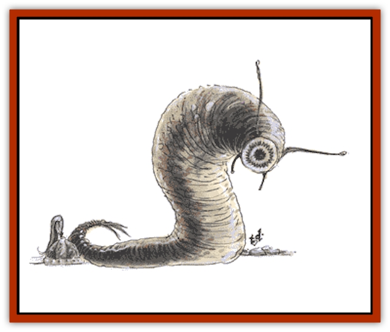

# Leech

| Statistic | **Giant** | **Swarm** | **Throat** |
| --- | --- | --- | --- |
| **Activity Cycle:** | Any | Any | Any |
| **Alignment:** | Neutral | Neutral | Neutral |
| **Armor Class:** | 9 | 10 | 10 |
| **Climate/Terrain:** | Temperate/Swamps and marshes | Temperate/Swamps and marshes | Temperate/Swamps and marshes |
| **Damage/Attack:** | 1-4 | Special | 1-3 |
| **Diet:** | Carnivore | Carnivore | Carnivore |
| **Frequency:** | Uncommon | Uncommon | Common |
| **Hit Dice:** | 1-4 | Special | 1 hp |
| **Intelligence:** | Non- (0) | Non- (0) | Non- (0) |
| **Magic Resistance:** | Nil | Nil | Nil |
| **Morale:** | Unsteady (7) | Unsteady (5) | Unsteady (6) |
| **Movement:** | 3, Sw 3 | Sw 1 | 1, Sw 1 |
| **No. Appearing:** | 4-16 | 200-500 | 1-6 |
| **No. of Attacks:** | 1 | 1 | 1 |
| **Organization:** | Group | Swarm | Group |
| **Size:** | S to M (2-5') | L (10' wide) | T (1&rdquo;) |
| **Special Attacks:** | Drain blood | Drain blood | Choke |
| **Special Defenses:** | Nil | Nil | Nil |
| **THAC0:** | 1-2 HD: 19 / 3-4 HD: 17 | N/A | 20 |
| **Treasure:** | Nil | Nil | Nil |
| **XP Value:** | 1 HD: 65 / 2 HD: 120 / 3 HD: 175 / 4 HD: 270 | 15 | 35 |

Giant leeches are horrid, slug-like creatures that dwell in wet, slimy areas and suck the blood of warm-blooded creatures.

These disgusting parasites range from 2 to 5 feet long. Their slimy skin is mottled brown and tan with an occasional shade of gray. Two antennae protrude from atop the head.

**Combat:** Leeches wait in the mud and slime for prey. The initial attack attaches the sucker mouth of the giant leech. On the next round, and on each round thereafter, it drains blood for 1 point of damage per Hit Die of the leech. There is only a 1% chance that the victim is aware of the attack if it occurs in the water. The leech has anesthetizing saliva, and its bite and blood drain are not usually felt until weakness (the loss of 50% of hit points) sets in and makes the victim aware that something is amiss.

They can be killed by attack or by salt sprinkled on their bodies. There is a 50% chance that the bite of one of these creatures causes a disease that is fatal in 1d4+1 weeks unless cured.

**Habitat/Society:** These creatures are found only in the waters of swamps and marshes. Giant leeches range from 1 to 4 Hit Dice in size; various sized creatures usually are found in a group.

**Throat Leech**

  This leech is about one inch long and resembles an inconspicuous twig. It is found in pools, lakes, and streams.

Anyone drinking water containing a leech has a 10% chance of taking it into his mouth unless the water is carefully filtered (such as through a sheet of gauze) before drinking. The leech sucks blood at the rate of 1-3 points of damage per round, until it becomes completely distended. After ten rounds of sucking, the leech is bloated and will not suck any more blood.

Each round that the leech is in the victim's throat, there is a 50% chance that the victim chokes, causing an additional 1d4 points of damage. A victim who chokes on three successive rounds dies on the third round.

Apart from magical means that may suggest themselves, the only way to kill a throat leech in a victim's throat is to place a thin, heated metal object, such as a wire, into the bloated leech; the hot metal causes the leech to burst and no further damage is inflicted on the victim.

**Leech swarm**

  This is merely a massive swarm of small leeches, found only in the water. They move in a cloud 10 feet in diameter. Anyone caught in the swarm receives 1d10 points of damage per round from blood drain. Area-effect attacks that inflict 10 or more points of damage will disperse the swarm.

---
## Discovery & Documentation

**Source Publication:** MC2 Volume II (1993)
**Campaign Setting:** Advanced Dungeons & Dragons 2nd Edition
**Author(s):** Jay Batista, Scott Bennie, Grant Boucher, William W. Connors, Steve Gilbert, Heike Kubasch, James Lowder, David Edward Martin, Bruce Nesmith, Jean Rabe, Rick Swan, John J. Terra, Gary L. Thomas

### Other Creatures Found in This Source Book
   * [[Ant|Ant]]
   * [[Ant_Lion_Giant|Ant Lion, Giant]]
   * [[Ape_Carnivorous|Ape, Carnivorous]]
   * [[Baboon|Baboon]]
   * [[Badger|Badger]]
   * [[Barracuda|Barracuda]]
   * [[Beetle_Giant|Beetle, Giant]]
   * [[Bulette|Bulette]]
   * [[Bullywug|Bullywug]]
   * [[Dwarf_Duergar|Dwarf, Duergar]]
   * [[Dwarf_Gully|Dwarf, Gully]]
   * [[Eagle|Eagle]]
   * [[Eel|Eel]]
   * [[Elemental_Air_Kin|Elemental, Air Kin]]
   * [[Elemental_Water_Kin|Elemental, Water Kin]]
   * [[Elemental_Water_Kin_Water_Weird|Elemental, Water Kin, Water Weird]]
   * [[Firestar|Firestar]]
   * [[Firetail|Firetail]]
   * [[Fish_Giant|Fish, Giant]]
   * [[Frog|Frog]]
   * [[Gorgon|Gorgon]]
   * [[Hawk|Hawk]]
   * [[Heucuva|Heucuva]]
   * [[Hippocampus|Hippocampus]]
   * [[Hippogriff|Hippogriff]]
   * [[Kelpie|Kelpie]]
   * [[Kenku|Kenku]]
   * [[Killmoulis|Killmoulis]]
   * [[Kuo-Toa|Kuo-Toa]]
   * [[Lamia|Lamia]]
   * [[Lammasu|Lammasu]]
   * [[Lamprey|Lamprey]]
   * [[Leprechaun|Leprechaun]]
   * [[Leucrotta|Leucrotta]]
   * [[Locathah|Locathah]]
   * [[Lycanthrope_Wereboar|Lycanthrope, Wereboar]]
   * [[Lycanthrope_Werefox|Lycanthrope, Werefox]]
   * [[Mammal_Minimal|Mammal, Minimal]]
   * [[Mammal_Small|Mammal, Small]]
   * [[Mimic|Mimic]]
   * [[Morkoth|Morkoth]]
   * [[Muckdweller|Muckdweller]]
   * [[Myconid|Myconid]]
   * [[Naga|Naga]]
   * [[Obliviax|Obliviax]]
   * [[Octopus_Giant|Octopus, Giant]]
   * [[Otyugh|Otyugh]]
   * [[Piranha|Piranha]]
   * [[Plant_Dangerous_I|Plant, Dangerous I]]
   * [[Plant_Intelligent|Plant, Intelligent]]
   * [[Poltergeist|Poltergeist]]
   * [[Porcupine|Porcupine]]
   * [[Rat_Osquip|Rat, Osquip]]
   * [[Roc|Roc]]
   * [[Roper|Roper]]
   * [[Rot_Grub|Rot Grub]]
   * [[Rust_Monster|Rust Monster]]
   * [[Sahuagin|Sahuagin]]
   * [[Sea_Lion|Sea Lion]]
   * [[Sea_Horse_Giant|Sea Horse, Giant]]
   * [[Shambling_Mound|Shambling Mound]]
   * [[Shark|Shark]]
   * [[Sphinx|Sphinx]]
   * [[Squid_Giant|Squid, Giant]]
   * [[Stirge|Stirge]]
   * [[Swanmay|Swanmay]]
   * [[Tarrasque|Tarrasque]]
   * [[Tasloi|Tasloi]]
   * [[Triton|Triton]]
   * [[Troglodyte|Troglodyte]]
   * [[Urchin|Urchin]]
   * [[Urd|Urd]]
   * [[Weasel|Weasel]]
   * [[Wolverine|Wolverine]]
   * [[Yellow_Musk_Creeper|Yellow Musk Creeper]]
