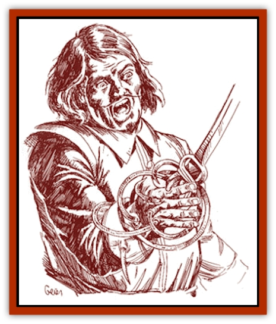

# Leech - Legacy

| Statistic | **Leech, Legacy** |
| --- | --- |
| **Activity Cycle:** | Any |
| **Alignment:** | Chaotic evil |
| **Armor Class:** | -2 |
| **Climate/Terrain:** | Any |
| **Damage/Attack:** | As per weapon |
| **Diet:** | Legacies |
| **Frequency:** | Very rare |
| **Hit Dice:** | 10 |
| **Intelligence:** | Supra-genius (19-20) |
| **Magic Resistance:** | 25% |
| **Morale:** | Fearless (19-20) |
| **Movement:** | 18 |
| **No. Appearing:** | 1 |
| **No. of Attacks:** | 1 |
| **Organization:** | Solitary |
| **Size:** | L (7' long) |
| **Special Attacks:** | See below |
| **Special Defenses:** | See below |
| **THAC0:** | 11 |
| **Treasure:** | Nil |
| **XP Value:** | 6,000 |

A legacy [[Leech|leech]] is the essence of a [[Tanar'ri_General_Information|tanar'ri]] that has been banished to the Prime Material Plane. The legacy leech looks like a slug with writhing tendrils along its tail and head and no discernible eyes or facial features. However, no one is likely to see it in this form. Instead, the legacy leech takes on the appearance of a single red steel weapon - either a +1 rapier, a +1 dagger, a +1 magical hook, or even a +1 pistol. It will remain in one of these forms, waiting to be grasped by an intelligent creature.

**Combat:** Before it is grasped, the legacy leech (in weapon form) can move about and attack on its own. Its one attack per round inflicts damage as per the weapon shape it assumes. Once it is grasped, the creature attacks with the wielder's weapon abilities. In times of need, a leech may allow its host to call upon a Legacy it has previously absorbed.

**Habitat/Society:** It is not known why these tanar'ri were banished. What is known is that they have found a way to gain the power necessary to break their banishment. By absorbing Legacies, a legacy leech can accumulate enough power to regain its natural form.

The legacy leech requires an intelligent creature to work through. Still, if a priest of good alignment holds on to the weapon, it will violently twist and shake, skittering across the room away from the priest (treat as Strength 20). Likewise, a legacy leech will never choose the host of a heroic spirit; two such spirits would be forced to fight for control, with the leech at a disadvantage. Strangely, a paladin can grasp the leech, though the weapon does radiate an aura of evil.

When the weapon form of a legacy leech is grasped, it grows tendrils that penetrate the owner's flesh (no saving throw allowed), becoming one with the host. When this happens, the leech disappears completely into the host's body, reappearing as needed. It can reappear as any of the weapons listed above as its host desires, forcing the host to drop anything being held in that hand.

The creature steals Legacies by changing into a blade and forcing its host to plunge it into a victim's heart immediately after death. A host can attempt to refuse any demand by the leech, but must make a successful Wisdom check to do so. The Wisdom check blocks the leech for one hour or until a new conflict arises. A leech can only drain Legacies which it does not yet possess; during this process, the host can attempts a saving throw vs. spell (with a -1 penalty for each Legacy the leech has absorbed) to expel the leech. If a leech steals at least 15 Legacies while in the same host, that host immediately dies.

Once the leech has absorbed at least two Legacies per Hit Die (20+), it possesses enough energy to break its banishment and return home. For two rounds, the tanar'ri will attack anyone present before being automatically gated to its plane of origin. In tanar'ri form, it gets two claw attacks per round (4d4 points of damage each) and casts as a 9th-level wizard. It is also immune to cold, fire, electricity, poison, and *charm*.

**Ecology:** For the most part, a legacy leech interacts only with its host, so most of its effect on the ecology is actually brought on by the host's desires and actions. The leech, itself, merely requires victims with Legacies.

---
## Discovery & Documentation

**Source Publication:** Monstrous Compendium Savage Coast Appendix (Online Exclusive) (1995)
**Campaign Setting:** Mystara
**Author(s):** Loren L Coleman, Ted James, Thomas Zuvich, Cindi M. Rice

### Other Creatures Found in This Source Book
   * [[Aranea_Savage_Coast|Aranea (Savage Coast)]]
   * [[Arashaeem|Arashaeem]]
   * [[Batracine|Batracine]]
   * [[Cat_Marine|Cat, Marine]]
   * [[Cinnavixen|Cinnavixen]]
   * [[Clockwork_Swordsman|Clockwork Swordsman]]
   * [[Critter_Temple|Critter, Temple]]
   * [[Cursed_One|Cursed One]]
   * [[Deathmare|Deathmare]]
   * [[Dragon_Savage_Coast_Crimson|Dragon (Savage Coast), Crimson]]
   * [[Dragon_Savage_Coast_Red_Hawk|Dragon (Savage Coast), Red Hawk]]
   * [[Echyan|Echyan]]
   * [[Ee'aar|Ee'aar]]
   * [[Enduk|Enduk]]
   * [[Fachan_Savage_Coast|Fachan (Savage Coast)]]
   * [[Feliquine|Feliquine]]
   * [[Fiend_Narvaezan|Fiend, Narvaezan]]
   * [[Frelôn|Frelôn]]
   * [[Ghriest|Ghriest]]
   * [[Glutton_Sea|Glutton, Sea]]
   * [[Goatman|Goatman]]
   * [[Golem_Naâruk|Golem, Naâruk]]
   * [[Golem_Savage_Coast|Golem (Savage Coast)]]
   * [[Grudgling|Grudgling]]
   * [[Heraldic_Servant_I|Heraldic Servant I]]
   * [[Heraldic_Servant_II|Heraldic Servant II]]
   * [[Heraldic_Servant_III|Heraldic Servant III]]
   * [[Heraldic_Servant_IV|Heraldic Servant IV]]
   * [[Heraldic_Servant_V|Heraldic Servant V]]
   * [[Heraldic_Servant_General_Information|Heraldic Servant, General Information]]
   * [[Hermit_Sea|Hermit, Sea]]
   * [[Jorri|Jorri]]
   * [[Juhrion|Juhrion]]
   * [[Kla'a-tah|Kla'a-tah]]
   * [[Lich_Inheritor|Lich, Inheritor]]
   * [[Lizard_Kin_Savage_Coast|Lizard Kin (Savage Coast)]]
   * [[Lupasus|Lupasus]]
   * [[Lupin|Lupin]]
   * [[Lyra_Bird_Saragón|Lyra Bird, Saragón]]
   * [[Malfera|Malfera]]
   * [[Manscorpion_Nimmurian|Manscorpion, Nimmurian]]
   * [[Mythuínn_Folk|Mythuínn Folk]]
   * [[Neshezu|Neshezu]]
   * [[Nikt'oo|Nikt'oo]]
   * [[Nosferatu|Nosferatu]]
   * [[Omm-wa|Omm-wa]]
   * [[Omshirim|Omshirim]]
   * [[Parasite_Savage_Coast|Parasite (Savage Coast)]]
   * [[Phanaton|Phanaton]]
   * [[Plant_Savage_Coast|Plant (Savage Coast)]]
   * [[Pudding_Vermilion|Pudding, Vermilion]]
   * [[Rakasta|Rakasta]]
   * [[Ray_Forest|Ray, Forest]]
   * [[Shedu_Greater_Savage_Coast|Shedu, Greater (Savage Coast)]]
   * [[Shimmerfish|Shimmerfish]]
   * [[Skinwing|Skinwing]]
   * [[Spawn_of_Nimmur|Spawn of Nimmur]]
   * [[Spider-spy|Spider-spy]]
   * [[Spirit_Heroic|Spirit, Heroic]]
   * [[Spirit_Walleran|Spirit, Walleran]]
   * [[Succulus|Succulus]]
   * [[Swampmare|Swampmare]]
   * [[Symbiont_Shadow|Symbiont, Shadow]]
   * [[Tortle|Tortle]]
   * [[Troll_Legacy|Troll, Legacy]]
   * [[Trosip|Trosip]]
   * [[Tyminid|Tyminid]]
   * [[Utukku|Utukku]]
   * [[Voat|Voat]]
   * [[Voat_Herathian|Voat, Herathian]]
   * [[Vulturehound|Vulturehound]]
   * [[Wallara|Wallara]]
   * [[Wurmling|Wurmling]]
   * [[Wynzet|Wynzet]]
   * [[Yeshom|Yeshom]]
   * [[Zombie_Red|Zombie, Red]]
