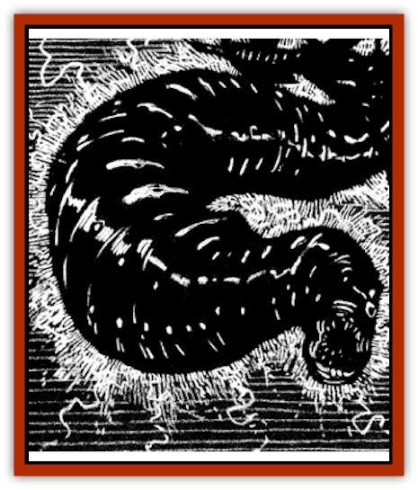

# Leech - Magical

| Statistic | **Leech, Magical** |
| --- | --- |
| **Activity Cycle:** | Any |
| **Alignment:** | Neutral |
| **Armor Class:** | 10 |
| **Climate/Terrain:** | Ravenloft wetlands |
| **Damage/Attack:** | Nil |
| **Diet:** | Magical energy |
| **Frequency:** | Uncommon |
| **Hit Dice:** | 1 hit point |
| **Intelligence:** | Non- (0) |
| **Magic Resistance:** | 99% |
| **Morale:** | Steady (11-12) |
| **Movement:** | 0, Sw 3 |
| **No. Appearing:** | 5-30 (5d6) |
| **No. of Attacks:** | 0 |
| **Organization:** | Solitary |
| **Size:** | T (1&rdquo; long) |
| **Special Attacks:** | Magic drain &amp; energy burst |
| **Special Defenses:** | Magic Resistance |
| **THAC0:** | 20 |
| **Treasure:** | Nil |
| **XP Value:** | 15 |

In the wet grasses of some realms lurk strange [[Leech|leeches]] capable of draining a wizard's magical essence. They are a bane to any magic-wielding creature or those who depend on spellcasting in combat. When feeding, they disrupt incantations, drain spells from the minds of wizards or priests, and are even capable of rendering magical objects useless and mundane.

Magical leeches look no different from normal ones, save that they occasionally emit tiny sparks of purplish energy from their grotesquely bloated bodies.

As one might expect, these creatures have no language and do not communicate with other creatures in any way.

**Combat:** Magical leeches do not need to make physical contact with their victims to feed-simply being within 1 yard allows them to draw forth the tendrils of sorcery that feed them. This makes magical leeches difficult to detect, for there is often nothing for the victim to feel.

The very presence of a leech makes it harder for spellcasters to activate their powers. Whenever one or more of these creatures is within one yard of them, a spell user must make a successful Ability Check on Intelligence or Wisdom (as appropriate) to cast a spell. If the check is failed, the spell simply peters out and does not take effect.

Magical leeches may also drain memorized spells from the minds of wizards or priests. The chance that a spell will be drained each round is 10% plus 1% per leech within 1 yard. Magical leeches drain a caster's highest-level spells first, with the exact enchantment lost being randomly determined. The absence of the spell is noticed only when the wizard or priest attempts to cast it.

Magical leeches can also feed on the energy of a magical object, although they prefer the taste of energy drained from the humanoid mind instead. Every round that leeches are present, there is a 5% chance, plus 1 % per leech, that one power, function. or plus of a magical object is destroyed. The exact effect of the leech's feeding is determined randomly.

Removing a magical leech is a painful task. When touched, magical leeches release a fraction of the energy stored in their bodies as an electrical discharge that causes 1-2 points of damage. For every spell, ability, of other essence the leech has consumed within the last 8 hours, the burst causes an additional 1 point of damage.

**Habitat/Society:** Magical leeches live in swamps or even tall wet grasses. They never leave their habitat under their own power. Anyone who walks through an infested area is likely to pick up 1d6 of the creatures, though there are usually 5-30 actually present at a particular site.

**Ecology:** After draining its host of magical energies, the leech drops off as soon as its host enters a swamp or similar wetland in which it can spawn, The magical energies ingested by the leech allow the filthy creature to give birth to 1-6 new leeches in 3d4 days.

---
## Discovery & Documentation

**Source Publication:** Ravenloft Appendix III (1991)
**Campaign Setting:** Ravenloft
**Author(s):** Kirk Botulla

### Other Creatures Found in This Source Book
   * [[Akikage|Akikage]]
   * [[Animator_Common|Animator, Common]]
   * [[Animator_Greater|Animator, Greater]]
   * [[Animator_Minor|Animator, Minor]]
   * [[Animator_General_Information|Animator, General Information]]
   * [[Bakhna_Rakhna|Bakhna Rakhna]]
   * [[Baobhan_Sith|Baobhan Sith]]
   * [[Beetle_Scarab|Beetle, Scarab]]
   * [[Boneless|Boneless]]
   * [[Boowray|Boowray]]
   * [[Bruja|Bruja]]
   * [[Carrionette|Carrionette]]
   * [[Carrion_Stalker|Carrion Stalker]]
   * [[Cat_Midnight|Cat, Midnight]]
   * [[Cat_Skeletal|Cat, Skeletal]]
   * [[Cloaker_Resplendent|Cloaker, Resplendent]]
   * [[Cloaker_Shadow|Cloaker, Shadow]]
   * [[Cloaker_Undead|Cloaker, Undead]]
   * [[Corpse_Candle|Corpse Candle]]
   * [[Death's_Head_Tree|Death's Head Tree]]
   * [[Doppelganger_Ravenloft|Doppelganger (Ravenloft)]]
   * [[Familiar_Pseudo-|Familiar, Pseudo-]]
   * [[Familiar_Undead|Familiar, Undead]]
   * [[Feathered_Serpent|Feathered Serpent]]
   * [[Fenhound|Fenhound]]
   * [[Figurine_Ceramic|Figurine, Ceramic]]
   * [[Figurine_Crystal|Figurine, Crystal]]
   * [[Figurine_Ivory|Figurine, Ivory]]
   * [[Figurine_Obsidian|Figurine, Obsidian]]
   * [[Figurine_Porcelain|Figurine, Porcelain]]
   * [[Figurine_General_Information|Figurine, General Information]]
   * [[Fleas_of_Madness|Fleas of Madness]]
   * [[Furies|Furies]]
   * [[Geist|Geist]]
   * [[Ghost_Animal|Ghost, Animal]]
   * [[Golem_Flesh_Ravenloft|Golem, Flesh (Ravenloft)]]
   * [[Golem_Mist_Ravenloft|Golem, Mist (Ravenloft)]]
   * [[Golem_Wax_Ravenloft|Golem, Wax (Ravenloft)]]
   * [[Gremishka|Gremishka]]
   * [[Hag_Spectral|Hag, Spectral]]
   * [[Head_Hunter|Head Hunter]]
   * [[Hearth_Fiend|Hearth Fiend]]
   * [[Hebi-No-Onna|Hebi-No-Onna]]
   * [[Hound_Phantom|Hound, Phantom]]
   * [[Hound_Skeletal|Hound, Skeletal]]
   * [[Imp_Wishing|Imp, Wishing]]
   * [[Ivy_Crawling|Ivy, Crawling]]
   * [[Jack_Frost|Jack Frost]]
   * [[Jolly_Roger|Jolly Roger]]
   * [[Kizoku|Kizoku]]
   * [[Lashweed|Lashweed]]
   * [[Leech_Psionic|Leech, Psionic]]
   * [[Lich_Defiler|Lich, Defiler]]
   * [[Lich_Drow|Lich, Drow]]
   * [[Lich_Elemental|Lich, Elemental]]
   * [[Lich_Psionic|Lich, Psionic]]
   * [[Living_Tattoo|Living Tattoo]]
   * [[Lycanthrope_Loup-garou|Lycanthrope, Loup-garou]]
   * [[Lycanthrope_Werejackal|Lycanthrope, Werejackal]]
   * [[Lycanthrope_Werejaguar_Ravenloft|Lycanthrope, Werejaguar (Ravenloft)]]
   * [[Lycanthrope_Wereleopard|Lycanthrope, Wereleopard]]
   * [[Lycanthrope_Wereray|Lycanthrope, Wereray]]
   * [[Mist_Ferryman|Mist Ferryman]]
   * [[Moor_Man|Moor Man]]
   * [[Obedient|Obedient]]
   * [[Odem|Odem]]
   * [[Paka|Paka]]
   * [[Plant_Blood_Rose|Plant, Blood Rose]]
   * [[Plant_Fearweed|Plant, Fearweed]]
   * [[Radiant_Spirit|Radiant Spirit]]
   * [[Recluse|Recluse]]
   * [[Remnant_Aquatic|Remnant, Aquatic]]
   * [[Rushlight|Rushlight]]
   * [[Sea_Spawn_Master|Sea Spawn, Master]]
   * [[Sea_Spawn_Minion|Sea Spawn, Minion]]
   * [[Shadow_Asp|Shadow Asp]]
   * [[Shattered_Brethren|Shattered Brethren]]
   * [[Skeleton_Archer|Skeleton, Archer]]
   * [[Skeleton_Insectoid|Skeleton, Insectoid]]
   * [[Skin_Thief|Skin Thief]]
   * [[Spirit_Psionic|Spirit, Psionic]]
   * [[Strahd_Skeleton|Strahd Skeleton]]
   * [[Strahd_Zombie|Strahd Zombie]]
   * [[Unicorn_Shadow|Unicorn, Shadow]]
   * [[Vampire_Drow|Vampire, Drow]]
   * [[Vampire_Nosferatu|Vampire, Nosferatu]]
   * [[Vampire_Oriental|Vampire, Oriental]]
   * [[Virus_General_Information|Virus, General Information]]
   * [[Virus_I|Virus I]]
   * [[Virus_II|Virus II]]
   * [[Virus_III|Virus III]]
   * [[Vorlog|Vorlog]]
   * [[Will_O'Dawn|Will O'Dawn]]
   * [[Will_O'Deep|Will O'Deep]]
   * [[Will_O'Mist|Will O'Mist]]
   * [[Will_O'Sea|Will O'Sea]]
   * [[Zombie_Cannibal|Zombie, Cannibal]]
   * [[Zombie_Desert|Zombie, Desert]]
   * [[Zombie_Wolf|Zombie Wolf]]
   * [[Zombie_Fog|Zombie Fog]]
