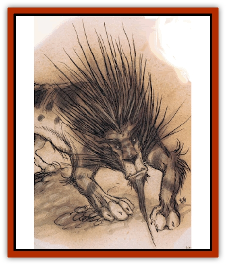

# Leomarh

| Statistic | **Leomarh** |
| --- | --- |
| **Activity Cycle:** | Day |
| **Alignment:** | Neutral |
| **Armor Class:** | 4 |
| **Climate/Terrain:** | Outlands (any plains) |
| **Damage/Attack:** | 1d6+1/1d6+1/1d10 |
| **Diet:** | Carnivore |
| **Frequency:** | Uncommon |
| **Hit Dice:** | 6+2 |
| **Intelligence:** | Low (5-7) |
| **Magic Resistance:** | Nil |
| **Morale:** | Average (8-10) |
| **Movement:** | 15 |
| **No. Appearing:** | 2-12 |
| **No. of Attacks:** | 3 |
| **Organization:** | Pride |
| **Size:** | L (6-7' long) |
| **Special Attacks:** | Rear claws, knock-down |
| **Special Defenses:** | Camouflage, immune to <i>magic missiles</i> |
| **THAC0:** | 15 |
| **Treasure:** | Nil |
| **XP Value:** | 1,400 |

The realms of the Great Road don't always answer to the same natural laws that hold sway on the Prime Material Plane. From place to place, local ecologies are dictated by the high-up cutters who rule there. Exotic combinations or artificially stocked regions are common everywhere out here. Even Clueless travelers tumble to this little dark real fast: If physical laws can change on the planes, why can't ecologies and food chains?

'Course, with that said, it's also important to remember that living creatures need to find themselves a niche of some kind, or they won't survive. Here's where leomarhs come into the picture. They're completely natural predators who've escaped the artificial realms of the powers and now exist anywhere some high-up isn't in charge. They're most common in the Outlands, but a cutter shouldn't be too surprised to run across a pride of leomars in the dusty plains of Avernus or the meadows and forests of Amoria. After all, leomarhs are planars now, just like any basher born and raised in Sigil, and they can see portals too.

Leomarhs appear to be much like [[Cat_Great|lions]] - in fact, it's almost certain that they evolved from lions or other [[Cat_Great|great cats]] that were brought to the plains or created out here by one of the powers. But there are some important differences. Leomarhs have larger forequarters than hindquarters, resulting in a slight [[Hyena|hyena]]like slope to their bodies. They're covered by fine scales rather than fur, and their tails're long and snakelike with a bladed spade at the end. Leomarhs' manes are dense, golden-brown fur, and they've got small beards and tassels of the same color along their legs and feet.

Leomarhs're much smarter than a typical lion, even if they still don't speak or show signs of true sentience. It's a fiend's cunning they have, and a pride of hunting leomarhs sets expert ambushes and uses hit-and-run tactics with remarkable skill. Most importantly, they're smart enough to have a real good idea of how tough armed humans can be, understand that some creatures can call on magical energy as a weapon, and leave the bigger foes alone.

**Combat:** Leomarhs have exceptionally keen senses and are surprised only on a roll of 1. They've got a natural ability to change the color of their bodies to match their surroundings. If the leomarh holds still, it's 90% invisible until it pounces. Generally, this gives the leomarh's prey a -4 penalty to surprise checks. On the move, a leomarh gains no advantage from its camouflage. These creatures have mastered the tactic of dividing their pride and using several obvious attackers to drive their prey toward motionless, camouflaged ambushers.

When they strike, leomarhs attack with their large, powerful front claws and a dangerous bite. If both front paws hit, the leomarh gains 2 extra attacks with its rear claws, raking for 1d4 points of damage each. In addition, a small or man-size opponent who's hit by both front claws must successfully save versus death magic or be knocked prone. (Prone characters suffer a -4 penalty to their AC and attack rolls.) Leomarhs'll drag down even the strongest warriors if they can get close enough,

Last but not least, leomarhs've got an unusual immunits: *Magic missiles* don't affect them. Some bloods believe that leomarhs're plane-touched, just like tieflings, and have some unusual powers and abilities running through their bloodlines.

**Habitat/Society:** Despite their unusually high intelligence, leomarhs are still animals. They've got a complex system of communication among themselves, but they don't interact with intelligent races or monsters. A sod shouldn't think that a leomarh'll ever look at him as anything but a potential meal or threat to its offspring, and either premise is a poor one for approaching the leomarh's lair.

Leomarhs live and hunt in small bands known as prides. A pride usually settles in one area, selecting a dense thicket or small cave as its lair. From this lair, small hunting groups of 1 to 4 individuals range out in search of prey. Leomarhs're extremely defensive of their young and aggressively attack anything barmy enough to approach their lair.

Generally, a number of cubs equaling 1O% to 60% of the number of adults will be found in or near the lair. Leomarh cubs have only 1 HD and attack with a THAC0 of 20, their claws doing 1 point of damage, their bite only 1 to 2. A cub's camouflage ability is fully developed at birth, and its instinctive response to danger is to lie still and keep out of sight.

**Ecology:** Leomarhs prey on the scattered normal creatures inhabiting the Outlands and some regions of the Outer Planes. Typically, goats, deer, and bison or wild cattle are the preferred prey of leomarhs, but in some areas they'll attack lesser fiends or local peasants if that's the most plentiful supply of food. Leomarhs can be a significant danger to travelers in the wilder areas of the planes, since they're willing to attack just about anything smaller than an elephant.

---
## Discovery & Documentation

**Source Publication:** Planescape II (1996)
**Campaign Setting:** Planescape
**Author(s):** Rich Baker, Karen S. Boomgarden

### Other Creatures Found in This Source Book
   * [[Aasimar|Aasimar]]
   * [[Abrian|Abrian]]
   * [[Arcane|Arcane]]
   * [[Balaena|Balaena]]
   * [[Beholder-kin_Observer|Beholder-kin, Observer]]
   * [[Bloodthorn|Bloodthorn]]
   * [[Bonespear|Bonespear]]
   * [[Darkweaver|Darkweaver]]
   * [[Demarax|Demarax]]
   * [[Dhour|Dhour]]
   * [[Eater_of_Knowledge|Eater of Knowledge]]
   * [[Eladrin_Greater_Firre|Eladrin, Greater, Firre]]
   * [[Eladrin_Greater_Ghaele|Eladrin, Greater, Ghaele]]
   * [[Eladrin_Greater_Tulani|Eladrin, Greater, Tulani]]
   * [[Eladrin_Lesser_Bralani|Eladrin, Lesser, Bralani]]
   * [[Eladrin_Lesser_Coure|Eladrin, Lesser, Coure]]
   * [[Eladrin_Lesser_Noviere|Eladrin, Lesser, Noviere]]
   * [[Eladrin_Lesser_Shiere|Eladrin, Lesser, Shiere]]
   * [[Fhorge|Fhorge]]
   * [[Ghostlight|Ghostlight]]
   * [[Guardinal_Avoral|Guardinal, Avoral]]
   * [[Guardinal_Cervidal|Guardinal, Cervidal]]
   * [[Guardinal_General_Information|Guardinal, General Information]]
   * [[Guardinal_Equinal|Guardinal, Equinal]]
   * [[Guardinal_Leonal|Guardinal, Leonal]]
   * [[Guardinal_Lupinal|Guardinal, Lupinal]]
   * [[Guardinal_Ursinal|Guardinal, Ursinal]]
   * [[Hollyphant|Hollyphant]]
   * [[Incantifer|Incantifer]]
   * [[Ironmaw|Ironmaw]]
   * [[Keeper|Keeper]]
   * [[Khaasta|Khaasta]]
   * [[Monster_of_Legend|Monster of Legend]]
   * [[Mortai|Mortai]]
   * [[Noctral|Noctral]]
   * [[Quill|Quill]]
   * [[Razorvine|Razorvine]]
   * [[Reave|Reave]]
   * [[Retriever|Retriever]]
   * [[Rilmani_Abiorach|Rilmani, Abiorach]]
   * [[Rilmani_General_Information|Rilmani, General Information]]
   * [[Rilmani_Argenach|Rilmani, Argenach]]
   * [[Rilmani_Aurumach|Rilmani, Aurumach]]
   * [[Rilmani_Cuprilach|Rilmani, Cuprilach]]
   * [[Rilmani_Ferrumach|Rilmani, Ferrumach]]
   * [[Rilmani_Plumach|Rilmani, Plumach]]
   * [[Shadowdrake|Shadowdrake]]
   * [[Spellhaunt|Spellhaunt]]
   * [[Spider_Hook|Spider, Hook]]
   * [[Sunfly|Sunfly]]
   * [[Sword_Spirit|Sword Spirit]]
   * [[Tanar'ri_Lesser_Bulezau|Tanar'ri, Lesser, Bulezau]]
   * [[Tanar'ri_Lesser_Maurezhi|Tanar'ri, Lesser, Maurezhi]]
   * [[Tanar'ri_Lesser_Yochlol|Tanar'ri, Lesser, Yochlol]]
   * [[Tanar'ri_General_Information|Tanar'ri, General Information]]
   * [[Tanar'ri_True_Alkilith|Tanar'ri, True, Alkilith]]
   * [[Terlen|Terlen]]
   * [[Tso|Tso]]
   * [[T'uen-rin|T'uen-rin]]
   * [[Vaporighu|Vaporighu]]
   * [[Vorr|Vorr]]
   * [[Wastrel|Wastrel]]
   * [[Wraithworm|Wraithworm]]
   * [[Yugoloth_Lesser_Canoloth|Yugoloth, Lesser, Canoloth]]
   * [[Zoveri|Zoveri]]
