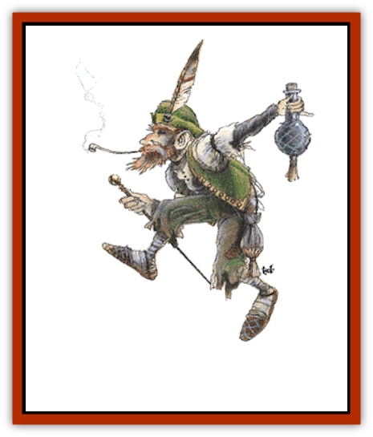

# Leprechaun

| Statistic | **Leprechaun** |
| --- | --- |
| **Activity Cycle:** | Any |
| **Alignment:** | Neutral |
| **Armor Class:** | 8 |
| **Climate/Terrain:** | Temperate/Green lands, sylvan glens |
| **Damage/Attack:** | Nil |
| **Diet:** | Omnivore |
| **Frequency:** | Uncommon |
| **Hit Dice:** | 2-5 hp |
| **Intelligence:** | Exceptional (15-16) |
| **Magic Resistance:** | 80% |
| **Morale:** | Steady (11) |
| **Movement:** | 15 |
| **No. Appearing:** | 1-20 |
| **No. of Attacks:** | 0 |
| **Organization:** | Clans |
| **Size:** | T (2' tall) |
| **Special Attacks:** | See below |
| **Special Defenses:** | See below |
| **THAC0:** | 20 |
| **Treasure:** | F |
| **XP Value:** | 270 |

Leprechauns are diminutive folk who are found in fair, green lands and enjoy frolicking, working magic, and causing harmless mischief.

Rumored to be a cross between a species of [[Halfling|halfling]] and a strong strain of [[Sprite|pixie]], leprechauns are about 2 feet tall. They have pointed ears, and their noses also come to a tapered point. About 30% of all male leprechauns have beards. Pointed shoes, brown or green breeches, green or gray coats, and either wide-brimmed or stocking caps are the preferred dress of the wee folk. Many leprechauns also enjoy smoking a pipe, usually a long-stemmed one.

**Combat:** These fun-loving creatures of magical talent are by nature noncombative. They can become invisible at will, polymorph nonliving objects, create illusions (with full audio and olfactory effects), and use *ventriloquism* spells as often as they like. Their keen ears prevent them from ever being surprised. Being full of mischief, they often (75%) snatch valuable objects from adventurers, turn invisible and dash away. There is a 75% chance that the attempt is successful. If pursued closely, there is a 25% chance per turn of pursuit that the leprechaun drops the stolen goods. The chase never leads to the leprechaun's lair.

If caught or discovered in its lair (10% chance), the leprechaun attempts to mislead his captor into believing that he is giving over his treasure while he actually is duping the captor. It requires great care to actually obtain the leprechaun's treasure.

**Habitat/Society:** Leprechauns live in families of up to 20, though they call this unit a clan. They use first names and surnames, and it is fairly certain that these names are a good indicator of which clan one is dealing with. A lair usually consists of a warm, dry cave with a hearth, rugs, and furniture. Strangely, word travels fast between clans of the same surname, and a clan that a group of adventurers runs into may already know the adventurers' names from another clan the party encountered several days prior.

There is a rumor that a King of the Leprechauns exists, but there seems to be no official political hierarchy. There are no communities or villages of leprechauns.

It is rare to see leprechaun offspring, but they do exist, born with the full magical powers of an adult. For every 10 adults encountered in a lair, one child will be found.

Leprechauns enjoy eating the same sorts of foods that humans and demihumans eat, with a special fondness for wine. This weakness may be used to outwit them.

Gold is the one treasure found in every leprechaun's hoard. If an intruder secures this treasure, a leprechaun will bargain and beg to get it back. As a last desperate measure, he will grant the intruder three wishes (very limited), but only if the intruder gives over the treasure first. When this is done, the leprechaun will indeed grant the three wishes. After all three wishes, the leprechaun will flatter the intruder and declare that the three wishes were so well-phrased that he will give a fourth wish. If the fourth wish is pronounced, the leprechaun will cackle with glee, the results of all the wishes will be reversed, and the intruder plus his group will be teleported (no saving throw) to a random location 2d20 miles away. No member of that party will never be able to find that particular leprechaun again.

Leprechauns are naturally distrustful toward humans and dwarves, since these races have greedy tendencies. They get along well with [[Elf|elves]], [[Gnome|gnomes]], and halflings.

A leprechaun will not sit idly by while a helpless creature is attacked, since they have a soft spot for weaker creatures. In general, if a leprechaun senses that a stranger means no harm, he can be quite civil, but he will not bring visitors to his lair. If the leprechaun finds someone hurt, he might take the victim to his lair, but only after making sure that the stranger is not followed and cannot see where he is being taken.

**Ecology:** The best times and places to observe leprechauns are called borderlines. Dawn and dusk (which are neither all light nor dark), the shore (which is neither all earth nor all water), or the equinoxes and solstices (which are neither one season nor another), are the best times and places to see leprechauns and their ilk frolicking and celebrating.

---
## Discovery & Documentation

**Source Publication:** MC2 Volume II (1993)
**Campaign Setting:** Advanced Dungeons & Dragons 2nd Edition
**Author(s):** Jay Batista, Scott Bennie, Grant Boucher, William W. Connors, Steve Gilbert, Heike Kubasch, James Lowder, David Edward Martin, Bruce Nesmith, Jean Rabe, Rick Swan, John J. Terra, Gary L. Thomas

### Other Creatures Found in This Source Book
   * [[Ant|Ant]]
   * [[Ant_Lion_Giant|Ant Lion, Giant]]
   * [[Ape_Carnivorous|Ape, Carnivorous]]
   * [[Baboon|Baboon]]
   * [[Badger|Badger]]
   * [[Barracuda|Barracuda]]
   * [[Beetle_Giant|Beetle, Giant]]
   * [[Bulette|Bulette]]
   * [[Bullywug|Bullywug]]
   * [[Dwarf_Duergar|Dwarf, Duergar]]
   * [[Dwarf_Gully|Dwarf, Gully]]
   * [[Eagle|Eagle]]
   * [[Eel|Eel]]
   * [[Elemental_Air_Kin|Elemental, Air Kin]]
   * [[Elemental_Water_Kin|Elemental, Water Kin]]
   * [[Elemental_Water_Kin_Water_Weird|Elemental, Water Kin, Water Weird]]
   * [[Firestar|Firestar]]
   * [[Firetail|Firetail]]
   * [[Fish_Giant|Fish, Giant]]
   * [[Frog|Frog]]
   * [[Gorgon|Gorgon]]
   * [[Hawk|Hawk]]
   * [[Heucuva|Heucuva]]
   * [[Hippocampus|Hippocampus]]
   * [[Hippogriff|Hippogriff]]
   * [[Kelpie|Kelpie]]
   * [[Kenku|Kenku]]
   * [[Killmoulis|Killmoulis]]
   * [[Kuo-Toa|Kuo-Toa]]
   * [[Lamia|Lamia]]
   * [[Lammasu|Lammasu]]
   * [[Lamprey|Lamprey]]
   * [[Leech|Leech]]
   * [[Leucrotta|Leucrotta]]
   * [[Locathah|Locathah]]
   * [[Lycanthrope_Wereboar|Lycanthrope, Wereboar]]
   * [[Lycanthrope_Werefox|Lycanthrope, Werefox]]
   * [[Mammal_Minimal|Mammal, Minimal]]
   * [[Mammal_Small|Mammal, Small]]
   * [[Mimic|Mimic]]
   * [[Morkoth|Morkoth]]
   * [[Muckdweller|Muckdweller]]
   * [[Myconid|Myconid]]
   * [[Naga|Naga]]
   * [[Obliviax|Obliviax]]
   * [[Octopus_Giant|Octopus, Giant]]
   * [[Otyugh|Otyugh]]
   * [[Piranha|Piranha]]
   * [[Plant_Dangerous_I|Plant, Dangerous I]]
   * [[Plant_Intelligent|Plant, Intelligent]]
   * [[Poltergeist|Poltergeist]]
   * [[Porcupine|Porcupine]]
   * [[Rat_Osquip|Rat, Osquip]]
   * [[Roc|Roc]]
   * [[Roper|Roper]]
   * [[Rot_Grub|Rot Grub]]
   * [[Rust_Monster|Rust Monster]]
   * [[Sahuagin|Sahuagin]]
   * [[Sea_Lion|Sea Lion]]
   * [[Sea_Horse_Giant|Sea Horse, Giant]]
   * [[Shambling_Mound|Shambling Mound]]
   * [[Shark|Shark]]
   * [[Sphinx|Sphinx]]
   * [[Squid_Giant|Squid, Giant]]
   * [[Stirge|Stirge]]
   * [[Swanmay|Swanmay]]
   * [[Tarrasque|Tarrasque]]
   * [[Tasloi|Tasloi]]
   * [[Triton|Triton]]
   * [[Troglodyte|Troglodyte]]
   * [[Urchin|Urchin]]
   * [[Urd|Urd]]
   * [[Weasel|Weasel]]
   * [[Wolverine|Wolverine]]
   * [[Yellow_Musk_Creeper|Yellow Musk Creeper]]
