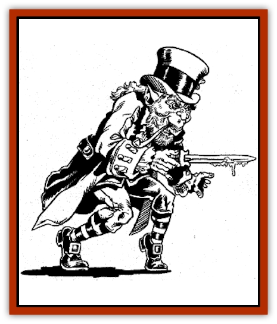

# Leprechaun - Wicked

| Statistic | **Leprechaun, Wicked** |
| --- | --- |
| **Activity Cycle:** | Night |
| **Alignment:** | Neutral evil |
| **Armor Class:** | 7 |
| **Climate/Terrain:** | Dense forests |
| **Damage/Attack:** | By weapon |
| **Diet:** | Omnivore (see below) |
| **Frequency:** | Very rare |
| **Hit Dice:** | 1 |
| **Intelligence:** | Exceptional (15-16) |
| **Magic Resistance:** | 80% |
| **Morale:** | Elite (14) |
| **Movement:** | 15 |
| **No. Appearing:** | 1 |
| **No. of Attacks:** | 1 |
| **Organization:** | Solitary |
| **Size:** | T (2' tall) |
| **Special Attacks:** | See below |
| **Special Defenses:** | See below |
| **THAC0:** | 20 |
| **Treasure:** | F |
| **XP Value:** | 420 |

Wicked [[Leprechaun|leprechauns]] are probably the result of the same form of evil magics that turned a race of [[Brownie|brownies]] into [[Brownie_Quickling|quicklings]]. While these creatures were once playful and mischievous, they are now vile, deadly monsters.

Wicked leprechauns appear similar to their more common kin, but they always wear black and gray, disdaining the colorful garb of their relatives. They inhabit haunted forests and glens.

**Combat:** Wicked leprechauns fight wlth pixie-sized daggers, garrotes and stilettos when they choose to reveal themselves, Lacking any type of honor, they often poison these weapons with various venoms.

These creatures possess most powers of the normal leprechaun. They can turn invisible, polymorph nonliving objects, create illusions, and use ventriloquism as often as they like. They often use these powers to set deadly traps for victims. For example, one might wait at a bridge for someone to cross, and then turn the rungs into sand, sending the victims plummeting. They cannot, however, grant wishes or enact Leprechaun Law (teleporting victims away).

Once per turn, a wicked leprechaun can cast an *evil grin* spell that duplicates the effects of a *scare* spell. Once per day he can cast *Tasha's uncontrollable hideous laughter* on 1-4 victims.

Wicked leprechauns can communicate with hornets, wasps, and similar insects. They often send the pests to torment humans and horses. They can also command a single giant insect of this type, often using one for a mount.

**Habitat/Society:** Wicked leprechauns aren't a normal part of fairy-kind and often disrupt ecosystems instead of filling a place in them.

These creatures get along with other evil fairies, such as quicklings and [[Gnome_Spriggan|spriggans]].

**Ecology:** Wicked leprechauns eat normal food, but instead of savoring wine, they have the habit of drinking the blood of their victims.
These fairies are, if anything, even greedier than normal leprechauns, and they hoard large amounts of treasure.

---
## Discovery & Documentation

**Source Publication:** Dragon239 (1997)
**Campaign Setting:** Dragon Magazine
**Author(s):** 

### Other Creatures Found in This Source Book
   * [[Boggart|Boggart]]
   * [[Clurichaun|Clurichaun]]
   * [[Leshy|Leshy]]
