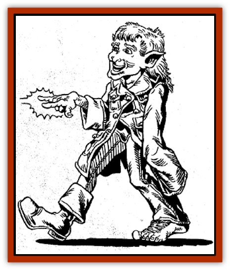

# Leshy

| Statistic | **Leshy** |
| --- | --- |
| **Activity Cycle:** | Day |
| **Alignment:** | Neutral good |
| **Armor Class:** | 5 |
| **Climate/Terrain:** | Any large forest |
| **Damage/Attack:** | By weapon + possible Str bonus |
| **Diet:** | Herbivore |
| **Frequency:** | Rare |
| **Hit Dice:** | 8 |
| **Intelligence:** | Genius (17-18) |
| **Magic Resistance:** | 40% |
| **Morale:** |  |
| **Movement:** | 12 |
| **No. Appearing:** | 1 |
| **No. of Attacks:** | 1 |
| **Organization:** | Solitary |
| **Size:** | -15 |
| **Special Attacks:** | Spells |
| **Special Defenses:** | Spells |
| **THAC0:** | 12 |
| **Treasure:** | M (&times;10) |
| **XP Value:** |  |

Leshies are magical protectors of old and ancient forests. There is always only one leshy per forest, and they can never go more than 100' from their domain, as they are tied to it as a [[Dryad|dryad]] is bound to her tree.

Leshies look comical, appearing as young elflike men in green and red clothes. Their coats are always buttoned wrong, and their shoes are always on the wrong feet.

A leshy's size depends on where he is in his forest. At the forest edge, he is tiny, merely 1' tall. In the forests center, he is as tall as a [[Giant_Hill|hill giant]] and has the Strength to match. In between, his size varies; the closer to the center, the bigger he is.

**Combat:** A leshy can blend in with his surroundings by standing perfectly still, effectively invisible. A druid or ranger has a 5% chance per level of spotting a leshy. It is impossible to surprise one.

Leshies do not normally carry weapons. They may, at their largest size, use tree trunks as clubs, inflicting double club damage plus the Strength bonus (2d6 + 7 hp damage). They may also, at this size, hurl rocks up to 200 yards for 2d8 hp damage, as a hill giant. They rarely use this attack, however, as they consider it barbaric.

Leshies have the spellcasting ability of a 12th-level druid. They prefer spells dealing with plants. They can also call woodland beings once a day, calling creatures who fight to the best of their ability. Also, no good- or neutral-aligned forest creature will ever harm a leshy.

**Habitat/Society:** Leshies are protectors who act in maintenance and defense of their forests at all costs. A leshy will die if his forest is destroyed (a rare event, as they inhabit only the largest of forests).

Leshies know every detail of the forest they inhabit and may make excellent guides if they can be persuaded. Leshies help only good creatures and drive away any evil ones.

**Ecology:** Leshies can live to be 1,000 years old, retaining a youthful appearance throughout their lives. If one dies, a new one appears by some unknown occurrence.

Leshies are vegetarians, subsisting primarily on berries, fruit, roots, and tubers.

Gold and silver have no value to leshies, but they often keep small amounts of wealth to use for bartering purposes.

---
## Discovery & Documentation

**Source Publication:** Dragon239 (1997)
**Campaign Setting:** Dragon Magazine
**Author(s):** 

### Other Creatures Found in This Source Book
   * [[Boggart|Boggart]]
   * [[Clurichaun|Clurichaun]]
   * [[Leprechaun_Wicked|Leprechaun, Wicked]]
