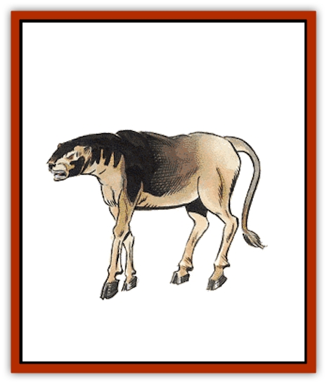

# Leucrotta

| Statistic | **Leucrotta** |
| --- | --- |
| **Activity Cycle:** | Any |
| **Alignment:** | Chaotic evil |
| **Armor Class:** | 4 |
| **Climate/Terrain:** | Temperate/ Wasteland, broken terrain |
| **Damage/Attack:** | 3-18 |
| **Diet:** | Carnivore |
| **Frequency:** | Rare |
| **Hit Dice:** | 6+1 |
| **Intelligence:** | Average (8-10) |
| **Magic Resistance:** | Nil |
| **Morale:** | Elite (14) |
| **Movement:** | 18 |
| **No. Appearing:** | 1-4 |
| **No. of Attacks:** | 1 |
| **Organization:** | Pack |
| **Size:** | L (7' at shoulder, 9' long) |
| **Special Attacks:** | See below |
| **Special Defenses:** | Kick in retreat |
| **THAC0:** | 15 |
| **Treasure:** | D |
| **XP Value:** | 975 |

The leucrotta is a creature of ugly appearance and temperament that haunts deserted places in search of prey.

The average leucrotta stands 7 feet tall at the shoulder and can reach a length of 9 feet in its mature form. The body of the leucrotta resembles that of a stag, with a leonine tufted tail and cloven hooves. Its head resembles that of a huge [[Badger|badger]], but instead of teeth it has sharp, jagged bony ridges. Its body is tan, with the neck gradually darkening until it turns black at the head. The so-called teeth are sickly gray, and its eyes glow with a feral red light. The smell of animals, decomposing on a hot humid day follows the leucrotta, and its breath is especially bad.

**Combat:** This monster is very sly and can imitate a range of noises and voices, the most common ones being a man, a woman, a child, or domestic animals in pain. It uses these noises in order to trick its prey into approaching within attack distance. It hunts humans, demihumans, humanoids, and even other animal predators. Leucrotta are intelligent and can speak their own language as well as the common tongue.

Leucrotta attack by biting for 3d6 points of damage. It is rumored that their bony ridges and jaws are so powerful that they can even bite through metal. If a leucrotta scores a hit against someone with a shield or armor, the target must roll a saving throw vs. crushing blow for the shield. If the roll fails, then in addition to scoring the regular damage, the beast managed to also bite through the shield. Once the shield is gone, the armor must go through the same routine with subsequent successful bites.

Once an opponent is rendered helpless, a leucrotta will leave its prize and attack any other intruders if the melee is still going on. It will give chase to an enemy, but will never pursue beyond sight of any prey it has managed to already capture.

When a leucrotta retreats, it turns its back on its opponent and kicks with its hind legs, causing 1d6 points of damage with each hoof.

Note to trackers: It is almost impossible to identify leucrotta tracks, since they look exactly like a stag's.

**Habitat/Society:** This ugly creature haunts deserted and desolate places because most other creatures cannot bear the sight of it. Its ugliness is legendary. Leucrotta lair in treacherous ravines and rocky spires, because they are as surefooted as a mountain goat. Caves, old abandoned towers, or a hollowed out deadfall are the preferred lairs for this disgusting beast.

For every four leucrotta found in a lair, there is a 10% chance that an extra one, an immature leucrotta of half strength, is also present. Leucrotta are not a very family oriented species, as their nasty tempers extend sometimes to each other. The beasts range over a 20-mile area.

Since the leucrotta is not a very social creature, all strangers are nothing more than sources of food. Sometimes, a powerful chaotic evil person may entrap a leucrotta and force it to serve as a guardian, but such beasts rebel at the first opportunity.

Those brave enough to venture into a leucrotta lair must first roll a successful saving throw vs. poison with a -1 penalty, due to the horrendous stench, or gag helplessly for 1d4 rounds. Once inside, the money and possessions of past victims await.

Though the leucrotta prefer freshly killed meat, they are not above eating carrion. This serves to enhance their already bad reputation.

**Ecology:** Leucrotta distance themselves from the grand picture of nature, preferring to lurk on the fringes. They serve no practical use and one would be hard pressed to find a druid that would try to protect a member of this species. Some sages speculate that the leucrotta is an unnatural abnormality, an aberration spawned by some demented power or archmage.

Still, some mages prize the leucrotta hide for creating *boots of striding and springing*, hoping that the surefootedness of the beast passes down to the boots themselves. There are rumors that leucrotta saliva is an effective antidote to *love philters*, but so far there have been no volunteers to test this theory.

---
## Discovery & Documentation

**Source Publication:** MC2 Volume II (1993)
**Campaign Setting:** Advanced Dungeons & Dragons 2nd Edition
**Author(s):** Jay Batista, Scott Bennie, Grant Boucher, William W. Connors, Steve Gilbert, Heike Kubasch, James Lowder, David Edward Martin, Bruce Nesmith, Jean Rabe, Rick Swan, John J. Terra, Gary L. Thomas

### Other Creatures Found in This Source Book
   * [[Ant|Ant]]
   * [[Ant_Lion_Giant|Ant Lion, Giant]]
   * [[Ape_Carnivorous|Ape, Carnivorous]]
   * [[Baboon|Baboon]]
   * [[Badger|Badger]]
   * [[Barracuda|Barracuda]]
   * [[Beetle_Giant|Beetle, Giant]]
   * [[Bulette|Bulette]]
   * [[Bullywug|Bullywug]]
   * [[Dwarf_Duergar|Dwarf, Duergar]]
   * [[Dwarf_Gully|Dwarf, Gully]]
   * [[Eagle|Eagle]]
   * [[Eel|Eel]]
   * [[Elemental_Air_Kin|Elemental, Air Kin]]
   * [[Elemental_Water_Kin|Elemental, Water Kin]]
   * [[Elemental_Water_Kin_Water_Weird|Elemental, Water Kin, Water Weird]]
   * [[Firestar|Firestar]]
   * [[Firetail|Firetail]]
   * [[Fish_Giant|Fish, Giant]]
   * [[Frog|Frog]]
   * [[Gorgon|Gorgon]]
   * [[Hawk|Hawk]]
   * [[Heucuva|Heucuva]]
   * [[Hippocampus|Hippocampus]]
   * [[Hippogriff|Hippogriff]]
   * [[Kelpie|Kelpie]]
   * [[Kenku|Kenku]]
   * [[Killmoulis|Killmoulis]]
   * [[Kuo-Toa|Kuo-Toa]]
   * [[Lamia|Lamia]]
   * [[Lammasu|Lammasu]]
   * [[Lamprey|Lamprey]]
   * [[Leech|Leech]]
   * [[Leprechaun|Leprechaun]]
   * [[Locathah|Locathah]]
   * [[Lycanthrope_Wereboar|Lycanthrope, Wereboar]]
   * [[Lycanthrope_Werefox|Lycanthrope, Werefox]]
   * [[Mammal_Minimal|Mammal, Minimal]]
   * [[Mammal_Small|Mammal, Small]]
   * [[Mimic|Mimic]]
   * [[Morkoth|Morkoth]]
   * [[Muckdweller|Muckdweller]]
   * [[Myconid|Myconid]]
   * [[Naga|Naga]]
   * [[Obliviax|Obliviax]]
   * [[Octopus_Giant|Octopus, Giant]]
   * [[Otyugh|Otyugh]]
   * [[Piranha|Piranha]]
   * [[Plant_Dangerous_I|Plant, Dangerous I]]
   * [[Plant_Intelligent|Plant, Intelligent]]
   * [[Poltergeist|Poltergeist]]
   * [[Porcupine|Porcupine]]
   * [[Rat_Osquip|Rat, Osquip]]
   * [[Roc|Roc]]
   * [[Roper|Roper]]
   * [[Rot_Grub|Rot Grub]]
   * [[Rust_Monster|Rust Monster]]
   * [[Sahuagin|Sahuagin]]
   * [[Sea_Lion|Sea Lion]]
   * [[Sea_Horse_Giant|Sea Horse, Giant]]
   * [[Shambling_Mound|Shambling Mound]]
   * [[Shark|Shark]]
   * [[Sphinx|Sphinx]]
   * [[Squid_Giant|Squid, Giant]]
   * [[Stirge|Stirge]]
   * [[Swanmay|Swanmay]]
   * [[Tarrasque|Tarrasque]]
   * [[Tasloi|Tasloi]]
   * [[Triton|Triton]]
   * [[Troglodyte|Troglodyte]]
   * [[Urchin|Urchin]]
   * [[Urd|Urd]]
   * [[Weasel|Weasel]]
   * [[Wolverine|Wolverine]]
   * [[Yellow_Musk_Creeper|Yellow Musk Creeper]]
