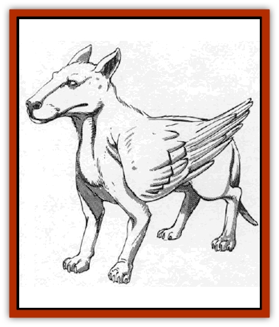

# Lhee

| Statistic | **Common** | **Greater** | **Lesser** |
| --- | --- | --- | --- |
| **Activity Cycle:** | Any | Any | Any |
| **Alignment:** | Neutral | Chaotic good | Chaotic neutral |
| **Armor Class:** | 2 | 4 | 3 |
| **Climate/Terrain:** | Any | Any | Any |
| **Damage/Attack:** | 1d2 | 1d6 | 1d8 |
| **Diet:** | Omnivore | Omnivore | Omnivore |
| **Frequency:** | Uncommon | Uncommon | Uncommon |
| **Hit Dice:** | 1+1 | 5+5 | 3+3 |
| **Intelligence:** | Low (5-7) | Semi- (2-4) | Low (5-7) |
| **Magic Resistance:** | 45% | 15% | 30% |
| **Morale:** | Unsteady (5) | Steady (11) | Fanatic (17) |
| **Movement:** | 9, Fl 12 (B) | 9, Fl 12 (B) | 9, Fl 12 (B) |
| **No. Appearing:** | 1-12 | 1-6 | 1-8 |
| **No. of Attacks:** | 1 | 1 | 1 |
| **Organization:** | Pack | Pack | Pack |
| **Size:** | S (1' high) | M (5' high) | S (3' high) |
| **Special Attacks:** | Nil | Nil | Nil |
| **Special Defenses:** | Nil | Nil | Nil |
| **THAC0:** | 19 | 15 | 17 |
| **Treasure:** | D | W | Nil |
| **XP Value:** | 120 | 650 | 270 |

The lhee are canine pranksters of wildspace, more of a nuisance than anything else. Their behavior swings wildly from acting like regular groundling [[Dog|dogs]] to being irresponsible [[Imp|imps]].

Although there are three types of lhee, they all share certain physical characteristics. All lhee have a pair of dextrous humanoid hands instead of front paws. Each type of lhee has a pair of great, snowy-white dove wings mounted just behind the shoulder blades. All lhee speak a language of yaps, growls, and woofs. They can also speak with [[Dog|blink dogs]].

The three types of lhee resemble different breeds of dogs. Lesser lhee resemble dachshunds, chihuahuas, and miniature poodles. Common lhee look like pit bull terriers, doberman pinschers, and rotweilers. Greater lhee appear as great danes, St. Bernards, and sheepdogs.

**Combat:** The common lhee's bite does 1d8 damage. The common lhee actively look for fights. All lhee can cast *invisibility* (at will), and *audible glamer*, *dancing lights*, *blur*, and *darkness 15' radius* three times a day each. Common lhee function as 3rd-level spellcasters.

**Habitat/Society:** The lhee have a definite hierarchy. The bigger lhee bully the smaller. A pack of lhee consists of all one type, though not necessarily all one breed. Each pack has a leader that the others follow, if they feel like it.

A pack of lhee lairs inside caves or hollows in small moons or planetoids. Common lhee chew everything they find to small bits; consequently, they have no treasure.

The life of a lhee consists of racing comets, eating, chasing spelljammers, eating, and annoying sailors. And eating. They exhibit some groundling dog habits such as a love for chasing felines, and a strong attraction to trees, wizard's staves, ship masts, and the like.

Common lhee are the most violent, aggressive, and downright nasty lhee. They enjoy pulling pranks, though their jokes tend to be violent. ("Hey, let's push that torch-wielding [[Halfling|halfling]] through that portal into the phlogiston!") They tend to be stupid, and the lesser lhee are forever tricking them.

**Lesser Lhee**

  What the lesser lhee lack in size and ferocity, they make up in brains and mischief. They enjoy pestering spelljamming sailors by pulling little innocent pranks on them. Lesser lhee are the most intelligent type of space canine, and they prefer to wriggle out of combat situations by spell use. Lesser lhee have 50% skill in picking pockets. Lhee love to steal little things and commit small acts of sabotage on spelljammers.

In addition to the spells available to the common lhee, the lesser lhee can cast *grease*, *spook*, and *phantasmal force* three times a day at 2nd level.

Lesser lhee bite for 1d2 damage. These small animals avoid battle if at all possible.

**Greater Lhee**

  Greater lhee act like big, friendly dogs. They exhibit many traits of groundling dogs, such as loyalty, frantic displays of happiness at seeing humans, a fierce love of playing, and a gullibility that shocks even the lesser lhee. For instance, a greater lhee will fetch a burning stick tossed into the phlogiston. Like other lhee, greater lhee love to play jokes on spelljamming sailors, though they believe the sailors want them to!

Greater lhee have the same spell capability as the common lhee, casting spells at 6th level.

The greater lhee's bite does 1d6 damage, and they are not reluctant to fight. They feel fights are part of a dog's life.

**Ecology:** Each pair of lhee encountered is a mated pair. There is a 10% chance that the pair have a litter of 2d4 puppies, These puppies have no powers or abilities until they reach adulthood at six months old.

Lhee are difficult to train, though it is possible if the trainer can get a puppy no older than three weeks. Training takes a full year. Trained lhee are sometimes used as watchdogs, but this does not always work, since the dogs have a horrendously limited attention span.

---
## Discovery & Documentation

**Source Publication:** MC9 Spelljammer Appendix II (1991)
**Campaign Setting:** Planescape
**Author(s):** Scott Davis, Newton Ewell, John Terra

### Other Creatures Found in This Source Book
   * [[Alchemy_Plant|Alchemy Plant]]
   * [[Allura|Allura]]
   * [[Aperusa|Aperusa]]
   * [[Autognome|Autognome]]
   * [[Bionoid|Bionoid]]
   * [[Bloodsac|Bloodsac]]
   * [[Buzzjewel|Buzzjewel]]
   * [[Constellate|Constellate]]
   * [[Contemplator|Contemplator]]
   * [[Dohwar|Dohwar]]
   * [[Dragon_Moon|Dragon, Moon]]
   * [[Dragon_Stellar|Dragon, Stellar]]
   * [[Dragon_Sun|Dragon, Sun]]
   * [[Dreamslayer|Dreamslayer]]
   * [[Dweomerborn|Dweomerborn]]
   * [[Fal|Fal]]
   * [[Feesu|Feesu]]
   * [[Fire_Bat|Fire Bat]]
   * [[Firebird|Firebird]]
   * [[Firelich|Firelich]]
   * [[Flowfiend|Flowfiend]]
   * [[Gadabout|Gadabout]]
   * [[Gammaroid|Gammaroid]]
   * [[Gonn|Gonn]]
   * [[Gossamer|Gossamer]]
   * [[Grav|Grav]]
   * [[Great_Dreamer|Great Dreamer]]
   * [[Greatswan|Greatswan]]
   * [[Grell_Colonial|Grell, Colonial]]
   * [[Gullion|Gullion]]
   * [[Insectare|Insectare]]
   * [[Mercurial_Slime|Mercurial Slime]]
   * [[Meteorspawn|Meteorspawn]]
   * [[Monitor|Monitor]]
   * [[Owl_Space|Owl, Space]]
   * [[Pristatic|Pristatic]]
   * [[Scro|Scro]]
   * [[Selkie_Star|Selkie, Star]]
   * [[Silatic|Silatic]]
   * [[Skullbird|Skullbird]]
   * [[Sleek|Sleek]]
   * [[Sluk|Sluk]]
   * [[Space_Swine|Space Swine]]
   * [[Sphinx_Astro-|Sphinx, Astro-]]
   * [[Spirit_Warrior|Spirit Warrior]]
   * [[Starfly_Plant|Starfly Plant]]
   * [[Stargazer|Stargazer]]
   * [[Undead_Stellar|Undead, Stellar]]
   * [[Witchlight_Marauder|Witchlight Marauder]]
   * [[Xixchil|Xixchil]]
   * [[Yitsan|Yitsan]]
   * [[Zurchin|Zurchin]]
