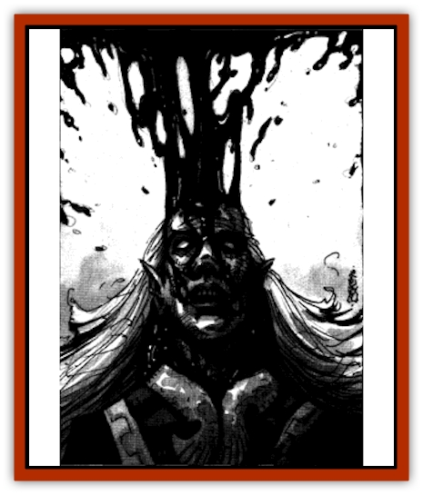

# Lich's Blood

| Statistic | **Lich's Blood** |
| --- | --- |
| **Activity Cycle:** | Any |
| **Alignment:** | Neutral |
| **Armor Class:** | 7 |
| **Climate/Terrain:** | Any |
| **Damage/Attack:** | 1-4 |
| **Diet:** | Magic |
| **Frequency:** | Very rare |
| **Hit Dice:** | 4+2 |
| **Intelligence:** | Exceptional (15-16) |
| **Magic Resistance:** | Special |
| **Morale:** | Fearless (20) |
| **Movement:** | 3 |
| **No. Appearing:** | 1 |
| **No. of Attacks:** | 1 |
| **Organization:** | Solitary |
| **Size:** | M |
| **Special Attacks:** | Drain spells |
| **Special Defenses:** | Immune to weapons and all magic |
| **THAC0:** | 16 |
| **Treasure:** | Nil |
| **XP Value:** | 1,400 |

The [[Lich|lich's]] blood is an artificial monster created by the necromancers final experiment. Fittingly, the first monster slew its maker before slinking off to find more of his kind, planning to take out its vengeance on all of its creator's ilk. Thus, this creature is a menace to all wizards. Lich's blood looks like a pool of animated blood that slowly oozes or drips around, searching for wizards and magical items.

**Combat:** Lich's blood attempts to coat a wizard, running down his throat, blocking his nostrils, and suffocating him as it drains his spells. This suffocation takes the form of 1d4 hp damage per round, with no attack roll needed to hit after the first successful attack. Each round the victim is coated, he must save vs. spells or lose 1d4 spells from his memory, starting with the highest-level spells memorized. Even after the victim is devoid of spells, the lich's blood continues to coat him, draining every last bit of magic from his body. Only after five rounds have passed after all spells have been drained does the lich's blood leave the victim alone. Because of its liquid state, lich's blood is immune to all weapon-based attacks. Thanks to its magic-draining nature, all spells cast on it are absorbed harmlessly. The only way to kill a lich's blood is to use nonmagical acid, fire, or the deprivation of magic. A *dispel magic* spell cast on lich's blood causes 1d6 hp damage per level of the caster; an *anti-magic shell* cast on one destroys the creature immediately.

**Habitat/Society:** Lich's blood has no society, working individually. These monsters heed magic as a human needs water. A lich's blood can survive indefinitely by coating a permanent magical item, living off the magical emanations of the object. However, the best source of such sustenance is a wizard, and a lich's blood will never miss an opportunity to attack such a being. Upon feasting on a wizard of 6th level or higher, lich's blood divides much as an amoeba does. The separate entities then go their own ways, each to seek out more sustenance alone. Lich's blood may exist in any environment, but it prefers the darkness of underground setting. Sunlight is painful but not damaging to the creature.

**Ecology:** Lich's blood has no natural predators and no prey other than spellcasters.

---
## Discovery & Documentation

**Source Publication:** Dragon238 (1997)
**Campaign Setting:** Dragon Magazine
**Author(s):** John Baichtal, Brian Walton, Tom Baxa

### Other Creatures Found in This Source Book
   * [[Cat_Water|Cat, Water]]
   * [[Crocodile_Albino|Crocodile, Albino]]
   * [[Moth_Plague|Moth, Plague]]
   * [[Mummy_Ice|Mummy, Ice]]
