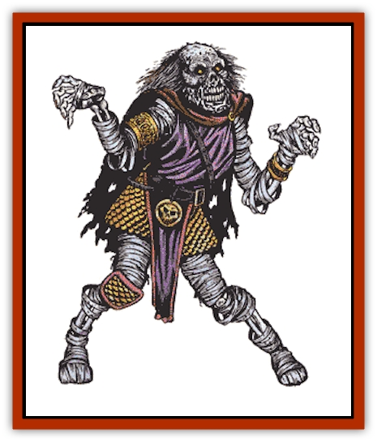
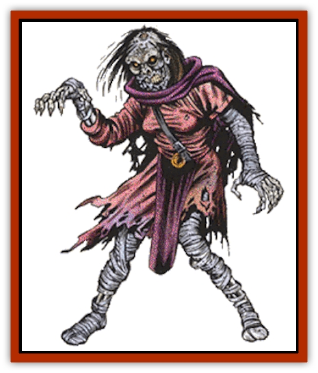

# Lich

| Statistic | **Demilich** | **Lich** |
| --- | --- | --- |
| **Activity Cycle:** | See below | Night |
| **Alignment:** | Any evil | Any evil |
| **Armor Class:** | See below | 0 |
| **Climate/Terrain:** | Any | Any |
| **Damage/Attack:** | See below | 1-10 |
| **Diet:** | None | None |
| **Frequency:** | Very rare | Very rare |
| **Hit Dice:** | See below | 11+ |
| **Intelligence:** | Supra-genius (19-20) | Supra-genius (19-20) |
| **Magic Resistance:** | See below | Nil |
| **Morale:** | Fanatic (17-18) | Fanatic (17-18) |
| **Movement:** | See below | 6 |
| **No. Appearing:** | 1 | 1 |
| **No. of Attacks:** | See below | 1 |
| **Organization:** | Solitary | Solitary |
| **Size:** | M (6' tall) | M (6' tall) |
| **Special Attacks:** | See below | See below |
| **Special Defenses:** | See below | +1 or better magical weapon to hit |
| **THAC0:** | 9 | 9 |
| **Treasure:** | Z | A |
| **XP Value:** | 10,000 | 8,000 |

The lich is, perhaps, the single most powerful form of undead known to exist. They seek to further their own power at all costs and have little or no interest in the affairs of the living, except where those affairs interfere with their own.

A lich greatly resembles a [[Wight|wight]] or [[Mummy|mummy]], being gaunt and skeletal in form. The creature's eye sockets are black and empty save for the fierce pinpoints of light which serve the lich as eyes. The lich can see with normal vision in even the darkest of environments but is unaffected by even the brightest light. An aura of cold and darkness radiates from the lich which makes it an ominous and fearsome sight. They were originally wizards of at least 18th level.

Liches are often (75%) garbed in the rich clothes of nobility. If not so attired, the lich will be found in the robes of its former profession. In either case, the clothes will be tattered and rotting with a 25% chance of being magical in some way.

**Combat:** Although a lich will seldom engage in actual melee combat with those it considers enemies, it is more than capable of holding its own when forced into battle.

The aura of magical power which surrounds a lich is so potent that any creature of fewer than 5 Hit Dice (or 5th level) which sees it must save vs. spell or flee in terror for 5-20 (5d4) rounds.

Should the lich elect to touch a living creature, its aura of absolute cold will inflict 1-10 points of damage. Further, the victim must save vs. paralysis or be utterly unable to move. This paralysis lasts until *dispelled* in some manner.

Liches can themselves be hit only by weapons of at least +1, by magical spells, or by monsters with 6 or more Hit Dice and/or magical properties. The magical nature of the lich and its undead state make it utterly immune to *charm*, *sleep*, *enfeeblement*, *polymorph*, *cold*, *electricity*, *insanity*, or *death* spells. Priests of at least 8th level can attempt to turn a lich, as can paladins of no less than 10th level.

A lich is able to employ spells just as it did in life. It still requires the use of its spell books, magical components, and similar objects. It is important to note that most, if not all, liches have had a great deal of time in which to research and create new magical spells and objects. Thus, adventurers should be prepared to face magic the likes of which they have never seen before when stalking a lich. In addition, liches are able to use any magical objects which they might possess just as if they were still alive.

Defeating a lich in combat is difficult indeed, but managing to actually destroy the creature is harder still. In all cases, a lich will protect itself from annihilation with the creation of a phylactery in which it stores its life force. This is similar to a magic jar spell. In order to ensure the final destruction of a lich, its body must be wholly annihilated and its phylactery must be sought out and destroyed in some manner. Since the lich will always take great care to see to it that its phylactery is well hidden and protected this can be an undertaking fully as daunting as the defeat of the lich in its physical form.

**Habitat/Society:** Liches are usually solitary creatures. They have cast aside their places as living beings by choice and now want as little to do with the world of men as possible. From time to time, however, a lich's interest in the world at large may be reawakened by some great event of personal importance.

A lich will make its home in some ominous fortified area, often a strong keep or vast subterranean crypt.

When a lich does decide to become involved with the world beyond its lair, its keen intelligence makes it a dangerous adversary. In some cases, a lich will depend on its magical powers to accomplish its goals. If this is not sufficient, however, the lich is quite capable of animating a force of undead troops to act on its behalf. If such is the case, the lich's endless patience and cunning more than make up for the inherent disadvantages of the lesser forms of undead which it commands.

Although the lich has no interest in good or evil as we understand it, the creature will do whatever it must to further its own causes. Since it feels that the living are of little importance, the lich is often viewed as evil by those who encounter it. In rare cases, liches of a most unusual nature can be found which are of any alignment.

The lich can exist for centuries without change. Its will drives it onward to master new magics and harness mystical powers not available to it in its previous life. So obsessed does the monster become with its quest for power that it often forgets its former existence utterly. Few liches call themselves by their old names when the years have drained the last vestiges of their humanity from them. Instead, they often adopt pseudonyms like "the Black Hand" or "the Forgotten King." Learning the true name of a lich is rumored to confer power over the creature.

**Ecology:** The lich is not a thing of this world. Although it was once a living creature, it has entered into an unnatural existence.

In order to become a lich, the wizard must prepare its phylactery by the use of the *enchant an item*, *magic jar*, *permanency* and *reincarnation* spells. The phylactery, which can be almost any manner of object, must be of the finest craftsmanship and materials with a value of not less than 1,500 gold pieces per level of the wizard. Once this object is created, the would-be lich must craft a potion of extreme toxicity, which is then enchanted with the following spells: *wraithform*, *permanency*, *cone of cold*, *feign death*, and *animate dead*. When next the moon is full, the potion is imbibed. Rather than death, the potion causes the wizard to undergo a transformation into its new state. A system shock survival throw is required, with failure indicating an error in the creation of the potion which kills the wizard and renders him forever dead.

**Demilich**

  The demilich is not, as the name implies, a weaker form of the lich. Rather, it is the stage into which a lich will eventually evolve as the power which has sustained its physical form gradually begins to fail. Inmost cases, all that remains of a demilich's body are a skull, some bones, and a pile of dust.

When it has learned all that it feels it can in its undead life, the lich will continue its quest for power in strange planes unknown to even the wisest of sages. Since it has no use for its physical body at this point, the lich leaves it to decay as it should have done centuries ago.

If the final resting place of a demilich's remains are entered, the dust which was once its body will rise up and assume a man-like shape. In the case of the oldest demiliches (25%), the shape will advance and threaten, but dissipate without attacking in 3 rounds unless attacked. Younger demiliches (75%) still retain a link to their remains, however, and will form with the powers of a [[Wraith|wraith]]. This dust form cannot be turned. In addition, it can store energy from attacks and use this power to engage its foes. If the dust form is attacked, each point of damage which is delivered to it is converted to an energy point. Since the demilich will fall back and seem to suffer injury from each attack (though none is actually inflicted), its attackers are likely to press on in their attempts to destroy it. Once the demilich has acquired 50 energy points, it will assume a manifestation which looks much like the lich's earlier undead form and has the powers and abilities of a [[Ghost|ghost]], but which cannot be turned.

If anyone touches the skull it will rise into the air and turn to face the most powerful of the intruders (a spell user will be chosen over a non-spell user). Instantly, it unleashes a howl which acts as a *death ray*, affecting all creatures within a 20' radius of the skull. Those who fail to save vs. death are permanently dead.

On the next round, the demilich will employ another manner of attack. In order to attain the status of a demilich, a lich must have replaced 5-8 (1d4+4) of its teeth with gems. Each of these gems now serves as a powerful magical device which can *trap the soul* of its adversaries. The physical body of someone hit with the demilich's spell collapses and rots away in a single round. Once it has drained the life essence from the most powerful member of the party, the skull sinks back to the floor. If it continues to be challenged, the demilich can repeat this attack until all of its gems are filled. An *amulet of life protection* will prevail over the gem, but the character's body will perish regardless.

In addition to the attacks mentioned above, a demilich can also pronounce a powerful curse on those who disturb it. These can be so mighty as to include: always being hit by one's enemies, never making a saving throw, or the inability to acquire new experience points. Demilich curses can be overcome with a *remove curse*, but the victim loses one point of charisma permanently when the curse is removed.

The skull of a demilich is Armor Class -6 and has 50 hit points. It can be affected by spells in only a few ways: a *forget* spell will cause it to sink down without attacking (either by howling or draining a soul), a *dispel evil* will do 5-8 (1d4+4) points of damage to it, a *shatter spell* will inflict 3-18 (3d6) points of damage to it, a *holy word* pronounced against it will deliver 5-30 (5d6) points of damage, and a *power word kill* spell cast by an ethereal or astral wizard will cause the skull to shatter (destroying it).

Most weapons will be unable to harm the skull of a demilich, but there are exceptions. A fighter or ranger with a *vorpal sword*, *sword of sharpness*, *sword +5*, or vorpal weapon can inflict normal damage  on the skull, as can a paladin with a vorpal or +4 weapon. Further, any character with a +4 or better weapon or a *mace of disruption* can inflict 1 point of damage to the skull each time he strikes it.

Upon the destruction of the skull, those who have been trapped inside the gems must make a saving throw vs. spell. Those who fail are lost forever, having been consumed by the demilich to power its magical nature. If the character survives, the gem glows with a faint inner light, and *true seeing* will reveal a tiny figure trapped within. If the throw is made the soul can be freed by simply crushing the gem. A new body must be within 10 yards for the soul to enter or it will be lost. Such a body might be a clone or simulacrum. (See spells of those names.)

If the fragments of the destroyed skull are not destroyed by immersion in holy water and the casting of a *dispel magic* the demilich will reform in 1-10 days.

**Archlich**

  From time to time, sages have heard rumors of liches having alignments other than evil, and even lawful good liches apparently have existed. There have even been reports of priests who, in extreme circumstances, have become liches. These reports have recently been verified, but the archlich is as rare as [[Roc|Roc's]] teeth.

---
## Discovery & Documentation

**Source Publication:** MC1 Volume I (w/binder #1) (1991)
**Campaign Setting:** Advanced Dungeons & Dragons 2nd Edition
**Author(s):** Jay Batista, Scott Bennie, Grant Boucher, William W. Connors, Steve Gilbert, Heike Kubasch, James Lowder, David Edward Martin, Bruce Nesmith, Jean Rabe, Rick Swan, John J. Terra, Gary L. Thomas

### Other Creatures Found in This Source Book
   * [[Bat|Bat]]
   * [[Bear|Bear]]
   * [[Behir|Behir]]
   * [[Boar|Boar]]
   * [[Bookworm|Bookworm]]
   * [[Brownie|Brownie]]
   * [[Bugbear|Bugbear]]
   * [[Carrion_Crawler|Carrion Crawler]]
   * [[Cat_Great|Cat, Great]]
   * [[Catoblepas|Catoblepas]]
   * [[Dragon_General_Information|Dragon, General Information]]
   * [[Dragonfish|Dragonfish]]
   * [[Elemental_Air_Kin_Aerial_Servant|Elemental, Air Kin, Aerial Servant]]
   * [[Elemental_Earth_Kin_Sandling|Elemental, Earth Kin, Sandling]]
   * [[Elephant|Elephant]]
   * [[Gnoll|Gnoll]]
   * [[Hobgoblin|Hobgoblin]]
   * [[Homunculus|Homunculus]]
   * [[Hornet_Giant|Hornet, Giant]]
   * [[Horse|Horse]]
   * [[Hyena|Hyena]]
   * [[Jackal|Jackal]]
   * [[Jackalwere|Jackalwere]]
   * [[Korred|Korred]]
   * [[Lizard|Lizard]]
   * [[Lizard_Man|Lizard Man]]
   * [[Lycanthrope_General_Information|Lycanthrope, General Information]]
   * [[Lycanthrope_Seawolf|Lycanthrope, Seawolf]]
   * [[Lycanthrope_Werebear|Lycanthrope, Werebear]]
   * [[Lycanthrope_Weretiger|Lycanthrope, Weretiger]]
   * [[Lycanthrope_Werewolf|Lycanthrope, Werewolf]]
   * [[Manticore|Manticore]]
   * [[Medusa|Medusa]]
   * [[Mind_Flayer|Mind Flayer]]
   * [[Minotaur|Minotaur]]
   * [[Mudman|Mudman]]
   * [[Mummy|Mummy]]
   * [[Nixie|Nixie]]
   * [[Nymph|Nymph]]
   * [[Ogre|Ogre]]
   * [[Ooze_Slime_Jelly_I|Ooze/Slime/Jelly I]]
   * [[Ooze_Slime_Jelly_II|Ooze/Slime/Jelly II]]
   * [[Orc|Orc]]
   * [[Owl|Owl]]
   * [[Owlbear_I|Owlbear I]]
   * [[Pegasus|Pegasus]]
   * [[Piercer|Piercer]]
   * [[Pudding_Deadly|Pudding, Deadly]]
   * [[Rakshasa|Rakshasa]]
   * [[Rat|Rat]]
   * [[Ray|Ray]]
   * [[Remorhaz|Remorhaz]]
   * [[Satyr|Satyr]]
   * [[Scorpion|Scorpion]]
   * [[Selkie|Selkie]]
   * [[Shadow|Shadow]]
   * [[Skeleton|Skeleton]]
   * [[Skunk|Skunk]]
   * [[Snake|Snake]]
   * [[Spectre|Spectre]]
   * [[Spider|Spider]]
   * [[Sprite|Sprite]]
   * [[Toad_Giant|Toad, Giant]]
   * [[Treant|Treant]]
   * [[Troll|Troll]]
   * [[Umber_Hulk|Umber Hulk]]
   * [[Unicorn|Unicorn]]
   * [[Vampire|Vampire]]
   * [[Wight|Wight]]
   * [[Will_O'Wisp|Will O'Wisp]]
   * [[Wolf|Wolf]]
   * [[Wolfwere|Wolfwere]]
   * [[Wraith|Wraith]]
   * [[Wyvern|Wyvern]]
   * [[Yeti|Yeti]]
   * [[Yuan-ti|Yuan-ti]]
   * [[Zombie|Zombie]]
