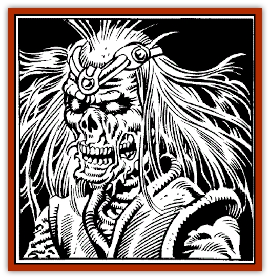
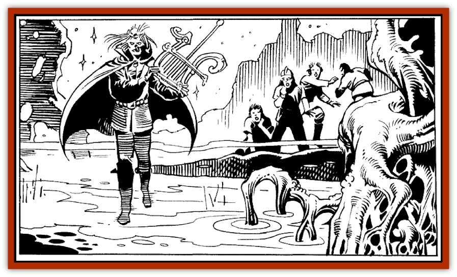

# Lich - Arch

| Statistic | **Lich, Arch** |
| --- | --- |
| **Activity Cycle:** | Any |
| **Alignment:** | Any good |
| **Armor Class:** | 0 |
| **Climate/Terrain:** | Any |
| **Damage/Attack:** | 1-10 |
| **Diet:** | Nil |
| **Frequency:** | Very rare |
| **Hit Dice:** | 11 + |
| **Intelligence:** | Supra-genius (19-20) |
| **Magic Resistance:** | Nil |
| **Morale:** | Fanatic (17-18) |
| **Movement:** | 6 |
| **No. Appearing:** | 1 |
| **No. of Attacks:** | 1 |
| **Organization:** | Solitary |
| **Size:** | M (6' tall) |
| **Special Attacks:** | See below |
| **Special Defenses:** | + 1 or better magical weapon to hit |
| **THAC0:** | 10 |
| **Treasure:** | A,T,V |
| **XP Value:** | 9,000 |

Archliches are a *very rare* form of undead. They are transformed human spellcasters of good alignment who have de- 1 iberately and carefully accomplished their own transformation into undeath. These caring individuals do so to serve a cause or protect a loved being or place, and devote their undeath to the furtherance of their purpose.

Nevertheless, archliches resemble [[Lich|liches]]. They appear as gaunt, skeletal humans who radiate a menacing chill, and wear tattered, once-fine robes (25% of which are magical).

Their eyesockets contain only twinkling lights; magical eyes that are unaffected by light, but can see in the deepest darkness as keenly as they saw in normal light, in life. Archliches were formerly wizards or priests of at least 18th level, or bards of at least 24th level.

**Combat:** Archliches like to avoid direct combat if possible. Unlike liches, they are immune to clerical turning or disruption. Their strength of will combined with the process through which they attain lichdom renders archliches immune to all mental magic (*enchantment*/*charm* and *illusion* spells and effects). They can therefore never be magically controlled or influenced by another being.

Archliches exude an aura of power that causes creatures of less than 5 hit dice or 5th level to flee in terror for 4d4 rounds. Their touch chills living things for 1-10 hit points of damage, and causes instant paralysis to victims that fail their saving throws. Such paralysis lasts 2-5 turns, unless magically *dispelled*.

An archlich can, by touch and will, *repel undead*-this power compelling even the most powerful undead creatures. Archliches are themselves immune to poison, disease, and all energy- and ability-draining undead attacks.

An archlich can *animate dead* by touch and will, to raise skeletons and zombies to serve it. If it so wills, its touch can give it the same control over existing wights and lesser undead as it has over the undead it animates. Such things are usually done in battle. An archlich has no interest in raising armies to serve it, nor in controlling others by force or fear.

Archliches can be hit only by magical weapons of + 1 or greater power, by magical spells and item effects, and by monsters having 6 or more hit dice or levels, and/or magical properties.

*Polymorph*, *paralysis*, *petrification*, *cold*, *electricity*, *death*, and *insanity*-causing spells and effects have utterly no effect on an archlich. *Raise dead* and similar spells will do an archlich 1 hit point of damage per level of the being casting them.

An archlich is able to employ spells and magical items just as it did in life. It still requires the use of magical components, spellbooks, and the like-with nine exceptions (see below). Archlich bards retain their musical abilities. Many have composed haunting, melancholy ballads in their undeath, and are known to roam dungeons, ruins, and desolate moors or bogs at night playing and singing the tunes of the past.

Each archlich can choose nine spells that it knows at the time of achieving undeath, and retain them in memory. When each is later cast, it is forgotten, but regenerates spontaneously in the archlich's mind 144 turns later. Typically *dispel magic*, *fly*, *invisibility*, *teleport* and a few offensive spells are retained by archliches in this manner.

**Habitat/Society:** Unlike liches, archliches have no phylacteries. They enshrine their life forces in a usable magical item (see below).

Archliches are usually solitary. They prefer to work behind the scenes, in study, contemplation, and (through servant creatures and allies) manipulation of other beings, to achieve their own ends. A few archliches exist to further their own mastery of magic, but most exist to serve a kingdom or royal family, a particular hero or organization, or to exact revenge or complete a goal left unfinished at death.

Archliches make their homes anywhere, but tend to conceal their presences or natures from living men, to avoid continual attack. They have the endless patience and cunning of their more evil counterparts, liches, and can make deadly foes.

Archliches, unlike liches, do not forget. This is both a blessing and a curse. They may grow very weary with the passing years and seek to end their own existence, but they never spurn their own names or former friends.

Archliches will often work with the living-rangers, bards, and wizards in particular-to achieve a common goal. Archliches have even been known to love living beings, tend the wounded, or tutor living wizards. However, they can never achieve true life again, short of divine means.

Knowing an archlich's name gives a creature no power over it, but archliches can hear their names spoken anywhere on the same plane, and sometimes (06% of the time) come curiously, to investigate.

Archliches can *water walk* (as the third-level priest spell) as a natural ability, at will. Those who live on islands or in marshes or rivers are often seen walking silently along where a living creature would plunge into the depths. Archliches always move silently unless they will themselves to do otherwise.

**Ecology:** To become an archlich, a living spellcaster must create a magical item of some sort. By tradition, for most wizards this item is a miniature spellbook into which they put the nine spells they seek to carry forever in undeath.

A potion must then be created and enchanted with the spells *animate dead*, *chill touch*, *contingency*, *pass without trace*, *permanency*, *teleport*, *trap the soul*, and *wraithform*. The would-be archlich drinks the potion while touching the chosen magical item, which must be anointed with at least one drop of the would-be archlich's blood.

A single, secret spell is then cast, and the being either dies (07% chance) or enters undeath (83% chance), collapsing into a death-like slumber that lasts 4-16 turns. When the being awakes, it will be an archlich forevermore.

The potion may be created and the lichdom spell cast by the would-be archlich or by another being; i.e., a prospective archlich may achieve undeath through the magical assistance of another. The process cannot, however, work on an unwilling creature (its death will always result). The would-be archlich may also have aid in creating the magical item that stores its essence, but must take an active part in its creation.

Should an archlich be destroyed, whatever remains of it is instantly teleported, even across vast distances or many planes, to touch the magical item containing its essence. The archlich will then begin to slowly re-form, gaining 1 hp per day, until it is whole once again. Until it has regained at least one-quarter of its hit points, the archlich will be immobile, yet will be able to speak.

It will regain one of its nine spells per day until it has them all (and once regained, each will return again a day after being cast). The immobile lich can cast these spells while still otherwise helpless, and need not remain in the vicinity of its magical item to further recover.

Whenever this process occurs, whatever items the archlich is wearing or holding when slain come with it, but all memorized spells are lost.

If the archlich's magical item is physically destroyed, the archlich is also instantly and irrevocably destroyed. Merely exhausting the charges of such an item, or dispelling its magical powers, will not harm the archlich; destruction is required.

Archliches need not eat, drink, or breathe. Their bodies never change, sweat, blush, ache, or grow hair as those of living humans do. They can eat, drink, smoke, and so on if they wish to do so.

---
## Discovery & Documentation

**Source Publication:** SJR1 Lost Ships (1990)
**Campaign Setting:** Spelljammer
**Author(s):** Ed Greenwood, Paul Jaquays, Anne Brown, Dell Barras, Brom, Jeff Grubb

### Other Creatures Found in This Source Book
   * [[Beholder_Undead_Death_Tyrant|Beholder, Undead (Death Tyrant)]]
   * [[Flow_Barnacle|Flow Barnacle]]
   * [[Neogi:_Undead_Old_Master|Neogi: Undead Old Master]]
   * [[Shadowsponge_Air_Stealer|Shadowsponge (Air Stealer)]]
   * [[Beholder_Eater_Thagar_Grimgobbler|Beholder Eater, Thagar (Grimgobbler)]]
   * [[Tinkerer_Giant_Bubble|Tinkerer (Giant Bubble)]]
   * [[Sarphardin_Watcher|Sarphardin (Watcher)]]
   * [[Men:_Wonderseeker|Men: Wonderseeker]]
   * [[Spaceworm|Spaceworm]]
