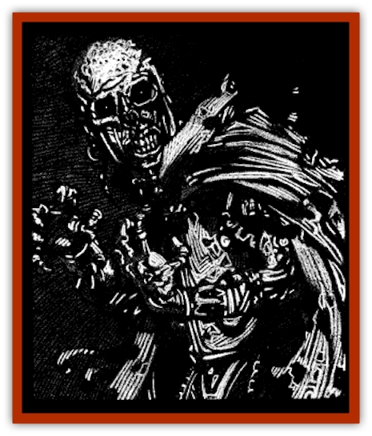
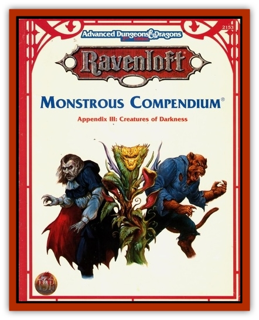

# Lich - Defiler

| Statistic | **Lich, Defiler** |
| --- | --- |
| **Activity Cycle:** | Any |
| **Alignment:** | Chaotic evil |
| **Armor Class:** | 0 |
| **Climate/Terrain:** | Athas or Ravenloft |
| **Damage/Attack:** | By weapon or 1d10 |
| **Diet:** | None |
| **Frequency:** | Very rare |
| **Hit Dice:** | 11+ |
| **Intelligence:** | Supra-genius (19-20) |
| **Magic Resistance:** | Nil |
| **Morale:** | Fanatic (17) |
| **Movement:** | 6 |
| **No. Appearing:** | 1 |
| **No. of Attacks:** | 1 |
| **Organization:** | Solitary |
| **Size:** | M (6') |
| **Special Attacks:** | See below |
| **Special Defenses:** | +1 or better weapons to hit |
| **THAC0:** | 9 |
| **Treasure:** | R,X (E) |
| **XP Value:** | 8,000 |

**Psionics Summary**

| Level | Dis/Sci/Dev | Attack/Defense | Score | PSPs |
| --- | --- | --- | --- | --- |
| 10 | 4/5/15 | all/all | 15 | 120 |

**Telepathy -** *Sciences:* domination, ejection, mind link; *Devotions:* aversion, awe, contact, conceal thoughts, ESP, life detection, send thoughts.

**Psychokinesis -** *Science:* ; *Devotions:* control body, control winds, levitation, soften.

**Psychoportation -** *Science:* teleport; *Devotions:* dimensional door, dimension walk, time/space anchor.

Though there is nothing more loathsome than the foul undead, the defiler [[Lich|lich]] raises even this putrid circle of fiends to new levels of destruction and malevolence. Some that tread across the blasted domains of these creatures have heard them called by another name: [[Kaisharga|*kaisharga*]].

Defiler liches look like gaunt and skeletal [[Wight|wights]] or [[Mummy|mummies]]. Tiny green points of light float in the blackness of their empty eye sockets and their bony fingers can quickly flay the flesh from the bones of an unarmored man.

All liches are arrogant creatures, so most dress in the clothes of local nobility or elaborate garb reminiscent of the profession they held before their transition to unlike. Even the fanciest of garments does little to hide their true appearance. however. Defiler liches emanate an aura of atrophy that slowly rots their clothes and anything around them. Cloaks begin to tatter, sleeves fray, and fruit at the same table as the defiler will quickly turn brown and spoiled.

**Combat:** Like other liches, defilers rarely engage in melee combat with their foes. If forced, however, the lich is more than able to stand up to all but the strongest opponents. The effective Strength, Dexterity, and Constitution scores of a kaisharga rise to 20 at the moment it assumes its undead state. In addition, any psionic powers that the defiler might have had in life are greatly magnified.

Simply approaching a defiler lich is enough to test the mettle of most opponents. Any creature of less than 5 Hit Dice (or 5th level) who sees the defiler must make a saving throw vs. spell or flee in terror for 5-20 (5d4) rounds.

The touch of a defiler lich is slightly different from that of its cousins. Those touched by the thing feel their magical essence drawn from the very marrow of their bones. Nollspellcasters suffer 1-10 points of damage from this attack; spellcasters (wizards and priests) are much more sensitive and lose 2-20 hit points per touch.

Liches can only be hit by weapons of at least +1 enchantment, magical spells. or by monsters with at least 4+1 Hit Dice or magical powers of their own. The magical nature of the lich and its undead state make it utterly immune to *charm*, *sleep*, *enfeeblement*, *polymorph*, *cold*, *electricity*, *insanity*, or *death* spells. Priests of at least 8th level can attempt to turn a lich, as can paladins of no less than 10th level.

Of course, the most powerful ability of the defiler lich is its vast repertoire of spells. Defilers have the same spell casting ability as a living wizard of equivalent Hit Dice. They often have spells never before seen by other eyes, however, as well as a plethora of magical weapons, devices, and potions. Liches have usually had centuries to create the magical artifacts that surround them, so their effects and abilities are often well suited to the creature's environment, lair, and temperament.

What truly sets the defiler lich apart from its cousins is the strange effect its spellcasting, and indeed its very presence, has on the environment around it. Defilers draw their energy from the living things of the world. It is a quicker and dirtier process that makes casting easier, but at the expense of the land and beings in the area. This process literally turns plant life to ash. Its effect on the living is less traumatic, though extremely painful.

The radius of this effect depends upon two things: the abundance of vegetation in the area. and the level of the spell cast.

| Terrain Type | Spell Level |
| --- | --- |
|  | 1 | 2 | 3 | 4 | 5 | 6 | 7 | 8 | 9 |
| --- | --- | --- | --- | --- | --- | --- | --- | --- | --- |
| Stony Barrens | 10 | 14 | 17 | 20 | 22 | 24 | 26 | 28 | 30 |
| Mountains, rocky | 10 | 14 | 17 | 20 | 22 | 24 | 26 | 28 | 30 |
| Seashore, beach | 10 | 14 | 17 | 20 | 22 | 24 | 26 | 28 | 30 |
| Seashore, grassy | 3 | 4 | 4 | 5 | 5 | 5 | 5 | 6 | 6 |
| Forest | 1 | 1 | 2 | 2 | 2 | 2 | 2 | 3 | 3 |
| City | 10 | 14 | 17 | 20 | 22 | 24 | 26 | 28 | 30 |
| Village | 3 | 4 | 4 | 5 | 5 | 5 | 5 | 6 | 6 |

The number shown is the radius, in yards, around the defiler where all vegetation is turned to ash. The effect is instantaneous with the casting of the spell. If a defiler casts more than one spell from the same location, the radius of destroyed vegetation expands around it. Consult the Defiler Magical Destruction Table for the highest level spell cast from that location, then add one yard for every other spell cast. Spells equal to the highest level spell are treated as additional spells.

Though usually only plants are destroyed within this radius, living creatures suffer great pain. Any being in the radius of a defiler lich's magic suffers an immediate initiative modifier penalty equal to the level of the defiler spell cast. No matter how high the resulting initiative roll, though, the pain can never keep a character from performing an action during a round. The initiative penalty only postpones when the action occurs.

Animate plants in the area of effect, such as [[Treant_Undead|undead treants]] or [[Lashweed|lashweeds]], suffer greatly from defiler spells. Only their high level of innate magical energy keeps them from being destroyed outright. Any plant fated with Hit Dice takes 1d4 points of damage for every level of the spell that affects it. Thus, a patch of lashweed in the destruction radius of a fifth level spell would take 5d4 points of damage each.

Any plant-based spell components within the area of effect are ruined.

**Habitat/Society:** In life, defiler liches were spellcasters of great power who learned to garner their magical energies from the very land around them. Trees, grasses, and the very essence of all living things provide fuel for their infernal spells.

No one seems to know where the first defiler lich came from. With the many gapes and portals existing in the demiplane, it is most likely that the foul things came from some other place far removed from Ravenloft. Rumors abound that the world of their origin was blasted into desert by their ilk, but thus far no proof has been offered of this theory.

What is evident is that the rich forests of the Ravenloft realms provide a virtually unlimited power source for their small numbers. Of course, this very same advantage can often be the first clue that such a creature has entered an area. If once lush forests suddenly turn to lifeless gray ash, few will doubt that there is a defiler in the land.

Due to the very nature of a defiler's magic, its lair is normally devoid of vegetation. Underground lairs may lie beneath blasted heaths, ruined keeps have none of the typical ivy growing up the side, and any haven is likely to lie in the midst of a gray and dusty plain. Defilers will often use illusions to cover their abodes, but an astute adventurer will notice the dusty film that covers his gear and collects in his throat and eyes.

The ash created by defiler magic is black and gray, completely devoid of life or life-giving elements. Nothing will grow in an area of ash for one year. The ash itself is very light and usually blows away, leaving behind a lifeless, circular scar on the ground. Even with the ash gone, though, the defiler's magic has leeched all life-giving nutrients from the soil, so that a defiled area may take many years to recover, if it ever does.

There are rumors that many of the defiler lichee chased from places like Barovia or Falkonovia have migrated to the more familiar environment of Bluetspur. Some even say that several of these fiends have stricken unholy alliances with the [[Mind_Flayer|illithids]] that live there. If this is true, it is likely that the defilers will use their allies to push their way back into lands with more flora to power their ruinous magical arts.

**Ecology:** Defilers have the same basic goals that other liches have; the eventual ascension to demilich status and even transcendence to other planes and forms of existence. In the meantime however, these undead fiends have thousands of years in which to wait impatiently for some condition or circumstance. During this period their evil plots often grow far beyond the comprehension of mere mortals.

Defiler liches gain their status in the same way that other liches do. This includes the construction of a phylactery and its enchantment. Adventurers seeking to battle such a creature would do well to locate the fiend's phylactery and focus their efforts on it.

**Demi-Defilers**

  Defiler demiliches gain the same benefits and invulnerabilities as others of that ilk. The major difference between the two is the nature of the demilich's *curse* ability. All demiliches can pronounce a single *curse* on anyone who disturbs them. This can be incredibly powerful, such as always being hit by one's enemies, never making a saving throw, or never being able to wield magical items.

In addition to this however, the *curse* of the defiler dooms one to an aura of entropy that kills all plant life in a radius equal to the character's level, in feet. The effect isn't as sudden or dramatic as that of the defiler's own spellcasting, but it can be devastating nonetheless. Within one minute, all flowers, leaves, or other light vegetation turns brown and begins to wilt. Within one turn, light vegetation is withered and dead. Trees and other larger plants develop dark blotches of disease-ridden bark or stems. In one half hour, light vegetation crumbles to dust. Trees and the like rot and may collapse, turning to ash one hour later. Animated plant-based lifeforms take 1d4 points of damage per round spent within the cursed character's aura of entropy. Spell components and similar organic things must make a saving throw vs. disintegration or crumble into dust.

**Optional Rule**

  Druids and rangers are very sensitive to the land and cannot tolerate the presence of such a blasphemous creature in their midst. Should either of these character types enter the blasted realm of a defiler lich or demilich, they should stop at nothing to find the source of the contagion and eliminate it. Those that turn their back on the situation will forever feel haunted, and their deities may disfavor them. The Dungeon Master should deny the druid or the ranger the use of some ability formerly granted to them by their patron. A druid might lose a granted power or a ranger may lose his ability to becalm wild beasts.

If the druid or the ranger takes part in defeating the kaisharga, the DM should award them an extra 10% of the creature's experience point value including minions and henchmen.

---
## Discovery & Documentation

**Source Publication:** Ravenloft Appendix III (1991)
**Campaign Setting:** Ravenloft
**Author(s):** Kirk Botulla

### Other Creatures Found in This Source Book
   * [[Akikage|Akikage]]
   * [[Animator_Common|Animator, Common]]
   * [[Animator_Greater|Animator, Greater]]
   * [[Animator_Minor|Animator, Minor]]
   * [[Animator_General_Information|Animator, General Information]]
   * [[Bakhna_Rakhna|Bakhna Rakhna]]
   * [[Baobhan_Sith|Baobhan Sith]]
   * [[Beetle_Scarab|Beetle, Scarab]]
   * [[Boneless|Boneless]]
   * [[Boowray|Boowray]]
   * [[Bruja|Bruja]]
   * [[Carrionette|Carrionette]]
   * [[Carrion_Stalker|Carrion Stalker]]
   * [[Cat_Midnight|Cat, Midnight]]
   * [[Cat_Skeletal|Cat, Skeletal]]
   * [[Cloaker_Resplendent|Cloaker, Resplendent]]
   * [[Cloaker_Shadow|Cloaker, Shadow]]
   * [[Cloaker_Undead|Cloaker, Undead]]
   * [[Corpse_Candle|Corpse Candle]]
   * [[Death's_Head_Tree|Death's Head Tree]]
   * [[Doppelganger_Ravenloft|Doppelganger (Ravenloft)]]
   * [[Familiar_Pseudo-|Familiar, Pseudo-]]
   * [[Familiar_Undead|Familiar, Undead]]
   * [[Feathered_Serpent|Feathered Serpent]]
   * [[Fenhound|Fenhound]]
   * [[Figurine_Ceramic|Figurine, Ceramic]]
   * [[Figurine_Crystal|Figurine, Crystal]]
   * [[Figurine_Ivory|Figurine, Ivory]]
   * [[Figurine_Obsidian|Figurine, Obsidian]]
   * [[Figurine_Porcelain|Figurine, Porcelain]]
   * [[Figurine_General_Information|Figurine, General Information]]
   * [[Fleas_of_Madness|Fleas of Madness]]
   * [[Furies|Furies]]
   * [[Geist|Geist]]
   * [[Ghost_Animal|Ghost, Animal]]
   * [[Golem_Flesh_Ravenloft|Golem, Flesh (Ravenloft)]]
   * [[Golem_Mist_Ravenloft|Golem, Mist (Ravenloft)]]
   * [[Golem_Wax_Ravenloft|Golem, Wax (Ravenloft)]]
   * [[Gremishka|Gremishka]]
   * [[Hag_Spectral|Hag, Spectral]]
   * [[Head_Hunter|Head Hunter]]
   * [[Hearth_Fiend|Hearth Fiend]]
   * [[Hebi-No-Onna|Hebi-No-Onna]]
   * [[Hound_Phantom|Hound, Phantom]]
   * [[Hound_Skeletal|Hound, Skeletal]]
   * [[Imp_Wishing|Imp, Wishing]]
   * [[Ivy_Crawling|Ivy, Crawling]]
   * [[Jack_Frost|Jack Frost]]
   * [[Jolly_Roger|Jolly Roger]]
   * [[Kizoku|Kizoku]]
   * [[Lashweed|Lashweed]]
   * [[Leech_Magical|Leech, Magical]]
   * [[Leech_Psionic|Leech, Psionic]]
   * [[Lich_Drow|Lich, Drow]]
   * [[Lich_Elemental|Lich, Elemental]]
   * [[Lich_Psionic|Lich, Psionic]]
   * [[Living_Tattoo|Living Tattoo]]
   * [[Lycanthrope_Loup-garou|Lycanthrope, Loup-garou]]
   * [[Lycanthrope_Werejackal|Lycanthrope, Werejackal]]
   * [[Lycanthrope_Werejaguar_Ravenloft|Lycanthrope, Werejaguar (Ravenloft)]]
   * [[Lycanthrope_Wereleopard|Lycanthrope, Wereleopard]]
   * [[Lycanthrope_Wereray|Lycanthrope, Wereray]]
   * [[Mist_Ferryman|Mist Ferryman]]
   * [[Moor_Man|Moor Man]]
   * [[Obedient|Obedient]]
   * [[Odem|Odem]]
   * [[Paka|Paka]]
   * [[Plant_Blood_Rose|Plant, Blood Rose]]
   * [[Plant_Fearweed|Plant, Fearweed]]
   * [[Radiant_Spirit|Radiant Spirit]]
   * [[Recluse|Recluse]]
   * [[Remnant_Aquatic|Remnant, Aquatic]]
   * [[Rushlight|Rushlight]]
   * [[Sea_Spawn_Master|Sea Spawn, Master]]
   * [[Sea_Spawn_Minion|Sea Spawn, Minion]]
   * [[Shadow_Asp|Shadow Asp]]
   * [[Shattered_Brethren|Shattered Brethren]]
   * [[Skeleton_Archer|Skeleton, Archer]]
   * [[Skeleton_Insectoid|Skeleton, Insectoid]]
   * [[Skin_Thief|Skin Thief]]
   * [[Spirit_Psionic|Spirit, Psionic]]
   * [[Strahd_Skeleton|Strahd Skeleton]]
   * [[Strahd_Zombie|Strahd Zombie]]
   * [[Unicorn_Shadow|Unicorn, Shadow]]
   * [[Vampire_Drow|Vampire, Drow]]
   * [[Vampire_Nosferatu|Vampire, Nosferatu]]
   * [[Vampire_Oriental|Vampire, Oriental]]
   * [[Virus_General_Information|Virus, General Information]]
   * [[Virus_I|Virus I]]
   * [[Virus_II|Virus II]]
   * [[Virus_III|Virus III]]
   * [[Vorlog|Vorlog]]
   * [[Will_O'Dawn|Will O'Dawn]]
   * [[Will_O'Deep|Will O'Deep]]
   * [[Will_O'Mist|Will O'Mist]]
   * [[Will_O'Sea|Will O'Sea]]
   * [[Zombie_Cannibal|Zombie, Cannibal]]
   * [[Zombie_Desert|Zombie, Desert]]
   * [[Zombie_Wolf|Zombie Wolf]]
   * [[Zombie_Fog|Zombie Fog]]
