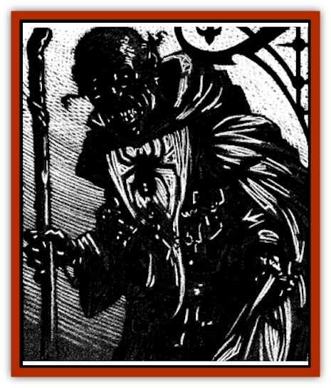

# Lich - Drow

| Statistic | **Drider** | **Drow** |
| --- | --- | --- |
| **Activity Cycle:** | Night | Night |
| **Alignment:** | Chaotic evil | Chaotic evil |
| **Armor Class:** | -1 | 0 |
| **Climate/Terrain:** | Subterranean | Subterranean |
| **Damage/Attack:** | 1d4 | 1d10 |
| **Diet:** | Nil | Nil |
| **Frequency:** | Very rare | Very rare |
| **Hit Dice:** | 11 | 11 |
| **Intelligence:** | Genius (17-18) | Supra-genius (19-20) |
| **Magic Resistance:** | Varies | Varies |
| **Morale:** | Elite (13-14) | Elite (13-14) |
| **Movement:** | 12 | 12 |
| **No. Appearing:** | 1 | 1 |
| **No. of Attacks:** | 1 | 1 |
| **Organization:** | Solitary | Solitary |
| **Size:** | L (9' tall) | M (6' tall) |
| **Special Attacks:** | See below | See below |
| **Special Defenses:** | See below | See below |
| **THAC0:** | 9 | 9 |
| **Treasure:** | Z (G) | U (G) |
| **XP Value:** | 9,000 | 9,000 |

[[Elf_Drow|Drow]] [[Lich|liches]] are perhaps the most terrible of these undead horrors. They are found in three varieties (wizard, priest, and drider), each with its own unique and ghastly powers.

Wizards and priests look much like other liches. They have a tall, skeletal form with dark skin stretched tight over their long bones. Their skin is, of course, a pale black, here and there spotted gray with decay and age. Mages tend to wear dark red robes with loose folds and numerous pockets in which to secret their spell components. Priestly liches often wear garb emblazoned with the image of their patron, the spider goddess Lolth.

Driders are much stranger creatures, and much more rare as well. In drew society, individuals who fail to please Lolth are either slain or transformed into driders by priestesses of the spider goddess. Driders have the upper torso of a drow (almost always male) and the lower half of a giant [[Spider|spider]]. The vast majority of driders are driven into battle by their kin and live short, violent lives. A very few have escaped to continue their studies, and perhaps even to seek revenge on those who twisted their bodies into their present state. Of these, a few have eventually pursued their black arts into the realm of lichdom. Drider liches are now macabre combinations of mummified torsos attached to the deteriorating carapaces of skeletal legs and abdomen.

All manner of drow liches speak the numerous languages they knew in life. In addition, they have a natural ability to converse freely with any manner of arachnid.

**Combat:** All drow and drider liches have the standard abilities of other liches, including an aura of magical power that surrounds the beast. Any creature of fewer than 5 Hit Dice (or 5th level) which sees it must save vs. spell or flee in terror for 5-20 (5d4) rounds.

Their touch is icy cold and delivers 1d10 points of damage to anyone who feels their evil caress. The victim must also make a saving throw vs. paralysis or become unable to move or act until a dispel magic or similar spell is cast upon them.

Liches can only be hit by weapons of at least +1 enchantment. by magical spells, or by monsters with 4+1 or more Hit Dice. The magical nature of the lich and its undead state make it utterly immune to *charm*, *sleep*, *enfeeblement*, *polymorph*, *cold*, *electricity*, *insanity*, or *death* spells. Priests of at least 8th level can attempt to turn a drow lich, as can paladins of no less than 10th level.

Drow liches are able to use spells as they did in life, but each type has special abilities or powers that can affect this. All retain the natural drow ability to cast *dancing lights*, *detect magic*, *faerie fire*, *darkness*, *levitate*, and *know alignment* once per day.

One of the natural abilities they retain in unlife is their phenomenal resistance to magic. Drow liches have 50% magic resistance plus 2% per Hit Die.

**Drow Wizard Liches**

  Drow wizards who transform themselves into liches are smolderingpowder kegs of sorcerous energy threatening to destroy anything in the area. Though their thoughts may be cold and calculating, their fiery tempers often win out over logic.

These dark creatures hoard and covet magical items. Besides those found in the thing's treasure cache, every such lich will have a magical weapon such as a *staff of power*, *wand of fireballs*, or some other suitably powerful device. In addition, the creature will have some form of magical defense such as *bracers of defense*.

Mage liches have often imbued their raiment with other properties as well, such as the ability to render the wearer *invisible* three times per day. By combining such magical clothing with rings and other magical objects, the drow lich can unleash a terrible barrage of sorcery upon those who disturb them.

Mage liches frequently maintain nests of [[Spider|hairy spiders]] about their lair. These creatures swarm over anything that walks through their territory, often including the lich (though they can do this walking corpse no harm).

**Drow Priestess Liches**

  Devout followers of the drow spider-goddess, Lolth, are sometimes rewarded with immortality through the transformation into lichdom. Although highly sought after by the followers of that sinister deity, it is a mixed blessing at best. Drow liches of this type are always female.

Though they are not magic hoarders like wizard liches, they still maintain a deadly arsenal of staves, weapons, and protective devices.

The real power of the priestess lich lies in her command of the undead and the magical abilities granted to her by Lolth. Lolth grants her priestess liches the ability to control and transform spiders. With this power the lich can transform up to twenty normal spiders into a like number of large spiders, transform ten normal spiders into a single huge spider, or transform twenty normal spiders into one gargantuan spider. This power may be used three times per day. The duration of the transformation is a number of hours equal to the priestess' Hit Dice, usually 11+.

Priestly liches can control undead in the manner described under "Evil priests and the Undead," in the *Dungeon Master Guide*.

**Drider Liches**

  Driders are the forlorn of Lolth. Years ago these pathetic wretches failed the cruel tests of their spider goddess and were sentenced to a lifetime of suffering in the miserable half-form of spider and drow. A few of these creature's fates were tragic enough to attract the attentions of the Demiplane of Dread, and there the pitiful driders found a home. A very few of these continued in their magical research and eventually mastered the magics that made them liches.

Perhaps the strangest aspect of the driders, both in their normal state and as a lich, is that priests who become driders maintain their spell casting ability. Why the spider-goddess continues to bestow failed worshipers with her power is anyone's guess. Perhaps the goddess enjoys the strife and grief that her forsaken create among their own race. Whatever the case, the powers of Ravenloft seize upon this miserable condition with rapacious enthusiasm. For the minuscule number of driders that are capable of continuing their magical research to the point of lichdom, there seem to be a relatively large number of them within the Demiplane of Dread. Perhaps the powers that be find their tragic existence appealing in some sinister way.

Drider liches can be either mages or priests, but gain none of the advantages described above for either. Instead, the mists of Ravenloft have granted these bizarre creatures other abilities instead.

Most liches can control any undead with half or less of their own Hit Dice. Drider liches have similar control, but cannot command humanoid undead through innate abilities (they may control them through spells or magical items, however). The undead minions of the drider lich are made up of [[Skeleton_Insectoid|insectoid skeletons]], generally the animated carapaces of giant spiders and other creatures that lived near the drider's lair.

Another of the drider lich's powers is the innate ability to cast a strong and sticky web from its thorax three times per day. This functions exactly as the second level wizard's *web* spell.

Drider liches are also able to communicate with and control all spiders within a number of yards equal to its Hit Dice. Most maintain nests of hairy spiders throughout their lairs to deal with intruders.

**Habitat/Society:** There are very few drow in the realms of Ravenloft. It is the unfortunate luck of the people that live in the demiplane that, of the few that are present, a relatively high number of them have discovered the secrets of lichdom. It is highly possible that the dark nature of the race encourages the quest and hastens the process, but the powers of Ravenloft seem also to welcome them with open arms.

Drow liches, both wizard and priests, tend to live near large villages or cities where they can easily find victims for their terrible experiments. They often interact with the surrounding populace much more than once-human liches, perhaps because their devious and arrogant nature enjoys fooling those around them.

Driders are much more solitary, mostly because their appearance is harder to disguise, but also because they often resent society and blame others for their miserable condition. Their lairs are always underground and filled with thousands of hairy spiders waiting hungrily for intruders.

**Ecology:** Both drow and drider liches are created in the same manner as their human cousins, including the creation and enchantment of a phylactery. Like all liches, these foul creatures are offensive to all natural things and will cause all animals within 100 yards to become jittery and nervous.

**Drow Demiliches**

  Wizard and priest drow may become demiliches in the usual manner. They gain the new abilities of demiliches and retain the additional powers of their type. Drider liches have never been known to make the ascension to demilich. Whether this is because no one has yet discovered such a creature and lived to tell about it or because Lolth enjoys allowing the things to quest for the unattainable is unknown.

---
## Discovery & Documentation

**Source Publication:** Ravenloft Appendix III (1991)
**Campaign Setting:** Ravenloft
**Author(s):** Kirk Botulla

### Other Creatures Found in This Source Book
   * [[Akikage|Akikage]]
   * [[Animator_Common|Animator, Common]]
   * [[Animator_Greater|Animator, Greater]]
   * [[Animator_Minor|Animator, Minor]]
   * [[Animator_General_Information|Animator, General Information]]
   * [[Bakhna_Rakhna|Bakhna Rakhna]]
   * [[Baobhan_Sith|Baobhan Sith]]
   * [[Beetle_Scarab|Beetle, Scarab]]
   * [[Boneless|Boneless]]
   * [[Boowray|Boowray]]
   * [[Bruja|Bruja]]
   * [[Carrionette|Carrionette]]
   * [[Carrion_Stalker|Carrion Stalker]]
   * [[Cat_Midnight|Cat, Midnight]]
   * [[Cat_Skeletal|Cat, Skeletal]]
   * [[Cloaker_Resplendent|Cloaker, Resplendent]]
   * [[Cloaker_Shadow|Cloaker, Shadow]]
   * [[Cloaker_Undead|Cloaker, Undead]]
   * [[Corpse_Candle|Corpse Candle]]
   * [[Death's_Head_Tree|Death's Head Tree]]
   * [[Doppelganger_Ravenloft|Doppelganger (Ravenloft)]]
   * [[Familiar_Pseudo-|Familiar, Pseudo-]]
   * [[Familiar_Undead|Familiar, Undead]]
   * [[Feathered_Serpent|Feathered Serpent]]
   * [[Fenhound|Fenhound]]
   * [[Figurine_Ceramic|Figurine, Ceramic]]
   * [[Figurine_Crystal|Figurine, Crystal]]
   * [[Figurine_Ivory|Figurine, Ivory]]
   * [[Figurine_Obsidian|Figurine, Obsidian]]
   * [[Figurine_Porcelain|Figurine, Porcelain]]
   * [[Figurine_General_Information|Figurine, General Information]]
   * [[Fleas_of_Madness|Fleas of Madness]]
   * [[Furies|Furies]]
   * [[Geist|Geist]]
   * [[Ghost_Animal|Ghost, Animal]]
   * [[Golem_Flesh_Ravenloft|Golem, Flesh (Ravenloft)]]
   * [[Golem_Mist_Ravenloft|Golem, Mist (Ravenloft)]]
   * [[Golem_Wax_Ravenloft|Golem, Wax (Ravenloft)]]
   * [[Gremishka|Gremishka]]
   * [[Hag_Spectral|Hag, Spectral]]
   * [[Head_Hunter|Head Hunter]]
   * [[Hearth_Fiend|Hearth Fiend]]
   * [[Hebi-No-Onna|Hebi-No-Onna]]
   * [[Hound_Phantom|Hound, Phantom]]
   * [[Hound_Skeletal|Hound, Skeletal]]
   * [[Imp_Wishing|Imp, Wishing]]
   * [[Ivy_Crawling|Ivy, Crawling]]
   * [[Jack_Frost|Jack Frost]]
   * [[Jolly_Roger|Jolly Roger]]
   * [[Kizoku|Kizoku]]
   * [[Lashweed|Lashweed]]
   * [[Leech_Magical|Leech, Magical]]
   * [[Leech_Psionic|Leech, Psionic]]
   * [[Lich_Defiler|Lich, Defiler]]
   * [[Lich_Elemental|Lich, Elemental]]
   * [[Lich_Psionic|Lich, Psionic]]
   * [[Living_Tattoo|Living Tattoo]]
   * [[Lycanthrope_Loup-garou|Lycanthrope, Loup-garou]]
   * [[Lycanthrope_Werejackal|Lycanthrope, Werejackal]]
   * [[Lycanthrope_Werejaguar_Ravenloft|Lycanthrope, Werejaguar (Ravenloft)]]
   * [[Lycanthrope_Wereleopard|Lycanthrope, Wereleopard]]
   * [[Lycanthrope_Wereray|Lycanthrope, Wereray]]
   * [[Mist_Ferryman|Mist Ferryman]]
   * [[Moor_Man|Moor Man]]
   * [[Obedient|Obedient]]
   * [[Odem|Odem]]
   * [[Paka|Paka]]
   * [[Plant_Blood_Rose|Plant, Blood Rose]]
   * [[Plant_Fearweed|Plant, Fearweed]]
   * [[Radiant_Spirit|Radiant Spirit]]
   * [[Recluse|Recluse]]
   * [[Remnant_Aquatic|Remnant, Aquatic]]
   * [[Rushlight|Rushlight]]
   * [[Sea_Spawn_Master|Sea Spawn, Master]]
   * [[Sea_Spawn_Minion|Sea Spawn, Minion]]
   * [[Shadow_Asp|Shadow Asp]]
   * [[Shattered_Brethren|Shattered Brethren]]
   * [[Skeleton_Archer|Skeleton, Archer]]
   * [[Skeleton_Insectoid|Skeleton, Insectoid]]
   * [[Skin_Thief|Skin Thief]]
   * [[Spirit_Psionic|Spirit, Psionic]]
   * [[Strahd_Skeleton|Strahd Skeleton]]
   * [[Strahd_Zombie|Strahd Zombie]]
   * [[Unicorn_Shadow|Unicorn, Shadow]]
   * [[Vampire_Drow|Vampire, Drow]]
   * [[Vampire_Nosferatu|Vampire, Nosferatu]]
   * [[Vampire_Oriental|Vampire, Oriental]]
   * [[Virus_General_Information|Virus, General Information]]
   * [[Virus_I|Virus I]]
   * [[Virus_II|Virus II]]
   * [[Virus_III|Virus III]]
   * [[Vorlog|Vorlog]]
   * [[Will_O'Dawn|Will O'Dawn]]
   * [[Will_O'Deep|Will O'Deep]]
   * [[Will_O'Mist|Will O'Mist]]
   * [[Will_O'Sea|Will O'Sea]]
   * [[Zombie_Cannibal|Zombie, Cannibal]]
   * [[Zombie_Desert|Zombie, Desert]]
   * [[Zombie_Wolf|Zombie Wolf]]
   * [[Zombie_Fog|Zombie Fog]]
