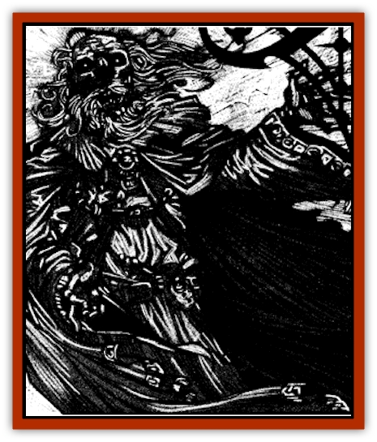

# Lich - Elemental

| Statistic | **Lich, Elemental** |
| --- | --- |
| **Activity Cycle:** | Night |
| **Alignment:** | Chaotic evil |
| **Armor Class:** | 0 |
| **Climate/Terrain:** | Ravenloft |
| **Damage/Attack:** | By weapon or 1d10 |
| **Diet:** | None |
| **Frequency:** | Very rare |
| **Hit Dice:** | 11 |
| **Intelligence:** | Supra-genius (19-20) |
| **Magic Resistance:** | Nil |
| **Morale:** | Fanatic (17-18) |
| **Movement:** | 6 |
| **No. Appearing:** | 1 |
| **No. of Attacks:** | 1 |
| **Organization:** | Solitary |
| **Size:** | M (6' tall) |
| **Special Attacks:** | See below |
| **Special Defenses:** | +1 or better weapon to hit |
| **THAC0:** | 9 |
| **Treasure:** | W (C) |
| **XP Value:** | 25,000 |

Elemental [[Lich|liches]] are diabolical wizards who studied and mastered the use of Ravenloft's strange elements before or during their undeath. Now the fiends continue their practices near the boneyards of the realms, conjuring massive monsters of bone, blood, fire, and mist to sow terror in the hearts of the innocent.

Elemental liches take on the likeness of their profession. Their skin is gray and ashen like that of the dead, their white hair blows in gentle wisps like the mists, their robes whip and snap in the wind like fire, and their rotting skin constantly seeps heavy drops of thick, crimson blood.

As one might expect, these creatures retain any linguistic abilities they might have had in life. In addition, however, they are also able to converse freely with any creature from the elemental planes.

**Combat:** Few liches like to engage in hand-to-band combat with their foes, but elemental liches are a rare exception. Their usual tactic is to surround themselves with [[Elemental_Ravenloft|elementals]] of all types and undead minions, then wade into the fray to deliver their deadly *touch of the grave*, *pyre*, *blood*, or *mist*. A lich may use each of these attack forms once per day, per target. After this it attacks as a normal lich, doing 1d10 points of damage but without the ability to paralyze its victims.

The *touch of the grave* is the lich's most deadly attack. On a successful hit, the victim must make a saving throw vs. death magic. If successful, he takes 1d10 points of damage but may continue to fight normally. If the save is failed. the victim is wracked with pain as the very bones in his body crack and attempt to rend their way out of their screaming shell. Unless a *heal* spell is administered within one round, the adventurer dies. If a *heal* spell is cast in time, the victim must make a System Shock roll or die anyway from the trauma of having his body sundered and repaired so quickly.

The *touch of the pyre* is another deadly attack form of the elemental lich. On a successful hit, the victim suffers a smoldering wound that does 1d10 points of damage. In addition, his clothing or armor must make a saving throw vs. magical fire or burst into flame. This magical flame burns the wearer for 1d10 points of damage each round and can be extinguished only by a *dispel magic*, *control flame*, or other magical methods, but not by immersion in water or other normal means. Luckily, this fire does not spread and will vanish once it has reduced the burning object to ash (in 1d4 rounds).

The *touch of blood* is a foul and evil power that the lich uses to drain the very life essence from a character. If the creature successfully hits its target, the victim takes 1d10 points of damage and must make a saving throw vs. paralyzation. If the roll fails, blood begins to ooze from the victim's every pore. The bleeding causes 1d4 points of damage per round until dispelled or magically healed. If a character loses 12 or more hit points to bleeding damage (not counting the normal 1d10 points caused by the lich's touch), he loses one level of experience. This reduces Hit Dice, class bonuses, spell abilities and so forth exactly as does the touch of a [[Wight|wight]].

Elemental liches use the previous three attack forms when directly confronting their opponents. The *touch of mist* is often used in more subtle and diabolical situations. This touch causes no damage, but those who are hit and fail a saving throw vs. spell are infused with evil. This changes the victim's alignment to chaotic evil and puts him in the direct service of the lich. The lich can communicate with his pawn telepathically over a number of mites equal to his Hit Dice. In order to regain their original alignment and break the lich's control, infused characters must receive a *remove curse* spell cast by an individual of their true alignment.

Besides its various magical touches, a lich may conjure a single Ravenloft elemental of each of the four types per day. These are always of the grave, pyre, blood, or mist varieties with 8 Hit Dice.

Elemental liches cannot control undead as most others of the kind do.

Like other liches, the elemental variety has an aura of power about it that causes creatures of 5 Hit Dice or less to make a saving throw vs. spell or flee in terror for 5-20 (5d4) rounds.

Elemental liches can only be hit by weapons of at least +1, by magical spells, or by monsters with 4+1 or more Hit Dice. Its magical nature renders it immune to *charm*, *sleep*, *enfeeblement*, *polymorph*, *cold*, *electricity*, *insanity*, or *death* spells. Elemental liches are not immune to the attacks of Ravenloft elementals, but those creatures will not attack an elemental lich unless controlled by a character of higher level than the lich, or unless they were conjured by a rival elemental lich.

Like any other lich, elementals have spellcasting ability appropriate to their Hit Dice. They almost always carry as many *conjure elemental* spells as possible. The things love to surround themselves with their creations in combat to lessen the risk to themselves and give them the freedom to use their multiple touch attacks.

Priests of at least 8th level can attempt to turn an elemental lich, as can paladins of no less than 10th level.

Elemental liches who have their physical form destroyed will retreat into a phylactery in the same manner as other liches. This is similar to a *magic jar* spell. To truly annihilate the lice, its phylactery must be destroyed as well as the creature's physical form.

**Habitat/Society:** Elemental liches seem to seek the same dark power that others of their undead kind do. The main difference seems to be the path they use to get there. Where most liches control hordes of undead minions, elementalists control the very spirits of the elements themselves.

The *touch of mist* power of the lich makes it easy for the creature to control large segments of a local population. Usually this is a town, hamlet, or some other place where the folk aren't likely to recognize the work of a lich and seek help in having it destroyed. The lich uses its magically controlled minions to sow discontent and death, but not in so overt a manner as to attract any do-gooders that happen to wander by.

**Ecology:** Elemental liches commune daily with the demiplane's elemental powres. Whether they are servants, peers or masters isn't known, but there are certain conditions that the creatures must fulfill to maintain their powers. An elemental lich's phylactery must first be buried in a nearby grave. Then a great fire of burning bones is ignited on that spot. Blood is then poured over the ashes and allowed to soak into the ground. If the elemental powers decide to grant the lich its powers, the mists of the demiplane will roll in and obscure the site from prying eyes.

This means that finding an elemental lich's phylactery is both easier and harder for those who would slay the vile thing. Knowledgeable adventurers will know that their prey's phylactery will be in the ground near a misty area, such as an old graveyard, burial mound, or even an isolated clearing in a deep dark forest. The mists maintained by the elemental powers are infused with the power to cause *confusion* in anyone who cannot make a saving throw vs. spell. Every turn spent in the mists requires a successful save. Those who fail are confused for 1d10 turns as per the 4th level wizard spell.

If the earth is penetrated directly above the phylactery, the elemental powers will telepathically warn the lich of the danger. The creature usually arrives 1d10 rounds later prepared to slay any living thing in the immediate vicinity.

**Demi-Elemental Liches**

  Elemental liches can become demiliches, but benefit from a few minor changes due to their close ties with the elemental planes of Ravenloft.

The teeth of the elementalist demilich are made of 1d4+4 gems that cast a *trap the soul* spell. If the saving throw to resist that spell is failed, the target's life force is trapped within the gem. Unlike other liches, however, the body of the victim immediately transforms into a 16 Hit Die elemental of a random type (1 - grave, 2 - pyre, 3 - blood, 4 - mist) under the demilich's control. The body of the victim is completely consumed by the process, so only a *wish* spell can bring them back to life. The elemental remains under the demilich's control for a number of months equal to the summoner's Hit Dice. For obvious reasons, the lairs of the elemental demolishes are filled with the burnt and broken bones of those who sought to slay them.

---
## Discovery & Documentation

**Source Publication:** Ravenloft Appendix III (1991)
**Campaign Setting:** Ravenloft
**Author(s):** Kirk Botulla

### Other Creatures Found in This Source Book
   * [[Akikage|Akikage]]
   * [[Animator_Common|Animator, Common]]
   * [[Animator_Greater|Animator, Greater]]
   * [[Animator_Minor|Animator, Minor]]
   * [[Animator_General_Information|Animator, General Information]]
   * [[Bakhna_Rakhna|Bakhna Rakhna]]
   * [[Baobhan_Sith|Baobhan Sith]]
   * [[Beetle_Scarab|Beetle, Scarab]]
   * [[Boneless|Boneless]]
   * [[Boowray|Boowray]]
   * [[Bruja|Bruja]]
   * [[Carrionette|Carrionette]]
   * [[Carrion_Stalker|Carrion Stalker]]
   * [[Cat_Midnight|Cat, Midnight]]
   * [[Cat_Skeletal|Cat, Skeletal]]
   * [[Cloaker_Resplendent|Cloaker, Resplendent]]
   * [[Cloaker_Shadow|Cloaker, Shadow]]
   * [[Cloaker_Undead|Cloaker, Undead]]
   * [[Corpse_Candle|Corpse Candle]]
   * [[Death's_Head_Tree|Death's Head Tree]]
   * [[Doppelganger_Ravenloft|Doppelganger (Ravenloft)]]
   * [[Familiar_Pseudo-|Familiar, Pseudo-]]
   * [[Familiar_Undead|Familiar, Undead]]
   * [[Feathered_Serpent|Feathered Serpent]]
   * [[Fenhound|Fenhound]]
   * [[Figurine_Ceramic|Figurine, Ceramic]]
   * [[Figurine_Crystal|Figurine, Crystal]]
   * [[Figurine_Ivory|Figurine, Ivory]]
   * [[Figurine_Obsidian|Figurine, Obsidian]]
   * [[Figurine_Porcelain|Figurine, Porcelain]]
   * [[Figurine_General_Information|Figurine, General Information]]
   * [[Fleas_of_Madness|Fleas of Madness]]
   * [[Furies|Furies]]
   * [[Geist|Geist]]
   * [[Ghost_Animal|Ghost, Animal]]
   * [[Golem_Flesh_Ravenloft|Golem, Flesh (Ravenloft)]]
   * [[Golem_Mist_Ravenloft|Golem, Mist (Ravenloft)]]
   * [[Golem_Wax_Ravenloft|Golem, Wax (Ravenloft)]]
   * [[Gremishka|Gremishka]]
   * [[Hag_Spectral|Hag, Spectral]]
   * [[Head_Hunter|Head Hunter]]
   * [[Hearth_Fiend|Hearth Fiend]]
   * [[Hebi-No-Onna|Hebi-No-Onna]]
   * [[Hound_Phantom|Hound, Phantom]]
   * [[Hound_Skeletal|Hound, Skeletal]]
   * [[Imp_Wishing|Imp, Wishing]]
   * [[Ivy_Crawling|Ivy, Crawling]]
   * [[Jack_Frost|Jack Frost]]
   * [[Jolly_Roger|Jolly Roger]]
   * [[Kizoku|Kizoku]]
   * [[Lashweed|Lashweed]]
   * [[Leech_Magical|Leech, Magical]]
   * [[Leech_Psionic|Leech, Psionic]]
   * [[Lich_Defiler|Lich, Defiler]]
   * [[Lich_Drow|Lich, Drow]]
   * [[Lich_Psionic|Lich, Psionic]]
   * [[Living_Tattoo|Living Tattoo]]
   * [[Lycanthrope_Loup-garou|Lycanthrope, Loup-garou]]
   * [[Lycanthrope_Werejackal|Lycanthrope, Werejackal]]
   * [[Lycanthrope_Werejaguar_Ravenloft|Lycanthrope, Werejaguar (Ravenloft)]]
   * [[Lycanthrope_Wereleopard|Lycanthrope, Wereleopard]]
   * [[Lycanthrope_Wereray|Lycanthrope, Wereray]]
   * [[Mist_Ferryman|Mist Ferryman]]
   * [[Moor_Man|Moor Man]]
   * [[Obedient|Obedient]]
   * [[Odem|Odem]]
   * [[Paka|Paka]]
   * [[Plant_Blood_Rose|Plant, Blood Rose]]
   * [[Plant_Fearweed|Plant, Fearweed]]
   * [[Radiant_Spirit|Radiant Spirit]]
   * [[Recluse|Recluse]]
   * [[Remnant_Aquatic|Remnant, Aquatic]]
   * [[Rushlight|Rushlight]]
   * [[Sea_Spawn_Master|Sea Spawn, Master]]
   * [[Sea_Spawn_Minion|Sea Spawn, Minion]]
   * [[Shadow_Asp|Shadow Asp]]
   * [[Shattered_Brethren|Shattered Brethren]]
   * [[Skeleton_Archer|Skeleton, Archer]]
   * [[Skeleton_Insectoid|Skeleton, Insectoid]]
   * [[Skin_Thief|Skin Thief]]
   * [[Spirit_Psionic|Spirit, Psionic]]
   * [[Strahd_Skeleton|Strahd Skeleton]]
   * [[Strahd_Zombie|Strahd Zombie]]
   * [[Unicorn_Shadow|Unicorn, Shadow]]
   * [[Vampire_Drow|Vampire, Drow]]
   * [[Vampire_Nosferatu|Vampire, Nosferatu]]
   * [[Vampire_Oriental|Vampire, Oriental]]
   * [[Virus_General_Information|Virus, General Information]]
   * [[Virus_I|Virus I]]
   * [[Virus_II|Virus II]]
   * [[Virus_III|Virus III]]
   * [[Vorlog|Vorlog]]
   * [[Will_O'Dawn|Will O'Dawn]]
   * [[Will_O'Deep|Will O'Deep]]
   * [[Will_O'Mist|Will O'Mist]]
   * [[Will_O'Sea|Will O'Sea]]
   * [[Zombie_Cannibal|Zombie, Cannibal]]
   * [[Zombie_Desert|Zombie, Desert]]
   * [[Zombie_Wolf|Zombie Wolf]]
   * [[Zombie_Fog|Zombie Fog]]
