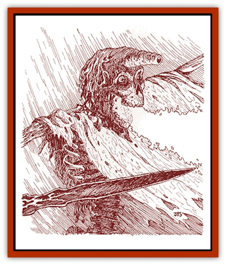

# Lich - Inheritor

| Statistic | **Lich, Inheritor** |
| --- | --- |
| **Activity Cycle:** | Night |
| **Alignment:** | Any evil |
| **Armor Class:** | 0 |
| **Climate/Terrain:** | Any |
| **Damage/Attack:** | 1d10 |
| **Diet:** | Nil |
| **Frequency:** | Very rare |
| **Hit Dice:** | 15 |
| **Intelligence:** | Supra-Genius (19-20) |
| **Magic Resistance:** | Nil |
| **Morale:** | Fanatic (17-18) |
| **Movement:** | 6 |
| **No. Appearing:** | 1 |
| **No. of Attacks:** | 1 |
| **Organization:** | Solitary |
| **Size:** | M (4-7' tall) |
| **Special Attacks:** | Touch, Legacies |
| **Special Defenses:** | Spell and Legacy immunities, hit only by magical weapons |
| **THAC0:** | 5 |
| **Treasure:** | A |
| **XP Value:** | 19,000 |

These vile undead creatures are the remnants of high-level Inheritors who sought to increase their power. Through arcane, alchemical processes, they transform from living beings into powerful undead creatures. Fortunately, Inheritor [[Lich|liches]] are extremely rare; only two are known to exist - one in the Savage Baronies (the Doomrider) and one in Renardy.

The appearance of an Inheritor lich varies widely. The basic visage is that of a skeletal humanoid, but individuals from a number of nonhuman races could also choose this evil path. Each creature then adopts a unique form, warped by the detrimental effects of its Legacies. Thus, an Inheritor lich with Armor, Sight, Burn, Projectile, Growth, and Weapon Hand could have scales; bony eyestalks; red glowing eye sockets; skin that is hot to the touch; flames issuing from its mouth; a hollow, open-ended horn in the center of its forehead; arms twice as long as normal; and one hand elongated into the shape of a bony sword.

An Inheritor lich is usually dressed in clothing reminiscent of its former life - armor for warriors or robes for wizards. The materials are generally of high quality, though roughly used. As the most ancient Inheritor lich is no more than a decade old, its possessions show little sign of decay but might be frayed from travel or combat.

**Combat:** Unlike other liches, an Inheritor lich has no qualms about entering battle. Also, it is likely to have servants and allies - some undead, some monstrous, and perhaps even a few normal humans or humanoids. Inheritor liches lack the magical aura that forces low-level creatures to flee in terror; still, their ghastly appearance causes many intelligent, low-level beings to flee anyway.

An Inheritor lich prefers to attack with its Legacies when possible. Further, an Inheritor lich is immune to the offensive effects of any Legacies that it possesses. For example, an Inheritor lich with the Burn Legacy cannot take damage from that Legacy when used by another creature.

The Inheritor lich also retains character class abilities from its former life. A lich that was once a priest, wizard, or bard can cast spells; a former thief can move silently, hide in shadows, and backstab. The Inheritor lich possesses these abilities as a 15th-level character of that class. Finally, the Inheritor lich might even carry arms and equipment from its former life. Wearing armor does not improve a lich's Armor Class, but the lich does receive any magical bonuses the armor might have. Also, Inheritor liches are not vulnerable to smokepowder in the same way that living Inheritors are, so they may carry wheellock pistols.

In addition to Legacies and class abilities, an Inheritor lich also has a lethal touch. If an Inheritor lich touches an opponent, that touch inflicts 1d10 points of damage. In addition, the victim must make a successful saving throw vs. death magic or suffer the effects of one day in the Time of Loss and Change. It does not matter if *cinnabryl* is actually being worn, if the target has ever worn it, or even if he is required to. A target who fails a saving throw loses 1 point from the appropriate ability score (or scores) and changes according to the detrimental effects of his Legacy or Legacies (see "The Curse and the Legacies" chapter of *The Savage Coast Campaign Book* for descriptions). If the target does not have a Legacy, determine one randomly. A character with multiple Legacies suffers the Time of Loss and Change for all Legacies simultaneously, losing several points and undergoing major physical changes. For this reason, Inheritor liches try to first target Inheritors with this touch. This attack does not actually deplete a target's *cinnabryl*; it bypasses the metal completely.

This touch automatically kills any individual who has one or more attribute scores (with the exception of Charisma) reduced to 0 or less. The next night, however, that victim will rise as a cursed one. The lair of an Inheritor lich might hold several [[Cursed_One|cursed ones]], remnants of former victims. As an Inheritor lich has no need for cinnabryl and cannot be harmed by a cursed one, it may feed them *cinnabryl* to hasten its transformation into *red steel*.

Recovery from Affliction caused by this attack differs from standard recovery in two ways. First, reversal begins immediately after victims receive a *remove curse* spell, provided that they are still wearing *cinnabryl*. Second, a system shock roll is not necessary to reverse the transformation. Victims can always recover completely from this forced Affliction.

An Inheritor lich also has formidable defenses. Besides immunity to Legacies which it possesses, an Inheritor lich is immune to all nonmagical weapons. These creatures also have the standard lich immunities to *charm*, *hold*, *sleep*, *enfeeblement*, *polymorph*, *insanity*, and *death* spells - as well as cold-based and electrical attacks. Inheritor liches are turned as normal liches.

While it is difficult to defeat an Inheritor lich in combat, destroying it is harder still. An Inheritor lich protects its life essence in a *red steel* item hidden in its lair. The item might be a depleted *cinnabryl* amulet or it could be a *red steel* weapon or piece of armor. To completely annihilate the Inheritor lich, both its body and that item must be destroyed. Melting it is not sufficient; it must be subjected to a *disintegrate* spell or similar power. (The Detonate Legacy fragments an item enough that it is considered destroyed.) If the item is merely melted and reforged, the life essence remains in whichever new piece contains the largest percentage of the original item. Inheritor liches take advantage of this by hiding these items very well or, sometimes, by placing their essence in magical *red steel* weapons that the characters might be loathe to destroy.

**Habitat/Society:** : Inheritor liches are solitary creatures. They create lairs in fortified places such as a fortresses, mountains, or caverns. The Inheritor lich, having been an adventurer once, realizes that it will be sought out by other adventurers and will try to keep the location of its lair a secret.

Still, in its burning desire for power, an Inheritor lich will sometimes spread rumors into the nearby area, hoping to encourage parties of low-level adventurers to come after it so it may rob them of their possessions and life force. Often, the lich will try to meet the adventurers somewhere other than its lair in case it needs to retreat. An Inheritor lich might even create a web of intrigue around itself, using spies and subtle manipulations to exert control over the people and events of a given region.

The two Inheritor liches known to currently exist also spend a great deal of their time studying the Red Curse. After all, knowledge is another form of power. If it is persuaded to talk, or if its journal can be located, an Inheritor lich can be a great source of knowledge concerning the Red Curse, the Legacies, and the associated magical substances.

The attitude of an Inheritor lich depends on its former life and subsequent undeath. The creature might hate living Inheritors or might feel nostalgic when meeting a member of its former order.

Like living Inheritors, these liches often have nicknames - but with a morbid twist. The two existing Inheritor liches are known as Death Flame, who was one of the first Inheritors, and Doomrider, a former Inheritor wizard who now has a [[Nightmare|nightmare]] for a mount. An Inheritor lich has little respect for life, doing whatever is necessary to accomplish its goals. While it is remotely possible that an Inheritor lich of good alignment could be created, the ambitions that lead a character to such an existence are not usually conducive to any alignment but evil.

**Ecology:** While an Inheritor lich has left its natural existence behind, it still has a profound effect on the local ecology by gathering riches, killing others, and causing destruction. While it does not consume or produce in a natural manner, it does create and destroy, doing so to extend the reaches of its power.

To become an Inheritor lich, an Inheritor must first construct the item that will hold his life essence. This must be done by the prospective lich - never by a second party. Ideally, the *red steel* used in the creation of the item was worn as *cinnabryl* by the Inheritor. The Inheritor must also personally create a difficult alchemical preparation. This potion is something like *crimson essence*, but also contains *steel seed*, finely ground *red steel*, herbs, blood, and miscellaneous arcane and costly items. The exact formula is known only to a few, but it might be found in the journals of those who have attempted the process. Like *crimson essence*, the potion must be bathed in the magic of depleting *cinnabryl* for several weeks. When ready to become a lich, the Inheritor imbibes the potion; he must then make a successful system shock roll or die. If the roll is successful, the Inheritor becomes an Inheritor lich and immediately enters the Time of Change, transforming according to the Legacies possessed. However, no points are lost from ability scores during this process, and any that were subtracted previously are gained back.

---
## Discovery & Documentation

**Source Publication:** Monstrous Compendium Savage Coast Appendix (Online Exclusive) (1995)
**Campaign Setting:** Mystara
**Author(s):** Loren L Coleman, Ted James, Thomas Zuvich, Cindi M. Rice

### Other Creatures Found in This Source Book
   * [[Aranea_Savage_Coast|Aranea (Savage Coast)]]
   * [[Arashaeem|Arashaeem]]
   * [[Batracine|Batracine]]
   * [[Cat_Marine|Cat, Marine]]
   * [[Cinnavixen|Cinnavixen]]
   * [[Clockwork_Swordsman|Clockwork Swordsman]]
   * [[Critter_Temple|Critter, Temple]]
   * [[Cursed_One|Cursed One]]
   * [[Deathmare|Deathmare]]
   * [[Dragon_Savage_Coast_Crimson|Dragon (Savage Coast), Crimson]]
   * [[Dragon_Savage_Coast_Red_Hawk|Dragon (Savage Coast), Red Hawk]]
   * [[Echyan|Echyan]]
   * [[Ee'aar|Ee'aar]]
   * [[Enduk|Enduk]]
   * [[Fachan_Savage_Coast|Fachan (Savage Coast)]]
   * [[Feliquine|Feliquine]]
   * [[Fiend_Narvaezan|Fiend, Narvaezan]]
   * [[Frelôn|Frelôn]]
   * [[Ghriest|Ghriest]]
   * [[Glutton_Sea|Glutton, Sea]]
   * [[Goatman|Goatman]]
   * [[Golem_Naâruk|Golem, Naâruk]]
   * [[Golem_Savage_Coast|Golem (Savage Coast)]]
   * [[Grudgling|Grudgling]]
   * [[Heraldic_Servant_I|Heraldic Servant I]]
   * [[Heraldic_Servant_II|Heraldic Servant II]]
   * [[Heraldic_Servant_III|Heraldic Servant III]]
   * [[Heraldic_Servant_IV|Heraldic Servant IV]]
   * [[Heraldic_Servant_V|Heraldic Servant V]]
   * [[Heraldic_Servant_General_Information|Heraldic Servant, General Information]]
   * [[Hermit_Sea|Hermit, Sea]]
   * [[Jorri|Jorri]]
   * [[Juhrion|Juhrion]]
   * [[Kla'a-tah|Kla'a-tah]]
   * [[Leech_Legacy|Leech, Legacy]]
   * [[Lizard_Kin_Savage_Coast|Lizard Kin (Savage Coast)]]
   * [[Lupasus|Lupasus]]
   * [[Lupin|Lupin]]
   * [[Lyra_Bird_Saragón|Lyra Bird, Saragón]]
   * [[Malfera|Malfera]]
   * [[Manscorpion_Nimmurian|Manscorpion, Nimmurian]]
   * [[Mythuínn_Folk|Mythuínn Folk]]
   * [[Neshezu|Neshezu]]
   * [[Nikt'oo|Nikt'oo]]
   * [[Nosferatu|Nosferatu]]
   * [[Omm-wa|Omm-wa]]
   * [[Omshirim|Omshirim]]
   * [[Parasite_Savage_Coast|Parasite (Savage Coast)]]
   * [[Phanaton|Phanaton]]
   * [[Plant_Savage_Coast|Plant (Savage Coast)]]
   * [[Pudding_Vermilion|Pudding, Vermilion]]
   * [[Rakasta|Rakasta]]
   * [[Ray_Forest|Ray, Forest]]
   * [[Shedu_Greater_Savage_Coast|Shedu, Greater (Savage Coast)]]
   * [[Shimmerfish|Shimmerfish]]
   * [[Skinwing|Skinwing]]
   * [[Spawn_of_Nimmur|Spawn of Nimmur]]
   * [[Spider-spy|Spider-spy]]
   * [[Spirit_Heroic|Spirit, Heroic]]
   * [[Spirit_Walleran|Spirit, Walleran]]
   * [[Succulus|Succulus]]
   * [[Swampmare|Swampmare]]
   * [[Symbiont_Shadow|Symbiont, Shadow]]
   * [[Tortle|Tortle]]
   * [[Troll_Legacy|Troll, Legacy]]
   * [[Trosip|Trosip]]
   * [[Tyminid|Tyminid]]
   * [[Utukku|Utukku]]
   * [[Voat|Voat]]
   * [[Voat_Herathian|Voat, Herathian]]
   * [[Vulturehound|Vulturehound]]
   * [[Wallara|Wallara]]
   * [[Wurmling|Wurmling]]
   * [[Wynzet|Wynzet]]
   * [[Yeshom|Yeshom]]
   * [[Zombie_Red|Zombie, Red]]
