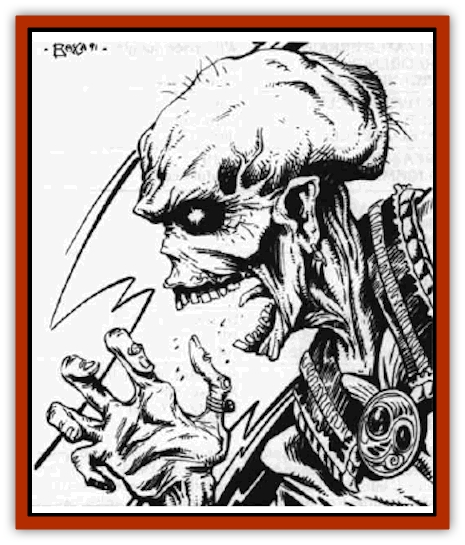

# Lich - Master

| Statistic | **Lich, Master** |
| --- | --- |
| **Activity Cycle:** | Continuous |
| **Alignment:** | Chaotic evil |
| **Armor Class:** | -2 |
| **Climate/Terrain:** | <i>Spelljammer</i> |
| **Damage/Attack:** | 3-18 (or by weapon) |
| **Diet:** | None |
| **Frequency:** | Unique |
| **Hit Dice:** | 13 |
| **Intelligence:** | Genius (17-18) |
| **Magic Resistance:** | 20% |
| **Morale:** | Fearless (19-20) |
| **Movement:** | 6, Fl 12 (C) |
| **No. Appearing:** | 1 |
| **No. of Attacks:** | 2 |
| **Organization:** | Leader |
| **Size:** | M (5½' tall) |
| **Special Attacks:** | See below |
| **Special Defenses:** | See below |
| **THAC0:** | 8 |
| **Treasure:** | H&times;4 |
| **XP Value:** | 15,000 |

The master lich is a variatlon of the [[Lich|standard lich]] developed from a combination of incantations, potions, and promises made to dark, extradimensional powers. An undead creature becomes a master lich until such time as it must pay the price of the promises given to the dark powers.

The master lich resembles a normal lich in many ways, save that its flesh is not rotted. Rather, the body is dessicated, the skin pulled back like leather over the skull and bones. It retains the standard lich's deepset, black eye sockets, with burning white pinpoints of light dancing deep within the recesses.

**Combat:** A master lich will not enter into direct combat unless he has no other choice or unless his target is helpless and easy to slay. If he chooses to avoid physical combat, he uses his ability to animate the dead to create an army of undead skeletons und zombies to fight in his stead.

The undead are under the master lichs full control, and all their actions can be manipulated by the lich. He can see through the remains of their eyes and hear through the remnants of their ears. Any living creature killed by or through the master lich's hand can be reanimated in this fashion.

In addition to retaining the abilities gained when alive, the master lich can paralyze on touch. Those failing a saving throw versus paralyzation will be immobile for 4-24 rounds.

The master lich cannot be affected by enchantment/charm or necromantic spells, including those that allow others to control the undead. He is also unaffected by polymorph, poison, cold, insanity, and electricity magic.

The master lich can be turned, however, except when he is on his home grounds; treat this lich as a special undead for purposes of turning. (The home grounds of the master lich known as the Fool are located in the warrens of the Spelljammer, and he is the only known example of a master lich. However, given the vastness of space, there is no telling whether another master lich may already be created - or when another may occur.)

Unlike normal liches, the mere appearance of a master lich does not cause fear, and he may be struck with normal weapons. The master lich does regenerate 1 point/round and will do so even if the body is destroyed and separated. As such, he is truly undead.

This lich is not restricted to humans and humanoids when creating undead. Long-dead creatures become [[Skeleton|skeletons]], humans and humanoids become [[Zombie|zombies]], and all other large creatures become monster zombies. In addition to his regular zombies and skeletons, the Fool has created a pack of undead rats (1 HP, AC 9, MOVE 6, all other stats as per normal rats). These rats serve as his eyes, scouting the warrens for potential targets or enemies.

**Habitat/Society:** The master lich is not as solitary as are his lichling counterparts. Rather, he prefers to be at the apex of an undead society, typically of his own creation. He commands his skeletons and zombies without question and imposes his will on other undead through the force of his personality or through threat if need be. Any type of less-powerful undead may be under the command of a master lich, excepting only liches, archliches, and demiliches. [[Vampire_General_Information|Vampires]] and other sentient undead will be treated as uneasy allies at best.

Since the master lich exists in part because of his eluding some dark bargain, he seeks safety in numbers. In particular he seeks protection from those who might seek to take the master lich to his final death.

**Ecology:** The master lich is undead, and with his regenerative properties can survive until he falls under the one true death. This will only happen if either of two events occur: if a dark power shows up to collect the lich's immortal spirit in payment, or if the lich is captured and dragged to a power's home plane. The master lich fears the dark powers that helped make him more than anything else in the world, for they are the ones who will prove to be his undoing.

Occaslonally a master lich will fixate on a particular place, event, or person, and he will work to the best of his undeadly ability to control that place, event, or person. This becomes an overriding obsession with the master Iich, eventually negating all other needs.

---
## Discovery & Documentation

**Source Publication:** Legend of the Spelljammer (1991)
**Campaign Setting:** Spelljammer
**Author(s):** Jeff Grub

### Other Creatures Found in This Source Book
   * [[Beholder_Kasharin|Beholder, Kasharin]]
   * [[K'r'r'r|K'r'r'r]]
   * [[Shivak|Shivak]]
