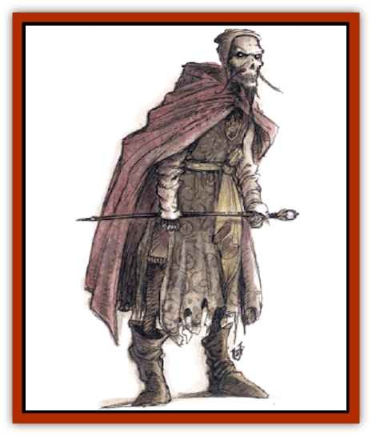

# Lich - Psionic

| Statistic | **Lich, Psionic** |
| --- | --- |
| **Activity Cycle:** | Night |
| **Alignment:** | Any evil |
| **Armor Class:** | 0 |
| **Climate/Terrain:** | Ravenloft or Athas |
| **Damage/Attack:** | 1d8+2 |
| **Diet:** | Psionic energy |
| **Frequency:** | Very rare |
| **Hit Dice:** | 9+18 |
| **Intelligence:** | Supra-genius (19-20) |
| **Magic Resistance:** | Nil |
| **Morale:** | Fanatic (17-18) |
| **Movement:** | 6 |
| **No. Appearing:** | 1 |
| **No. of Attacks:** | 1 |
| **Organization:** | Solitary |
| **Size:** | M (6' tall) |
| **Special Attacks:** | Psionics, mind strike, &amp; psionic draining |
| **Special Defenses:** | Psionics, spell immunity, &amp; +1 or better weapon to hit |
| **THAC0:** | 11 |
| **Treasure:** | A |
| **XP Value:** | 16,000 |

**Psionics Summary**

| Level | Dis/Sci/Dev | Attack/Defense | Score | PSPs |
| --- | --- | --- | --- | --- |
| 20 | 6/10/25 | all/all | 18 | 82 |

**Clairsentience -** *Sciences:* aura sight, object reading; *Devotion:* spirit sense.

**Psychokinesis -** *Sciences:* nil; *Devotion:* animate shadow.

**Psychometabolism -** *Sciences:* death field, life draining, shadow form; *Devotions:* aging, cause decay, displacement, ectoplasmatic form.

**Psychoportation -** *Science:* teleport; *Devotions:* astral projection, dimensional door, dream travel.

**Telepathy -** *Sciences:* domination, mind wipe, psionic crush, tower of iron will; *Devotions:* contact, ego whip, ESP, id insinuation, inflict pain, intellect fortress, mental barrier, mind blank, mind thrust, psionic blast, thought shield.

**Metapsionics -** *Science:* empower; *Devotions:* psionic sense, psionic drain, receptacle, wrench.

**Note:** These are the powers common to psionic liches, but it is not unusual for some to have different abilities.

There are few who dare to argue that the power of a master psionicist is any less than that of an archmage. Proof of this can be found in the fact that the most powerful psionicists are actually able to extend their lives beyond the spans granted them by nature, just as powerful wizards are known to do.

Psionic [[Lich|liches]] look much like their magical counterparts. Their flesh has mummified, pulling it tight over their bones and giving them a gaunt, skeletal appearance. Their eye sockets are empty and burn with crimson pinpoints of light. Often, a psionic lich will be found in the clothes it favored in life. Because this can be anything from the grand robes of nobility to the plate armor of a mighty knight, it is impossible to spot these creatures by their garb. (Metallic armor, if worn, will lower the lich's psionic power score, as per *The Complete Psionics Handbook*: small shields will not do so.)

Psionic lichss retain the abilities that they learned in life: languages, proficiencies, thieving skills, etc. Further, a psionic lich who was human may actually have been a dual-class character in life, and thus be able to employ psionic powers plus magical or clerical spells. Creatures with such abilities are rare, thankfully, but are truly terrible opponents.

**Combat:** Psionic liches seldom engage their foes personally, as they surround themselves with legions of minions. Hence, many adventurers never learn the true nature of their enemy. When forced to take part in direct combat, however, psionic liches are among the most deadly opponents that any band of heroes is ever likely to face.

The emanations of power that shroud a psionic lich are detectable even by those without psychic abilities. Those who come within 50 yards of such creatures will be affected by this aura, requiring them to save vs. spell or become mind struck. Such characters make all attack and damage rolls at a -2 penalty and must double the casting time of any spells (which allows saving throws for victims at a +2 bonus). The effects of this aura can be countered by any spell or psionic power that would diminish or remove fear or inspire bravery.

If the lich is able to deliver a touch attack in combat, the malignant aura of psionic power that encircles it rips at the opponent's life force. causing 1d8-2 points of damage. In addition, psionic characters will find their PSPs drawn away. Each physical blow will strip the victim of a number of PSPs equal to twice the number of points of damage the blow inflicted. This loss is not permanent, and the PSPs can be regained through normal means.

Just as normal liches have spent decades or even centuries in the research of new and unique magical powers, so too do the undead masters of the mind have powers undreamed of by mortal men. It is not at all uncommon for adventurers who come across these dreaded creatures to be confronted with psionic powers that have never been documented elsewhere. These new powers will conform to the general standards established in *The Complete Psionics Handbook* for function, damage, area of effect, range. etc., but may differ greatly from standard powers in terms of their effects. Insight into the creation of new psionic powers can be gleaned from the section on spell research in the *DMG*. Further Information can be gained from the *Forbidden Lore* boxed set of the *Ravenloft* campaign setting.

Further, liches are able to employ magical items just as they did in life and may have quite a formidable collection of enchanted trinkets to use against adventurers.

It is important to note that psionic liches differ from the traditional ranks of the undead. Because the force sustaining them is mental and not mystical, they are far more resistant to spells, spell-like powers, or psionic sciences and devotions involving charm, fear, or the like. Dungeon Masters should treat them as having the equivalent of a 25 Wisdom for purpose of determining what spells they are resistant to (see the *Player's Handbook*, Table 5). Spells like sleep or *finger of death*, which base their effects upon a biological function in the target, also do not affect psionic liches; again. psionic powers similar to these spells are also ineffective (e.g., *life detection*).

Psionic liches can be turned by priests, paladins, and similar characters, but since they are not magical in nature, they are more resistant to this power than are other undead. Thus, they are turned as "special" creatures.

Psionic liches are immune to harm from normal weapons but can be struck by weapons of +1 or better enchantment. Lesser weapons can not pierce the aura of power that hangs about the lich.

Spells or other powers based upon cold have no effect upon them. Other spells inflict normal damage on the lich. Psionic liches can be attacked in normal psionic combat, except as noted before.

In order to protect itself from destruction. a psionic lich employs a special form of phylactery (see "Ecology") that houses its life force. Although a Itch may be defeated in combat, it cannot be truly destroyed unless its phylactery can be found and obliterated. As most liches will take great care to protect these vital objects from the prying hands of heroes, this can be quite a challenge.

**Habitat/Society:** Psionic liches are powerful espers who have left behind the physical demands of life in pursuit of ultimate mental powers. They have little interest in the affairs of the living, except as they relate to the lich's search for psychic mastery and knowledge. Those who encounter the lich usually do so when the creature feels that it must leave its self-imposed isolation for a time.

Psionic liches often hide themselves away in some place that feels safe to them. Since most of them can sense the auras and emanations of the world around them quite keenly, their judgment is usually sound. For the most part, however, these creatures will reside in places associated with death or learning. If the two can be combined in some way, all the better. For example, an ideal lair for a psionic lich might be the great library of a castle that was buried in a volcanic eruption long ago. Not only does the location bear the taste of death about it, for everyone in the castle was slain by the disaster, but it also has a solid foundation of knowledge for the lich to pursue research into the secrets of the mind.

When it comes out into the world, a psionic lich generally assembles a great network of minions. Curiously, these followers are seldom undead themselves. More often than not, they are young espers who seek to learn from an obvious master. What they often do not understand is that their leader has little interest in them apart from their role in his immediate plans. Once the master's goal has been accomplished, be it the retrieval of some ancient tome on psionic powers or the testing of a new psionic defense mode, the followers will be cast aside without thought. Those who do not simply leave when the lich demands it will probably find themselves mercilessly slain.

The first psionic lich encountered in Ravenloft was reported on the fringes of Bluetspur, the dread domain of the [[Mind_Flayer|mind flayers]], in the land of Kartakass. There is some evidence that the creature was challenged and destroyed by Harkon Lukas, the master of that domain. Many scholars agree, however, that it seems probable that the lich escaped and survives to this day. Additional sightings of these horrible creatures leads one to believe that at least three more psionic liches have come into existence at various points in Ravenloft.

**Ecology:** Being undead, psionic liches have no place in the natural world as we know it. Although the power that transformed them is natural (not supernatural, as it is with other liches), the extent to which psionic liches have pursued their goals is not natural. By twisting the powers of their minds to extend their existence beyond the bounds of mortal life, psionic liches become exiles. Cast out from the land of the living, these creatures sometimes lament the foolishness that led them down the dark path of the undead.

By far the most important aspect of the existence of the psionic lich is the creation of its phylactery. To understand this mystical device, it is important to understand the process by which a psionicist becomes a lich. Before a psionicist can cross over into the darkness that is undeath, he must attain at least 18th level. In addition, he must be possessed of a great array of powers that can be bent and focused in ways new to the character.The first step in the creation of a phylactery is the crafting of the physical object that will become the creature's spiritual resting place. Phylacteries come in all shapes, from rings to crowns, and from swords to idols. They are made from only the finest materials and must be fashioned by master craftsmen. Generally, a phylactery is fashioned in a shape that reflects the personality of the psionicist. The cost of creating a phylactery is 5,000 gp per level of the character. Thus, a 20th level psionicist must spend 100,000 gp on his artifact.

Once the phylactery is fashioned, it must be readied to receive the psionicist's life force. This is generally done by means of the metapsionic empower ability, with some subtle changes in the way the psionicist uses the power that alters its outcome. In order to complete the phylactery, the psionicist must empower it with each and every psionic ability that he possesses.

Although an object cannot normally be empowered with psychic abilities in more than one discipline, the unusual nature of the phylactery allows this rule to be broken. However, before "opening" a new discipline within the object, the would-be lich must transfer all of his powers from the first discipline into it. For exampie, if a character has telepathic and metapsionic abilities, he must complete the empowering of all of his telepathic powers before he begins to infuse the object with his metapsionic ones. Once a discipline is closed it cannot be reopened.

During the creation of the phylactery, the psionicist is very vulnerable to attack. Each time that he gives his phylactery a new power, he loses it himself. Thus, the process strips away the powers of the psionicist as it continues. Obviously, the last power that is transferred into the phylactery is the empower ability. The effort of placing this ability within the phylactery drains the last essences of the psionicist's life from him and completes his transformation into a psionic lich. At the moment that the transformation takes place the character must make a system shock survival roll. Failure indicates that his willpower was not strong enough to survive the trauma of becoming undead; his spirit breaks up and dissipates, making him forever dead. Only the powers of a deity are strong enough to revive a character who has died in this way; even a *wish* will not suffice.

---
## Discovery & Documentation

**Source Publication:** Monstrous Compendium, 1994 Annual, Volume 1 (1995)
**Campaign Setting:** Advanced Dungeons & Dragons 2nd Edition
**Author(s):** David Wise

### Other Creatures Found in This Source Book
   * [[Abyss_Ant|Abyss Ant]]
   * [[Achaierai|Achaierai]]
   * [[Afanc|Afanc]]
   * [[Al-Jahar|Al-Jahar]]
   * [[Baelnorn|Baelnorn]]
   * [[Baneguard|Baneguard]]
   * [[Banelar|Banelar]]
   * [[Bird_Talking|Bird, Talking]]
   * [[Blazing_Bones|Blazing Bones]]
   * [[Campestri|Campestri]]
   * [[Caniquine|Caniquine]]
   * [[Cat_Winged|Cat, Winged]]
   * [[Crypt_Servant|Crypt Servant]]
   * [[Death's_Head_Tree|Death's Head Tree]]
   * [[Dog_Saluqi|Dog, Saluqi]]
   * [[Dragon_Electrum|Dragon, Electrum]]
   * [[Dragon_Fang|Dragon, Fang]]
   * [[Dragon_Linnorm_Corpse_Tearer|Dragon, Linnorm, Corpse Tearer]]
   * [[Dragon_Linnorm_Dread|Dragon, Linnorm, Dread]]
   * [[Dragon_Linnorm_Flame|Dragon, Linnorm, Flame]]
   * [[Dragon_Linnorm_Forest|Dragon, Linnorm, Forest]]
   * [[Dragon_Linnorm_Frost|Dragon, Linnorm, Frost]]
   * [[Dragon_Linnorm_Gray|Dragon, Linnorm, Gray]]
   * [[Dragon_Linnorm_Land|Dragon, Linnorm, Land]]
   * [[Dragon_Linnorm_Midgard|Dragon, Linnorm, Midgard]]
   * [[Dragon_Linnorm_Rain|Dragon, Linnorm, Rain]]
   * [[Dragon_Linnorm_Sea|Dragon, Linnorm, Sea]]
   * [[Dragon_Neutral_Jacinth|Dragon, Neutral, Jacinth]]
   * [[Dragon_Neutral_Jade|Dragon, Neutral, Jade]]
   * [[Dragon_Neutral_Pearl|Dragon, Neutral, Pearl]]
   * [[Dread|Dread]]
   * [[Dragon-kin|Dragon-kin]]
   * [[Elemental_Earth_Kin_Chrysmal|Elemental, Earth Kin, Chrysmal]]
   * [[Elemental_Earth_Kin_Earth_Weird|Elemental, Earth Kin, Earth Weird]]
   * [[Elemental_Fire_Kin_Azer|Elemental, Fire Kin, Azer]]
   * [[Elemental_Sandman|Elemental, Sandman]]
   * [[Elemental_Wind_Walker|Elemental, Wind Walker]]
   * [[Elemental_Vermin|Elemental Vermin]]
   * [[Feystag|Feystag]]
   * [[Flame_Skull|Flame Skull]]
   * [[Foulwing|Foulwing]]
   * [[Gambado|Gambado]]
   * [[Garbug|Garbug]]
   * [[Genie_Tasked_Administrator|Genie, Tasked, Administrator]]
   * [[Genie_Tasked_Deceiver|Genie, Tasked, Deceiver]]
   * [[Genie_Tasked_Harim_Servant|Genie, Tasked, Harim Servant]]
   * [[Genie_Tasked_Messenger|Genie, Tasked, Messenger]]
   * [[Genie_Tasked_Miner|Genie, Tasked, Miner]]
   * [[Genie_Tasked_Oathbinder|Genie, Tasked, Oathbinder]]
   * [[Gibbering_Mouther|Gibbering Mouther]]
   * [[Gnasher|Gnasher]]
   * [[Gnasher_Winged|Gnasher, Winged]]
   * [[Golem_Brain|Golem, Brain]]
   * [[Golem_Hammer|Golem, Hammer]]
   * [[Golem_Metagolem|Golem, Metagolem]]
   * [[Golem_Spiderstone|Golem, Spiderstone]]
   * [[Gorynych|Gorynych]]
   * [[Greelox|Greelox]]
   * [[Helmed_Horror|Helmed Horror]]
   * [[Jarbo|Jarbo]]
   * [[Laraken|Laraken]]
   * [[Living_Steel|Living Steel]]
   * [[Lock_Lurker|Lock Lurker]]
   * [[Loxo|Loxo]]
   * [[Lycanthrope_Loup_de_Noir|Lycanthrope, Loup de Noir]]
   * [[Lycanthrope_Werebadger|Lycanthrope, Werebadger]]
   * [[Lycanthrope_Werejaguar|Lycanthrope, Werejaguar]]
   * [[Lythlyx|Lythlyx]]
   * [[Magebane|Magebane]]
   * [[Marrashi|Marrashi]]
   * [[Metalmaster|Metalmaster]]
   * [[Mimic_House_Hunter|Mimic, House Hunter]]
   * [[Naga_Bone|Naga, Bone]]
   * [[Nautilus_Giant|Nautilus, Giant]]
   * [[Nightshade_Toril|Nightshade (Toril)]]
   * [[Nishruu|Nishruu]]
   * [[Noran|Noran]]
   * [[Opinicus|Opinicus]]
   * [[Ormyrr|Ormyrr]]
   * [[Parasite|Parasite]]
   * [[Pasari-Niml|Pasari-Niml]]
   * [[Plant_Vampire_Moss|Plant, Vampire Moss]]
   * [[Pteraman|Pteraman]]
   * [[Rautym|Rautym]]
   * [[Shadeling|Shadeling]]
   * [[Skum|Skum]]
   * [[Snake_Giant_Cobra|Snake, Giant Cobra]]
   * [[Snake_Stone|Snake, Stone]]
   * [[Spectral_Wizard|Spectral Wizard]]
   * [[Spell_Weaver|Spell Weaver]]
   * [[Spider_Brain|Spider, Brain]]
   * [[Suwyze|Suwyze]]
   * [[Tatalla|Tatalla]]
   * [[Tick_Heart|Tick, Heart]]
   * [[Tree_Dark|Tree, Dark]]
   * [[Tree_Singing|Tree, Singing]]
   * [[Tressym|Tressym]]
   * [[Troll_Snow|Troll, Snow]]
   * [[Tuyewera|Tuyewera]]
   * [[Ulitharid|Ulitharid]]
   * [[Undead_Dwarf|Undead Dwarf]]
   * [[Undead_Lake_Monster|Undead Lake Monster]]
   * [[Whipsting|Whipsting]]
   * [[Windghost|Windghost]]
   * [[Wolf_Dread|Wolf, Dread]]
   * [[Wolf_Stone|Wolf, Stone]]
   * [[Wolf_Vampiric|Wolf, Vampiric]]
   * [[Wraith_Shimmering|Wraith, Shimmering]]
   * [[Xantravar|Xantravar]]
   * [[Xaver|Xaver]]
