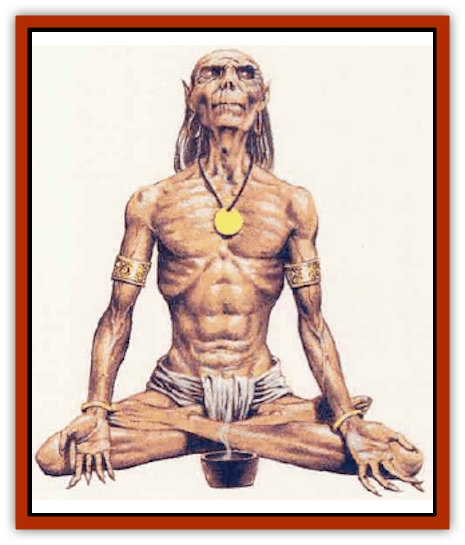

# Lich - Suel

| Statistic | **Lich, Suel** |
| --- | --- |
| **Activity Cycle:** | Any |
| **Alignment:** | Neutral evil |
| **Armor Class:** | As host (7) |
| **Climate/Terrain:** | Any |
| **Damage/Attack:** | 1 touch + paralysis |
| **Diet:** | None |
| **Frequency:** | Very rare |
| **Hit Dice:** | 15+ |
| **Intelligence:** | Supra-genius (19-20) |
| **Magic Resistance:** | 1% per Hit Die |
| **Morale:** | Fanatic (17-18) |
| **Movement:** | As host (12) |
| **No. Appearing:** | 1 |
| **No. of Attacks:** | 1d10 |
| **Organization:** | Solitary |
| **Size:** | M (5-6� tall) |
| **Special Attacks:** | Death gaze (under 3 HD paralyzed if save), paralysis touch, ignores armor, touch destroys items |
| **Special Defenses:** | +1 or better weauon to hit; immune to 1st and 2nd lv1 spells, mind-affecting spells, and death magic |
| **THAC0:** | 16 |
| **Treasure:** | P,Q (A) |
| **XP Value:** | 10,000 + 1,000/level above 15th |

These powerful wizards endure the centuries by transferring their life forces from one human host to the next.

The host of a Suel [[Lich|lich]] appears as a human with coarse, leathery skin and eyes that glow an ominous black fire. As the Suel lich grows in power, its skin becomes a thick hide, and the fire in its eyes becomes more pronounced. At the host body's venerable age, the Suel lich is little more than wrinkled husk whose entire head is bathed in black fire. While without a host body, the essence of the lich appears as a human shadow of fiery black energy.

**Combat:** Although it normally doesn't go looking for a fight, the Suel lich revels in combat against weaker foes. Any creature with fewer than 3 Hit Dice that gazes into the fiery eyes of the Suel lich must save vs. death magic at +3 or die of fright. Those who make their saves are paralyzed with terror for 1-4 turns, and are at the mercy of the evil creature. Creatures with 3 or more Hit Dice are unaffected.

The touch of a Suel-lich causes black flame to erupt from the body of any creature touched. This attack ignores all armor; creatures suffer 1dlO points of damage upon contact, and any item touched in this way must successfully save vs. magical fire or be damaged. Also, any living creature touched must make a saving throw vs. paralysis or be unable to move. The paralysis lasts until dispelled or until 24 hours pass.

The Suel lich can be hit only by magical weapons of +1 or better enchantment or by monsters with 7 or more Hit Dice. In addition to its natural magic resistance, the Suel-lich is immune to all mind-affecting spells, death magic, and all wizard and clerical spells below 3rd level. Because of its unique connection with the Negative Material Plane, a Suel lich touching a creature protected by a *negative plane protection* spell takes 5d10 points of damage unless its magic resistance blocks the effect.

A Suel lich casts spells as it did before its transformation but its spells do not require material components.

A Suel lich is turned as a special undead.

**Habitat/Society:** When the empire of the Suel was destroyed by the Rain of Colorless Fire more than a miknium ago, some of the few creatures to survive the destruction were the Suel liches. Several migrated from Oerth to other worlds. Some of these liches still roam, questing for wealth and power, while others exist in hidden strongholds, continuing their ageless research. Regardless of its intentions, a Suel lich always attempts to hide its hue nature. Since little knowledge (written or oral) survived the Colorless Fire, only a handful of sages and loremasters have even heard of such creatures.

**Ecology:** The Suel lich is an unholy amalgamation of the human body and energyeom the Negative Material Plane. Upon transformation into a Suel lich, the essence of the wizard is converted to negative energy that needs a human body to inhabit. The essence of the lich ages the body at three times the normal rate, burning it out after a short time. Each time a Suel lich gains a level, burns out a host, or is reduced to zero hit points, it must find a new body.

At this time, the essence of the lich must take a host with Hit Die or levels at least equal to the lich's level minus 15. For example, a 19th level Suel lich requires the body of at least a 4th level human. If the victim is unable to resist or gives his or her body willingly, no saving throw is allowed against the transformation. If the victim is able to resist, a saving throw vs. death magic at -1 is allowed to resist the takeover. Failure displaces and utterly destroys the life force of the victim; it cannot be *raised*, *resurrected*, or even restored by a *wish* spell. If the host body is destroyed, the lich has one hour to inhabit another body or its spirit disperses into nothingness. While in this form, a *dispel evil* or *holy word* can destroy it forever.

---
## Discovery & Documentation

**Source Publication:** Monstrous Compendium, 1995 Annual, Volume 2 (1995)
**Campaign Setting:** Advanced Dungeons & Dragons 2nd Edition
**Author(s):** Jon Pickens

### Other Creatures Found in This Source Book
   * [[Aboleth_Savant|Aboleth, Savant]]
   * [[Addazahr|Addazahr]]
   * [[Amiq_Rasol|Amiq Rasol]]
   * [[Arch-Shadow|Arch-Shadow]]
   * [[Automaton_Scaladar|Automaton, Scaladar]]
   * [[Automaton_Trobriand's|Automaton, Trobriand's]]
   * [[Bat_Sporebat|Bat, Sporebat]]
   * [[Beetle_Dragon|Beetle, Dragon]]
   * [[Bi-nou|Bi-nou]]
   * [[Boggle|Boggle]]
   * [[Brownie_Dobie|Brownie, Dobie]]
   * [[Brownie_Quickling|Brownie, Quickling]]
   * [[Cat_Crypt|Cat, Crypt]]
   * [[Cat_Great_Cath_Shee|Cat, Great, Cath Shee]]
   * [[Centaur-kin_Dorvesh|Centaur-kin, Dorvesh]]
   * [[Centaur-kin_Gnoat|Centaur-kin, Gnoat]]
   * [[Centaur-kin_Ha'pony|Centaur-kin, Ha'pony]]
   * [[Centaur-kin_Zebranaur|Centaur-kin, Zebranaur]]
   * [[Chronolily|Chronolily]]
   * [[Curst|Curst]]
   * [[Darktentacles|Darktentacles]]
   * [[Dinosaur_Aquatic|Dinosaur, Aquatic]]
   * [[Dinosaur_II|Dinosaur II]]
   * [[Dinosaur_III|Dinosaur III]]
   * [[Doppelganger_Greater|Doppelganger, Greater]]
   * [[Dragon_Brine|Dragon, Brine]]
   * [[Dragon_Half-|Dragon, Half-]]
   * [[Dragon-kin_Sea_Wyrm|Dragon-kin, Sea Wyrm]]
   * [[Dwarf_Wild|Dwarf, Wild]]
   * [[Ekimmu|Ekimmu]]
   * [[Elemental_Nature|Elemental, Nature]]
   * [[Elf_Winged|Elf, Winged]]
   * [[Fish_Great_Glacier|Fish (Great Glacier)]]
   * [[Fish_Subterranean|Fish, Subterranean]]
   * [[Fish_Toril|Fish (Toril)]]
   * [[Flareater|Flareater]]
   * [[Flumph|Flumph]]
   * [[Froghemoth|Froghemoth]]
   * [[Ghost_Casurua|Ghost, Casurua]]
   * [[Ghost_Ker|Ghost, Ker]]
   * [[Ghul|Ghul]]
   * [[Ghul-Kin|Ghul-Kin]]
   * [[Giant_Half-giant|Giant, Half-giant]]
   * [[Golem_Burning_Man|Golem, Burning Man]]
   * [[Golem_Phantom_Flyer|Golem, Phantom Flyer]]
   * [[Gulguthhydra|Gulguthhydra]]
   * [[Hakeashar|Hakeashar]]
   * [[Horse_Moon-|Horse, Moon-]]
   * [[Human_Dragonslayer|Human, Dragonslayer]]
   * [[Human_Vistana|Human, Vistana]]
   * [[Jellyfish_Giant|Jellyfish, Giant]]
   * [[Kalin|Kalin]]
   * [[Kholiathra|Kholiathra]]
   * [[Laerti|Laerti]]
   * [[Leucrotta_Greater|Leucrotta, Greater]]
   * [[Lurker_Shadow|Lurker, Shadow]]
   * [[Lycanthrope_Werepanther|Lycanthrope, Werepanther]]
   * [[Lycanthrope_Wereshark|Lycanthrope, Wereshark]]
   * [[Mammal_Herd_II|Mammal, Herd II]]
   * [[Marl|Marl]]
   * [[Meenlock|Meenlock]]
   * [[Mimic_Greater|Mimic, Greater]]
   * [[Mold_II|Mold II]]
   * [[Mummy_Creature|Mummy, Creature]]
   * [[Nyth|Nyth]]
   * [[Ooze_Slime_Jelly_Ghaunadan|Ooze/Slime/Jelly, Ghaunadan]]
   * [[Palimpsest|Palimpsest]]
   * [[Peltast|Peltast]]
   * [[Plant_Dangerous_II|Plant, Dangerous II]]
   * [[Pleistocene_Animal|Pleistocene Animal]]
   * [[Pudding_Subterranean|Pudding, Subterranean]]
   * [[Raggamoffyn|Raggamoffyn]]
   * [[Snake_Serpent|Snake, Serpent]]
   * [[Snake_Serpent_Vine|Snake, Serpent Vine]]
   * [[Sphinx_Draco-|Sphinx, Draco-]]
   * [[Sprite_Seelie_Faerie|Sprite, Seelie Faerie]]
   * [[Sprite_Unseelie_Faerie|Sprite, Unseelie Faerie]]
   * [[Squealer|Squealer]]
   * [[Turtle_Giant|Turtle, Giant]]
   * [[Umpleby|Umpleby]]
   * [[Vizier's_Turban|Vizier's Turban]]
   * [[Wall_Walker|Wall Walker]]
   * [[Webbird|Webbird]]
   * [[Yak-Man|Yak-Man]]
   * [[Zorbo|Zorbo]]
