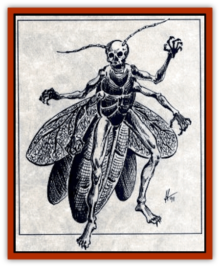
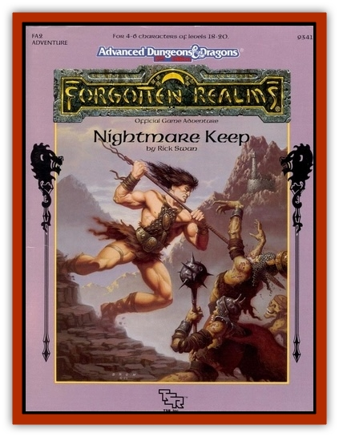

# Lichling

| Statistic | **Mature** | **Young** |
| --- | --- | --- |
| **Activity Cycle:** | Any | Any |
| **Alignment:** | Chaotics evil | Chaotic evil |
| **Armor Class:** | 2 | 1 |
| **Climate/Terrain:** | Any land | Any land |
| **Damage/Attack:** | 2d10/2d10/4d6 | 1-6 (bite) |
| **Diet:** | See below | See below |
| **Frequency:** | Very rare | Very rare |
| **Hit Dice:** | 20 | 2+2 |
| **Intelligence:** | Semi-(2) | Animal (1) |
| **Magic Resistance:** | See below | See below |
| **Morale:** | Fearless (20) | Fearless (19) |
| **Movement:** | 9, FL 18 (C) | 3, Fl 24 (B) |
| **No. Appearing:** | 1 | 1 or 10-100 |
| **No. of Attacks:** | 3 | 1 |
| **Organization:** | Solitary | Solitary or horde |
| **Size:** | G (80' long) | T (6" long) |
| **Special Attacks:** | Bone spew | Nil |
| **Special Defenses:** | See below | See below |
| **THAC0:** | 5 | 19 |
| **Treasure:** | Nil | Nil |
| **XP Value:** | 12,000 | 270 |

The lichling is a vicious, insect-like terror spawned from the body of a demilich.

The lichling resembles a 6"-long black cockroach with spindly human arms and legs, a pair of ragged gauzy wings, and a grinning human skull for a head. Razor-sharp hooked fangs line its mouth. The chitinous body is greasy to the touch and smells faintly of rotten meat. Lichlings make no sounds except in an attack, when they clack their teeth and hiss like serpents.

**Combat:**A lichling attacks any living creature, soaring in a straight line toward the most vulnerable area of the victim's body, such as the neck or other area of exposed flesh. A hit means that the lichling has sunk its powerful fangs into the victim, inflicting 1d6 damage. So powerful are the lichling's jaws that it can chew through a tree trunk.

Once it hits, the lichling inflicts an automatic 1d6 damage eachround thereafter until it lets go or is killed. If a lichling is killed, itremains attached to its victim; the victim suffers 1 point of damageper round, thanks to the deep wounds inflicted by the creatureand an anti-coagulant produced by the fangs.

Removing the corpse is a delicate procedure. A lichling corpse does not respond to fire or prodding. If the corpse is forcefully removed (which can be accomplished easily), the hooked fangs rip the victim's neck, inflicting 2 hit points of damage. If the lichling corpse is carefully detached (requiring a Dexterity check for the character removing the corpse), the corpse is removed without inflicting any additional damage to the victim; if the check fails, the victim suffers an additional 1 hit point of damage.

Lichlings can only be struck by + 1 or better magical weapons. They are immune to *charm*, *sleep*, *enfeeblement*, *polymorph*, *cold*, *electricity*, *fear*, *insanity*, and *death* spells.

**Habitat/Society:** Using arcane and complex magical procedures, certain demiliches are able to transform their original bodies into immense incubating husks. Infant lichlings are spawned from the brain cells of the husks, nurtured by substances generated within the husk. Following a period of 1d4 decades of dormancy, the lichlings become fully active.

Active lichlings have no permanent lair. They sometimes travel in loosely organized hordes that number as many as 100 members.

**Ecology:** Active lichlings don't consume organic food. Instead, they are nourished by the fear of their victims, along with the emotional trauma generated by victims suffering physical damage. In ways not fully understood, lichlings are able to assimilate fear and emotional trauma and transform it into nourishing energy. 

Though they are perfectly capable of inflicting damage and causing victims to feel fear, lichlings can also assimilate fear and trauma caused by other sources. For instance, lichlings sometimes linger near battlefields to assimilate the fear and emotional trauma that combatants inflict on each other.

 Lichlings show unwavering loyalty to the demilich who spawned them. If that demilich is destroyed, the lichlings may be pressed into service by an evil wizard or other powerful entity.

**Mature Lichling**

A lichling matures in 100-1,000 years. The mature lichling resembles an 80'-long version of a young lichling, with long claws on its hands used to supplement its biting attacks. The mature lichling can also spew a stream of sharp bone fragments at any single target up to 100' away (make normal attack roll) to inflict 6d6 damage; it can make this attack once every other round. Mature lichlings share the same diet and special defenses as young lichlings.

---
## Discovery & Documentation

**Source Publication:** FA2 Nightmare Keep (1991)
**Campaign Setting:** Forgotten Realms
**Author(s):** Rick Swan
