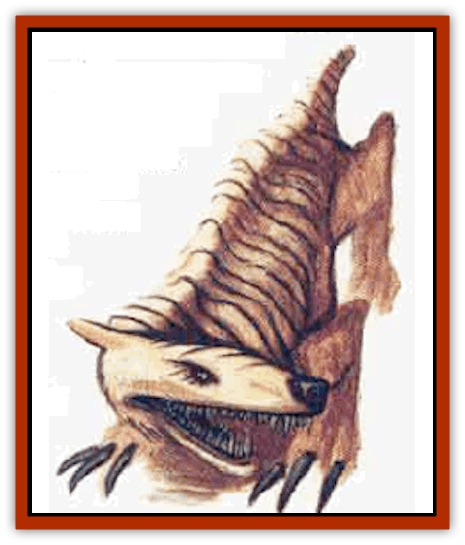
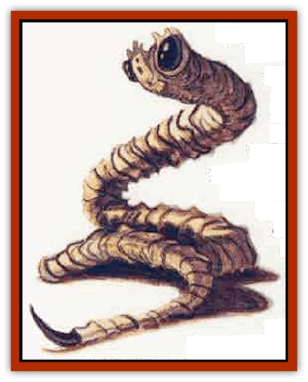
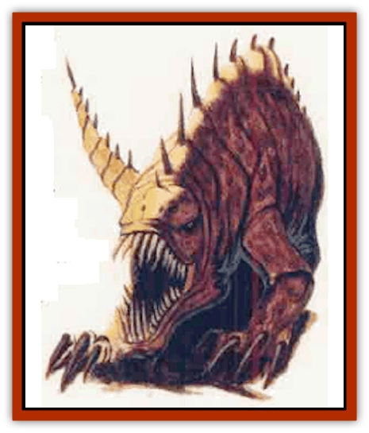
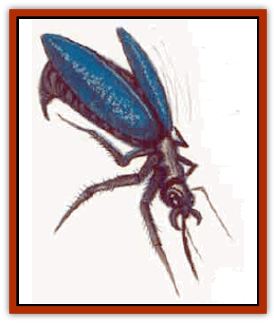
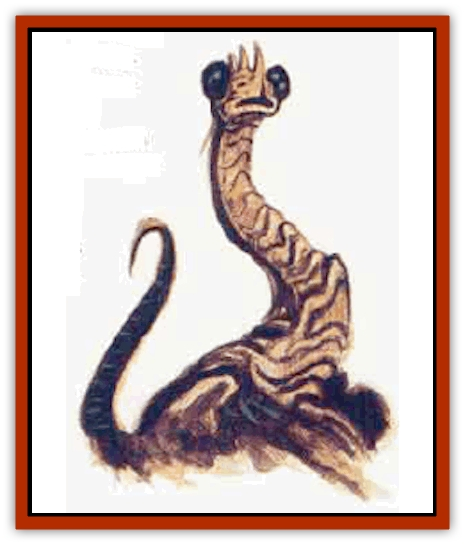

# Life-Shaped Creation - Guardian

| Statistic | **Climbdog** | **Darkstrike** | **Protector** | **Shieldbug** | **Watcher** |
| --- | --- | --- | --- | --- | --- |
| **Activity Cycle:** | All | All | All | All | All |
| **Alignment:** | Neutral | Neutral | Neutral | Neutral | Neutral |
| **Armor Class:** | 4 | 5 | 6 | 6 | 10 |
| **Climate/Terrain:** | Tropical cliffs | Tropical cliffs | Tropical cliffs | Tropical cliffs | Tropical cliffs |
| **Damage/Attack:** | 1d3/1d3/1d4 | 1d8 | 1d4/1d4/1d6 | Special | None |
| **Diet:** | Special | Special | Special | Special | Special |
| **Frequency:** | Very rare | Very rare | Very rare | Very rare | Very rare |
| **Hit Dice:** | 2 | 2 | 3 | 1 hp | 1 |
| **Intelligence:** | Semi- (2-4) | Non (0) | Animal (1) | Animal (1) | Non- (0) |
| **Magic Resistance:** | Nil | Nil | Nil | Nil | Nil |
| **Morale:** | Special | Special | Special | Special | Special |
| **Movement:** | 6 | Nil | 8 | 24 | Nil |
| **No. Appearing:** | Varies | Varies | Varies | Varies | Varies |
| **No. of Attacks:** | 3 | 1 | 3 | Special | None |
| **Organization:** | None | None | None | None | None |
| **Size:** | S (3' long) | S (4' long) | M (5' long) | T (6&rdquo; long) | S (3' long) |
| **Special Attacks:** | Nil | Poison | Nil | Special | Nil |
| **Special Defenses:** | Nil | Nil | Nil | Special | Nil |
| **THAC0:** | 15 | 15 | 17 | Nil | Nil |
| **Treasure:** | Nil | Nil | Nil | Nil | Nil |
| **XP Value:** | 65 | 65 | 120 | 7 | 35 |

The lifeshaped creations of Athas are organic automatons. Some have a modicum of independent intelligence, but all mindlessly obey the commands of their masters. They gain nourishment from a special nutrient solution rather than food and do not need the attention and care of real animals.

**

Climbdog**

  These canine beasts have wide, grasping paws and extremely flexible legs, allowing them to climb even sheer slopes. On Athas, they accompany [[Halfling_Athas|halfling]] climbers, giving them protection and aiding them with their keen sense of smell, hearing, and sight. These senses are all at least twice as good as the average halfling's. In times of danger or combat, they sacrifice themselves without hesitation to protect their masters. Climbdoes attack with two claws and a bite, suffering no penalties if attacking while climbing but being limited to only one claw attack instead of two.

**

Darkstrike**

  These guardian creatures look like [[Snake|snakes]] with large bulbous nodules at the end of their serpentine bodies. The nodules secrete an adhesive so that they can be attached to walls, doors, or other surfaces. Their dark flesh allows them to blend into the shadows, becoming 50% invisible in dim light. Usually, they are placed in nooks, alcoves, or around corners so that they can hide, waiting to pounce. Foes' surprise rolls are modified by a -2 when first attacked by a darkstrike. When a preselected condition is met, the serpentine creature strikes at any available target with its fearsome bite. Poison nodules often accomany darkstrikes so that their bite carries with it a virulent poison. A darkstrike can sense motion even in the dark by sonar, similar to bats, so attack conditions are usually based on movement. Other conditions include the detection of movement based on the amount of light (day or night), the number of figures passing by the creatures at the same time, the size, race, or species of figures passing, or similar criteria.

**

Protector**

  These feline creatures have the grace and power of large cats. They can be instructed to recognize intruders and attack them. The protectors flawlessly discriminate between those they are to protect and those who present an obvious threat. They attack with two huge claws and a tooth-filled maw that rend and rip their foes. Unlike predatory cats, however, these lifeshaped creations do not eat their kills or attack out of hunger.

**

Shieldbug**

  These wasp-like creations are 6 inches long and can fly up to 30 miles an hour. Singly they are virtually useless, but in a swarm they can be a formidable defense. A swarm comprises 50 to 100 of these creatures. They accompany the protected creature (usually resting on a mount until needed), flying up and around their master, screening out intruders and repulsing attacks. When a ranged attack (magical or missile) would otherwise hit the protected creature or his mount, the shieldbugs have a percentage chance equal to the number in the swarm that the attack strikes one of the insects instead of the protected one. The attack automatically kills the bug, reducing the number in the swarm by one. A shieldswarm cannot protect against area of effect attacks, although all of the bugs within the area of effect are slain. Against melee attacks, windriders surrounded by swarms have their AC improved by 2 places due to the swarm obscuring them and fouling the enemy's attacks.

Offensively, the swarm can be commanded to attack and harass the protected one's foes in battle. Every round within the hostile swarm, an enemy takes 1 point of damage and must make a saving throw vs. paralyzation to be able to take an action other than defending against the bugs.

**

Watcher**

  A watcher is a reptilian-plant creature with large, bulbous eyes possessed of virtually 360 degree vision. If a watcher observes a specific sight preselected by its master, it lets out a loud keening sound. It makes no attacks and never moves.

**Ecology:** The life-shaped creations are grown and used by the Rhul-Thaun, the halfling windriders of the Jagged Cliff region of Athas. The Rhul-Thaun also have developed the cam-rahn nutrient solution these creatures require.

These life-shaped creations of Athas are organic automatons. Some have a modicum of independent intelligence, but all mindlessly obey the commands of their masters. They gain nourishment from a special nutrient solution called cam-rahn rather than food, and do not need the attention and care of real animals.

---
## Discovery & Documentation

**Source Publication:** Monstrous Compendium, 1996 Annual, Volume 3 (1995)
**Campaign Setting:** Advanced Dungeons & Dragons 2nd Edition
**Author(s):** Jon Pickens

### Other Creatures Found in This Source Book
   * [[Alaghi|Alaghi]]
   * [[Alhoon|Alhoon]]
   * [[Aranea_Savage_Coast|Aranea (Savage Coast)]]
   * [[Arcane_Head|Arcane Head]]
   * [[Banedead|Banedead]]
   * [[Banelich|Banelich]]
   * [[Bat_Bonebat|Bat, Bonebat]]
   * [[Beetle|Beetle]]
   * [[Belgoi|Belgoi]]
   * [[Bladeling|Bladeling]]
   * [[Braxat|Braxat]]
   * [[Bunyip|Bunyip]]
   * [[Burbur|Burbur]]
   * [[Bvanen|Bvanen]]
   * [[Cat_Great_Snow_Tiger|Cat, Great, Snow Tiger]]
   * [[Chosen_One|Chosen One]]
   * [[Chronovoid|Chronovoid]]
   * [[Cildabrin|Cildabrin]]
   * [[Coffer_Corpse|Coffer Corpse]]
   * [[Disenchanter|Disenchanter]]
   * [[Dog_Temporal|Dog, Temporal]]
   * [[Dragon_Cerilia|Dragon (Cerilia)]]
   * [[Dragon_Ghost|Dragon, Ghost]]
   * [[Dragon_Lesser_Undead|Dragon, Lesser Undead]]
   * [[Dragon_Neutral_Amber|Dragon, Neutral, Amber]]
   * [[Dread_Warrior|Dread Warrior]]
   * [[Dreamweaver|Dreamweaver]]
   * [[Dream_Spawn_Greater_Ennui|Dream Spawn, Greater, Ennui]]
   * [[Dream_Spawn_Lesser_Morph|Dream Spawn, Lesser, Morph]]
   * [[Dwarf_Arctic|Dwarf, Arctic]]
   * [[Dwarf_Urdunnir|Dwarf, Urdunnir]]
   * [[Eel_Giant_Moray|Eel, Giant Moray]]
   * [[Elemental_Fire_Kin_Tome_Guardian|Elemental, Fire Kin, Tome Guardian]]
   * [[Elf_Rockseer|Elf, Rockseer]]
   * [[Ethyk|Ethyk]]
   * [[Faerie_Faerie_Fiddler|Faerie, Faerie Fiddler]]
   * [[Faerie_Petty_Bramble|Faerie, Petty, Bramble]]
   * [[Faerie_Petty_Gorse|Faerie, Petty, Gorse]]
   * [[Faerie_Petty|Faerie, Petty]]
   * [[Firenewt|Firenewt]]
   * [[Formian|Formian]]
   * [[Gargoyle_II|Gargoyle II]]
   * [[Giant_Cerilia|Giant (Cerilia)]]
   * [[Goblin_Cerilia|Goblin (Cerilia)]]
   * [[Golem_Magic|Golem, Magic]]
   * [[Golem_Shaboath|Golem, Shaboath]]
   * [[Hag_Bheur|Hag, Bheur]]
   * [[Hamadryad|Hamadryad]]
   * [[Hound_of_Ill-Omen|Hound of Ill-Omen]]
   * [[Human_Cerilia|Human (Cerilia)]]
   * [[Hybsil|Hybsil]]
   * [[Ibrandlin|Ibrandlin]]
   * [[Imp_Chaos|Imp, Chaos]]
   * [[Ixitxachitl_Ixzan|Ixitxachitl, Ixzan]]
   * [[Jabberwock|Jabberwock]]
   * [[Kyton|Kyton]]
   * [[Kyuss_Son_of|Kyuss, Son of]]
   * [[Lillend|Lillend]]
   * [[Life-Shaped_Creation_Transport|Life-Shaped Creation, Transport]]
   * [[Lycanthrope_Werecrocodile|Lycanthrope, Werecrocodile]]
   * [[Lycanthrope_Werespider|Lycanthrope, Werespider]]
   * [[Magedoom|Magedoom]]
   * [[Manotaur|Manotaur]]
   * [[Mastiff_Shadow|Mastiff, Shadow]]
   * [[Meazel|Meazel]]
   * [[Mist_Scarlet_Dancer|Mist, Scarlet Dancer]]
   * [[Needleman|Needleman]]
   * [[Orc_Neo-Orog|Orc, Neo-Orog]]
   * [[Orc_Ondonti|Orc, Ondonti]]
   * [[Owlbear_II|Owlbear II]]
   * [[Pegataur|Pegataur]]
   * [[Phaerimm|Phaerimm]]
   * [[Reggelid|Reggelid]]
   * [[Render|Render]]
   * [[Saurial|Saurial]]
   * [[Scalamagdrion|Scalamagdrion]]
   * [[Sharn|Sharn]]
   * [[Snake_Messenger|Snake, Messenger]]
   * [[Spirit_Forest_Uthraki|Spirit, Forest, Uthraki]]
   * [[Spirit_Forest_Wood_Man|Spirit, Forest, Wood Man]]
   * [[Spirit_Ice_Orglash|Spirit, Ice, Orglash]]
   * [[Spirit_Rock_Thomil|Spirit, Rock, Thomil]]
   * [[Strider_Giant|Strider, Giant]]
   * [[Tembo|Tembo]]
   * [[Temporal_Glider|Temporal Glider]]
   * [[Temporal_Stalker|Temporal Stalker]]
   * [[Tether_Beast|Tether Beast]]
   * [[Thessalmonster|Thessalmonster]]
   * [[Time_Dimensional|Time Dimensional]]
   * [[Tomb_Tapper|Tomb Tapper]]
   * [[Undead_Dragon_Slayer|Undead Dragon Slayer]]
   * [[Unicorn_Black_Toril|Unicorn, Black (Toril)]]
   * [[Vaath|Vaath]]
   * [[Vortex_Spider|Vortex Spider]]
   * [[Weredragon|Weredragon]]
   * [[Zhentarim_Spirit|Zhentarim Spirit]]
