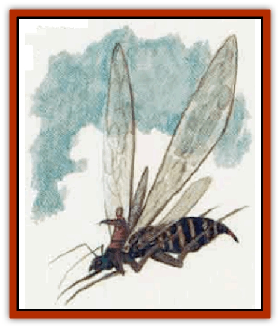
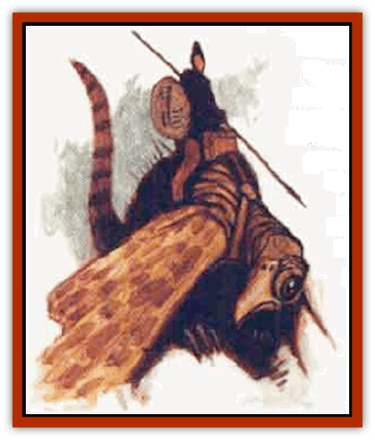
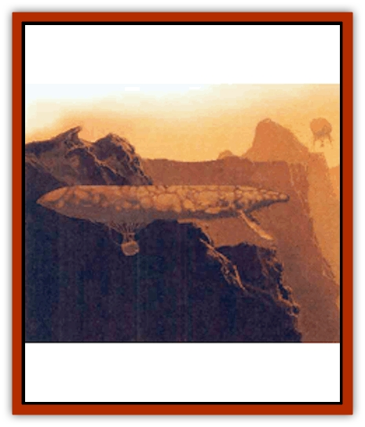
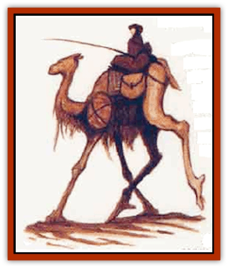

# Life-Shaped Creation - Transport

| Statistic | **Ber-ethern** | **Dhev-sahr** | **Gon-evauth** | **Yihn-eflan** |
| --- | --- | --- | --- | --- |
| **Activity Cycle:** | Any | Any | Any | Any |
| **Alignment:** | Neutral | Neutral | Neutral | Neutral |
| **Armor Class:** | 4 | 7 | 10 | 5 |
| **Climate/Terrain:** | Tropical cliffs | Tropical cliffs | Tropical cliffs | Tropical cliffs |
| **Damage/Attack:** | 1d4 | 1d6 | Nil | 1d4+1/1d4+1 |
| **Diet:** | Special | Special | Special | Special |
| **Frequency:** | Very rare | Very rare | Very rare | Very rare |
| **Hit Dice:** | 4 | 4 | 9 | 6 |
| **Intelligence:** | Animal (1) | Animal (1) | Animal (1) | Animal (1) |
| **Magic Resistance:** | Nil | Nil | Nil | Nil |
| **Morale:** | Special | Special | Special | Special |
| **Movement:** | Fl 45 (A) | 18 | Fl 24 (B) | Fl 32 (C) |
| **No. Appearing:** | Varies | Varies | Varies | Varies |
| **No. of Attacks:** | 1 | 1 | 0 | 2 |
| **Organization:** | None | None | None | None |
| **Size:** | M (6' long) | L (7' long) | H (20' long) | L (8' long) |
| **Special Attacks:** | Nil | Nil | Nil | Nil |
| **Special Defenses:** | Nil | Nil | Nil | Nil |
| **THAC0:** | 17 | 17 | 11 | 15 |
| **Treasure:** | Nil | Nil | Nil | Nil |
| **XP Value:** | 120 | 120 | 975 | 270 |

The lifeshaped creations of Athas are organic automatons. Some have a modicum of independent intelligence, but all mindlessly obey the commands of their masters. They gain nourishment from a special nutrient solution rather than food and do not need the attention and care of real animals.

**

Ber-ethern**

  *Breeze sprites* (which is what ber-ethern means) are the smallest mounts used by the windriders of Athas. They are insectoid flyers with room to carry one halfling rider and 25 pounds of cargo. They can fly up to 75 miles per hour fully loaded. Their long, thin wings are twice their body length, allowing them to fly with not only great speed but superb control. Ber-ethern can hover, pivot, and move straight up and down. Designed expressly for rapid, controlled movement, ber-ethern can move with speed and grace unequaled in nature. Their attack is with a small, poisonless stinger.

Windriders choose this mount for quick trips or for operating in situations where maneuverability is essential. They can fly through narrow crevices and hover next to the cliff face, allowing a rider to harvest plants from a vertical forest.

**

Yihn-eflan**

  Yihn-eflan are windriding mounts whose name means *gust climber*. Larger than breeze sprites but smaller than soar whales, the yihn-eflan is an avian creature with huge, oversized wings. Their bodies are covered with feathers, and their heads have hawk-like beaks. Their only method of attack, however, is to rake foes with their large talons. One to three riders can rest safely on its back or 200 pounds of cargo and a single rider can be carried. Fully loaded, a gust climber can reach speeds up to 50 miles per hour.

This is the medium windriding mount, still very fast but able to carry more weight than a ber-ethern. These are chosen mounts of windriders who know they are going into battle, for yihn-eflan dives upon foes with a terrible ferocity and rake with their talons besides its rider's attack.

**

Gon-evauth**

  This windrider mount is also called a *soar whale*, and sometimes (usually by outsiderrs who see them from afar) an airship. Gon-evaugh are huge balloon shapes, able to keep themselves aloft in the winds of the cliffs by filling their large inner cavities with hot, moist air. Windriders ride either atop the floating beasts or in gondolas attached beneath the beasts that can carry up to eight [[Halfling_Athas|halflings]] or one windrider and one ton of cargo (2,000 Ibs.). Fully loaded, a soar whale moves at a top speed of 30 miles per hour. It has no means of attack or even self-defense, and if it takes more than 25% of its hit points, it must descend - its air sack has been punctured.

This is the most common windriding mount, chosen when speed can be sacrificed to move great amounts of cargo or many passengers. Additionally, for extremely large and heavy loads, several soar whales can be hooked together and flown in teams. Due to their slow, gentle movements, they are good for vertical forest harvesting, and their undercarriages provide excellent steady platforms for hunters with spinethrowers and lightning generators.

**

Dhev-sahr**

  The dhev-sahr is the only land-based mount made by the life-shapers. Its mammallian, hair-covered body is round, its head resembles that of a camel. The creature's four stilt-like legs allow it to move very quickly at what appears to be an awkward gallop. Despite appearances, however, dhev-sahr are graceful and steady. Two halflings can ride comfortably on top, and the creature can carry up to a 120-pound load.

**Ecology:** The lifeshaped creations are grown and used by the Rhul-Thaun, the halfling windriders of the Jagged Cliff region of Athas. The Rhul-Thun also have developed the cam-rahn nutrient solution these creatures require.

---
## Discovery & Documentation

**Source Publication:** Monstrous Compendium, 1996 Annual, Volume 3 (1995)
**Campaign Setting:** Advanced Dungeons & Dragons 2nd Edition
**Author(s):** Jon Pickens

### Other Creatures Found in This Source Book
   * [[Alaghi|Alaghi]]
   * [[Alhoon|Alhoon]]
   * [[Aranea_Savage_Coast|Aranea (Savage Coast)]]
   * [[Arcane_Head|Arcane Head]]
   * [[Banedead|Banedead]]
   * [[Banelich|Banelich]]
   * [[Bat_Bonebat|Bat, Bonebat]]
   * [[Beetle|Beetle]]
   * [[Belgoi|Belgoi]]
   * [[Bladeling|Bladeling]]
   * [[Braxat|Braxat]]
   * [[Bunyip|Bunyip]]
   * [[Burbur|Burbur]]
   * [[Bvanen|Bvanen]]
   * [[Cat_Great_Snow_Tiger|Cat, Great, Snow Tiger]]
   * [[Chosen_One|Chosen One]]
   * [[Chronovoid|Chronovoid]]
   * [[Cildabrin|Cildabrin]]
   * [[Coffer_Corpse|Coffer Corpse]]
   * [[Disenchanter|Disenchanter]]
   * [[Dog_Temporal|Dog, Temporal]]
   * [[Dragon_Cerilia|Dragon (Cerilia)]]
   * [[Dragon_Ghost|Dragon, Ghost]]
   * [[Dragon_Lesser_Undead|Dragon, Lesser Undead]]
   * [[Dragon_Neutral_Amber|Dragon, Neutral, Amber]]
   * [[Dread_Warrior|Dread Warrior]]
   * [[Dreamweaver|Dreamweaver]]
   * [[Dream_Spawn_Greater_Ennui|Dream Spawn, Greater, Ennui]]
   * [[Dream_Spawn_Lesser_Morph|Dream Spawn, Lesser, Morph]]
   * [[Dwarf_Arctic|Dwarf, Arctic]]
   * [[Dwarf_Urdunnir|Dwarf, Urdunnir]]
   * [[Eel_Giant_Moray|Eel, Giant Moray]]
   * [[Elemental_Fire_Kin_Tome_Guardian|Elemental, Fire Kin, Tome Guardian]]
   * [[Elf_Rockseer|Elf, Rockseer]]
   * [[Ethyk|Ethyk]]
   * [[Faerie_Faerie_Fiddler|Faerie, Faerie Fiddler]]
   * [[Faerie_Petty_Bramble|Faerie, Petty, Bramble]]
   * [[Faerie_Petty_Gorse|Faerie, Petty, Gorse]]
   * [[Faerie_Petty|Faerie, Petty]]
   * [[Firenewt|Firenewt]]
   * [[Formian|Formian]]
   * [[Gargoyle_II|Gargoyle II]]
   * [[Giant_Cerilia|Giant (Cerilia)]]
   * [[Goblin_Cerilia|Goblin (Cerilia)]]
   * [[Golem_Magic|Golem, Magic]]
   * [[Golem_Shaboath|Golem, Shaboath]]
   * [[Hag_Bheur|Hag, Bheur]]
   * [[Hamadryad|Hamadryad]]
   * [[Hound_of_Ill-Omen|Hound of Ill-Omen]]
   * [[Human_Cerilia|Human (Cerilia)]]
   * [[Hybsil|Hybsil]]
   * [[Ibrandlin|Ibrandlin]]
   * [[Imp_Chaos|Imp, Chaos]]
   * [[Ixitxachitl_Ixzan|Ixitxachitl, Ixzan]]
   * [[Jabberwock|Jabberwock]]
   * [[Kyton|Kyton]]
   * [[Kyuss_Son_of|Kyuss, Son of]]
   * [[Lillend|Lillend]]
   * [[Life-Shaped_Creation_Guardian|Life-Shaped Creation, Guardian]]
   * [[Lycanthrope_Werecrocodile|Lycanthrope, Werecrocodile]]
   * [[Lycanthrope_Werespider|Lycanthrope, Werespider]]
   * [[Magedoom|Magedoom]]
   * [[Manotaur|Manotaur]]
   * [[Mastiff_Shadow|Mastiff, Shadow]]
   * [[Meazel|Meazel]]
   * [[Mist_Scarlet_Dancer|Mist, Scarlet Dancer]]
   * [[Needleman|Needleman]]
   * [[Orc_Neo-Orog|Orc, Neo-Orog]]
   * [[Orc_Ondonti|Orc, Ondonti]]
   * [[Owlbear_II|Owlbear II]]
   * [[Pegataur|Pegataur]]
   * [[Phaerimm|Phaerimm]]
   * [[Reggelid|Reggelid]]
   * [[Render|Render]]
   * [[Saurial|Saurial]]
   * [[Scalamagdrion|Scalamagdrion]]
   * [[Sharn|Sharn]]
   * [[Snake_Messenger|Snake, Messenger]]
   * [[Spirit_Forest_Uthraki|Spirit, Forest, Uthraki]]
   * [[Spirit_Forest_Wood_Man|Spirit, Forest, Wood Man]]
   * [[Spirit_Ice_Orglash|Spirit, Ice, Orglash]]
   * [[Spirit_Rock_Thomil|Spirit, Rock, Thomil]]
   * [[Strider_Giant|Strider, Giant]]
   * [[Tembo|Tembo]]
   * [[Temporal_Glider|Temporal Glider]]
   * [[Temporal_Stalker|Temporal Stalker]]
   * [[Tether_Beast|Tether Beast]]
   * [[Thessalmonster|Thessalmonster]]
   * [[Time_Dimensional|Time Dimensional]]
   * [[Tomb_Tapper|Tomb Tapper]]
   * [[Undead_Dragon_Slayer|Undead Dragon Slayer]]
   * [[Unicorn_Black_Toril|Unicorn, Black (Toril)]]
   * [[Vaath|Vaath]]
   * [[Vortex_Spider|Vortex Spider]]
   * [[Weredragon|Weredragon]]
   * [[Zhentarim_Spirit|Zhentarim Spirit]]
