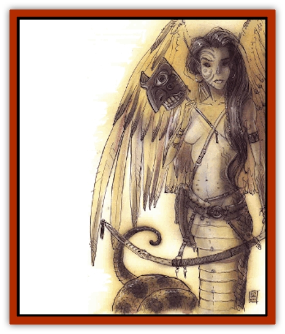

# Lillend

| Statistic | **Lillend** |
| --- | --- |
| **Activity Cycle:** | Day |
| **Alignment:** | Chaotic neutral or chaotic good |
| **Armor Class:** | 3 |
| **Climate/Terrain:** | Ysgard, Arborea, Limbo |
| **Damage/Attack:** | 2d6 and by weapon type |
| **Diet:** | Omnivore |
| **Frequency:** | Rare |
| **Hit Dice:** | 7+14 |
| **Intelligence:** | High (13-14) |
| **Magic Resistance:** | 25% |
| **Morale:** | Champion (15-16) |
| **Movement:** | 9, Fl 27 (C), Sw 15 |
| **No. Appearing:** | 2d6 |
| **No. of Attacks:** | 1 tail and 1 weapon |
| **Organization:** | Family |
| **Size:** | L (human torso with 20' body) |
| **Special Attacks:** | Dropping in flight, spells, crush |
| **Special Defenses:** | Spells, immunities, magical weapon to hit |
| **THAC0:** | 11 |
| **Treasure:** | A |
| **XP Value:** | 9,000 |

Lillendi are natives of Ysgard, though they can travel astrally to the Prime and may also be found on the planes of Arborea and Limbo. On the Prime Material Plane, they prefer to dwell in temperate or tropical woodlands. They are peaceful and delight in song and conversation - and far from harmless. Those who offend lillendi may recieve harsh treatment at their hands, and even blameless individuals are subject to their pranks. Lillendi are particularly hostile toward those who seek to impose civilized order on the wilderness.

A lillend has the torso, arms, and head of a comely man or woman, but also has broad, powerful, feathered wings and a stout serpentine body from the waist downwards. Though the humanlike portions of a lillend are of unremarkable hue, the feathered and scaled parts of its anatomy are brightly colored and strikingly patterned. Each individual has its own unique color combination and is quite proud of it. A lillend wears no clothing but sometimes wears jewelry. It always carries weapons and musical instruments.

Lillendi do not mate or marry. They reproduce parthenogenically, giving birth to offspring that resemble the mother in most respects. Lillendi with male human torsos are biologically female, though they follow male human patterns of dress and customs.

A lillend can understand any intelligent communication, including writing or sign language. All lillendi have infravision to 120 feet. Lillendi speak their own language and the languages of giants, [[Bariaur|bariaur]], and [[Githzerai|githzerai]].

**Combat:** Lillendi can cast spells, charm with music, affect morale, determine the history of legendary magical items as 7th-level bards, and they can use any magical items that bards can use. In addition to their bardic abilities, they can cast *darkness*, *hallucinatory terrain*, *knock*, and *light* each 3 times per day. Once per day they can cast *fire charm*, *Otto's irresistible dance*, *pass plant*, *polymorph self* (into humanlike form only), *speak with animals*, *speak with plants*, and *transport via plants*.

Lillendi can breathe water and can move swiftly on or under the surface, wings folded tightly against the body when they snake their way across the surface. When they dive underwater their wings beat slowly to propel them forward, like enormous diving birds.

They are immune to poisons, noxious gases, normal fire, the effects of the Positive and Negative Energy Planes (including level draining and enervation), and to any musically based magical effect, such as [[Harpy|harpy]] song or [[Satyr|satyr]] piping. They are unaffected by all enchantment/charm spells, and only +1 or better weapons can strike them.

Lillendi have 17 Strength and 16 Dexterity for their human torsos, with attendant bonuses in combat. Their weapons, sometimes magical, are usually long swords, great spears, or powerful long bows with war arrows. A lillend catching an opponent in her serpentine coils inflicts 2d6 points of damage that round and constricts each round thereafter for 2d6 points of damage as she crushes the life out of her prey. Any creature held in a lillend's coils suffers a -3 penalty to attack, damage, and saving throw rolls. When a lillend attacks prey caught in her coils she does so at +1 to attack and damage rolls.

Lillendi carry particularly unpleasant enemies in flight for up to 10 rounds, then drop them for a maximum of 20d6 points of falling damage. Falls that inflict more than 50 points of damage require a saving throw vs. death magic to avoid instant death from massive damage, regardless of the character's remaining hit point total. Lillendi cannot constrict while flying, and they cannot carry more than 250 pounds aloft.

Those who go into battle to meet death fight more fiercely to make the best possible impression on the power they serve. Lillendi entering the Silent Hour (see below) strike in a calm, focused fury, always winning initiative and attacking at +4 for doubled damage, but they always perish at the end of the alotted span.

**Habitat/Society:** Lillendi serve the gods of the moon in the realm called Gates of the Moon, which lies on the plane of Ysgard. They only travel to the Prime when ordered to do so by their Powers. Of all the proxies of Ysgard, the lillendi are the least involved in the affairs of others.

Lillendi are said to be able to choose the hour of their death, the Silent Hour, when they grow weary of life and service to the moon. This knowledge is either a gift from the gods of the moon, or a curse from the powers of Law, whom the lillendi are said to have served long ago and then abandoned. Shortly before her death, a lillend makes her farewells. As she dies she is absorbed into her power's realm, disappearing in a misty fog that acts as a combination *moonbeam* and *chaos* spell.

Lillendi who haven't yet chosen the Silent Hour can still die through accident or violence, but in death their faces are always wracked with despair, for the legends say that those who do not pass through the Silent Hour are never joined with the power they serve.

Lillendi social status depends on a simple system of initiations into mysteries and the ownership of certain totem masks. The mysteries are akin to secret societies, and each mystery is a specific kernel of wisdom passed on from one generation to the next. The more societies a lillend is a member of, the greater her status. Each society is devoted to particular musical forms, songs, instruments, and weapons, so a group of lillendi usually uses the same instruments, weaponry, and spells.

The masks are tangentially related to the societies, since each mask design belongs to a specific family, and long ago each family lived in a single lodge and wore a single type of mask. Things have gotten a little more complicated since then, but the masks still roughly indicate status and family affiliations.

**Ecology:** Lillendi devour both material food and magic essences. They can sustain themselves on moonbeams and the elemental essence of the wilderness (mountain breezes, gentle rains, raging rivers, and forest fires), though they prefer more substantial fare. If they gorge themselves on meat, they often remain in a torpid digestive state for hours or even days. This torpor doubles their spellcasting times, halves their constriction damage, and causes a -2 penalty to initiative. The lillendi enjoy this sluggishness, though they are wise enough not to go into such torpor alone and unguarded.

Lillendi are known for broad tastes: They eat meat, vegetables, hay, grains, or spell components with equal abandon. Their digestion is complete and efficient; they excrete nothing though some say that the lillendi merely transmute matter into magical energy. Hunters and rangers have never found scat or markings in lillendi territory. It may be that anything indigestible is transformed into the fog that lillendi sometimes breathe out. Who knows?

Lillendi feud with the petitioners of Ysgard from time to time, but more often keep to themselves. They are rivals of tht [[Asuras|asuras]], [[Aasimon_Deva|devas]], and valkyries. They usually avoid the clumsy [[Fensir|*fensir*]] (ysgardian trolls) easily. They are deadly enemies of the [[Baatezu_General_Information|baatezu]] and [[Modron|modrons]].

---
## Discovery & Documentation

**Source Publication:** Monstrous Compendium, 1996 Annual, Volume 3 (1995)
**Campaign Setting:** Advanced Dungeons & Dragons 2nd Edition
**Author(s):** Jon Pickens

### Other Creatures Found in This Source Book
   * [[Alaghi|Alaghi]]
   * [[Alhoon|Alhoon]]
   * [[Aranea_Savage_Coast|Aranea (Savage Coast)]]
   * [[Arcane_Head|Arcane Head]]
   * [[Banedead|Banedead]]
   * [[Banelich|Banelich]]
   * [[Bat_Bonebat|Bat, Bonebat]]
   * [[Beetle|Beetle]]
   * [[Belgoi|Belgoi]]
   * [[Bladeling|Bladeling]]
   * [[Braxat|Braxat]]
   * [[Bunyip|Bunyip]]
   * [[Burbur|Burbur]]
   * [[Bvanen|Bvanen]]
   * [[Cat_Great_Snow_Tiger|Cat, Great, Snow Tiger]]
   * [[Chosen_One|Chosen One]]
   * [[Chronovoid|Chronovoid]]
   * [[Cildabrin|Cildabrin]]
   * [[Coffer_Corpse|Coffer Corpse]]
   * [[Disenchanter|Disenchanter]]
   * [[Dog_Temporal|Dog, Temporal]]
   * [[Dragon_Cerilia|Dragon (Cerilia)]]
   * [[Dragon_Ghost|Dragon, Ghost]]
   * [[Dragon_Lesser_Undead|Dragon, Lesser Undead]]
   * [[Dragon_Neutral_Amber|Dragon, Neutral, Amber]]
   * [[Dread_Warrior|Dread Warrior]]
   * [[Dreamweaver|Dreamweaver]]
   * [[Dream_Spawn_Greater_Ennui|Dream Spawn, Greater, Ennui]]
   * [[Dream_Spawn_Lesser_Morph|Dream Spawn, Lesser, Morph]]
   * [[Dwarf_Arctic|Dwarf, Arctic]]
   * [[Dwarf_Urdunnir|Dwarf, Urdunnir]]
   * [[Eel_Giant_Moray|Eel, Giant Moray]]
   * [[Elemental_Fire_Kin_Tome_Guardian|Elemental, Fire Kin, Tome Guardian]]
   * [[Elf_Rockseer|Elf, Rockseer]]
   * [[Ethyk|Ethyk]]
   * [[Faerie_Faerie_Fiddler|Faerie, Faerie Fiddler]]
   * [[Faerie_Petty_Bramble|Faerie, Petty, Bramble]]
   * [[Faerie_Petty_Gorse|Faerie, Petty, Gorse]]
   * [[Faerie_Petty|Faerie, Petty]]
   * [[Firenewt|Firenewt]]
   * [[Formian|Formian]]
   * [[Gargoyle_II|Gargoyle II]]
   * [[Giant_Cerilia|Giant (Cerilia)]]
   * [[Goblin_Cerilia|Goblin (Cerilia)]]
   * [[Golem_Magic|Golem, Magic]]
   * [[Golem_Shaboath|Golem, Shaboath]]
   * [[Hag_Bheur|Hag, Bheur]]
   * [[Hamadryad|Hamadryad]]
   * [[Hound_of_Ill-Omen|Hound of Ill-Omen]]
   * [[Human_Cerilia|Human (Cerilia)]]
   * [[Hybsil|Hybsil]]
   * [[Ibrandlin|Ibrandlin]]
   * [[Imp_Chaos|Imp, Chaos]]
   * [[Ixitxachitl_Ixzan|Ixitxachitl, Ixzan]]
   * [[Jabberwock|Jabberwock]]
   * [[Kyton|Kyton]]
   * [[Kyuss_Son_of|Kyuss, Son of]]
   * [[Life-Shaped_Creation_Guardian|Life-Shaped Creation, Guardian]]
   * [[Life-Shaped_Creation_Transport|Life-Shaped Creation, Transport]]
   * [[Lycanthrope_Werecrocodile|Lycanthrope, Werecrocodile]]
   * [[Lycanthrope_Werespider|Lycanthrope, Werespider]]
   * [[Magedoom|Magedoom]]
   * [[Manotaur|Manotaur]]
   * [[Mastiff_Shadow|Mastiff, Shadow]]
   * [[Meazel|Meazel]]
   * [[Mist_Scarlet_Dancer|Mist, Scarlet Dancer]]
   * [[Needleman|Needleman]]
   * [[Orc_Neo-Orog|Orc, Neo-Orog]]
   * [[Orc_Ondonti|Orc, Ondonti]]
   * [[Owlbear_II|Owlbear II]]
   * [[Pegataur|Pegataur]]
   * [[Phaerimm|Phaerimm]]
   * [[Reggelid|Reggelid]]
   * [[Render|Render]]
   * [[Saurial|Saurial]]
   * [[Scalamagdrion|Scalamagdrion]]
   * [[Sharn|Sharn]]
   * [[Snake_Messenger|Snake, Messenger]]
   * [[Spirit_Forest_Uthraki|Spirit, Forest, Uthraki]]
   * [[Spirit_Forest_Wood_Man|Spirit, Forest, Wood Man]]
   * [[Spirit_Ice_Orglash|Spirit, Ice, Orglash]]
   * [[Spirit_Rock_Thomil|Spirit, Rock, Thomil]]
   * [[Strider_Giant|Strider, Giant]]
   * [[Tembo|Tembo]]
   * [[Temporal_Glider|Temporal Glider]]
   * [[Temporal_Stalker|Temporal Stalker]]
   * [[Tether_Beast|Tether Beast]]
   * [[Thessalmonster|Thessalmonster]]
   * [[Time_Dimensional|Time Dimensional]]
   * [[Tomb_Tapper|Tomb Tapper]]
   * [[Undead_Dragon_Slayer|Undead Dragon Slayer]]
   * [[Unicorn_Black_Toril|Unicorn, Black (Toril)]]
   * [[Vaath|Vaath]]
   * [[Vortex_Spider|Vortex Spider]]
   * [[Weredragon|Weredragon]]
   * [[Zhentarim_Spirit|Zhentarim Spirit]]
