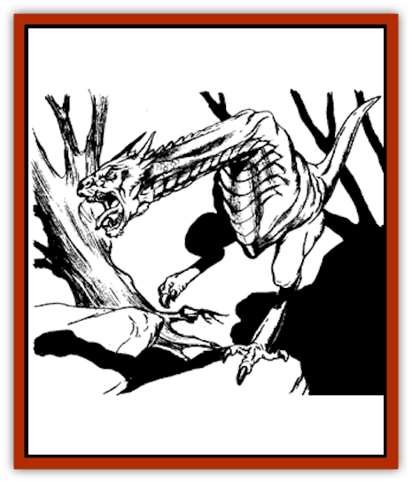
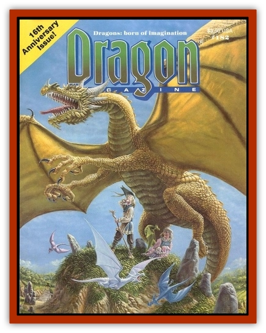

# Lindworm

| Statistic | **Lindworm** |
| --- | --- |
| **Activity Cycle:** | Any |
| **Alignment:** | Any evil |
| **Armor Class:** | Variable (see text) |
| **Climate/Terrain:** | Variable (see text) |
| **Damage/Attack:** | 1-8/1-6/2-12 |
| **Diet:** | Carnivore |
| **Frequency:** | Very rare |
| **Hit Dice:** | 5 |
| **Intelligence:** | Low (5-7) |
| **Magic Resistance:** | Nil |
| **Morale:** | Steady (11) |
| **Movement:** | 12 |
| **No. Appearing:** | 1 (20% of 2) |
| **No. of Attacks:** | 3 |
| **Organization:** | Solitary |
| **Size:** | H (20' long) |
| **Special Attacks:** | Breath weapon |
| **Special Defenses:** | Immune to attacks similar to those of breath weapon |
| **THAC0:** | 15 |
| **Treasure:** | B |
| **XP Value:** | 650 |

The lindworm is a deficient form of evil [[Dragon_General_Information|dragon]], one that may be born to a [[Dragon_Chromatic_Black|black]], [[Dragon_Chromatic_Blue|blue]], [[Dragon_Chromatic_Green|green]], [[Dragon_Chromatic_Red|red]], or [[Dragon_Chromatic_White|white dragon]]. This may be due to a curse of the gods or simply nature's way of insuring that the population of true dragons doesn't grow too large. Either way, the lindworm, while formidable, is not nearly as dangerous as a regular dragon. It looks like a two-legged dragon, rather like a [[Wyvern|wyvern]], but without wings or the wyvern's poison stinger. The lindworm has a typically draconic head and long neck, but the creature's body is built like that of a huge scaly bird. Its color and other details of its appearance are similar to those of its parents.

**Combat:** The lindworm has three physical attacks: a bite (1-8 hp), a clawing attack (1-6 hp; only one clawing attack can be made, since the lindworm must have one leg to stand on), and a tail lash (1-12 hp). No lindworm can cast spells, but they do inherit their parents' breath weapon, which has only half the physical dimensions of the usual form and does 5d8 hp damage (half if a successful save vs. breath weapons is made). The breath attack may be used three times a day. All lindworms are also immune to attack forms similar to those of their breath weapons (e.g., fire and heat for the lindworm spawn of red dragons). As a final defense, the lindworm's armor class is equal to the parent dragon's base armor class.

**Habitat/Society:** Lindworms are the result of a dragon couple's breeding failures (one appearing every 100 births), and as such they are quickly driven forth from the den. Eighty percent of the time, only one lindworm is encountered; otherwise, there are twins. Because they are effectively banished from draconic society, lindworms are extremely vicious, selfish, bitter creatures seeking revenge on the world. Twins are quite loyal to each other, as each is the only creature in the world that provides companionship for the other. If one is killed or injured, the other attacks with no thought for its own life (Morale 20). They speak their parents' natural tongue only, but rarely speak before or instead of attacking. Lindworms have no true society, despising even each other unless they are twins.

**Ecology:** The lindworm has no ingrained hunting technique, having to learn through trial and error. (Even if dragons knew how to kill through instinct instead of being taught by their parents, the lindworm's lack of wings and forelimbs would make this knowledge useless.) All lindworm hunting methods are essentially variants on the ambush: hiding in thick brush or woods, waiting behind boulders, sitting submerged in murky water, or burying itself in sand or snow (depending on the lindworm's parentage and environment). Lindworms eat anything they can catch and are almost always hungry, a state that only adds to their generally bad dispositions. They don't value treasure for its own sake as their parents do, but often leave the spoils of a previous hunt as bait for intelligent prey.

Though dangerous, lindworms are often deposed from the top of the local food chain by even more dangerous predators. Dragons who were not their birth parents will willingly slay them out of hand, without eating the bodies; other powerful monsters find them to be interesting prey, and adventurers regularly reduce their ranks. Wizards have yet to find a use for lindworm parts.

---
## Discovery & Documentation

**Source Publication:** Dragon182 (1992)
**Campaign Setting:** Dragon Magazine
**Author(s):**
