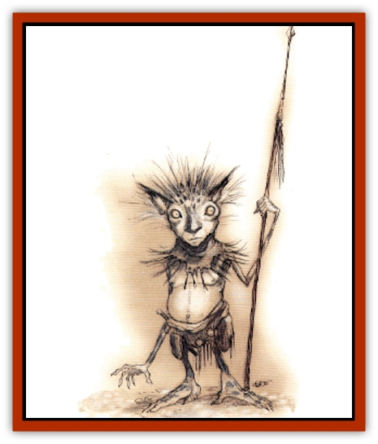

# Linqua

| Statistic | **Linqua** |
| --- | --- |
| **Activity Cycle:** | Any |
| **Alignment:** | Neutral evil |
| **Armor Class:** | 4 |
| **Climate/Terrain:** | Gehenna (any) |
| **Damage/Attack:** | 1d3 or by weapon |
| **Diet:** | Omnivore |
| **Frequency:** | Rare (very rare) |
| **Hit Dice:** | 2 |
| **Intelligence:** | Average to very (8-12) |
| **Magic Resistance:** | 5% |
| **Morale:** | Average (8-10) |
| **Movement:** | 6 |
| **No. Appearing:** | 3d8 (or 1) |
| **No. of Attacks:** | 1 |
| **Organization:** | Pack |
| **Size:** | S (3' tall) |
| **Special Attacks:** | Backstab |
| **Special Defenses:** | Spell use |
| **THAC0:** | 19 |
| **Treasure:** | M |
| **XP Value:** | 420 |

Linquas are short, squat humanoids native to Gehenna. Though they appear male, they are actually sexless, being more construct than creature. Their pale, pocked flesh is broken by tufts of bristlelike green hair.

**Combat:** Creatures created through godly magic, the linquas are able to draw power from their deity in a manner similar to the way that priests receive spells from their patron. While in the service of their creator Sung Chang, linquas have access to the following powers, each usable once per day: *detect lie*, *detect magic*, *free action*, *know alignment*, *spider climb*, *stone shape*, and *tongues*. Linquas are also able to summon great strength from their lord, giving them a Strength score of 19 for up to 10 rounds each day (these rounds need not be consecutive).

Tempered with the stuff of Gehenna itself, linquas are immune to the horrible conditions of its four terrible furnaces. Away from Gehenna, they take half damage from fire, cold, and acid.

Like thieves, linquas inflict twice normal damage with a backstabbing attack. For such actions they use long, serrated daggers. In more forthright combat they use short swords, hand axes, or spiked maces. When necessary, they arm themselves with pole arms, for despite their height they can wield the long weapons without difficulty. When the need for ranged weapons arises, they prefer the use of slings, light crossbows, and sometimes javelins. They never wear armor but occasionally employ shields, lowering their Armor Class by 1 to AC 3.

Linquas were born and bred in dark, shadowy chambers where subterfuge and guile were necessary to survive. For this reason, they operate as 2nd-level rogues with the following skill percentages: pick pockets 40%, open locks 25%, find/remove traps 20%, move silently 50%, hide in shadows 55%, detect noise 20%, climb walls 65%, read languages 0%.

**Habitat/Society:** Scampering about the layer (volcano) of Gehenna known as Khalas, linquas dwell in caves and underground caverns that they carve out of the blistering rock. Those currently favored by Sung Chiang live with the power in his Teardrop Palace. These linquas serve their master as guards and servants. Servants of Sung Chiang are cared for and well fed. If they displease their lord, however, Sung Chiang's patience is short and his mercy nonexistent. At best, a disobedient linqua will be exiled into the open, rocky ledges of Gehenna. Utter destruction is even more likely. Sung Chiang can always bring in more linquas from the caves and wilds outside the palace as replacements. If he cared to, he could also certainly make more.

Linquas that do not dwell in the palace are free to do what they will in the misery that is Khalas. They gather in loose-knit groups without organization or leader. Though not directly the servants of Sung Chiang, they still serve as a perimeter defense, keeping those foolish enough to wander about Gehenna far from the power's home. These linquas are still subject to the deity's whim and will, and must always do as he commands should he send an avatar out to speak to them or conscript them into more direct service.

Though most by far dwell on Gehenna, directly serving Sung Chiang, a few linquas have escaped or simply left his service and fled to other planes. Since the evil power most certainly has the prerogative to destroy his creations at a whim, one can only assume that Sung Chiang does not mind that some of his creations leave - even moving on to serve other powers. Perhaps it is part of some sort of scheme brewed in his Teardrop Palace. Perhaps he is just surprised and impressed by the willpower of these individuals and their ability to resist the pull of the power he offers. Most linquas become "addicted" to the energies of an actual power flowing through their body, and would never think of cutting themselves off from their source. Even those that do break away from Sung Chiang sometimes regret their decision, feeling the loss as a painful deprivation of a vital need.

Newly free linquas often go to Sigil to enjoy their autonomy. Often they have no idea how to handle their liberty, acting rashly and irresponsibly. These linquas usually fall victim to strong drink (to which they are unaccustomed) and poor judgment - and occasionally to the less reputable figures within the City of Doors.

Some independent linquas eventually begin to long for the power that they had in the service of their deity. Assuming Sung Chiang is angry at their escape, the linquas approach other powers and offer their services. Once in a while, they are actually accepted into such service. Presumably, such a lingua eventually changes its alignment to match that of its new master. It is also likely that the set of powers gained from this new master would differ from those received from Sung Chiang.

In certain circles, a tale is told regarding the first linqua, which, incidentally, was also the first linqua to ever leave Gehenna to obtain his freedom. This linqua, whose name was Runnisimon, had served Sung Chiang directly for many years, along with others among the power's "first batch". One day, for reasons known only to himself, the power told his servant of a portal which lay within a section of the palace the lingua had never visited. Beyond it, said Sung Chiang, lay wonders and miracles.

Curiosity getting the best of him, the linqua sneaked to the portal. Though he knew that he would be betraying his creator and master, he left the Teardrop Palace through the magical doorway and found himself in Sigil. He also discovered that the portal worked only one way. He couldn't return to his master through that door even if he wanted to.

Runnisimon wandered the dirty streets of the Cage. He saw sights he'd dreamed of, and he learned what it was like to breathe air that did not burn his lungs and walk upon stone that did not singe his feet. Yet at the same time, he felt the loss of the divine power which had coursed through his veins since his "birth".

He tried many things to supplant this loss. He found drink, which threw him into many misadventures, but he thought it no substitute. He sought love, which also thrust him into strange exploits, but still he longed for the touch of the power. He tried friendship, wealth, self-improvement, philosophy, religion, and other distractions, but nothing could fill the void left by the immortal energies that he was created to house. Finally, he decided to find another portal back to Gehenna and plead for his master's forgiveness.

When the prodigal linqua returned, it is said that Sung Chiang smiled. As he smiled, the evil power destroyed his creation with a flash of fiery pyrotechnics. While many linquas have left their deity's service since, not one has ever returned.

**Ecology:** The linquas are the creations of the power Sung Chiang. When not fed scraps at his Teardrop Palace, they eat the flesh of whatever beast they can get their tiny hands on. Though linquas fear the other lower-planar powers and fiends that make their way through the realm from time to time, they look upon [[Imp|quasits]], [[Imp|imps]], [[Spider_Hook|hook spiders]], and whatever else presents itself as food.

Linquas do not age, being immortal creations of an immortal power. The free will that they (or at least some of them) seem to possess suggests that they are imbued with independent spirits. Nevertheless, they cannot procreate, nor do they produce anything of value or creative merit. Linquas are naive and unsophisticated, unless sophistication is forced upon them. They know no concepts such as love, mercy, or kindness. Linquas instead are motivated by fear, respect, greed, and despair.

---
## Discovery & Documentation

**Source Publication:** Planes of Conflict (1995)
**Campaign Setting:** Planescape
**Author(s):** Colin Mccomb, Dale Donovan

### Other Creatures Found in This Source Book
   * [[Aeserpent|Aeserpent]]
   * [[Asuras|Asuras]]
   * [[Buraq|Buraq]]
   * [[Delphon|Delphon]]
   * [[Diakk|Diakk]]
   * [[Ethyk|Ethyk]]
   * [[Gautiere|Gautiere]]
   * [[Ni'iath|Ni'iath]]
   * [[Phiuhl|Phiuhl]]
   * [[Quesar|Quesar]]
   * [[Slasrath|Slasrath]]
   * [[Warden_Beast|Warden Beast]]
   * [[Yugoloth_Greater_Baernaloth|Yugoloth, Greater, Baernaloth]]
