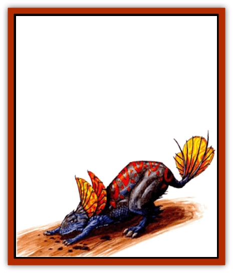

# Lirr

| Statistic | **Lirr** |
| --- | --- |
| **Activity Cycle:** | Day |
| **Alignment:** | Neutral |
| **Armor Class:** | 5 |
| **Climate/Terrain:** | Any (Tablelands) |
| **Damage/Attack:** | 1d4+1/1d4+1/1d10 |
| **Diet:** | Carnivore |
| **Frequency:** | Uncommon |
| **Hit Dice:** | 5+2 |
| **Intelligence:** | Animal (1) |
| **Magic Resistance:** | Nil |
| **Morale:** | Very steady (13-14) |
| **Movement:** | 15 |
| **No. Appearing:** | 2-12 (2d6) |
| **No. of Attacks:** | 3 |
| **Organization:** | Pack |
| **Size:** | M (4' high, 6' long) |
| **Special Attacks:** | Roar, rear claws (1d6+1/1d6+1) |
| **Special Defenses:** | Nil |
| **THAC0:** | 15 |
| **Treasure:** | Nil |
| **XP Value:** | 420 |

The lirr is a large, warm-blooded reptile that resembles a large [[Cat_Great|lion]]. It possesses bright, multi-colored plumage that it uses for silent communication.

The lirr has a long, sleek, dark gray body. Its scales are small and fine, almost like those of a [[Snake|snake's]]. Around its neck and at the end of its tail sit rings of a weblike membrane. Colored brilliant red, yellow, and orange, these rings normally lie flat against the creature's scales. When prey is sighted, however, the membrane fills with air, puffing up to alert other lirr that quarry is nearby. The lirr's four muscular legs grant a powerful spring, giving it the ability to outrun most prey.

**Combat:** The lirr's first offensive move is not to slice its target with claws or teeth, but to render its victims immobile. Once aware of a potential meal, the lirr lets go with a forceful roar. The roar has a devastating effect for all creatures (with the capacity to hear) within a 40-foot by 10-foot path directly in front of the lirr. Creatures must successfully save vs. petrification to avoid being stunned for 1-4 rounds. Characters who stuff wax or similar material in their ears save at +4 and those within the area of affect of a *silence* spell suffer no ill effects from the roar. Lirrs can combine efforts to increase the chance of stunning prey, each additional lirr's bellow resulting in a -1 to the victim's chance to be stunned. A stunned creature can perform no action (including psionics) and attacks against it have a +4 bonus. This makes a large pack particularly dangerous.

Once the lirr is close enough to strike, it lashes out with its two front claws, inflicting 2-5 points of damage with each hit. If both claws connect in the same melee round, the lirr can effectively support itself on its target to bring its rear claws to bear. Each rear claw that hits causes 2-7 points of damage. Regardless of other strikes, the lirr can also bite, causing 1-10 (1d10) points of damage.

When needed, the lirr is capable of leaping great distances, over ridges and up to ledges. With a running start, a lirr has a vertical leap of 15 feet or horizontal leap of 30 feet. From a standing position, however, the lirr's horizontal lump distance is halved.

**Habitat/Society:** Lirr live and hunt in packs. Males hunt and females raise the young, but both genders protect the pack as a whole. When food and water are scarce, though, the lirr are intelligent enough to split up. Lirr that are not currently parenting offspring leave the region in search of better sources of sustenance.

Lirr packs are exceptionally quarrelsome. Particularly intelligent quarry might be able to escape one pack by leading pursuers into the lair of another.

**Ecology:** A female lirr produces 2-8 (2d4) eggs every two years, which hatch in approximately three months. Lirr spend about nine months developing into adults and can live as long as 45 years. Though only the birth mother is concerned for her eggs, any female will protect the pack's young once they have hatched.

**Mountain Lirr**

  Some smaller lirr packs seem to prefer the rockier terrain of the mountain ranges, finding a modicum of comfort in the cooler cave temperatures. There is little physiological difference between the lirr and its mountainous cousins. The only deviation is that the lirr's characteristically bright colors are absent from this variation's ringed membrane. The muted coloring and smaller hunting packs (2d4 members) make mountain lirrs considerably more difficult to spot, giving prey a -2 to surprise.

---
## Discovery & Documentation

**Source Publication:** Dark Sun Appendix II - Terrors Beyond Tyr (1991)
**Campaign Setting:** Dark Sun
**Author(s):** Jim Atkiss, Steve Brown, Timothy B. Brown, Andrew P. Morris, Bruce Nesmith, Wes Nicholson, Bill Slavicsek

### Other Creatures Found in This Source Book
   * [[Aarakocra_Athas|Aarakocra (Athas)]]
   * [[Animal_Domestic_Athas_II|Animal, Domestic (Athas) II]]
   * [[Aviarag|Aviarag]]
   * [[Baazrag|Baazrag]]
   * [[Baazrag_Boneclaw|Baazrag, Boneclaw]]
   * [[Bloodgrass|Bloodgrass]]
   * [[Cactus_Hunting|Cactus, Hunting]]
   * [[Cactus_Rock|Cactus, Rock]]
   * [[Cilops|Cilops]]
   * [[Crodlu|Crodlu]]
   * [[Dagorran|Dagorran]]
   * [[Dhaot|Dhaot]]
   * [[Drake_Lesser_Athas_General_Information|Drake, Lesser (Athas), General Information]]
   * [[Drake_Lesser_Athas_Magma|Drake, Lesser (Athas), Magma]]
   * [[Drake_Lesser_Athas_Rain|Drake, Lesser (Athas), Rain]]
   * [[Drake_Lesser_Athas_Silt|Drake, Lesser (Athas), Silt]]
   * [[Drake_Lesser_Athas_Sun|Drake, Lesser (Athas), Sun]]
   * [[Dray|Dray]]
   * [[Drik|Drik]]
   * [[Dune_Reaper|Dune Reaper]]
   * [[Dwarf_Athas|Dwarf (Athas)]]
   * [[Elemental_Beast_Athas_Air|Elemental Beast (Athas), Air]]
   * [[Elemental_Beast_Athas_Earth|Elemental Beast (Athas), Earth]]
   * [[Elemental_Beast_Athas_Fire|Elemental Beast (Athas), Fire]]
   * [[Elemental_Beast_Athas_Water|Elemental Beast (Athas), Water]]
   * [[Elf_Athas|Elf (Athas)]]
   * [[Fael|Fael]]
   * [[Feylaar|Feylaar]]
   * [[Fordorran|Fordorran]]
   * [[Giant_Half-giant|Giant, Half-giant]]
   * [[Giant_Shadow|Giant, Shadow]]
   * [[Golem_Athas_Magma|Golem (Athas), Magma]]
   * [[Golem_Athas_Salt|Golem (Athas), Salt]]
   * [[Golem_Athas_General_Information|Golem (Athas), General Information]]
   * [[Gorak|Gorak]]
   * [[Halfling_Athas|Halfling (Athas)]]
   * [[Human_Athas|Human (Athas)]]
   * [[Jhakar|Jhakar]]
   * [[Kaisharga|Kaisharga]]
   * [[Kes'trekel|Kes'trekel]]
   * [[Klar|Klar]]
   * [[Krag|Krag]]
   * [[Kragling|Kragling]]
   * [[Mastyrial|Mastyrial]]
   * [[Meorty|Meorty]]
   * [[Mul|Mul]]
   * [[Nikaal|Nikaal]]
   * [[Paraelemental_Beast_General_Information|Paraelemental Beast, General Information]]
   * [[Paraelemental_Beast_Magma|Paraelemental Beast, Magma]]
   * [[Paraelemental_Beast_Rain|Paraelemental Beast, Rain]]
   * [[Paraelemental_Beast_Silt|Paraelemental Beast, Silt]]
   * [[Paraelemental_Beast_Sun|Paraelemental Beast, Sun]]
   * [[Pakubrazi|Pakubrazi]]
   * [[Psionocus|Psionocus]]
   * [[Psurlon|Psurlon]]
   * [[Raaig|Raaig]]
   * [[Retriever_Obsidian|Retriever, Obsidian]]
   * [[Ruktoi|Ruktoi]]
   * [[Ruvoka_Athas|Ruvoka (Athas)]]
   * [[Sand_Howler|Sand Howler]]
   * [[Scorpion_Athas|Scorpion (Athas)]]
   * [[Seed_Brain|Seed, Brain]]
   * [[Silt_Horror_Black|Silt Horror, Black]]
   * [[Silt_Horror_Magma|Silt Horror, Magma]]
   * [[Silt_Horror_Red|Silt Horror, Red]]
   * [[Silt_Spawn|Silt Spawn]]
   * [[Slig|Slig]]
   * [[Spider_Athas|Spider (Athas)]]
   * [[Spinewyrm|Spinewyrm]]
   * [[Ssurran|Ssurran]]
   * [[Stalking_Horror|Stalking Horror]]
   * [[Tarek|Tarek]]
   * [[Tari|Tari]]
   * [[Thri-kreen|Thri-kreen]]
   * [[T'liz|T'liz]]
   * [[Tohr-kreen_II|Tohr-kreen II]]
   * [[Tohr-kreen_III|Tohr-kreen III]]
   * [[Trin|Trin]]
   * [[Tul'k|Tul'k]]
   * [[Undead_Athas_General_Information|Undead (Athas), General Information]]
   * [[Wraith_Athas|Wraith (Athas)]]
   * [[Xerichou|Xerichou]]
   * [[Zombie_Thinking|Zombie, Thinking]]
