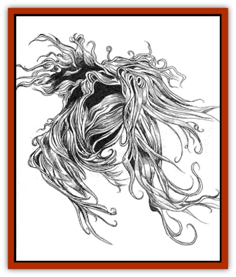

# Living Hair

| Statistic | **Living Hair** |
| --- | --- |
| **Activity Cycle:** | Darkness, night |
| **Alignment:** | Neutral evil |
| **Armor Class:** | 7 |
| **Climate/Terrain:** | Any |
| **Damage/Attack:** | 1-6/1-6 |
| **Diet:** | Hair, fur |
| **Frequency:** | Very rare |
| **Hit Dice:** | 5 |
| **Intelligence:** | Average (8-10) |
| **Magic Resistance:** | 50% |
| **Morale:** | Champion (15-16) |
| **Movement:** | 12 |
| **No. Appearing:** | 1 |
| **No. of Attacks:** | 2 |
| **Organization:** | Solitary |
| **Size:** | M (5-6' tall) |
| **Special Attacks:** | Strangulation |
| **Special Defenses:** | See below |
| **THAC0:** | 15 |
| **Treasure:** | Nil |
| **XP Value:** | 975 |

A person who is extremely vain concerning the appearance of his hair can create a living hair creature. Such a person must use strands of his own hair as material in the creation of a curtain or rug, and the rug must contain certain magic sigils as part of the design.

Sages suggest that the old folk tales about corpses growing hair after death, sometimes enough to fill the coffin, are actually accounts of living hair forming spontaneously. Once having grown in the womb of the grave, living hair can trickle out through the merest cracks and reach the surface world.

**Combat:** Living hair appears as a humanoid mass of matted hair. It can break up into individual fibers and pass through cracks and under doors, but it requires 2-8 rounds to reform its manlike shape, so it tries to hide in a dark corner or nook until ready to strike. It can Move Silently (90%), Hide in Shadows (80%), Detect Noises (50%), and Climb Walls (95%).

In battle, living hair strikes with its two shapeless fists. If discovered before it has fully formed, it can fight but causes only 1 point of damage per blow on the first round, 1-2 points on the second, 1-3 on the third, and 1-4 on the fourth before finally reaching its full strength of 1-6 points of damage per blow.

If living hair strikes with an attack roll of 18 or higher, it begins strangling the victim for an automatic 2-8 points of damage per round. This is not simply a matter of seizing the victim by the neck - wads of hair actually enter the nostrils and windpipe! The victim - or other characters - must make a successful Strength check on 1d20 to yank the monster loose, foregoing any other attacks that round.

Living hair regenerates 2 points of damage per round. Blunt weapons cause only half damage, but fire-based attacks inflict double damage to the creature. Even if killed, living hair grows back in 2-20 days unless every strand of hair is destroyed. Living hair is not considered undead and cannot be turned by priests or harmed with holy water.

**Habitat/Society:** These monsters are loners, mostly due to their rarity but also because they carry a residue of vanity from the humans or demihumans who gave them birth. This vanity has soured into a general hatred of all humanoid races, and they actively try to destroy characters with higher than average Charisma. They inhabit artificial structures like castles, manors, and dungeons - another memory of their "parents".

**Ecology:** Although not natural beings, living hair creatures have stepped into an almost untapped ecological niche: They can utilize cast-off hair and fur in their bodies, materials that most creatures find difficult to digest.

Bits of living hair are used by wizards in the creation of magical ropes, such as those of *climbing* and *constriction*, and *nets of entanglement*.

---
## Discovery & Documentation

**Source Publication:** Dungeon #76 (1999)
**Campaign Setting:** Dungeon Magazine
**Author(s):** Raymond E. Dyer, Toren Atkinson

### Other Creatures Found in This Source Book
   * [[Chraal|Chraal]]
   * [[Death_Linnen|Death Linnen]]
   * [[Sawfly_Demonic|Sawfly, Demonic]]
