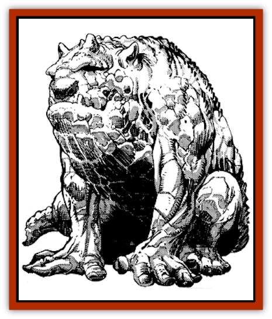

# Living Idol

| Statistic | **Animal** | **Death** | **Elemental** | **Healing** |
| --- | --- | --- | --- | --- |
| **Activity Cycle:** | Any | Any | Any | Any |
| **Alignment:** | Lawful neutral | Neutral Evil | Chaotic neutral | Neutral good |
| **Armor Class:** | 4 | 4 | Nil | 4 |
| **Climate/Terrain:** | Any | Any | Any | Any |
| **Damage/Attack:** | 4-32 | 4-32 | 4-32 | 4-32 |
| **Diet:** | Sacrifices | Sacrifices | Sacrifices | Sacrifices |
| **Frequency:** | Very rare | Very rare | Very rare | Very rare |
| **Hit Dice:** | 9 | 16 | 12 | 12 |
| **Intelligence:** | Semi (2-4) | Semi (2-4) | Semi (2-4) | Semi (2-4) |
| **Magic Resistance:** | Nil | Nil | Nil | Nil |
| **Morale:** | Fearless (20) | Fearless (20) | Fearless (20) | Fearless (20) |
| **Movement:** | 6 | 3 | 4 | 3 |
| **No. Appearing:** | 1 | 1 | 1 | 1 |
| **No. of Attacks:** | 1 | 1 | 1 | 1 |
| **Organization:** | Solitary | Solitary | Solitary | Solitary |
| **Size:** | L (10-12' tall) | L (10-12' tall) | L (10-12' tall) | L (10-12' tall) |
| **Special Attacks:** | Charm | Charm | Charm | Charm |
| **Special Defenses:** | Immune to most spells, +3 or better weapon to hit | Immune to most spells, +3 or better weapon to hit | Immune to most spells, +3 or better weapon to hit | Immune to most spells, +3 or better weapon to hit |
| **THAC0:** | 3 | 3 | 3 | 3 |
| **Treasure:** | Incidental | Incidental | Incidental | Incidental |
| **XP Value:** | 9,000 | 16,000 | 12,000 | 12,000 |

Living idols are moving stone statues, each with one particular power and defense. The remnants of ancient, forgotten empires and religions, they often inspire strange cults which are opposed by even the most pragmatic of modern faiths.

Living idols appear to be very large stone statues. They can be of any shape, either monster, animal, human, or demihuman. One feature common to all of them is their incredible age. All show signs of heavy weathering and erosion, their once smooth surface riddled with small cracks, pock marks, and holes. Some living idols are no longer completely intact, missing an arm, leg, or other appendage. A few are so ancient as to be little more than weathered standing stones.

The magic of these idols is so strong that it is not dispelled until the entire statue is reduced to small fragments. Until that time, the largest surviving chunk retains the enchantment.

Idols with two or more appendages still intact are capable of moving at a rate of 6; those with one appendage drag themselves along at a rate of 3. Depending upon the amount of decay, an idol will have from 9 Hit Dice (a featureless hunk of rock) to 18 Hit Dice (hardly affected by the ravages of time).

Living idols exist for one purpose and that is to be worshipped as a deity in their own right. They draw power from the number of sacrifices made in their honor and can perform a potentially beneficial side effect in return for a weekly sacrifice. The nature of the beneficial power and sacrifice varies, however; the idols with the most beneficial powers require the most costly sacrifices.

All living idols can communicate using empathy. They make it immediately clear to worshippers whether or not they find a particular sacrifice pleasing and appropriate.

**Combat:** While not entirely sentient, all living idols are imbued with a strong instinct for self-preservation and have several powerful mechanisms to help insure their survival.

Living idols are immune to any weapon of less than a +3 or better enchantment. Most spells have absolutely no effect on a living idol, with the following exceptions: *rock to mud* inflicts 6-36 points of damage (the idol is entitled a save for half damage); the reverse of the spell, *mud to rock*, restores 6-36 points of damage and may (50% chance) regenerate a lost limb, provided one is missing; *stone to flesh* makes the idol vulnerable to any normal attack or damage-inflicting spell for a single round; *disintegrate* inflicts 10-100 points of damage on the idol (no save).

All living idols must consume at least one sacrifice a week in order to be satisfied. So long as the weekly sacrifice is maintained, the powerful magic of these enchanted statues has a side effect on the surrounding area unique to each individual living statue. In addition to the weekly sacrifice, another is required in order for the idol to perform its major power (see the sample idols below for examples).

Living idols can also *charm* creatures that approach nearby, although the manner in which the enchantment is administered may vary (see the sample idols section below). If the idol is attended by a cult and has been nourished by frequent sacrifices, targets of the *charm* receive a -4 penalty on their saves (in addition to any penalties described below).

Finally, if physically threatened, living idols can physically attack if they possess at least one appendage. They can deliver a crushing blow each round with their stony fist or claw, inflicting 4-32 points of damage. Living idols fight as automatons, with little strategy beyond eliminating any opponents capable of harming them.

## Sample idols and their cults

Long-forgotten, ancient religions are thought to be responsible for the creation of living idols. Now these religions are reduced to small cults, existing only because of the idols. ability to charm passers-by.

In the most general of terms, cults are known to worship either animals, death, elemental forces, or healing. The DM should feel free to create personalized cults for his campaign.

**Animal Cults**

  These cults are centered around an animal-shaped living idol, usually a common pest or vermin, such as the [[Rat|rat]] or [[Scorpion|scorpion]]. The alignment of these idols is strictly lawful neutral, and they typically charm any creature who approaches within 100', compelling the being to join in its worship. These idols require a small and slightly valuable sacrifice of gold, gems, or jewelry (usually of no more than 25 gp value).

The side effect is an *aura of protection* against the type of animal depicted by the idol; for instance, a scorpion idol radiates a *protection from scorpions aura* in up to a one-mile radius. The major power also relates to the type of animal depicted by the idol; for instance, a rat idol will *cure disease*. Living animal idols cannot perform their major power more than once per day.

These are perhaps the most common of living idols, fostering small- to medium-sized cults of 20-200 worshipers. They are strictly a local phenomena, at most the hushed secret of a small, desert village. Since the idol.s charmed worshippers accurately believe that the idol is protecting them from a particular type of animal or vermin, they will protect the idol at every opportunity and violently oppose any who seek to destroy it. The major power of the idol is thought to be a sacred boon to the village or congregation, not to be shared with outsiders or nonbelievers.

**Death Cults**

  These cults are centered around a horrible and grotesque idol, usually in the form of a man-eating monster (a [[Ghul|great ghul]] or [[Silat|silat]]) or undead [[Skeleton|skeleton]]. The alignment of these idols is neutral evil. They only *charm* creatures that physically touch them, although the mind control exerted by these idols is extremely strong (save at -4). Charmed beings will serve the idol and seek out human and demihuman victims to add to the cult. At least once per week, an outsider will be sacrificed to the idol. A lowranking member of the cult may be sacrificed instead.

The side effect of joining the cult is that all members cease aging for as long as the idol is satisfied. The major power of these idols is to endow the cult "priest" with the ability to cast a powerful necromantic spell once per week (either *resurrection*, *regeneration*, or *restoration*, or their reverse). Typically, a death cult's "priest" will be the highest-ranking cult member and is not necessarily a cleric.

The death cults are universally hated and feared by civilized Zakharans. Organized religions and local rulers seek to stamp them out whenever they surface. As a result, these cults are now restricted to the wilderness of Zakhara, where the cults can operate with impunity, gathering victims through planned raids on caravans, isolated villages, and wandering tribes. Large, established death cults (200-500 + members) tend to attract sentient undead, especially [[Vampire_General_Information|vampires]]. These quickly rise to the "priest" position within the cult and use cult members to feed their own, and the idol's, appetites.

**Elemental Cults**

  These cults are centered around a living idol crafted in the shape of a faceless man. The alignment of these idols is chaotic neutral. Using their empathic ability to screen the emotions of all creatures who approach within 30', these idols will attempt to *charm* (save at -2) only those beings fostering an intent to harm or destroy them. The substance of the sacrifice (100 gp value) and the idol's protective side effect (which covers the area in a one-mile radius surrounding the statue) depends on the element represented by the idol.

#t Element|Sacrifice|Aura of protection from:#Earth|Gems|Earthquakes#Fire|Rare woods|Uncontrolled fires#Water|Aromatic oils|Tidal waves and flooding#Air|Exotic perfumes|Whirlwinds and sandstorms

The major power of these statues is to summon a 12 HD [[Elemental_General_Information|elemental]] of the appropriate type from the inner planes, one per week, to perform a specific task for the individual who made the sacrifice. (There is no chance of the summoned elemental turning on the summoner.) See also the [[Elemental_Athas_General_Information|Elemental, Athas]] entry.

These types of living idols do not generate *charmed* cults, but are catalysts for chaos in the society around them. Desert sheiks, for instance, have been known to fight over a particular elemental idol for generations. Elemental wizards are drawn to these idols like iron filings to a magnet, seeking to destroy them. (They are interested in keeping a monopoly on controlling the elements; these idols are a threat to that goal.)

**Healing Cults**

  These cults seek to promote healing and growth. The idols themselves are neutral good, representing a kind, gentle figure; statues of young girls and old men are the most common. Like the elemental idols, these will only attempt to *charm* (save at -2) those beings fostering harmful or destructive intentions. These idols thrive on a sacrifice of beauty, praise, and thanksgiving, feeding on the positive energy generated in worship.

As a side effect, these statues radiate *protection from evil* in a 100' radius. The maiden statues are known to *heal*, while the old men statues can *control weather*. (Usually this power is used to summon rain in times of drought.) A living idol of this type can perform its major ability once per day.

**Ecology:** Living idols have no function or role on Zakharan society and ecology outside the cults and social disruption they often inspire. Living idols are considered savage and unenlightened by most Zakharans. Even the kahin, who draw their power from the oldest of idol-worshipping faiths, usually consider worshipping a living idol anachronistic or outmoded. Almost all modern religions despise living idols for their mind-controlling ability, which is antithetical to most organized religions in Zakhara. Moralist and ethoist priests will seek to destroy the idols at every opportunity, though a pragmatic priest might see the benefits of the healing idols.

Although many priests like to foster the image that living idols are very rare, nomads tell a completely different story. The nomads sometimes discover them in abandoned ruins, recently uncovered by a sandstorm. Most believe many more living idols are still buried beneath the desert's shifting sands.

---
## Discovery & Documentation

**Source Publication:** MC13 Al-Qadim Appendix (1992)
**Campaign Setting:** Al-Qadim (Forgotten Realms)
**Author(s):** C. Terry Phillips

### Other Creatures Found in This Source Book
   * [[Ammut|Ammut]]
   * [[Ashira|Ashira]]
   * [[Asuras|Asuras]]
   * [[Black_Cloud_of_Vengeance|Black Cloud of Vengeance]]
   * [[Buraq|Buraq]]
   * [[Camel|Camel]]
   * [[Camel_of_the_Pearl|Camel of the Pearl]]
   * [[Centaur_Desert|Centaur, Desert]]
   * [[Copper_Automaton|Copper Automaton]]
   * [[Debbi|Debbi]]
   * [[Elephant_Bird|Elephant Bird]]
   * [[Gen|Gen]]
   * [[Genie_Noble_Dao|Genie, Noble Dao]]
   * [[Genie_Noble_Djinni|Genie, Noble Djinni]]
   * [[Genie_Noble_Efreeti|Genie, Noble Efreeti]]
   * [[Genie_Noble_Marid|Genie, Noble Marid]]
   * [[Genie_Tasked_Architect_Builder|Genie, Tasked, Architect/Builder]]
   * [[Genie_Tasked_Artist|Genie, Tasked, Artist]]
   * [[Genie_Tasked_Guardian|Genie, Tasked, Guardian]]
   * [[Genie_Tasked_Herdsman|Genie, Tasked, Herdsman]]
   * [[Genie_Tasked_Slayer|Genie, Tasked, Slayer]]
   * [[Genie_Tasked_Warmonger|Genie, Tasked, Warmonger]]
   * [[Genie_Tasked_Winemaker|Genie, Tasked, Winemaker]]
   * [[Ghost_Mount|Ghost Mount]]
   * [[Ghul|Ghul]]
   * [[Giant_Desert|Giant, Desert]]
   * [[Giant_Jungle|Giant, Jungle]]
   * [[Giant_Reef|Giant, Reef]]
   * [[Giant_Zakhara_General_Information|Giant (Zakhara), General Information]]
   * [[Hama|Hama]]
   * [[Heway|Heway]]
   * [[Lycanthrope_Werehyena|Lycanthrope, Werehyena]]
   * [[Lycanthrope_Werelion|Lycanthrope, Werelion]]
   * [[Markeen|Markeen]]
   * [[Maskhi|Maskhi]]
   * [[Mason_Wasp_Giant|Mason Wasp, Giant]]
   * [[Nasnas|Nasnas]]
   * [[Pahari|Pahari]]
   * [[Rom|Rom]]
   * [[Sabu_Lord|Sabu Lord]]
   * [[Sakina|Sakina]]
   * [[Serpent_Lord|Serpent Lord]]
   * [[Serpent_Winged|Serpent, Winged]]
   * [[Silat|Silat]]
   * [[Simurgh|Simurgh]]
   * [[Stone_Maiden|Stone Maiden]]
   * [[Vishap|Vishap]]
   * [[Zaratan|Zaratan]]
   * [[Zin|Zin]]
