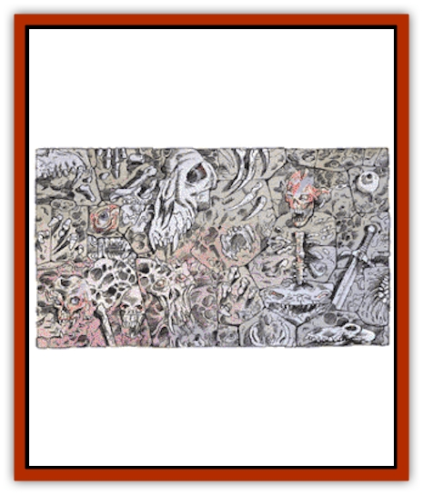

# Living Wall

| Statistic | **Living Wall** |
| --- | --- |
| **Activity Cycle:** | Any |
| **Alignment:** | Chaotic evil |
| **Armor Class:** | 8 (Base) |
| **Climate/Terrain:** | Any |
| **Damage/Attack:** | Variable |
| **Diet:** | Assimilation (see below) |
| **Frequency:** | Very Rare |
| **Hit Dice:** | 8 (Base) |
| **Intelligence:** | Variable (3-18) |
| **Magic Resistance:** | 20% |
| **Morale:** | Fearless (20) |
| **Movement:** | Nil |
| **No. Appearing:** | 1 |
| **No. of Attacks:** | Variable |
| **Organization:** | Solitary |
| **Size:** | L to G+ (Rectangular area) |
| **Special Attacks:** | See below |
| **Special Defenses:** | See below |
| **THAC0:** | Variable |
| **Treasure:** | Variable |
| **XP Value:** | 2,000 to 100,000+ |

Living walls appear to be normal walls of stone or brick, although they radiate both evil and magic if detected. Infravision will not detect any peculiar patterns. However, a character who casts a *true seeing* spell or who peers through a *gem of seeing* will see past the illusion: the wall actually consists of greying and sinewy flesh - of faces, hands, broken bones, feet, and toes jutting from the surface. Characters within 5 yards of the wall can hear low moans of horror, pain, and sorrow issuing from it. Even if a *silence* spell is cast, the moans still rise.

A living wall contains the melded bodies of humanoids and monsters who died within 100 yards of the wall since its creation. Those who die fighting a living wall are absorbed into it and actually strengthen it.

Characters and monsters captured by the wall retain all the abilities they had in life; as part of the wall, they become chaotic evil and fight any creature that approaches it to the best of their abilities. If a wizard becomes melded with a living wall, his spellcasting abilities are retained and can immediately be used for attacks. The wizard retains any spells that were memorized at the time he was absorbed into the wall; these are renewed each day. If a warrior loses his life in combat with a living wall, his fighting abilities and his weapons come under control of the beast: the weapons are hidden within the wall until the wall attacks, then are pushed through the mass of graying flesh to the surface. A hand attaches itself to the weapon, and eyes jutting from the wall guide the attack of the weapon. If the wall absorbs characters with ranged weapons, the weapons become useless once arrows, quarrels, or other necessary projectiles are expended.

**Combat:** A living wall never initiates combat, except against its creator, whom it despises. When such a wall is attacked, every creature that is part of the wall returns one attack, per strike against the wall. If a wall is made up of 12 creatures and one creature lands a blow on the wall, the attacker is subject to a dozen return blows from the wall.

All creatures in the wall fight according to their normal attack modes. These attacks can be magical, physical, or mental in origin. The type of attack and its damage often depend upon who or what is melded into the wall.

If a 10th-level fighter and a 6th-level fighter are absorbed into the wall, the wall attacks as one 6th-level fighter and one 10th-level fighter. For every mage or priest absorbed, the wall gains spell attacks. The only spells that can be used, however, are those that the mage or priest had memorized (and had material components for) at the time of absorption. Each of these spells may be cast once per day. The material components of the spells are not consumed. If one absorbed mage has three *fireball* spells memorized and a second mage has one *fireball* in memory, the living wall can attack with four *fireballs* per day. If the wall assimilates a paladin or a lawful good priest, all his special powers are reversed (e.g., *detect good* rather than *detect evil*, harm by laying of hands rather than heal, etc.)

Magical items absorbed with characters grant the wall their spell effects, though items that grant AC improvements are less effective because of the wall's size. The wall gains 1 point improvement in Armor Class for every 3 points of magical improvement to AC. Thus, a *ring of protection +3* lowers the wall's AC by 1.

When a character is absorbed, his hit points, at full health, are added to the wall's base hit point total of 64.

Nonmagical armor, packs, and purses are lost by absorbed characters. The piles of loot at the base of the wall often attracts bystanders, bringing them close enough to be seized by one of the wall's hands. Though a living wall will not initiate an attack, characters who come within 2 feet of the wall may be weakly grabbed by its many beseeching hands, tugging at them and imploring them for deliverance. (Any character, regardless of Strength, may break the hold.). Sometimes PCs who hear voices imploring, "help me! pull me free, help me!" grope about until they grab a hand. In this case, the character must roll a save vs. spell or become absorbed. If another character is holding onto the first character, he must also roll a saving throw vs. spell or become absorbed into the wall. If the save vs. spell succeeds, the character is able to break free. A character who views the absorption of any creature into the wall must make a horror check.

Once absorbed, characters are lost forever. A wish spell, worded carefully, can remove one or more trapped characters.

*Passwall* spells do not allow individuals to go through a living wall. Characters must either cut through or blast through using magic. This, however, allows the wall to return attacks. When cutting or blasting though the living wall, the stench that rises from the exposed underflesh is nauseating and horrifying. A saving throw vs. poison is required to avoid passing out from the smell. A successful saving throw indicates the character is only nauseated.

Living walls are immune to all planar and temporal spells. *Speak with dead*, *ESP* and similar spells reveal a cacophony of tortured minds and voices. The caster learns nothing and must make a horror check.

**Habitat/Society:** Living walls never reproduce and always remain active until they are killed. Living walls encountered in the lairs of malevolent creatures often serve as part of a torture chamber, or to cover the true openings to secret passageways or corridors.

No one knows whether these monstrosities are limited in size or longevity. Walls as large as 15 feet high, 30 feet long, and 10 feet thick have been reported. Living walls do, however, seem to be limited to one section of wall. Thus, a cemetery or castle could not be surrounded by one large living wall. Nor can a wall section spread beyond itself: a house with a living wall in its basement will not slowly become a living house.

The wall desires, above all else, to slay the creature who created it. If it does so, or the creature meets its end within 100 yards of the wall, the corpse of the hated creator is assimilated and the beings trapped in the wall are freed to return to the peace of death. The wall reverts to being a structure of stone, with the corpse of its creator entombed within.

**Ecology:** Chaotic evil mages occasionally create these monoliths. The exact method is unknown, but several years of preparation and spellcasting are required. A minimum of three corpses are necessary for the spells.

A fact known only to one or two inhabitants of Ravenloft, is that living walls also arise as rare manifestations of Ravenloft's power, as responses to despair and dread. These walls are born in curses, midwived by death, and nursed on massacre.

The seed for such a living wall is planted when one sapient creature willfully entombs another in a wall. The hapless victim may be bound and walled alive in a rock niche on a windswept mountain trail, a sill in a fetid catacomb, a corner in an asylum, a cave wall, a mausoleum facade, or any other stone or brick wall. Once entombed, the victim will suffocate, dehydrate, or starve in utter darkness and solitude. But even this agony is not sufficient to wake the land's attention - the entombed creature, in his terror, must curse his slayer, screaming loudly enough for his voice to carry beyond his tomb of stone. Only then does the land hear his agony.

When the victim dies, his life force is trapped within the wall. As he struggles to escape, his life energy becomes soiled by the soot of his screams and curses, which thickly coat the inside of his stone sarcophagus. In a matter of days, madness corrupts the trapped life force, changing it to chaotic evil.

At this point, the bodies of any creatures that have died within 100 yards of the wall within the last month rise, shamble to the wall, and meld into it. Even corpses that have been buried will dig their way to the surface and converge upon the wall. Although the wall retains its previous appearance, it is no longer stone, but a gray and rotting bulwark of limbs, ribs, hands, bones, and faces, twisted and fused together. Bodies of any subsequent deaths occurring within 100 yards also rise and wander to the wall for assimilation.

Most cultures, and all good-aligned characters, attempt to destroy these creations wherever they are found. But many of these assaults merely strengthen the wall with deposits of more corpses.

---
## Discovery & Documentation

**Source Publication:** Monstrous Manual (1995)
**Campaign Setting:** Advanced Dungeons & Dragons 2nd Edition
**Author(s):** Tim Beach

### Other Creatures Found in This Source Book
   * [[Aarakocra|Aarakocra]]
   * [[Aboleth|Aboleth]]
   * [[Ankheg|Ankheg]]
   * [[Arcane|Arcane]]
   * [[Argos|Argos]]
   * [[Aurumvorax|Aurumvorax]]
   * [[Baatezu_Lesser_Abishai|Baatezu, Lesser, Abishai]]
   * [[Baatezu_General_Information|Baatezu, General Information]]
   * [[Baatezu_Greater_Pit_Fiend|Baatezu, Greater, Pit Fiend]]
   * [[Banshee|Banshee]]
   * [[Basilisk|Basilisk]]
   * [[Bat|Bat]]
   * [[Bear|Bear]]
   * [[Beetle_Giant|Beetle, Giant]]
   * [[Behir|Behir]]
   * [[Beholder_and_Beholder-kin_I|Beholder and Beholder-kin I]]
   * [[Beholder_and_Beholder-kin_II|Beholder and Beholder-kin II]]
   * [[Bird|Bird]]
   * [[Brain_Mole|Brain Mole]]
   * [[Broken_One|Broken One]]
   * [[Brownie|Brownie]]
   * [[Bugbear|Bugbear]]
   * [[Bulette|Bulette]]
   * [[Bullywug|Bullywug]]
   * [[Carrion_Crawler|Carrion Crawler]]
   * [[Cat_Great|Cat, Great]]
   * [[Catoblepas|Catoblepas]]
   * [[Cat_Small|Cat, Small]]
   * [[Cave_Fisher|Cave Fisher]]
   * [[Centaur|Centaur]]
   * [[Centipede|Centipede]]
   * [[Chimera|Chimera]]
   * [[Cloaker|Cloaker]]
   * [[Cockatrice|Cockatrice]]
   * [[Couatl|Couatl]]
   * [[Crabman|Crabman]]
   * [[Crawling_Claw|Crawling Claw]]
   * [[Crocodile|Crocodile]]
   * [[Crustacean_Giant|Crustacean, Giant]]
   * [[Crypt_Thing|Crypt Thing]]
   * [[Death_Knight|Death Knight]]
   * [[Deepspawn|Deepspawn]]
   * [[Dinosaur_I|Dinosaur I]]
   * [[Displacer_Beast|Displacer Beast]]
   * [[Dog|Dog]]
   * [[Dog_Moon|Dog, Moon]]
   * [[Dolphin|Dolphin]]
   * [[Doppelganger|Doppelganger]]
   * [[Dracolich|Dracolich]]
   * [[Dragon_Brown|Dragon, Brown]]
   * [[Dragon_Chromatic_Black|Dragon, Chromatic, Black]]
   * [[Dragon_Chromatic_Blue|Dragon, Chromatic, Blue]]
   * [[Dragon_Chromatic_Green|Dragon, Chromatic, Green]]
   * [[Dragon_Cloud|Dragon, Cloud]]
   * [[Dragon_Chromatic_Red|Dragon, Chromatic, Red]]
   * [[Dragon_Chromatic_White|Dragon, Chromatic, White]]
   * [[Dragon_Deep|Dragon, Deep]]
   * [[Dragon_Gem_Amethyst|Dragon, Gem, Amethyst]]
   * [[Dragon_Gem_Crystal|Dragon, Gem, Crystal]]
   * [[Dragon_Gem_Emerald|Dragon, Gem, Emerald]]
   * [[Dragon_Gem_Sapphire|Dragon, Gem, Sapphire]]
   * [[Dragon_Gem_Topaz|Dragon, Gem, Topaz]]
   * [[Dragon_Metallic_Brass|Dragon, Metallic, Brass]]
   * [[Dragon_Metallic_Bronze|Dragon, Metallic, Bronze]]
   * [[Dragon_Metallic_Copper|Dragon, Metallic, Copper]]
   * [[Dragon_Mercury|Dragon, Mercury]]
   * [[Dragon_Metallic_Gold|Dragon, Metallic, Gold]]
   * [[Dragon_Mist|Dragon, Mist]]
   * [[Dragon_Metallic_Silver|Dragon, Metallic, Silver]]
   * [[Dragon_General_Information|Dragon, General Information]]
   * [[Dragon_Shadow|Dragon, Shadow]]
   * [[Dragon_Steel|Dragon, Steel]]
   * [[Dragon_Yellow|Dragon, Yellow]]
   * [[Dragonne|Dragonne]]
   * [[Dragon_Turtle|Dragon Turtle]]
   * [[Dragonet_Faerie_Dragon|Dragonet, Faerie Dragon]]
   * [[Dragonet_Fire_Drake|Dragonet, Fire Drake]]
   * [[Dragonet_Pseudodragon|Dragonet, Pseudodragon]]
   * [[Dryad|Dryad]]
   * [[Dwarf_Derro|Dwarf, Derro]]
   * [[Dwarf|Dwarf]]
   * [[Elemental_Athas_General_Information|Elemental (Athas), General Information]]
   * [[Elemental_Air_Kin|Elemental, Air Kin]]
   * [[Elemental_Earth_Kin|Elemental, Earth Kin]]
   * [[Elemental_Fire_Kin|Elemental, Fire Kin]]
   * [[Elemental_Water_Kin|Elemental, Water Kin]]
   * [[Elemental_of_Chaos_Air_Earth|Elemental of Chaos, Air/Earth]]
   * [[Elemental_of_Chaos_Fire_Water|Elemental of Chaos, Fire/Water]]
   * [[Elemental_Composite|Elemental, Composite]]
   * [[Elemental_Air_Earth|Elemental, Air/Earth]]
   * [[Elemental_Fire_Water|Elemental, Fire/Water]]
   * [[Elemental_General_Information|Elemental, General Information]]
   * [[Elephant|Elephant]]
   * [[Elf|Elf]]
   * [[Elf_Aquatic|Elf, Aquatic]]
   * [[Elf_Drow|Elf, Drow]]
   * [[Ettercap|Ettercap]]
   * [[Eyewing|Eyewing]]
   * [[Feyr|Feyr]]
   * [[Fish|Fish]]
   * [[Frog|Frog]]
   * [[Fungus|Fungus]]
   * [[Galeb_Duhr|Galeb Duhr]]
   * [[Gargantua|Gargantua]]
   * [[Gargoyle_I|Gargoyle I]]
   * [[Genie|Genie]]
   * [[Ghost|Ghost]]
   * [[Ghoul|Ghoul]]
   * [[Giant_Cloud|Giant, Cloud]]
   * [[Giant_Cyclops|Giant, Cyclops]]
   * [[Giant_Desert|Giant, Desert]]
   * [[Giant_Ettin|Giant, Ettin]]
   * [[Giant_Firbolg|Giant, Firbolg]]
   * [[Giant_Fire|Giant, Fire]]
   * [[Giant_Fog|Giant, Fog]]
   * [[Giant_Fomorian|Giant, Fomorian]]
   * [[Giant_Frost|Giant, Frost]]
   * [[Giant_Hill|Giant, Hill]]
   * [[Giant_Jungle|Giant, Jungle]]
   * [[Giant_Mountain|Giant, Mountain]]
   * [[Giant_Reef|Giant, Reef]]
   * [[Giant_Stone|Giant, Stone]]
   * [[Giant_Storm|Giant, Storm]]
   * [[Giant_Verbeeg|Giant, Verbeeg]]
   * [[Giant_Wood|Giant, Wood]]
   * [[Gibberling|Gibberling]]
   * [[Giff|Giff]]
   * [[Gith|Gith]]
   * [[Gith_Pirate_of|Gith, Pirate of]]
   * [[Githyanki|Githyanki]]
   * [[Githzerai|Githzerai]]
   * [[Gloomwing|Gloomwing]]
   * [[Gnoll|Gnoll]]
   * [[Gnome|Gnome]]
   * [[Gnome_Spriggan|Gnome, Spriggan]]
   * [[Goblin|Goblin]]
   * [[Golem_General_Information|Golem, General Information]]
   * [[Golem_I_Greater_Golem|Golem I (Greater Golem)]]
   * [[Golem_II_Lesser_Golem|Golem II (Lesser Golem)]]
   * [[Golem_III|Golem III]]
   * [[Golem_IV|Golem IV]]
   * [[Golem_V|Golem V]]
   * [[Golem_VI_Stone_Variants|Golem VI (Stone Variants)]]
   * [[Gorgon|Gorgon]]
   * [[Grell_Colonial|Grell, Colonial]]
   * [[Gremlin_Jermlaine|Gremlin, Jermlaine]]
   * [[Gremlin|Gremlin]]
   * [[Griffon|Griffon]]
   * [[Grimlock|Grimlock]]
   * [[Grippli|Grippli]]
   * [[Hag|Hag]]
   * [[Halfling|Halfling]]
   * [[Harpy|Harpy]]
   * [[Hatori|Hatori]]
   * [[Haunt|Haunt]]
   * [[Hell_Hound|Hell Hound]]
   * [[Heucuva|Heucuva]]
   * [[Hippocampus|Hippocampus]]
   * [[Hippogriff|Hippogriff]]
   * [[Hobgoblin|Hobgoblin]]
   * [[Homunculus|Homunculus]]
   * [[Hook_Horror|Hook Horror]]
   * [[Horse|Horse]]
   * [[Human|Human]]
   * [[Hydra|Hydra]]
   * [[Imp|Imp]]
   * [[Insect_Giant|Insect, Giant]]
   * [[Insect_Swarm|Insect Swarm]]
   * [[Intellect_Devourer|Intellect Devourer]]
   * [[Invisible_Stalker|Invisible Stalker]]
   * [[Ixitxachitl|Ixitxachitl]]
   * [[Jackalwere|Jackalwere]]
   * [[Kenku|Kenku]]
   * [[Ki-rin|Ki-rin]]
   * [[Kirre|Kirre]]
   * [[Kobold|Kobold]]
   * [[Kuo-Toa|Kuo-Toa]]
   * [[Lamia|Lamia]]
   * [[Lammasu|Lammasu]]
   * [[Leech|Leech]]
   * [[Leprechaun|Leprechaun]]
   * [[Leucrotta|Leucrotta]]
   * [[Lich|Lich]]
   * [[Lizard|Lizard]]
   * [[Lizard_Man|Lizard Man]]
   * [[Locathah|Locathah]]
   * [[Lurker|Lurker]]
   * [[Lycanthrope_General_Information|Lycanthrope, General Information]]
   * [[Lycanthrope_Seawolf|Lycanthrope, Seawolf]]
   * [[Lycanthrope_Werebear|Lycanthrope, Werebear]]
   * [[Lycanthrope_Wereboar|Lycanthrope, Wereboar]]
   * [[Lycanthrope_Werebat|Lycanthrope, Werebat]]
   * [[Lycanthrope_Werefox|Lycanthrope, Werefox]]
   * [[Lycanthrope_Wererat|Lycanthrope, Wererat]]
   * [[Lycanthrope_Wereraven|Lycanthrope, Wereraven]]
   * [[Lycanthrope_Weretiger|Lycanthrope, Weretiger]]
   * [[Lycanthrope_Werewolf|Lycanthrope, Werewolf]]
   * [[Mammal|Mammal]]
   * [[Mammal_Giant|Mammal, Giant]]
   * [[Mammal_Herd_I|Mammal, Herd I]]
   * [[Mammal_Small|Mammal, Small]]
   * [[Manscorpion|Manscorpion]]
   * [[Manticore|Manticore]]
   * [[Medusa_Maedar|Medusa, Maedar]]
   * [[Medusa|Medusa]]
   * [[Mephit_General_Information|Mephit, General Information]]
   * [[Merman|Merman]]
   * [[Mimic|Mimic]]
   * [[Mind_Flayer|Mind Flayer]]
   * [[Minotaur|Minotaur]]
   * [[Mist_Crimson_Death|Mist, Crimson Death]]
   * [[Mist_Vampiric|Mist, Vampiric]]
   * [[Mold_I|Mold I]]
   * [[Moldman|Moldman]]
   * [[Mongrelman|Mongrelman]]
   * [[Morkoth|Morkoth]]
   * [[Muckdweller|Muckdweller]]
   * [[Mudman|Mudman]]
   * [[Mummy_Greater|Mummy, Greater]]
   * [[Mummy|Mummy]]
   * [[Myconid|Myconid]]
   * [[Naga|Naga]]
   * [[Naga_Dark|Naga, Dark]]
   * [[Neogi|Neogi]]
   * [[Nightmare|Nightmare]]
   * [[Nymph|Nymph]]
   * [[Octopus_Giant|Octopus, Giant]]
   * [[Ogre|Ogre]]
   * [[Ogre_Half-|Ogre, Half-]]
   * [[Ooze_Slime_Jelly_I|Ooze/Slime/Jelly I]]
   * [[Ooze_Slime_Jelly_II|Ooze/Slime/Jelly II]]
   * [[Ooze_Slime_Jelly_Slithering_Tracker|Ooze/Slime/Jelly, Slithering Tracker]]
   * [[Orc|Orc]]
   * [[Otyugh|Otyugh]]
   * [[Owlbear_I|Owlbear I]]
   * [[Pegasus|Pegasus]]
   * [[Peryton|Peryton]]
   * [[Phantom|Phantom]]
   * [[Phoenix|Phoenix]]
   * [[Piercer|Piercer]]
   * [[Plant_Dangerous_I|Plant, Dangerous I]]
   * [[Plant_Intelligent|Plant, Intelligent]]
   * [[Poltergeist|Poltergeist]]
   * [[Pudding_Deadly|Pudding, Deadly]]
   * [[Quaggoth|Quaggoth]]
   * [[Rakshasa|Rakshasa]]
   * [[Rat|Rat]]
   * [[Rat_Osquip|Rat, Osquip]]
   * [[Remorhaz|Remorhaz]]
   * [[Revenant|Revenant]]
   * [[Roc|Roc]]
   * [[Roper|Roper]]
   * [[Rust_Monster|Rust Monster]]
   * [[Sahuagin|Sahuagin]]
   * [[Satyr|Satyr]]
   * [[Scorpion|Scorpion]]
   * [[Sea_Lion|Sea Lion]]
   * [[Selkie|Selkie]]
   * [[Shadow|Shadow]]
   * [[Shedu|Shedu]]
   * [[Sirine|Sirine]]
   * [[Skeleton|Skeleton]]
   * [[Skeleton_Giant|Skeleton, Giant]]
   * [[Skeleton_Warrior|Skeleton, Warrior]]
   * [[Slaad|Slaad]]
   * [[Slug_Giant|Slug, Giant]]
   * [[Snake|Snake]]
   * [[Snake_Winged|Snake, Winged]]
   * [[Spectre|Spectre]]
   * [[Sphinx|Sphinx]]
   * [[Spider|Spider]]
   * [[Sprite|Sprite]]
   * [[Squid_Giant|Squid, Giant]]
   * [[Stirge|Stirge]]
   * [[Su-Monster|Su-Monster]]
   * [[Swanmay|Swanmay]]
   * [[Tabaxi|Tabaxi]]
   * [[Tako|Tako]]
   * [[Tanar'ri_True_Balor|Tanar'ri, True, Balor]]
   * [[Tanar'ri_True_Marilith|Tanar'ri, True, Marilith]]
   * [[Tarrasque|Tarrasque]]
   * [[Tasloi|Tasloi]]
   * [[Thought_Eater|Thought Eater]]
   * [[Thri-kreen|Thri-kreen]]
   * [[Titan|Titan]]
   * [[Toad_Giant|Toad, Giant]]
   * [[Treant|Treant]]
   * [[Triton|Triton]]
   * [[Troglodyte|Troglodyte]]
   * [[Troll|Troll]]
   * [[Umber_Hulk|Umber Hulk]]
   * [[Unicorn|Unicorn]]
   * [[Urchin|Urchin]]
   * [[Vampire|Vampire]]
   * [[Wemic|Wemic]]
   * [[Whale|Whale]]
   * [[Wight|Wight]]
   * [[Will_O'Wisp|Will O'Wisp]]
   * [[Wolf|Wolf]]
   * [[Wolfwere|Wolfwere]]
   * [[Worm|Worm]]
   * [[Wraith|Wraith]]
   * [[Wyvern|Wyvern]]
   * [[Xorn|Xorn]]
   * [[Yeti|Yeti]]
   * [[Yuan-ti_Histachii|Yuan-ti, Histachii]]
   * [[Yuan-ti|Yuan-ti]]
   * [[Yugoloth_Guardian|Yugoloth, Guardian]]
   * [[Zaratan|Zaratan]]
   * [[Zombie|Zombie]]
