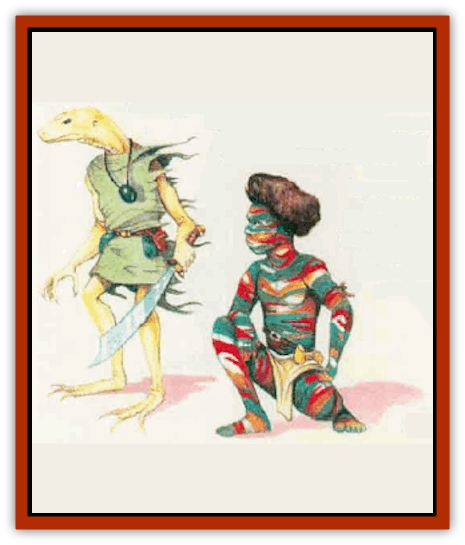

# Lizard-kin - Mystara

| Statistic | **Cayman** | **Chameleon Man** | **Gator Man** | **Sis'thik** |
| --- | --- | --- | --- | --- |
| **Activity Cycle:** | Any | Any | Night | Any |
| **Alignment:** | Neutral | Neutral | Chaotic evil | Neutral evil |
| **Armor Class:** | 7 | 10 | 1 | 5 (4 with armor) |
| **Climate/Terrain:** | Temperate or subtropical swamp or forests | Nonarctic woods, plains, or caverns | Tropical or subtropical swamp | Tropical or subtropical desert |
| **Damage/Attack:** | 1d3 (bite) or by weapon | By weapon | 2d4 (bite) / and by weapon +2 | By weapon +2 or 1d6 (claw)/1d6 (claw)/1d3 (bite) |
| **Diet:** | Omnivore | Omnivore | Carnivore | Omnivore |
| **Frequency:** | Uncommon | Rare | Rare | Rare |
| **Hit Dice:** | 2 | 2 | 7 | 3+3 |
| **Intelligence:** | Average (8-10) | Average (8-10) | Low (5-7) | Average (8-10) |
| **Magic Resistance:** | Nil | Nil | Nil | Nil |
| **Morale:** | Average (9) | Average (10) | Champion (15) | Elite (13) |
| **Movement:** | 9 | 12 | 12, Sw 18 | 9 |
| **No. Appearing:** | 10d6 | 2d4 | 1d6 | 3d6 |
| **No. of Attacks:** | 1 | 1 | 2 | 1 or 3 |
| **Organization:** | Village | Clan | Village | Tribe |
| **Size:** | S (1' tall) | M (7' tall) | L (8' tall) | M (6' tall) |
| **Special Attacks:** | Surprise | Dimension door | Nil | Nil |
| **Special Defenses:** | Stealth | Nil | Nil | Fire resistance |
| **THAC0:** | 19 | 19 | 13 | 17 |
| **Treasure:** | K | E (Q,S) | M | A |
| **XP Value:** | 65 / Shaman: 175 | 120 / Bodyguard: 175 / Leader: 420 | 420 / Leader: 650 | 175 / Bodyguard: 270 / Shaman: 650 / Queen: 975 |

The lizard-kin of Mystara share an ancient lineage. The chameleon men are the oldest of these races; some believe that caymen, gator men, sis'thik, and standard [[Lizard_Man|lizard men]] all descend from a common ancestor related to chameleon men. Relations between lizard men and the four lizard-kin races, however, range from indifferent at best to hostile at worst.

## Cayman

These reptilian humanoids stand about a foot tall, with bodies sheathed in rough brown or green skin. Their black, pupil-less eyes boast infravision with a 90-foot range.

Caymen are intelligent and sociable, dwelling together in vilages. Their native language sounds like simple hisses and chitters to other creatures. Fortunately, caymen also speak Common. In addition, some may know the languages of subterranean creatures living nearby.

**Combat:** Caymen usually avoid conflict, except in self-defense or when protecting their villages, territory, or food sources. When pressed, they use bone weapons, usually small javelins and large daggers. Each weapon inflicts 1d6 points of damage.

In general, caymen dislike frontal assaults. They prefer to surprise an opponent, make a few quick attacks, then flee.

All caymen can move silently and hide in shadows with a 40% chance of success. They use these skills to evade combat, or to surprise foes with whom they must fight; those attacked by a concealed cayman suffer a -2 penalty to surprise rolls.

**Habitat/Society:** Caymen build underground villages of tunnels and chambers 1 to 2 feet high. They protect these lairs with palisades of packed dirt and woven reeds. The walls have many entrances, aU of them the equivalent of concealed doors.

Each cayman village includes 10d6 adults, and half that many noncombatant offspring. Immature caymen reach adulthood in one year. Villages are led by a shaman, equivalent to a priest of 5th to 7th level. These shamans live longer than the average cayman (60 years, as opposed to the normal 40-year life span), so their hides grow tough and improve their Armor Class to AC 6. With a shaman in a cayman party, the creatures' morale increases by 1 point.

Not only do the better warriors use bone weapons and tools, they wear bone and feather headdresses. The more elaborate the headdress, the greater the warrior - though these caymen avoid wearing such adornments in battle, not wishing to alert the enemy to their superior abilities.

These lizard-kin get along well with [[Gnome|gnomes]] and tolerate lizard men. However, due to the caymen's small size, evil subterranean races often take them as slaves.

**Ecology:** Caymen enjoy eating giant-sized reptiles and amphibians but sometimes fall prey themselves to large predators. They make reliable guides in swamps.

## Chameleon Man

The reclusive chameleon men possess a bit of [[Dragon_General_Information|dragon]] ancestry. In their homes far from human and demihuman civilizations, they generally can avoid contact with strangers.

Chameleon men stand 7 feet tall, and their spindly arms and legs make them look quite thin. They move with a stride that other races find gangling and awkward. Chameleon men have multicolored, somewhat scaly skin with stripes of many colors: red, blue, green, yellow, brown, orange, black, and white (though few chameleon men have every possible hue). The colors seem to shift and swirl when the creatures walk (a trick of the light as it plays off their scales).

**Combat:** Chameleon men usually arm themselves with light weapons: daggers, spears, or dubs. They never wear armor, as it interferes with their natural abilities; they would rather blend in with the scenery than fight openly.

By far the most useful feature of the chameleon men remains their vanishing ability, which they use to avoid combat or to surround opponents. Each round, a chameleon man can vanish and reappear up to 120 feet away. This ability essentially mirrors the wizard spell dimension door, with a 120-foot range limitation. The creatures wield such precise control over this ability that they never reappear in midair or inside solid objects. Of course, a chameleon man cannot appear in the exact spot as someone or something else. These lizard-kin cannot attack in the round that they use this ability.

Chameleon man leaders - or Lords of Shade and Hue - have 4 Hit Dice and 1d20+10 constant bodyguards with 3 Hit Dice. Leaders can blend in with any natural background and have a 90% chance to remain undetected while unmoving. Lords and their bodyguards have a morale of Average (9).

**Habitat/Society:** All chameleon man settlements feature a magical site called a tookoo. The tookoo of a cave-dwelling clan might be a special grotto that glistens with arcane crystals. Forest dwellers might revere an ancient tree of strong magic. These sites always radiate magic and enable chameleon men to fight at a +2 bonus to attack and damage rolls. When fighting for their tookoos or homes, their morale rises to Fearless (20).

Once a year chameleon men shed their skin, much as a lizard does. They save the skin for a vital purpose: reproduction. As this race has no female gender, chameleon men reproduce by placing their old skins in their clan's tookoo. The offering has a 60% chance of magically transforming into a young chameleon man, which grows to maturity in just eight weeks.

**Ecology:** Chameleon men enjoy watching over old woods and caverns, maintaining the harmony of nature. They are sometimes hunted by lizard men, who fear their ability to vanish. These lizard-kin subsist on crops they cultivate and fish. Less scrupulous wizards prize a chameleon man's skin as a component for making robes of blending.

## Gator Man

Gator men - horrible, lizardlike homanoids - result from magical experiments on lizard men that went awry. The escapees have thrived, expanding their ranks into a new race.

These lizard-kin stand 7 to 8 feet tall, their bodies covered in dark green scales. They have alligator heads and mouths with prominent, sharp teeth. Slitlike black pupils split their red eyes.

Gator men speak Common and the language of lizard men. They refuse to negotiate with strangers, preferring instead to attack unwary parties of humans and demihumans.

**Combat:** Gator men possess formidable Strength (18), and their bite causes 2d4 hit points of damage. Many cany large, crude swords, which they wield with a +1 bonus to attack and +2 bonus to damage rolls.

A huge specimen, the village chief can cause 3d4 points of damage with its bite. A chief wields a sword with Strength 19, gaining a +3 bonus to attack and a +7 bonus to damage rolls.

**Habitat/Society:** During experiments in which evil mages tried to fuse lizard men and alligators, several specimens managed to escape and fled into the swamps. Once there, they reproduced rapidly, overcoming all predators and competitors.

Some tribes of gator men reportedly follow shamans with spellcasting abilities equivalent to those of 7th-level clerics.

**Ecology:** Gator men consider themselves the mortal enemies of lizard men, usually attacking them on sight in an effort to drive the lizard men away from gator man homeland.

Raiding parties of gator men often make sweeps of isolated settlements for fresh human meat to supplement their diet of lizards, alligators, and other animals native to swampland.

## Sis'thik (Desert Scourge)

In burning deserts live nomadic humanoids called Sis'thik, a proud race of reptilian warriors that fear nothing.

Sis'thik have thick, leathery light tan skin that lets them blend in with the arid terrain. Their nostrils can seal out dust, and transparent eye screens allow them to see in sandstorms.

**Combat:** Female sis'thik use scimitars in combat and sometimes employ shields (boosting their AC to 4). These females boast great strength, inklicting a +2 bonus to damage rolls using melee weapons. Males, if forced, attack with daws and bite.

Normal fires do not affect sis'thik; plus, these lizard-kin suffer only 1 point of damage per die of magical fire damage.

**Habitat/Society:** Sis'thik tribes have 3d6 x 10 adult members, plus 4d6 noncombatant children. Female sis'thik control the tribes and do all the fighting. The males seem slow and stupid, existing only for mating and drudge work. Females do not reproduce often, consideling how much other work they have to do. Most lay a clutch of 2d4 eggs every other year.

Each sis'thik tribe follows a queen with 8 Hit Dice, who receives a +3 bonus to damage rolls. The queen is accompanied at all times by 2d4 bodyguards, each with 4+1 Hit Dice. Each tribe also includes 1d4 shamans of 1st to 8th levels.Some sis'thik tribes breed xytar lizards as mounts; two sis'thik can ride a smgle xytar. In addition, these lizard-kin have been known to cooperate with [[Dragon_Chromatic_Blue|blue dragons]].

Each sis'thik tribe has its own territory. Any who wish to cross it must debase themselves before the queen and shower the tribe with gifts of wine, food, and metal items. Sis'thik sometimes build shelters of mud brick, usually near oases and other resting places. They do not appreciate others using these structures without permission.

**Ecology:** Sis'thik prey on creatures such as ant lions, camels, jackals, and wyvems. They savor the taste of copper dragon flesh, which has resulted in enmity between the two races. These lizardkin also enjoy eating figs, dates, and cacti.

---
## Discovery & Documentation

**Source Publication:** Mystara Appendix (1994)
**Campaign Setting:** Mystara
**Author(s):** John Nephew, Teeuwynn Woodruff, John Terra, Skip Williams

### Other Creatures Found in This Source Book
   * [[Actaeon|Actaeon]]
   * [[Agarat|Agarat]]
   * [[Ash_Crawler|Ash Crawler]]
   * [[Baldandar|Baldandar]]
   * [[Bargda|Bargda]]
   * [[Bhut|Bhut]]
   * [[Bird_Mystara|Bird (Mystara)]]
   * [[Blackball|Blackball]]
   * [[Choker|Choker]]
   * [[Coltpixie|Coltpixie]]
   * [[Crone_of_Chaos|Crone of Chaos]]
   * [[Darkhood|Darkhood]]
   * [[Darkwing|Darkwing]]
   * [[Decapus|Decapus]]
   * [[Deep_Glaurant|Deep Glaurant]]
   * [[Diabolus|Diabolus]]
   * [[Dimensional_Warper|Dimensional Warper]]
   * [[Dragon_Mystara_Crystalline|Dragon (Mystara), Crystalline]]
   * [[Dragon_Mystara_Jade|Dragon (Mystara), Jade]]
   * [[Dragon_Mystara_Onyx|Dragon (Mystara), Onyx]]
   * [[Dragon_Mystara_Ruby|Dragon (Mystara), Ruby]]
   * [[Drake_Mystara|Drake (Mystara)]]
   * [[Dragonfly|Dragonfly]]
   * [[Dusanu|Dusanu]]
   * [[Elemental_of_Chaos_Air_Earth|Elemental of Chaos, Air/Earth]]
   * [[Elemental_of_Chaos_Fire_Water|Elemental of Chaos, Fire/Water]]
   * [[Elemental_of_Law_Air_Earth|Elemental of Law, Air/Earth]]
   * [[Elemental_of_Law_Fire_Water|Elemental of Law, Fire/Water]]
   * [[Familiar_Mystara|Familiar (Mystara)]]
   * [[Frost_Salamander|Frost Salamander]]
   * [[Fundamental_Air_Earth|Fundamental, Air/Earth]]
   * [[Fundamental_Fire_Water|Fundamental, Fire/Water]]
   * [[Gargantua_Mystara|Gargantua (Mystara)]]
   * [[Geonid|Geonid]]
   * [[Ghostly_Horde|Ghostly Horde]]
   * [[Giant_Athach|Giant, Athach]]
   * [[Giant_Hephaeston|Giant, Hephaeston]]
   * [[Golem_Drolem|Golem, Drolem]]
   * [[Golem_Mystara_I|Golem (Mystara) I]]
   * [[Golem_Mystara_II|Golem (Mystara) II]]
   * [[Golem_Mystara_III|Golem (Mystara) III]]
   * [[Gray_Philosopher|Gray Philosopher]]
   * [[Guardian_Warrior|Guardian Warrior]]
   * [[Gyerian|Gyerian]]
   * [[Herex|Herex]]
   * [[Hivebrood|Hivebrood]]
   * [[Horde|Horde]]
   * [[Hsiao|Hsiao]]
   * [[Huptzeen|Huptzeen]]
   * [[Hutaakan|Hutaakan]]
   * [[Imp_Mystara|Imp (Mystara)]]
   * [[Jellyfish_Giant_Mystara|Jellyfish, Giant (Mystara)]]
   * [[Kna|Kna]]
   * [[Kopru|Kopru]]
   * [[Lizard_Mystara|Lizard (Mystara)]]
   * [[Lupin|Lupin]]
   * [[Lycanthrope_Werejaguar_Mystara|Lycanthrope, Werejaguar (Mystara)]]
   * [[Lycanthrope_Wereswine|Lycanthrope, Wereswine]]
   * [[Magen|Magen]]
   * [[Manikin|Manikin]]
   * [[Mek|Mek]]
   * [[Mujina|Mujina]]
   * [[Nagpa|Nagpa]]
   * [[Neh-thalggu|Neh-thalggu]]
   * [[Nightshade_Mystara|Nightshade (Mystara)]]
   * [[Nuckalavee|Nuckalavee]]
   * [[Pegataur|Pegataur]]
   * [[Phanaton|Phanaton]]
   * [[Plant_Dangerous_Mystara|Plant, Dangerous (Mystara)]]
   * [[Plasm|Plasm]]
   * [[Rakasta|Rakasta]]
   * [[Rock_Man|Rock Man]]
   * [[Sabreclaw|Sabreclaw]]
   * [[Sacrol|Sacrol]]
   * [[Scamille|Scamille]]
   * [[Shapeshifter|Shapeshifter]]
   * [[Shargugh|Shargugh]]
   * [[Shark-kin|Shark-kin]]
   * [[Sollux|Sollux]]
   * [[Spectral_Death|Spectral Death]]
   * [[Spectral_Hound|Spectral Hound]]
   * [[Spider-kin|Spider-kin]]
   * [[Spirit_Mystara|Spirit (Mystara)]]
   * [[Statue_Living|Statue, Living]]
   * [[Surtaki|Surtaki]]
   * [[Tabi|Tabi]]
   * [[Thoul|Thoul]]
   * [[Thunderhead|Thunderhead]]
   * [[Tiger_Ebon|Tiger, Ebon]]
   * [[Topi|Topi]]
   * [[Tortle|Tortle]]
   * [[Vampire_Velya|Vampire, Velya]]
   * [[White_Fang|White Fang]]
   * [[Worm_Mystara|Worm (Mystara)]]
   * [[Wyrd|Wyrd]]
   * [[Yowler|Yowler]]
   * [[Zombie_Lightning|Zombie, Lightning]]
