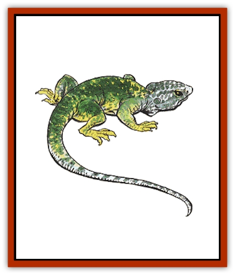

# Lizard

| Statistic | **Fire** | **Giant** | **Minotaur** | **Subterranean** |
| --- | --- | --- | --- | --- |
| **Activity Cycle:** | Day | Day | Day | Day |
| **Alignment:** | Neutral | Neutral | Neutral | Neutral |
| **Armor Class:** | 3 | 5 | 5 | 5 |
| **Climate/Terrain:** | Any warm land | Any warm land | Tropical hills and mountains | Any subterranean |
| **Damage/Attack:** | 1-8/1-8/2-16 | 1-8 | 2-12/2-12/3-18 | 2-12 |
| **Diet:** | Carnivore | Carnivore | Blood | Carnivore |
| **Frequency:** | Very rare | Uncommon | Rare | Uncommon |
| **Hit Dice:** | 10 | 3+1 | 8 | 6 |
| **Intelligence:** | Animal (1) | Non- (0) | Non- (0) | Non- (0) |
| **Magic Resistance:** | Nil | Nil | Nil | Nil |
| **Morale:** | Steady (11-12) | Average (8-10) | Average (8-10) | Average (8-10) |
| **Movement:** | 9 | 15 | 6 | 12 |
| **No. Appearing:** | 1-4 | 2-12 (2d6) | 1-8 | 1-6 |
| **No. of Attacks:** | 3 | 1 | 3 | 1 |
| **Organization:** | Solitary | Solitary | Solitary | Solitary |
| **Size:** | G (30') | H (15') | G (40') | H (20') |
| **Special Attacks:** | See below | See below | See below | See below |
| **Special Defenses:** | See below | Nil | Nil | Nil |
| **THAC0:** | 11 | 17 | 13 | 15 |
| **Treasure:** | B,Q(&times;10),S,T | Nil | J-N,Q,C (magic) | O,P,Q(&times;5) |
| **XP Value:** | 3,000 | 175 | 975 | 650 |

**Fire Lizards**

Fire lizards resemble wingless [[Dragon_Chromatic_Red|red dragons]] and are sometimes called "false dragons". They are gray-colored with mottled red and brown back and reddish undersides. Hatchlings are light gray in color, and darken as they age.

**Combat:** Fire lizards attack with a combination of raking claws and bite. They can simultaneously breathe a fiery cone 5 feet wide at the mouth, 10 feet wide at the end, and 15 feet long which inflicts 2-12 points of fire-based damage (half if saving throw vs. breath weapon is made). Fire lizards are immune to fire-based attacks.

**Habitat/Society:** Fire lizards prefer subterranean lairs but come out every fortnight to hunt fresh game. Prey is hauled back to the lair for a leisurely meal; the debris forms the treasure trove. Fire lizards are slow moving and sleep 50% of the time. Their lairs may have 1-4 eggs (10% chance, market value 5,000 gp each). Hatchlings immediately leave to hunt on their own. Shiny objects attract fire lizards; gems and metals form the bulk of treasure found in their dens.

**Ecology:** Fire lizards are perhaps an ancestral [[Dragon_General_Information|dragon]] type or offshoot of a common ancestor. Real dragons avoid these "false dragons", which live to be 50-100 years old. Fire lizard eggs are worth 5,000 gp, hatchlings 7,500 gp.

**Giant Lizards**

  This lizard is relatively normal, albeit large, and lives in marshes and swamps. An attack score of 20 means the giant lizard's victim is trapped in the mouth and suffers double damage (2-16 points). The giant lizard inflicts 2-16 points of damage each round thereafter. Giant lizards are lazy hunters and tend to attack anything edible that wanders by. While their great size protects them from most predators, it renders them a sumptuous feast to the [[Dragon_Chromatic_Black|black dragons]] who share their swamps. Giant lizards are sometimes domesticated by lizard men, who use them as mounts, beasts of burden, and food. Their lairs may be home to a wide range of lizards, from eggs to century-old adults.

**Minotaur Lizards**

  This huge, aggressive lizard derives its name from its horns. While these horns look like those of a minotaur, the male's horns are not used in combat - rather, they are believed to be a means of attracting a mate. The minotaur lizard attacks with sharp claws and teeth. They are adept at ambushes; others are -5 on their surprise roll. An attack roll of 20 means the lizard has trapped its victim within its jaws and can automatically inflict 3-18 points of damage each round thereafter until the victim escapes or dies. The victim is unable to attack the following round. Minotaur lizards are found in tropical hills and mountains near [[Dragon_Metallic_Copper|copper]] and red dragons.

**Subterranean Lizards**

  [[Lizard_Subterranean_Toril|This aggressive lizard]] is able to run across walls or ceilings with the help of its suction cup-tipped feet. An attack roll of 20 means the lizard has clamped its jaws on its victim and does double damage (4-24 points). The victim automatically suffers an additional 2-12 points of damage each round thereafter. These lizards never leave their caves voluntarily. Some species are albino; these shun light and attack at -1 in daylight or its equivalent. Other species have tongues up to 20 feet long. Any man-sized or smaller prey seized by the tongue will be drawn into the mouth and bitten the next round unless a bend bars roll is made.

---
## Discovery & Documentation

**Source Publication:** MC1 Volume I (w/binder #1) (1991)
**Campaign Setting:** Advanced Dungeons & Dragons 2nd Edition
**Author(s):** Jay Batista, Scott Bennie, Grant Boucher, William W. Connors, Steve Gilbert, Heike Kubasch, James Lowder, David Edward Martin, Bruce Nesmith, Jean Rabe, Rick Swan, John J. Terra, Gary L. Thomas

### Other Creatures Found in This Source Book
   * [[Bat|Bat]]
   * [[Bear|Bear]]
   * [[Behir|Behir]]
   * [[Boar|Boar]]
   * [[Bookworm|Bookworm]]
   * [[Brownie|Brownie]]
   * [[Bugbear|Bugbear]]
   * [[Carrion_Crawler|Carrion Crawler]]
   * [[Cat_Great|Cat, Great]]
   * [[Catoblepas|Catoblepas]]
   * [[Dragon_General_Information|Dragon, General Information]]
   * [[Dragonfish|Dragonfish]]
   * [[Elemental_Air_Kin_Aerial_Servant|Elemental, Air Kin, Aerial Servant]]
   * [[Elemental_Earth_Kin_Sandling|Elemental, Earth Kin, Sandling]]
   * [[Elephant|Elephant]]
   * [[Gnoll|Gnoll]]
   * [[Hobgoblin|Hobgoblin]]
   * [[Homunculus|Homunculus]]
   * [[Hornet_Giant|Hornet, Giant]]
   * [[Horse|Horse]]
   * [[Hyena|Hyena]]
   * [[Jackal|Jackal]]
   * [[Jackalwere|Jackalwere]]
   * [[Korred|Korred]]
   * [[Lich|Lich]]
   * [[Lizard_Man|Lizard Man]]
   * [[Lycanthrope_General_Information|Lycanthrope, General Information]]
   * [[Lycanthrope_Seawolf|Lycanthrope, Seawolf]]
   * [[Lycanthrope_Werebear|Lycanthrope, Werebear]]
   * [[Lycanthrope_Weretiger|Lycanthrope, Weretiger]]
   * [[Lycanthrope_Werewolf|Lycanthrope, Werewolf]]
   * [[Manticore|Manticore]]
   * [[Medusa|Medusa]]
   * [[Mind_Flayer|Mind Flayer]]
   * [[Minotaur|Minotaur]]
   * [[Mudman|Mudman]]
   * [[Mummy|Mummy]]
   * [[Nixie|Nixie]]
   * [[Nymph|Nymph]]
   * [[Ogre|Ogre]]
   * [[Ooze_Slime_Jelly_I|Ooze/Slime/Jelly I]]
   * [[Ooze_Slime_Jelly_II|Ooze/Slime/Jelly II]]
   * [[Orc|Orc]]
   * [[Owl|Owl]]
   * [[Owlbear_I|Owlbear I]]
   * [[Pegasus|Pegasus]]
   * [[Piercer|Piercer]]
   * [[Pudding_Deadly|Pudding, Deadly]]
   * [[Rakshasa|Rakshasa]]
   * [[Rat|Rat]]
   * [[Ray|Ray]]
   * [[Remorhaz|Remorhaz]]
   * [[Satyr|Satyr]]
   * [[Scorpion|Scorpion]]
   * [[Selkie|Selkie]]
   * [[Shadow|Shadow]]
   * [[Skeleton|Skeleton]]
   * [[Skunk|Skunk]]
   * [[Snake|Snake]]
   * [[Spectre|Spectre]]
   * [[Spider|Spider]]
   * [[Sprite|Sprite]]
   * [[Toad_Giant|Toad, Giant]]
   * [[Treant|Treant]]
   * [[Troll|Troll]]
   * [[Umber_Hulk|Umber Hulk]]
   * [[Unicorn|Unicorn]]
   * [[Vampire|Vampire]]
   * [[Wight|Wight]]
   * [[Will_O'Wisp|Will O'Wisp]]
   * [[Wolf|Wolf]]
   * [[Wolfwere|Wolfwere]]
   * [[Wraith|Wraith]]
   * [[Wyvern|Wyvern]]
   * [[Yeti|Yeti]]
   * [[Yuan-ti|Yuan-ti]]
   * [[Zombie|Zombie]]
