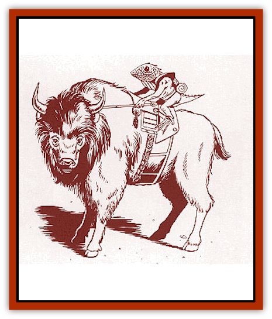
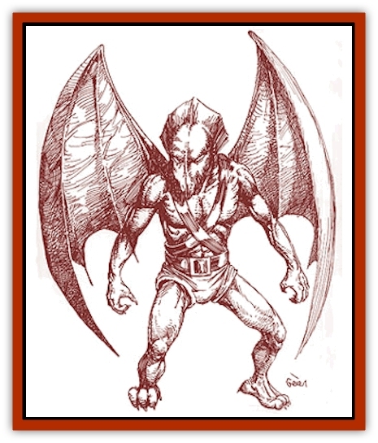

# Lizard Kin - Savage Coast

| Statistic | **Cayma** | **Gurrash** | **Krolli** | **Shazak** |
| --- | --- | --- | --- | --- |
| **Activity Cycle:** | Any | Any | Any | Any |
| **Alignment:** | Neutral | Chaotic evil | Any | Neutral |
| **Armor Class:** | 7 | 5 | 3 (2) | 5 |
| **Climate/Terrain:** | Temperate to subtropical / swamps and forests | Bayou | Hill or mountain | Temperate to subtropical / swamps and forests |
| **Damage/Attack:** | 1d3 (or by weapon) | 1d4/1d4/2d4 (or by weapon) | 1d8+1/1d8+1/1d6+1 (or by weapon) | 1d2/1d2/1d6 (or by weapon) |
| **Diet:** | Omnivore | Carnivore | Omnivore | Omnivore |
| **Frequency:** | Uncommon | Rare | Rare | Rare |
| **Hit Dice:** | 2 | 3 | 3 | 3 |
| **Intelligence:** | Average (8-10) | Low (5-7) | Average to Very (8-12) | Average (8-10) |
| **Magic Resistance:** | Nil | Nil | Nil | Nil |
| **Morale:** | Average (8-10) | Elite (13-14) | Elite (13-14) | Elite (13-14) |
| **Movement:** | 9 | 12, Sw 18 | 10, Fl 18 (C) | 9 |
| **No. Appearing:** | 10d6 | 1d6 | 1d20 | 3d6 |
| **No. of Attacks:** | 1 | 3 | 3 (4) | 3 |
| **Organization:** | Village | Village | Community | Tribe |
| **Size:** | S (1' tall) | L (8' tall) | L (7-8' tall, 17-20' wingspan) | M (6' tall) |
| **Special Attacks:** | Surprise | Tail slap, drown | Airborne attack | Nil |
| **Special Defenses:** | Stealth | Nil | Acute senses | Nil |
| **THAC0:** | 19 | 17 | 17 | 17 |
| **Treasure:** | K | M | M (A) | K (A) |
| **XP Value:** | 65 / 5 HD Shaman: 420 / 6 HD Shaman: 650 / 7 HD Shaman: 975 | 420 / Leader: 650 | 270 | 65 / 6 HD Leader: 270 |

The lizard kin of the Orc's Head Peninsula were created by the Herathians about 1700 years ago, using captured [[Wallara|wallaras]] as raw material. The lizard kin were created to serve as soldiers and slaves, but none of the three races were suitable. The shazaks and caymas were set free, while the savage gurrash escaped from Herathian control. Now the great marsh known as the Bayou and the surrounding regions are home to three distinct races of lizard kin: the shazaks (much like the [[Lizard_Man|lizard men]]), the more barbaric gurrash (also called "[[Lizard-kin_Mystara|gator men]]"), and the diminutive caymas.

All lizard kin speak a variant of the shazak tongue, which has a written form that shazaks and a few gurrash mages understand. Fluency with one dialect gives a basic understanding of the other two. A few lizard kin also speak common, although this ability is very rare.

## 

Cayma

These reptilian humanoids stand about 1 foot tall, with green or brown skin and black eyes. They have infravision with a range of 90 feet.

Intelligent and sociable, caymas live together in villages, herding aurochs (large, shaggy bison) and trading auroch meat and cinnabryl with the shazaks. Aurochs are about 6 feet tall at the shoulder, so the caymas have some interesting herding techniques. A cayma herder usually rides an auroch, using sticks with metal hooks on the end to tug on the auroch's ears, thereby directing it. Caymas have also domesticated small lizards (2 to 3 feet in length), which they use to pull their war chariots and as beasts of burden.

**Combat:** Caymas generally avoid combat except in self-defense. They prefer to surprise opponents, make a few quick attacks, and then flee. They use large (for them) bone daggers (which inflict 1d2 points of damage), small javelins called boks (which inflict 1d6 points of damage), and special grenades manufactured by cayma Wokani. Refer to the *Savage Coast Campaign Book*  for more information on cayma weapons.

All caymas move silently and hide in shadows with a 40% chance of success. Those attacked by concealed caymas receive a -2 penalty to surprise rolls.

Caymas are incredibly tough for their size; this is a deliberate feature incorporated by their Herathian creators.

**Habitat/Society:** Caymas build haphazard villages of tunnels and chambers protected by rickety palisades of mud, sticks, and any other material they can obtain. The villages have many entrances, all of them the equivalent of concealed doors. The caymas are inordinately proud of these structures and refuse to see any flaws in the designs, no matter how blatant.

Each cayma village includes 10d6 adults, and half that many noncombatant offspring. Immature caymas reach adulthood in one year. Each village is led by a shaman, equivalent to a priest of 5th to 7th level. These shamans live longer than the average cayma (60 years, as opposed to the normal 40-year life span), so their hides grow tough, giving them an Armor Class of 6. With a shaman in a cayma party, the creatures' morale increases by 1 level.

Not only do the better warriors use bone weapons and tools, they wear ceremonial bone and feather headdresses - the more elaborate the headdress, the greater the warrior. However, these caymas avoid wearing such adornments in battle, not wishing to alert the enemy to their superior abilities.

Caymas tolerate shazaks and are afraid of gurrash. Caymas are not necessarily hostile but are very leery of the "big" races. Often, caymas have been taken as slaves by larger, evil races.

## Gurrash

The savage gurrash stand about 8 feet tall and weigh almost 300 pounds. They have deep green scales and heads like alligators, with prominent sharp teeth and slitted red eyes.

Gurrash consider themselves the mortal enemies of shazaks, usually attacking them on sight in an effort to drive the shazaks away from gurrash homeland.

**Habitat/Society:** Gurrash hunt and make war; they are survivors in an unforgiving environment. They refuse to negotiate with strangers, preferring instead to attack unwary parties of humans and demihumans. When their population depletes the available resources, the shamans call for raids to keep the gurrash from feeding on each other.

Gurrash worship the Immortal Goron, the embodiment of gurrash evil and destruction. As the reptilian queen of evil and water, she made the gurrash brutal and bloodthirsty, causing them to revolt against the Herathians. For the gurrash, Goron is the patron of victory.

**Ecology:** Not originally a naturally occurring species, gurrash are at the top of the food chain in their bayou homes.

Gurrash subsist on lizards, alligators, fish, and the occasional shazak. Still, raiding parties of gurrash have sometimes been known to make sweeps of isolated settlements for fresh human meat to supplement their diet.

## 

Krolli

Krolli are a strong race of warm-blooded, winged lizardmen native to the Arm of the Immortals. Krolli are usually 7 to 8 feet tall and are quite lightweight (150 to 180 pounds) for their size.

**Combat:** Krolli are short-distance, high-speed fliers. A flying krolli can carry up to 30 pounds unencumbered, or 45 pounds encumbered. An unencumbered krolli must attempt a saving throw vs. paralyzation for every 15 minutes of flight. If it fails, it must rest 1 hour for each previous 15 minutes of flight. An encumbered krolli must attempt a saving throw every 5 minutes.

A krolli's unfeathered wings are AC 7. Only those taller than the krolli can attack the wings while standing in front, but back attacks are always made against the wings. Krolli that have lost 50% or more of their hit points cannot fly.

Krolli have superhuman Dexterity, phenomenal Strength, and extremely acute senses. All krolli undergo rigorous training from youth. A krolli warrior can attack with a vicious claw/claw/bite attack when standing, or with a claw/claw/rear claw/bite (1d8+1/1d8+1/1d10/1d6+1) attack when airborne. They can also attack standing opponents while airborne. Few krolli (30%) attack with weapons, but many use shields.

Fully 95% of all krolli are fighters capable of attaining up to 7th level. The remaining 5% of the population are likely to be priests of their patron Immortal, Ka the Preserver.

**Habitat/Society:** Krolli prefer to have their communities far from humans and their ilk. They form solitary communities, or eyries. Each eyrie contains 3d20 krolli, with one 7th-level fighter for every ten krolli. An eyrie also contains young (1/2 HD), equal to about 10% of the number of adults.

While they do not relish the company of humans, they appreciate the wealth to be had in dealing with men, and they will sometimes venture forth to trade. Krolli will occasionally be encountered among men, either trading or employed as mercenaries. In short, wherever profit is to be had, there will be krolli.

**Ecology:** Female krolli lay 2d4 eggs per year. Of these, only about 25% actually hatch. Krolli eggs are very tough, and krolli society strictly forbids helping the young out of their shells, which they believe helps to keep the race strong. Outsiders are sometimes horrified by this harsh and pragmatic attitude. A krolli that reaches maturity can live as long as 125 years, although warriors seldom live that long.

## Shazak

The shazaks are peaceful primitives. They stand about 6 feet tall and have dark green or brown scaly skin and slitted gold eyes. Shazaks sometimes serve as mercenaries for Herathian nobles. They have developed a written language, art, and trade since establishing their own society. They are ruled by a monarch known as the Shaz.

**Combat:** Though not as ferocious as the gurrash, shazaks are strong, hardy, and far more dependable. They can choose from many different weapons, ranging from spears to swords. They have domesticated large bats (mobats) which serve as mounts for the important members of the tribe and for the beast-riders among them.

Habitat/Society: Shazaks are survivors. When they were turned out by the Herathians, they adapted to the bayou. Chased from that habitat by the gurrash, they adapted to their woodland home. They pursue peaceful callings like pottery and fishing, but they also serve Herathians in times of war. They must defend their homes often from both gurrash raids and rakastan invasions from Bellayne.

**Ecology:** Shazaks are to some extent the caretakers of their woodland homes. They cull old trees and trade the rare woods to Herath and keep the plant and animal populations within bounds. Shazaks have no widespread effect on the rest of the Savage Coast and the Orc's Head Peninsula.

---
## Discovery & Documentation

**Source Publication:** Monstrous Compendium Savage Coast Appendix (Online Exclusive) (1995)
**Campaign Setting:** Mystara
**Author(s):** Loren L Coleman, Ted James, Thomas Zuvich, Cindi M. Rice

### Other Creatures Found in This Source Book
   * [[Aranea_Savage_Coast|Aranea (Savage Coast)]]
   * [[Arashaeem|Arashaeem]]
   * [[Batracine|Batracine]]
   * [[Cat_Marine|Cat, Marine]]
   * [[Cinnavixen|Cinnavixen]]
   * [[Clockwork_Swordsman|Clockwork Swordsman]]
   * [[Critter_Temple|Critter, Temple]]
   * [[Cursed_One|Cursed One]]
   * [[Deathmare|Deathmare]]
   * [[Dragon_Savage_Coast_Crimson|Dragon (Savage Coast), Crimson]]
   * [[Dragon_Savage_Coast_Red_Hawk|Dragon (Savage Coast), Red Hawk]]
   * [[Echyan|Echyan]]
   * [[Ee'aar|Ee'aar]]
   * [[Enduk|Enduk]]
   * [[Fachan_Savage_Coast|Fachan (Savage Coast)]]
   * [[Feliquine|Feliquine]]
   * [[Fiend_Narvaezan|Fiend, Narvaezan]]
   * [[Frelôn|Frelôn]]
   * [[Ghriest|Ghriest]]
   * [[Glutton_Sea|Glutton, Sea]]
   * [[Goatman|Goatman]]
   * [[Golem_Naâruk|Golem, Naâruk]]
   * [[Golem_Savage_Coast|Golem (Savage Coast)]]
   * [[Grudgling|Grudgling]]
   * [[Heraldic_Servant_I|Heraldic Servant I]]
   * [[Heraldic_Servant_II|Heraldic Servant II]]
   * [[Heraldic_Servant_III|Heraldic Servant III]]
   * [[Heraldic_Servant_IV|Heraldic Servant IV]]
   * [[Heraldic_Servant_V|Heraldic Servant V]]
   * [[Heraldic_Servant_General_Information|Heraldic Servant, General Information]]
   * [[Hermit_Sea|Hermit, Sea]]
   * [[Jorri|Jorri]]
   * [[Juhrion|Juhrion]]
   * [[Kla'a-tah|Kla'a-tah]]
   * [[Leech_Legacy|Leech, Legacy]]
   * [[Lich_Inheritor|Lich, Inheritor]]
   * [[Lupasus|Lupasus]]
   * [[Lupin|Lupin]]
   * [[Lyra_Bird_Saragón|Lyra Bird, Saragón]]
   * [[Malfera|Malfera]]
   * [[Manscorpion_Nimmurian|Manscorpion, Nimmurian]]
   * [[Mythuínn_Folk|Mythuínn Folk]]
   * [[Neshezu|Neshezu]]
   * [[Nikt'oo|Nikt'oo]]
   * [[Nosferatu|Nosferatu]]
   * [[Omm-wa|Omm-wa]]
   * [[Omshirim|Omshirim]]
   * [[Parasite_Savage_Coast|Parasite (Savage Coast)]]
   * [[Phanaton|Phanaton]]
   * [[Plant_Savage_Coast|Plant (Savage Coast)]]
   * [[Pudding_Vermilion|Pudding, Vermilion]]
   * [[Rakasta|Rakasta]]
   * [[Ray_Forest|Ray, Forest]]
   * [[Shedu_Greater_Savage_Coast|Shedu, Greater (Savage Coast)]]
   * [[Shimmerfish|Shimmerfish]]
   * [[Skinwing|Skinwing]]
   * [[Spawn_of_Nimmur|Spawn of Nimmur]]
   * [[Spider-spy|Spider-spy]]
   * [[Spirit_Heroic|Spirit, Heroic]]
   * [[Spirit_Walleran|Spirit, Walleran]]
   * [[Succulus|Succulus]]
   * [[Swampmare|Swampmare]]
   * [[Symbiont_Shadow|Symbiont, Shadow]]
   * [[Tortle|Tortle]]
   * [[Troll_Legacy|Troll, Legacy]]
   * [[Trosip|Trosip]]
   * [[Tyminid|Tyminid]]
   * [[Utukku|Utukku]]
   * [[Voat|Voat]]
   * [[Voat_Herathian|Voat, Herathian]]
   * [[Vulturehound|Vulturehound]]
   * [[Wallara|Wallara]]
   * [[Wurmling|Wurmling]]
   * [[Wynzet|Wynzet]]
   * [[Yeshom|Yeshom]]
   * [[Zombie_Red|Zombie, Red]]
