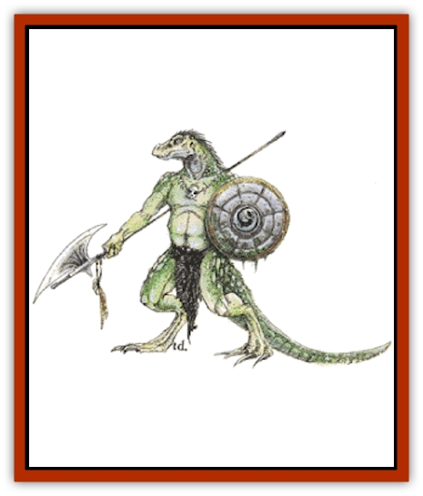

# Lizard Man

| Statistic | **Lizard King** | **Lizard Man** |
| --- | --- | --- |
| **Activity Cycle:** | Any | Any |
| **Alignment:** | Chaotic evil | Neutral |
| **Armor Class:** | 3 | 5 |
| **Climate/Terrain:** | Tropical, subtropical and temperate swamp | Tropical, subtropical and temperate swamp |
| **Damage/Attack:** | 5-20 (3d6+2) | 1-2/1-2/1-6 |
| **Diet:** | Special | Special |
| **Frequency:** | Very rare | Rare |
| **Hit Dice:** | 8 | 2+1 |
| **Intelligence:** | Average (8-10) | Low (5-7) |
| **Magic Resistance:** | Nil | Nil |
| **Morale:** | Champion (16) | Elite (14) |
| **Movement:** | 9, Sw 15 | 6, Sw 12 |
| **No. Appearing:** | 1 | 8-15 (1d8+7) |
| **No. of Attacks:** | 1 | 3 |
| **Organization:** | Tribal | Tribal |
| **Size:** | L (8' tall) | M (7' tall) |
| **Special Attacks:** | Skewer | Nil |
| **Special Defenses:** | Nil | Nil |
| **THAC0:** | 13 | 19 |
| **Treasure:** | E | D |
| **XP Value:** | 975 | 65 / Patrol leader: 65 / Subleader: 120 / War leader: 270 / Shaman, 3rd: 175 / Shaman, 5th: 650 / Shaman, 7th: 975 |

Lizard men are savage, semi-aquatic, reptilian humanoids that live through scavenging, raiding, and, in less hostile areas, by fishing and gathering.

Adult lizard men stand 6 to 7 feet tall, weighing 200 to 250 pounds. Skin tones range from dark green to gray to brown, and their scales give them a flecked appearance. Their tails average 3 to 4 feet long and are not prehensile. Males are nearly impossible to distinguish from females without close inspection.

Lizard man garb is limited to strings of bones and other barbaric ornament. Lizard men speak their own language.

**Combat:** In combat, lizard men fight as unorganized individuals. If they have equality or an advantage over their opponents, they tend toward frontal assaults and massed rushes. When outnumbered, overmatched, or on their home ground, however, they become wily and ferocious opponents. Snares, sudden ambushes, and spoiling raids are favored tactics in these situations. While individually savage in melee, lizard men tend to be distracted by food (such as slain opponents) and by simple treasures, which may allow some of their quarry to escape. They occasionally take prisoners as slaves, for food, or to sacrifice in obscure tribal rites.

For every 10 lizard men encountered, there will be one patrol leader with maximum hit points (17 hp) and a 50% chance for a shaman with 3 Hit Dice and the abilities of a 3rd-level priest. If one or more tribes are encountered, each tribe will also have a war leader of 6 Hit Dice, two subleaders with 4 Hit Dice, and a shaman of either 4 or 5 Hit Dice (50% chance of each). Any group of two or more tribes has a 50% chance for an additional shaman of 7 Hit Dice. Furthermore, each such group has a cumulative 10% chance per tribe to be led by a lizard king. If a lizard king is present, a shaman of 7 Hit Dice will always be present, and all patrol leaders from each tribe (i.e., 10% of the male warriors) will be combined into a single fanatical bodyguard for the lizard king.

**Habitat/Society:** Lizard men are typically found in swamps, marshes, and similar places, often (35%) dwelling totally underwater in air-filled caves. A tribe rarely numbers more than 150 individuals, including females and hatchlings. It is not uncommon for several tribes in an area to forge an informal alliance against outsiders, including other lizard man tribes.

Lizard men are omnivorous, but are likely to prefer human flesh to other foods. In this regard they have been known to ambush humans, gather up the corpses and capture the survivors, and take the lot back to their lair for a rude and horrid feast.

**Ecology:** Lizard men have few natural enemies. They prey on human, demihuman, or humanoid settlements if these are nearby. Lizard man eggs are bitter and inedible, as is their flesh, but their skin is sometimes worked as scale armor (Armor Class 6). Lizard men produce no art, artifacts, or trade goods.

**Advanced Lizard Men**

  About 1 tribe in 10 has evolved to a higher state. These lizard men dwell in crude huts, use shields (thus Armor Class 4) and hurl barbed darts (30 yard range, 1-4 points damage) or javelins (1-6 points damage) before closing with the enemy. These lizard men use clubs (treat as morning stars, 2-8 points damage), and the leaders may use captured swords or other weaponry. The chance of these advanced lizard men having a lizard king is doubled, i.e., 20% cumulative chance per tribe.

**Lizard King**

  A lizard king is a lizard man of above average height and intelligence, leading one or more loosely organized tribes of lizard men. The lizard king is most often armed with a great trident, which it wields with great skill and ferocity. In the hands of the lizard king, the weapon inflicts 5-20 (3d6+2) points of damage. If the attack roll is 5 or more greater than the score needed to hit, the lizard king inflicts double damage (with a minimum of 15 points).

A lizard king usually demands two humans each week. If no humans are available, demihumans and other humanoids will be sought. If none are available, two of the lizard king's bodyguards will be killed and eaten instead.

---
## Discovery & Documentation

**Source Publication:** MC1 Volume I (w/binder #1) (1991)
**Campaign Setting:** Advanced Dungeons & Dragons 2nd Edition
**Author(s):** Jay Batista, Scott Bennie, Grant Boucher, William W. Connors, Steve Gilbert, Heike Kubasch, James Lowder, David Edward Martin, Bruce Nesmith, Jean Rabe, Rick Swan, John J. Terra, Gary L. Thomas

### Other Creatures Found in This Source Book
   * [[Bat|Bat]]
   * [[Bear|Bear]]
   * [[Behir|Behir]]
   * [[Boar|Boar]]
   * [[Bookworm|Bookworm]]
   * [[Brownie|Brownie]]
   * [[Bugbear|Bugbear]]
   * [[Carrion_Crawler|Carrion Crawler]]
   * [[Cat_Great|Cat, Great]]
   * [[Catoblepas|Catoblepas]]
   * [[Dragon_General_Information|Dragon, General Information]]
   * [[Dragonfish|Dragonfish]]
   * [[Elemental_Air_Kin_Aerial_Servant|Elemental, Air Kin, Aerial Servant]]
   * [[Elemental_Earth_Kin_Sandling|Elemental, Earth Kin, Sandling]]
   * [[Elephant|Elephant]]
   * [[Gnoll|Gnoll]]
   * [[Hobgoblin|Hobgoblin]]
   * [[Homunculus|Homunculus]]
   * [[Hornet_Giant|Hornet, Giant]]
   * [[Horse|Horse]]
   * [[Hyena|Hyena]]
   * [[Jackal|Jackal]]
   * [[Jackalwere|Jackalwere]]
   * [[Korred|Korred]]
   * [[Lich|Lich]]
   * [[Lizard|Lizard]]
   * [[Lycanthrope_General_Information|Lycanthrope, General Information]]
   * [[Lycanthrope_Seawolf|Lycanthrope, Seawolf]]
   * [[Lycanthrope_Werebear|Lycanthrope, Werebear]]
   * [[Lycanthrope_Weretiger|Lycanthrope, Weretiger]]
   * [[Lycanthrope_Werewolf|Lycanthrope, Werewolf]]
   * [[Manticore|Manticore]]
   * [[Medusa|Medusa]]
   * [[Mind_Flayer|Mind Flayer]]
   * [[Minotaur|Minotaur]]
   * [[Mudman|Mudman]]
   * [[Mummy|Mummy]]
   * [[Nixie|Nixie]]
   * [[Nymph|Nymph]]
   * [[Ogre|Ogre]]
   * [[Ooze_Slime_Jelly_I|Ooze/Slime/Jelly I]]
   * [[Ooze_Slime_Jelly_II|Ooze/Slime/Jelly II]]
   * [[Orc|Orc]]
   * [[Owl|Owl]]
   * [[Owlbear_I|Owlbear I]]
   * [[Pegasus|Pegasus]]
   * [[Piercer|Piercer]]
   * [[Pudding_Deadly|Pudding, Deadly]]
   * [[Rakshasa|Rakshasa]]
   * [[Rat|Rat]]
   * [[Ray|Ray]]
   * [[Remorhaz|Remorhaz]]
   * [[Satyr|Satyr]]
   * [[Scorpion|Scorpion]]
   * [[Selkie|Selkie]]
   * [[Shadow|Shadow]]
   * [[Skeleton|Skeleton]]
   * [[Skunk|Skunk]]
   * [[Snake|Snake]]
   * [[Spectre|Spectre]]
   * [[Spider|Spider]]
   * [[Sprite|Sprite]]
   * [[Toad_Giant|Toad, Giant]]
   * [[Treant|Treant]]
   * [[Troll|Troll]]
   * [[Umber_Hulk|Umber Hulk]]
   * [[Unicorn|Unicorn]]
   * [[Vampire|Vampire]]
   * [[Wight|Wight]]
   * [[Will_O'Wisp|Will O'Wisp]]
   * [[Wolf|Wolf]]
   * [[Wolfwere|Wolfwere]]
   * [[Wraith|Wraith]]
   * [[Wyvern|Wyvern]]
   * [[Yeti|Yeti]]
   * [[Yuan-ti|Yuan-ti]]
   * [[Zombie|Zombie]]
