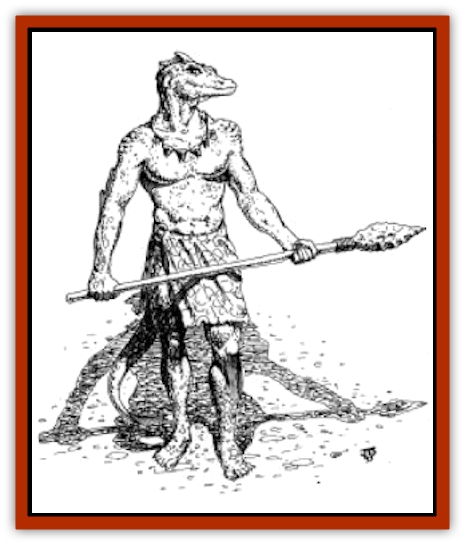
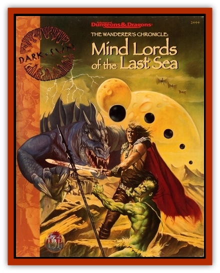

# Lizard Man - Athas

| Statistic | **Lizard King** | **Lizard Man** |
| --- | --- | --- |
| **Activity Cycle:** | Any | Any |
| **Alignment:** | Neutral | Neutral |
| **Armor Class:** | 3 | 4 |
| **Climate/Terrain:** | The Last Sea | The Last Sea |
| **Damage/Attack:** | 5-20 (3d6+2) | 2-7 |
| **Diet:** | Omnivore | Omnivore |
| **Frequency:** | Very Rare | Rare |
| **Hit Dice:** | 8 | 2+1 |
| **Intelligence:** | Very (12) | Average (8-10) |
| **Magic Resistance:** | Nil | Nil |
| **Morale:** | Elite (13) | Steady (11) |
| **Movement:** | 9, Sw 15 | 6, Sw 12 |
| **No. Appearing:** | Unique | 8-15 (1d8+7) |
| **No. of Attacks:** | 1 | 1 |
| **Organization:** | Tribal | Tribal |
| **Size:** | L (8' tall) | M (7' tall) |
| **Special Attacks:** | Nil | Nil |
| **Special Defenses:** | Nil | Nil |
| **THAC0:** | 13 | 19 |
| **Treasure:** | E | D |
| **XP Value:** | 975 | 65 / Patrol leader: 65 / Subleader: 120 / War leader: 270 / Psionicist, 3rd: 175 / Psionicist, 5th: 650 / Psionicist, 7th: 975 |

Athasian [[Lizard_Man|lizard men]] are amphibious humanoids who survive by herding kreel and by fishing. Adults stand six to seven feet tall, weighing 200 to 250 pounds. The skin of the creatures is chameleonlike, changing color to permit the lizard men to blend in with their surroundings. It is composed of thin scales meshed closely together which provides protection while remaining flexible.

The tail of a lizard man is three to four feet long, but not prehensile. It does help to keep the creature balanced when swimming, however. It is nearly impossible to distinguish between the sexes without a thorough inspection, something most lizard men (and women) are reluctant to let strangers attempt. Lizard man clothing usually consists of a simple [[Kreel|kreel]]skin loincloth.

Lizard men actually have a fair amount of control over their changing coloration. They can change their skin to match just about any color of the spectrum. Normally, they let their reflexes automatically cause them to blend into their environment, but during special ceremonies, they can actually will their skin to color itself in intricate patterns, each with a special symbolic meaning.

While these creatures have their own language, most of them (especially their king Nelyrox) have at least a rough command of the common tongue. This helps them negotiate in their infrequent encounters with those who dwell along the shores of the Last Sea.

**Combat:** In combat, Athasian lizard men are ferocious fighters. They temper their bloodlust with cunning, however, and they are not ashamed to fall back from a fight they are losing, at least until reinforcements arrive. They are more intelligent than traditional lizard men, able to follow fairly complicated battle plans and intricate schemes.

For every 10 lizard men encountered, one of them is a patrol leader with maximum hit points (17 hp). There is also a 50% chance that one of them is a 3rd-level psionicist. If more than one of the three Last Sea tribes is encountered, each tribe has a war leader with 6 Hit Dice, two subleaders with 4 Hit Dice and a 5th-level psionicist, with a 50% chance of an additional 7th-level psionicist by the name of Mobji. If Nelyrox is present (50% chance), Mobji is automatically there, and the patrol leaders form an elite body guard for their king.

**Habitat/Society:** The lizard men of Athas are a bit more civilized than the typical sort. Although they didn't start out this way, circumstances have forced them to adapt. After all, the traditional lizard man meal of human flesh was frowned upon by the Mind Lords, so in Marnita, if the creatures couldn't find another source of food, they were doomed to extinction. As their hunting grounds were severely limited the Barrier of Guardians, they took the only option open to them and domesticated the local kreel, becoming a society of kreelherders. As such, its rare to see more than a dozen or so lizard men together at a time outside the lizard man city deep in the center of Marnita.

Athasian lizard men are advanced enough to use shields and weapons. They tend to prefer tridents with wooden shafts and heads carved from three long bones. On more formal occasions, they wear full kreelskin togas, but these are rarely used on a daily basis, as they hamper underwater movement.

**Ecology:** Athasian lizard men have few natural enemies. [[Shark_Athas|Sharks]] and [[Dolphin_Athas|dolphins]] alike tend to give them a wide berth, but it is not unheard of for a lone lizard man to be attacked and killed by a roaming school of sharks. The only true threat to lizard men in general is the [[Squid_Squark|squark]], the behemoth with which they share the Last Sea. Once every so many years, on a more or less unpredictable basis, the squark attacks the lizard man city of Nesthaven. The walls of Nesthaven are strongly fortified against the creature, but they can only hold so long against its monstrous onslaught. Dozens of lizard men are killed each time the monster attacks.

Other than that, though, the lizard men generally live fairly sedate lives. They farm the kelp beds and tend their flocks of kreel and have wonderful underwater festivals. These are sometimes so amazing that the lights under the waves can be seen even in distant Saragar.

The lizard men have a great deal of respect for the Mind Lords and their children (as the lizard men think of the shore dwellers). After all, the Mind Lords saved them from hated Keltis, the lizard-man executioner. Without their help, the people (as they call themselves) would sure have been scoured from even the floor of Marnita.

**The Lizard King**

  Nelyrox the lizard king is a wise and generous ruler, and he has the full support of the vast majority of his people. Those under the command of Xhenrid, one of Nelyrox's three war leaders, are more loyal to their leader than their king, but the royal reptilian has managed to keep his old rival and her people in line so far.

Nelyrox stands a full eight feet tall and weighs over 250 pounds. In battle, he arms himself with a great trident which inflicts 3d6+2 points of damage. If the attack roll is 5 or more greater than the score needed to hit the target, Nelyrox's attack scores double damage (with a minimum of 15 points inflicted).

As a leader of a civilized people, no Athasian lizard king has demanded a sacrifice of a sentient's flesh for centuries. In fact, the killing of sentients for any reason other than self-defense is held to be this society's most heinous crime. This is enforced by both the lizard man tribal government and by the lawkeepers from Saragar if need be.

---
## Discovery & Documentation

**Source Publication:** Mind Lords of the Last Sea (1996)
**Campaign Setting:** Dark Sun
**Author(s):** Matt Forbeck

### Other Creatures Found in This Source Book
   * [[Dolphin_Athas|Dolphin (Athas)]]
   * [[Giant_Crag|Giant, Crag]]
   * [[Kreel|Kreel]]
   * [[Puddingfish|Puddingfish]]
   * [[Shark_Athas|Shark (Athas)]]
   * [[Skyfish|Skyfish]]
   * [[Squid_Squark|Squid, Squark]]
