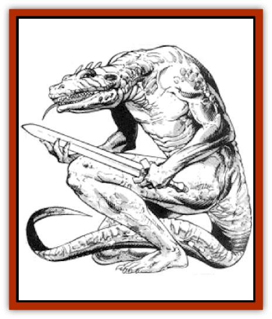

# Lizard Man - Krynn

| Statistic | **Bakali** | **Jarak-Sinn** |
| --- | --- | --- |
| **Activity Cycle:** | Any | Any |
| **Alignment:** | Neutral (evil) | Neutral (evil) |
| **Armor Class:** | 7 | 5 |
| **Climate/Terrain:** |  Tropical and subtropical/swamp | Tropical, subtropical, and temperate/swamp |
| **Damage/Attack:** | 1-2/1-2/1-6 or 1-4 or by weapon | 1-2/1-2/1-6 (claw/claw/bite) or 1-4 (tail) or by weapon |
| **Diet:** | Omnivore | Omnivore |
| **Frequency:** | Very rare | Rare |
| **Hit Dice:** | 2+1 | 2+1 |
| **Intelligence:** | Average (8-10) | Low (5-7) |
| **Magic Resistance:** | Nil | Nil |
| **Morale:** | Champion (15) | Elite (13) |
| **Movement:** | 9, Sw 9 | 6, Sw 12 |
| **No. Appearing:** | 1-10 | 10-40 |
| **No. of Attacks:** | 3 or 1 | 3 or 1 |
| **Organization:** | Tribe | Tribe |
| **Size:** | M (6-8' tall) | L (7' tall) |
| **Special Attacks:** | Squirt blood | Venom |
| **Special Defenses:** | See below | See below |
| **THAC0:** | 19 | 19 |
| **Treasure:** | J,K | D |
| **XP Value:** | 175 | 270 |

Jarak-sinn are a vile race of [[Lizard_Man|lizard men]] devoted to the worship of Chislev. All civilized races avoid associating with the vulgar, vicious, foul jarak.sinn. The bakali are the forefathers of the jarak-sinn; though not as numerous as the jarak-sinn, a few communities of bakali still remain in Ansalon, with more in Taladas.

## Jarak-Sinn

Jarak-sinn are stoop-shouldered, thick-bodied creatures covered from head to toe with thin, green scales. A bony ridge extends from their broad snouts, between their eyes, and runs down their spines. They have whip-like tails, which average four to five feet long. They have sharp, hooked teeth and long claws on their hands and feet. Their small eyes are either red or pink in color, and their eyelids are clear, giving them the appearance of always having their eyes open. Thick pink tongues nearly two feet long dangle limply from the sides of their mouths: unlike [[Snake|snakes]] and other reptiles, their tongues have no sensory functions.

Jarak-sinn wear few clothes. The king, knights, and priests wear thick leather collars, respectively studded with gems, copper bands, and chunks of bone to distinguish them from the rest of the tribe. Many jarak.sinn wear bone necklaces and bracelets. Others etch crude tattoos into their scales using red-hot dagger blades.

Their language consists of short bursts of hisses, growls, and rasps. About 15% of the jarak.sinn can understand common language, and about 5% can make themselves understood to other intelligent races, albeit on a rudimentary level.

**Combat:** Jarak-sinn love combat and eagerly embrace every opportunity to engage in bloodshed. Though jarak-sinn pride themselves on their combat skills, they are by no means sophisticated fighters. A typical assault amounts to little more than a forward charge followed by fierce melee. If jarak.sinn face clearly superior opponents, they may refrain from charging, lurking in the shadows or other cover until they can ambush their victims from behind.

In addition to their claw and bite attacks, jarak-sinn use a variety of weapons, short swords and long swords being their favorites. They also use daggers javelins, and clubs studded with sharp pieces of bone (to cause 2d4 points of damage). They never wear armor, but occasionally employ small shields to raise their AC to 4.

The jarak-sinn's spittle is a thick, acidic venom that inflicts burns on all creatures other than lizard men. They sometimes coat their weapons with this venomous spittle, victims struck with a spittle-coated weapon must roll successful saving throws vs. poison or suffer an additional 1d4 points of damage. Since they lack the necessary jaw muscles, jarak-sinn are unable to spew their spittle at opponents.

A jarak-sinn can strike opponents from behind, using its tail like a whip to inflict 1d4 points of damage. A jarak-sinn can detach this appendage at will; if an opponent grabs his tail, the opponent may find himself struggling with a writhing tail while the jarak-sinn flees to safety A new tail can be grown in 1d4+8 weeks.

About 15% of jarak-sinn have two loose flaps of skin on either side of their necks that they can inflate to the size of three-foot-diameter balloons, these swellings are sometimes effective in discouraging predators. About 25% of jarak.sinn tan emit loud hisses to frighten opponents; although most intelligent opponents are not impressed with these sounds, unintelligent animals often associate the sounds with those made by poisonous snakes or small dragons, thus making them think twice before attacking.

Jarak.sinn occasionally ride [[Lizard|giant lizards]] into battle. The notoriously uncooperative lizards obey only the simplest of commands, but they are effective mounts when jarak-sinn are attacking opponents the lizards perceive as edible. The lizards relentlessly pursue such opponents, gobbling them up as soon as they run them down.

**Habitat/Society:** When the gods created the [[Dragon_General_Information|dragons]], the [[Elf|elves]], and other races at the dawn of time, Chislev decided to create his own race for the specific purpose of worshiping him. Thus were born the bakali, a race of loathsome lizard men that crawled from the Great Moors of northern Ansalon and proceeded to establish small colonies in swamps and tropical regions throughout the land. The other races of Krynn, however, did not take kindly to the bakali; though not particularly aggressive, bakali habitually kidnapped innocent citizens to sacrifice to Chislev. Bakali were no match for the more intelligent and better-armed races. They were eventually forced to withdraw to Ansalon.s most desolate swamps, from which they ventured only rarely.

Adding to the bakali's problems were their diminishing numbers. While the other races grew and flourished, the bakali population could barely sustain itself; war and disease both took their toll. Additionally, bakali females produced only a single egg every five years. Desperately, the bakali petitioned Chislev for help. Chislev responded by creating a new species of lizard men he called the jarak-sinn; for the next 50 years, all offspring of female bakali were members of this more prolific species.

When they matured, female jarak.sinn gave birth to their own offspring at the rate of 10-20 per year. The number of jarak-sinn soon matched, then exceeded, the number of bakali.

But as the population of jarak-sinn grew, so did conflicts with the bakali. The first jarak-sinn leader of note - an ambitious, scheming male named Krazak - organized a revolt against the bakali. All bakali the jarak-sinn could find were rounded up and systematically executed. Some bakali managed to escape, fleeing in crude boats to the open sea. Eventually these last remnants of the bakali race came upon the continent of Taladas. Once there they quickly established themselves in Blackwater Glade and began to grow in numbers in the relative safety of that dismal swamp. Rumors persist that there are still some bakali yet alive in Ansalon, as the rulers of the less-intelligent jarak-sinn recognize their usefulness as advisors.

Jarak-sinn settlements have few of the elements normally associated with a civilized society. There are no formal laws - all decisions are made by the king, whose judgments can be as arbitrary as they are cruel. Homes are little more than mud pits or filth-strewn caves, which the jarak-sinn share with snakes, [[Rat|rats]], and other vermin. Jarak.sinn lack the ambition to master any useable skills aside from those that are combat-related; consequently, a jarak-sinn settlement has no craftsmen, merchants, or artists.

A king seldom reigns more than a few years before he is assassinated; his assassin becomes the new king. The king always surrounds himself with 1d4+6 bodyguards, referred to as knights; knights are selected for their strength (they have a minimum of 15 hit points) and trustworthiness, although kings are usually assassinated by one of their own knights.

The community's shamans are in charge of conducting services in the name of Chislev. A shaman always has the spellcasting abilities of a 3rd.level shaman and has 1d4 acolytes with the spellcasting abilities of 1st.level shamans. There is usually one shaman for every 20 members of a tribe.

Tribal members who are not knights, shamans, or acolytes are all considered members of the community militia - all children capable of wielding a weapon (age 10 and up with a minimum of 5 hp) are considered mature enough to fight.

Jarak-sinn spend most of their time eating, sleeping, or cooling themselves in mud pits. When the dark moon of Nuitari is in High Sanction (full moon), which occurs for a seven-day period every month, the shamans lead the jarak-sinn in elaborate worship services to Chislev, involving chants, prayers, and numerous slave sacrifices.

**Ecology:** Though few know of the existence of the jarak-sinn, those who do despise and fear them. The shadowpeople, who occupy many of the underground caverns coveted by the jarak-sinn, especially hate them.

Jarak-sinn eat small mammals, algae and fungus, human flesh, and each other. They can unhinge their jaws to swallow large prey, such as sheep, though this process is time-consuming (up to four hours to swallow a sheep) and somewhat painful. Their sour flesh is inedible, as are their gelatinous eggs: hence, jarak-sinn are avoided by predators. Their hides can be re-worked by skilled armorers to make scale armor (AC 6).

## Bakali

Bakali range from slightly shorter than most jarak-sinn to slightly taller. Their hides vary from yellow-green to mottled brown in color. Otherwise they are similar in appearance to the jarak-sinn. Although the bakali are the more intelligent species, the jarak-sinn consider them inferior in every respect.

Bakali are distrustful and suspicious by nature. They tend to keep to themselves and seldom leave their territories. To others they seem savage and cruel; as a race, they have no compunctions against violence, though individuals may hold more tolerant views.

Though frequently hostile to humans, bakali have a strong sense of honor. They remember both the good and the ill done to them, and they treat others as others treat them. They place great store in friendships, both among their own kind and with those of other races.

Although they are warm-blooded, bakali are vulnerable to cold and suffer 1 extra point of damage per die of damage caused by a cold-based attack. Their tough hides serve as the equivalent of AC 7. They are able to move equally well in the water and on land. Bakali do not possess infravision. They do have special nictating membranes that can quickly shield their eyes from harm. Thus they gain a +1 bonus to all saving throws against effects that involve blinding or dazzling of the eyes.

---
## Discovery & Documentation

**Source Publication:** MC4 Dragonlance Appendix (w/binder #2) (1989)
**Campaign Setting:** Dragonlance
**Author(s):** Rick Swan

### Other Creatures Found in This Source Book
   * [[Anemone_Giant_Sea|Anemone, Giant Sea]]
   * [[Bear_Ice|Bear, Ice]]
   * [[Beast_Undead|Beast, Undead]]
   * [[Bird_Krynn|Bird (Krynn)]]
   * [[Disir|Disir]]
   * [[Draconian_Aurak|Draconian, Aurak]]
   * [[Draconian_Baaz|Draconian, Baaz]]
   * [[Draconian_Bozak|Draconian, Bozak]]
   * [[Draconian_Kapak|Draconian, Kapak]]
   * [[Draconian_General_Information|Draconian, General Information]]
   * [[Draconian_Sivak|Draconian, Sivak]]
   * [[Draconian_Proto-_Traag|Draconian, Proto-, Traag]]
   * [[Dragon_Amphi|Dragon, Amphi]]
   * [[Dragon_Astral|Dragon, Astral]]
   * [[Dragon_Kodragon|Dragon, Kodragon]]
   * [[Dragon_Krynn_Othlorx_General_Information|Dragon (Krynn), Othlorx, General Information]]
   * [[Dragon_Krynn_General_Information|Dragon (Krynn), General Information]]
   * [[Dragon_Sea|Dragon, Sea]]
   * [[Dreamshadow|Dreamshadow]]
   * [[Dreamwraith|Dreamwraith]]
   * [[Dwarf_Daergar|Dwarf, Daergar]]
   * [[Dwarf_Hill_Neidar|Dwarf, Hill, Neidar]]
   * [[Dwarf_Mountain_Hylar|Dwarf, Mountain, Hylar]]
   * [[Dwarf_Theiwar|Dwarf, Theiwar]]
   * [[Dwarf_Zakhar|Dwarf, Zakhar]]
   * [[Elf_Half-|Elf, Half-]]
   * [[Elf_High_Qualinesti|Elf, High, Qualinesti]]
   * [[Elf_High_Silvanesti|Elf, High, Silvanesti]]
   * [[Elf_Sea_Dargonesti|Elf, Sea, Dargonesti]]
   * [[Elf_Sea_Dimernesti|Elf, Sea, Dimernesti]]
   * [[Elf_Wild_Kagonesti|Elf, Wild, Kagonesti]]
   * [[Eyewing|Eyewing]]
   * [[Fetch|Fetch]]
   * [[Fire_Minion|Fire Minion]]
   * [[Fireshadow|Fireshadow]]
   * [[Gnome_Tinker|Gnome, Tinker]]
   * [[Gurik_Cha'ahl|Gurik Cha'ahl]]
   * [[Haunt_Knight|Haunt, Knight]]
   * [[Horax|Horax]]
   * [[Human_Krynn|Human (Krynn)]]
   * [[Imp_Blood_Sea|Imp, Blood Sea]]
   * [[Kalothagh|Kalothagh]]
   * [[Kani_Doll|Kani Doll]]
   * [[Kender|Kender]]
   * [[Kyrie|Kyrie]]
   * [[Minotaur_Krynn|Minotaur, Krynn]]
   * [[Ogre_High|Ogre, High]]
   * [[Ogre_Krynn|Ogre (Krynn)]]
   * [[Phaethon|Phaethon]]
   * [[Saqualaminoi|Saqualaminoi]]
   * [[Shadowperson|Shadowperson]]
   * [[Shimmerweed|Shimmerweed]]
   * [[Skrit|Skrit]]
   * [[Spectral_Minion|Spectral Minion]]
   * [[Spider_Krynn|Spider (Krynn)]]
   * [[Stag|Stag]]
   * [[Tayling|Tayling]]
   * [[Thanoi|Thanoi]]
   * [[Tylor|Tylor]]
   * [[Wichtlin|Wichtlin]]
   * [[Wyndlass|Wyndlass]]
   * [[Yaggol|Yaggol]]
