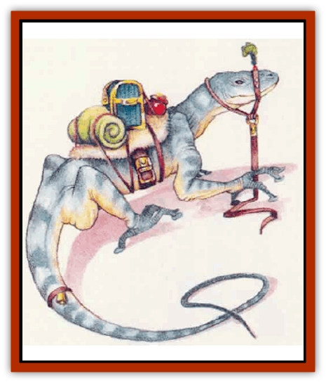
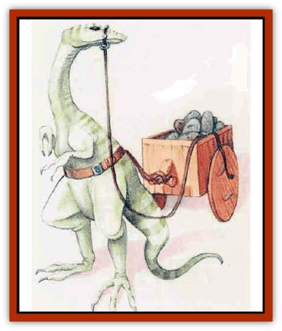

# Lizard - Mystara

| Statistic | **Draco** | **Footpad (giant)** | **Gecko (giant)** | **Horned Chameleon** | **Lava** | **Rockhome** | **Tuatara (giant)** | **Xytar** |
| --- | --- | --- | --- | --- | --- | --- | --- | --- |
| **Activity Cycle:** | Any | Any | Night | Day | Any | Any | Night | Day |
| **Alignment:** | Neutral | Neutral | Neutral | Neutral | Neutral | Neutral | Neutral | Neutral |
| **Armor Class:** | 5 | 6 | 5 | 2 | 3 | 5 | 4 | 3 |
| **Climate/Terrain:** | Temperate forests and hills | Temperate hills and subterranean | Temperate forests and urban | Temperate forests and hills | Volcanlc subterranean caverns | Nonarctic subterranean caverns | Dry temperate plains | Subtropical or tropxal desert |
| **Damage/Attack:** | 1d10 (bite) | 1d6 (bite) | 1d8 (bite) | 2d4 (bite)/1d6 (horn) | 1d6 (bite) | 1d6 (bite) | 1d6 (bite) | 1d10 (bite) |
| **Diet:** | Carnivore | Omnivore | Carnivore | Carnivore | Carnivore | Omnivore | Carnivore | Carnivore |
| **Frequency:** | Uncommon | Rare | Uncommon | Uncommon | Very rare | Common | Uncommon | Rare |
| **Hit Dice:** | 4+2 | 2+1 | 3+1 | 5 | 4 | 3 | 6 | 5+1 |
| **Intelligence:** | Semi- (2) | Semi- (2) | Semi- (2) | Semi- (2) | Semi- (2) | Semi- (2-4) | Semi- (2) | Semi- (4) |
| **Magic Resistance:** | Nil | Nil | Nil | Nil | Nil | Nil | Nil | Nil |
| **Morale:** | Average (9) | Average (9) | Average (9) | Average (10) | Champion (15) | Average (10) | Average (8) | Elite (13) |
| **Movement:** | 12, Glide 15 | 12, Cl 6 | 12, Cl 6 | 12 | 9 | 15 | 9 | 12 |
| **No. Appearing:** | 1d4 | 1d3 | 1d6 | 1d3 | 1 | 2d4 | 1d2 | 1d6 |
| **No. of Attacks:** | 1 | 1 | 1 | 2 | 1 | 1 | 1 | 1 |
| **Organization:** | Pack | Pack | Pack | Pack | Solitary | Pack | Pack | Pack |
| **Size:** | M (6' long) | L (8' long) | M (5' long) | L (7' long) | M (6' long) | L (9' tall) | L (8' long) | L (8' long) |
| **Special Attacks:** | Surprise | Nil | Surprise | Surprise, tail sweep | Heat | Nil | Nil | Breath weapon |
| **Special Defenses:** | Nil | Climb walls | Climb walls | Nil | Weapon melt, fire immunity | Nil | Nil | Nil |
| **THAC0:** | 17 | 19 | 17 | 15 | 17 | 17 | 15 | 15 |
| **Treasure:** | U | Nil | U | U | Nil | Nil | V | Nil |
| **XP Value:** | 420 | 120 | 270 | 420 | 420 | 65 | 270 | 650 |

Many types of [[Lizard|lizard]] and giant lizard live on Mystara, ranging from the harmless to the deadly. Some species can be trained for use as mounts by a character with the animal training non-weapon proficiency who has chosen to train lizards.

**Draco Lizard**

  With its scaly skin and fearsome face, the 6-foot-long draco lizard looks draconian - its appearance explains how this creature got its name. Its head is bright red; this coloration fades to vellow at the neck, then gradually becomes green toward the rear. While the draco lizard lacks wings, it does have wide flaps of skin between its legs, with which it can glide through the air like a flying squirrel.

The draco lizard is a carnivore, and it favors unintelligent prey. Nonetheless, a hungry draco may drop from a high perch to attack a human or demihuman morsel. (Such a victim suffers a -3 penalty to surprise.) Draco lizards can be trained for hunting and guarding but will not cany riders.

**

Giant Footpad Lizard**

  The giant footpad lizard is an 8-Foot-long, slender reptile with slate gray coloration and small ridges on its back. The lizard's body seems rather flat, compared to other specimens.

Long, spindly legs characterize this lizard, as do its long toes that end in round, sticky pads. These pads, combined with the creature's agility and low body weight, make the footpad lizard an excellent climber. The creatures can cope with all but the smoothest surfaces, at any angle up to vertical.

If captured and trained while young, footpad lizards can make excellent mounts or pack animals. Subterranean races such as gnomes prize these giant lizards for their surefootedness in precarious cavern environments.

While bearing a rider, a aiant footpad lizard cannot climb slopes steeper &an 60 degGes. The lizard can carry as much weight as a pony (maximum 320 pounds).

Some wizards and alchemists use giant footpad lizard hides to help create gauntelts of swimming and climbing.

**Giant Gecko**

  The 5-foot-long giant gecko is pale blue with orange-brown spots. The creatures find [[Insect_Giant|giant insects]] and [[Spider|spiders]] quite tasty; in fact, these lizards are common only in areas frequented by giant arthropods. Preferring to hunt their quarry at night, geckos have natural adhesive pads on their toes that help them climb trees or walls rapidly, then drop onto prey. Geckos employing this tactic penalize victims' surprise rolls by -2.

Giant geckos can learn to work as guard animals.

**Horned Chameleon**

  The horned charneleon, a 7-foot-long lizard with a tail another 10 feet long, changes color to blend in with its surroundings. Opponents suffer a -5 penalty to their surprise rolls.

A very aggressive lizard known to attack people with no provocation, the homed chameleon enjoys employing its sticky tongue, which can shoot out up to 5 feet. A successful hit means the chameleon has pulled the victim into its mouth and bitten, inflicting 2d4 hit points of damage.

The creature also attacks with its horn, causing 1d6 points of damage. Further, it can use its tail to knock down attackers within 10 feet. A tail strike requires a successful attack roll for each victim. While such "knock-downs" cause no damage, victims lose their next round of attacks.

**Lava Lizard**

  A strange reptile, the lava lizard lives in subterranean caverns amid pools of bubbling magma. The creature has a rocklike outer shell that helps maintain the high body temperature it needs to survive.

Most lava lizards have reddish brown bides. Brieht red lumps on their outer shells resemble hot coals, and their eyes glow pale yellow. A smoky odor hangs about them.

A lava lizard attacks by biting with its quick but relatively weak jaws. A bitten creature suffers 1d6 points of damage and must make a saving throw vs. breath weapon. Failing the save means that the lizard holds the victim fast in its jaws for that round, inflicting an additional 1d6 points of heat damage. Magical means of fire resistance, such as rings, potions, and spells, can reduce this extra damage. Lava lizards remain immune to normal and magical fires.

Whenever a lava lizard is struck by a nonmagical metal weapon, the attacker must make a saving throw for the item using the "magical fire" category of the item saving throw chart. A failed saving throw means the weapon melts due to the lizard�s intense heat. The melted weapon still causes damage on that round, but becomes useless afterward.

Although these creatures dwell in hot subterranean caverns, they can wander several miles away from the life-sustaining heat the lava pools produce. They cannot stay away for long, however. Stories tell of lava lizards found frozen like statues, presumably having suayed too far from their heat sources.

**

Rockhome**

  The rockhome lizard is a gentle creature commonly found in terranean colonies of dwarves or gnomes. Possibly an ancestor of the [[Lizard_Man|lizard man]], it stands on two legs and seem roughly as intelligent as a domesticated [[Dog|dog]].

All rockhomes can run very fast. They have long forelimbs for catching prey and strong jaws. Coloration varies from white to whitish hues of green and blue.

As they thrive in captivity, these repriles can learn to perform simple tasks. They catch [[Rat|rats]], carry riders, pull wagons or carts, and run in large wheels to power machines.

Unfortunately, rockhome lizards do not get along well with [[Horse|horses]]: The species seem to scare each other. In addition, they die if exposed to sunlight, suffering 1d6 points of damage per hour of exposure until dead.

**Giant Tuatara**

  An 8-foot-long lizard that looks like a cross between an iguana and a toad is the giant tuatara. Wbite spikes along its back protrude from olive-colored, pebbly bide. Tuataras have a temperature-sensitive membrane over their eyes which, when lowered, allows the lizards to "see" in darkness (90-foot infravision).

Tuataras love to hunt small animals at night and sleep during the day. They aggressively attack people who wander too close to their lairs.

Although these lizards can be trained to attack, the spines along their backs make them poor mounts.

**Xytar**

  Because of xytars' fiery breath, inexperienced travelers sometimes mistake these 8-foot-long lizardlike creatures for [[Dragon_General_Information|dragons]].

Xytar hides, though predominantly yellow, bear red and orange mottling along the back. Xvtars have six legs and long, toothy jaws. They dwell in hot desert areas and can go without water for weeks.

The carnivorous xytars hunt in packs, often targeting passing caravans and settlements on the fringes of deserts. Xytars attack either with their strong jaws or their breath weapon. They can breathe a cone of fire 30 feet long and 10 feet wide at the base, causing 10d4 bit points of damage; creatures in the area of effect take only half damage if they make a successful saving throw. A favorite xytar tactic involves first breathing fire to "soften up" the victims, then dosing in to snap and bite in melee. Alchemists seek out the throat sacs that create the lizards' fire, using them to concoct *potions of fiery breath*.

With much difficulty, xytars can be trained to attack (+4 penalty to proficiency checks). The creatures must be raised by their trainers and will not respond to aiyone else. Only [[Lizard-kin_Mystara|sis'thik lizard-kin]] are known to commonly raise Xytars.

---
## Discovery & Documentation

**Source Publication:** Mystara Appendix (1994)
**Campaign Setting:** Mystara
**Author(s):** John Nephew, Teeuwynn Woodruff, John Terra, Skip Williams

### Other Creatures Found in This Source Book
   * [[Actaeon|Actaeon]]
   * [[Agarat|Agarat]]
   * [[Ash_Crawler|Ash Crawler]]
   * [[Baldandar|Baldandar]]
   * [[Bargda|Bargda]]
   * [[Bhut|Bhut]]
   * [[Bird_Mystara|Bird (Mystara)]]
   * [[Blackball|Blackball]]
   * [[Choker|Choker]]
   * [[Coltpixie|Coltpixie]]
   * [[Crone_of_Chaos|Crone of Chaos]]
   * [[Darkhood|Darkhood]]
   * [[Darkwing|Darkwing]]
   * [[Decapus|Decapus]]
   * [[Deep_Glaurant|Deep Glaurant]]
   * [[Diabolus|Diabolus]]
   * [[Dimensional_Warper|Dimensional Warper]]
   * [[Dragon_Mystara_Crystalline|Dragon (Mystara), Crystalline]]
   * [[Dragon_Mystara_Jade|Dragon (Mystara), Jade]]
   * [[Dragon_Mystara_Onyx|Dragon (Mystara), Onyx]]
   * [[Dragon_Mystara_Ruby|Dragon (Mystara), Ruby]]
   * [[Drake_Mystara|Drake (Mystara)]]
   * [[Dragonfly|Dragonfly]]
   * [[Dusanu|Dusanu]]
   * [[Elemental_of_Chaos_Air_Earth|Elemental of Chaos, Air/Earth]]
   * [[Elemental_of_Chaos_Fire_Water|Elemental of Chaos, Fire/Water]]
   * [[Elemental_of_Law_Air_Earth|Elemental of Law, Air/Earth]]
   * [[Elemental_of_Law_Fire_Water|Elemental of Law, Fire/Water]]
   * [[Familiar_Mystara|Familiar (Mystara)]]
   * [[Frost_Salamander|Frost Salamander]]
   * [[Fundamental_Air_Earth|Fundamental, Air/Earth]]
   * [[Fundamental_Fire_Water|Fundamental, Fire/Water]]
   * [[Gargantua_Mystara|Gargantua (Mystara)]]
   * [[Geonid|Geonid]]
   * [[Ghostly_Horde|Ghostly Horde]]
   * [[Giant_Athach|Giant, Athach]]
   * [[Giant_Hephaeston|Giant, Hephaeston]]
   * [[Golem_Drolem|Golem, Drolem]]
   * [[Golem_Mystara_I|Golem (Mystara) I]]
   * [[Golem_Mystara_II|Golem (Mystara) II]]
   * [[Golem_Mystara_III|Golem (Mystara) III]]
   * [[Gray_Philosopher|Gray Philosopher]]
   * [[Guardian_Warrior|Guardian Warrior]]
   * [[Gyerian|Gyerian]]
   * [[Herex|Herex]]
   * [[Hivebrood|Hivebrood]]
   * [[Horde|Horde]]
   * [[Hsiao|Hsiao]]
   * [[Huptzeen|Huptzeen]]
   * [[Hutaakan|Hutaakan]]
   * [[Imp_Mystara|Imp (Mystara)]]
   * [[Jellyfish_Giant_Mystara|Jellyfish, Giant (Mystara)]]
   * [[Kna|Kna]]
   * [[Kopru|Kopru]]
   * [[Lizard-kin_Mystara|Lizard-kin (Mystara)]]
   * [[Lupin|Lupin]]
   * [[Lycanthrope_Werejaguar_Mystara|Lycanthrope, Werejaguar (Mystara)]]
   * [[Lycanthrope_Wereswine|Lycanthrope, Wereswine]]
   * [[Magen|Magen]]
   * [[Manikin|Manikin]]
   * [[Mek|Mek]]
   * [[Mujina|Mujina]]
   * [[Nagpa|Nagpa]]
   * [[Neh-thalggu|Neh-thalggu]]
   * [[Nightshade_Mystara|Nightshade (Mystara)]]
   * [[Nuckalavee|Nuckalavee]]
   * [[Pegataur|Pegataur]]
   * [[Phanaton|Phanaton]]
   * [[Plant_Dangerous_Mystara|Plant, Dangerous (Mystara)]]
   * [[Plasm|Plasm]]
   * [[Rakasta|Rakasta]]
   * [[Rock_Man|Rock Man]]
   * [[Sabreclaw|Sabreclaw]]
   * [[Sacrol|Sacrol]]
   * [[Scamille|Scamille]]
   * [[Shapeshifter|Shapeshifter]]
   * [[Shargugh|Shargugh]]
   * [[Shark-kin|Shark-kin]]
   * [[Sollux|Sollux]]
   * [[Spectral_Death|Spectral Death]]
   * [[Spectral_Hound|Spectral Hound]]
   * [[Spider-kin|Spider-kin]]
   * [[Spirit_Mystara|Spirit (Mystara)]]
   * [[Statue_Living|Statue, Living]]
   * [[Surtaki|Surtaki]]
   * [[Tabi|Tabi]]
   * [[Thoul|Thoul]]
   * [[Thunderhead|Thunderhead]]
   * [[Tiger_Ebon|Tiger, Ebon]]
   * [[Topi|Topi]]
   * [[Tortle|Tortle]]
   * [[Vampire_Velya|Vampire, Velya]]
   * [[White_Fang|White Fang]]
   * [[Worm_Mystara|Worm (Mystara)]]
   * [[Wyrd|Wyrd]]
   * [[Yowler|Yowler]]
   * [[Zombie_Lightning|Zombie, Lightning]]
