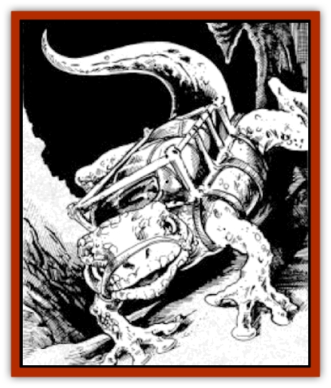

# Lizard - Subterranean - Toril

| Statistic | **Lizard, Subterranean (Toril)** |
| --- | --- |
| **Activity Cycle:** | Any |
| **Alignment:** | (Lawful) neutral |
| **Armor Class:** | 3 |
| **Climate/Terrain:** | Any |
| **Damage/Attack:** | 2-12 |
| **Diet:** | Omnivore |
| **Frequency:** | Common (subterranean); rare (surface) |
| **Hit Dice:** | 8 |
| **Intelligence:** | Low (5-7) |
| **Magic Resistance:** | Nil |
| **Morale:** | Elite (13) |
| **Movement:** | 9, Sw 15 |
| **No. Appearing:** | 1-4 (domesticated: 1-20) |
| **No. of Attacks:** | 1 |
| **Organization:** | Solitary or packs |
| **Size:** | H (15'+ long, tail an additional 8-12') |
| **Special Attacks:** | Nil |
| **Special Defenses:** | See below |
| **THAC0:** | 13 |
| **Treasure:** | Q (stomach) + whatever carried |
| **XP Value:** | 1,400 |

Subterranean lizards, also called pack lizards, resemble [[Iguana_Giant|giant iguanas]], except that they are a dull, mottled olive-gray in hue, and are unusually broad of body (averaging 22-24' in overall length, they are always around 10' wide). As their name suggests, they are used as draft animals by all intelligent races traveling in rocky or underground terrain.

**Combat:** Pack lizards are placid, slow-moving beasts who seldom attack anything unless attacked first. They will eat anything, including carrion, and seem especially fond of snake-flesh and the various yellow-petaled flowers that grow in meadows (such as dandelions, sunflowers, buttercups, and sunstars). Pack lizards have long, sticky probing tongues, and in battle bite down with crushingly-powerful jaws (if their teeth were larger, sharper fangs, they would do far more damage). They have been known to bite through armor and wooden doors, if hungry enough, and given time to think about it. If a pack lizard bites down in such a way that a metal or wooden object is at risk (a flat surface usually is not, but one that sticks up, or has a projecting corner certainly is), the item should make a saving throw vs. crushing blow. If the lizard deliberately attacks the item (i.e. to bite the head off a spear that is jabbing it, or to get through a cell door to food beyond), the saving throw is made at -2.

Pack lizards are immune to most known poisons, and regenerate physical damage at the rate of 1 hit point every 3 turns. Heat- and fire-based attacks inflict only half damage on them, but cold-based attacks do them an extra point of damage per die. Pack lizards have sticky pads on their splay-toed feet. These flexible, vulnerable digits are covered by claw-like, horny protective sheaths.but pack lizards do not in fact have claws, and cannot rake anything in combat for damage. Their sticky feet allow them to travel on cavern (and room!) walls and ceilings just as they do on floors, retaining their grip even when carrying heavy loads.

Pack lizards able to knock down and put a foot on a M-sized or smaller opponent can hold on, so that bite attacks are automatically successful (no attack roll necessary; roll only for damage). On the round that follows, the lizard does not bite, but does 4d4 crushing damage. Allow the pinned victim (who can attack only at -3) a Strength Check (at the usual 4-point penalty) to wriggle free of the crushing weight; success on any round means only half damage is taken. The lizard typically goes on crushing, at 4d4 damage per round, for 6 to 8 rounds (or until it successfully makes another Intelligence Check), when it stops to see what's left - and bite it.

**Habitat/Society:** Left to themselves, pack lizards tend to be lazy, placid beasts who lie about in grassy meadows devouring grass and carrion at leisure, crawling into burrows or cave-refuges to escape biting winter cold, and who venture down into the depths when breezes bring them the reek of much carrion - after a large battle in the Underdark, for instance.

However, they seldom, if ever, are left to themselves. Faster, more intelligent creatures are always hunting them down for food, or enslaving them. Few are left aboveground, these days, save in the remotest desert areas. Instead, they dwell in burrows and caverns around volcanic areas, basking in the heat of the earth, and eating whatever they can find (such as [[Fungus|violet fungi]], [[Ooze_Slime_Jelly_II|gelatinous cubes]], and other plants or creatures that most beings find poisonous or corrosive). Pack lizards mate seldom, but remain together in stable pairs for years when they do, raising litters of 2d4 young at a time from rubbery-shelled eggs, and having new litters twice or thrice a year.

**Ecology:** Pack lizards can haul awesome loads in quite cold and damp conditions, so long as they have sufficient time to soak up the heat of the full sun (in surface-world deserts or on sun-baked mountain rocks, for example), or that of deep, close-flowing lava. Their flesh, which resembles the densest, whitest pork, is eaten by many creatures, including [[Elf_Drow|drow]] and humans, and is especially prized by [[Orc|orcs]]. Pack lizard ichor is a prized ingredient in *potions of vitality*, and the essence derived from their boiled feet is valued in the making of *sovereign glue*.

---
## Discovery & Documentation

**Source Publication:** Menzoberranzan (1992)
**Campaign Setting:** Forgotten Realms
**Author(s):** Greenwood, Niles, and Salvatore

### Other Creatures Found in This Source Book
   * [[Alhoon|Alhoon]]
   * [[Cloaker_Lord|Cloaker Lord]]
   * [[Foulwing|Foulwing]]
   * [[Riding_Lizard|Riding Lizard]]
   * [[Wingless_Wonder|Wingless Wonder]]
