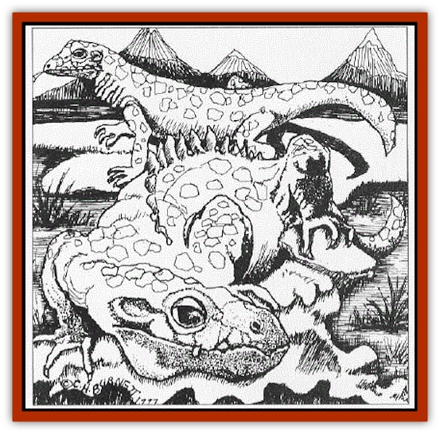

# Lizard - Tundra

| Statistic | **Lizard, Tundra** |
| --- | --- |
| **Activity Cycle:** | Any |
| **Alignment:** | Neutral |
| **Armor Class:** | 4 |
| **Climate/Terrain:** | Subarctic, arctic |
| **Damage/Attack:** | 1-3/1-3/1-6 |
| **Diet:** | Omnivore |
| **Frequency:** | Rare |
| **Hit Dice:** | 3 |
| **Intelligence:** | Animal (1) |
| **Magic Resistance:** | Nil |
| **Morale:** | Unsteady (5-7) |
| **Movement:** | 15 |
| **No. Appearing:** | 1 |
| **No. of Attacks:** | 3 |
| **Organization:** | Solitary |
| **Size:** | S (3-4') |
| **Special Attacks:** | See below |
| **Special Defenses:** | Camouflage |
| **THAC0:** | 14 |
| **Treasure:** | Nil |
| **XP Value:** | 420 |

Tundra lizards arc warm-blooded creatures that roam the cold regions of the north. To survive the bitter chill, tundra lizards are covered in thick plates of leathery skin and have a special heat-draining ability. During the winter, their skin is white along their backs and legs, and pale green on their stomachs. In areas where the snow melts during the short summers, tundra lizards turn a mottled brown and white. Because of their coloration, they are 95% undetectable by all but the most observant. Rangers and those who are familiar with the tundra lizard (i.e., those living in the arctic or subarctic climates) have 20% bonus to detect.

Tundra lizards have long snouts to burrow into mouse and rabbit warrens, and long claws to rip open dens. Despite their dense skin, they are quick and agile. They have a keen sense of smell similar to that of [[Dog|dogs]], and almond-shaped silver eyes with 60' infravision. Their tails are short, but their limbs are long and muscular. Males have a ridge of small spikes along the center of their backs and are usually larger than females.

Though meat is their preferred meal, tundra lizards eat almost anything, even refuse left by people or carcasses from another's kill. They will not, however, eat rotting or poisoned meat.

**Combat:** Tundra lizards drain heat from other warm-blooded mammals to survive in the harsh terrain of the north, storing the heat as energy. Excellent stalkers, tundra lizards track their prey across the snow-covered valleys and mountains until an opportunity arises to use their special ability. Tundra lizards emit a pleasant smell similar to lavender from their pores, causing sleep to all air-breathing creatures within a 10' radius. They can produce this effect four times per day. Target creatures receive a -2 to their saves. When a tundra lizard collects warmth from a host body, it drains 1 point of Constitution and 1d3 hp. It must touch the victim to absorb the heat. This collection takes two rounds, during which time the tundra lizard does not move. If forced to move within this time period, it does so at half the movement rate. Tundra lizards must receive a minimum of 4 Constitution points and 4 hp per day to sustain their metabolisms, sometimes draining all they need from one victim. Constitution points lost to tundra lizards are regained at 1 point per week; hit points lost can be regained normally or by any cure spell or potion.

Anything less than the minimum daily drain causes the lizard to weaken, shiver, and move sluggishly. After three days without draining, they freeze and die. This harsh departure from the world has earned them their name.

Tundra lizards do not attack creatures larger than themselves unless cornered, preferring to trip attackers and run away. A trip is a special attack, rolled as a called shot against base AC 10, modified for Dexterity and magic. If tripped, a creature must spend one round regaining its footing. If no other course than fighting presents itself, tundra lizards attack fiercely with long claws and sharp teeth.

**Habitat/Society:** Tundra lizards are territorial and roam over vast quantities of land during their dally travels. They are active through spring, summer and fall but go into semi-hibernation during winter. Daytime is their preferred time to hunt, though they have been known to attack at night as well. Tundra lizards are loners except when mating or rearing their young. They mate once a year during the early fall. The female carefully digs a den, concealing the entrance with rocks, and gives birth to 3-4 live young in the spring. After the young are one month old, the father leaves the den while the mother continues to protect and feed her young. The mother never brings a kill to the den. Instead she regurgitates the food for the youngsters. The juveniles leave the nest after eight months to find their own territory. Tundra lizards live between 10-15 years.

**Ecology:** Tundra lizards are quick to pick off the old and sick, so they are not prone to overfeeding in one area. Few animals will attack a tundra lizard, partially because their tough hides are difficult to penetrate and partially because when eaten, the sacs which hold the sleep poison burst, putting the predator into a deep slumber. In the harsh world of the north, an unguarded sleeping creature is an easy meal.

Their hides are good for making small shields, pauldrons, and breastplates but are too hard for other apparel. Tundra lizards are also killed for their sleep sacs. Alchemists use these sacs to create very potent sleep potions.

Tundra lizards are ssometimes given as "gifts" to an unwary opponent as a means to weaken or even kill the opponent without anyone the wiser.

---
## Discovery & Documentation

**Source Publication:** Dragon Magazine Annual 2 -1997 (1997)
**Campaign Setting:** Dragon Magazine
**Author(s):** Belinda G. Ashley, C.H. Burnett

### Other Creatures Found in This Source Book
   * [[Growler|Growler]]
   * [[Skeleton_Crystal|Skeleton, Crystal]]
