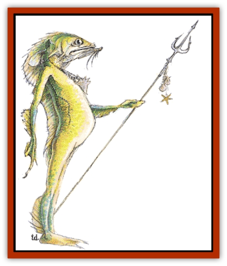

# Locathah

| Statistic | **Locathah** |
| --- | --- |
| **Activity Cycle:** | Any |
| **Alignment:** | Neutral |
| **Armor Class:** | 6 |
| **Climate/Terrain:** | Tropical and subtropical/Coastal waters |
| **Damage/Attack:** | By weapon |
| **Diet:** | Omnivore |
| **Frequency:** | Rare |
| **Hit Dice:** | 2 |
| **Intelligence:** | Very (11-12) |
| **Magic Resistance:** | Nil |
| **Morale:** | Average (9) |
| **Movement:** | 1, Sw 12 |
| **No. Appearing:** | 20-200 |
| **No. of Attacks:** | 1 |
| **Organization:** | Clan |
| **Size:** | M (5'+ tall) |
| **Special Attacks:** | Nil |
| **Special Defenses:** | Nil |
| **THAC0:** | 19 |
| **Treasure:** | A |
| **XP Value:** | 35 |

The locathah are a humanoid race of aquatic nomads that roams warm coastal waters.

A typical locathah stands 5 to 6 feet tall and weighs 150 to 200 pounds. The skin is covered in fine but tough scales. The scales vary in color from a ivory yellow on the stomach and neck to a pale yellow on the rest of the body. The fins of their ears and spine are ocher. The ear fins enhance hearing while the large eyes are designed to enhance underwater vision. The only way to distinguish males from females is a vertical ocher stripe marking the egg sac. On the surface, locathah have a typically fish-like smell. They speak their own language; 10% also speak [[Merman|merman]], [[Hobgoblin|koalinth]], or other aquatic languages.

**Combat:** The intelligent locathah have developed tactics that enable them to beat their deadlier rivals. They always operate in teams, the larger the better. Furthermore, when away from their homes they ride [[Eel|giant eels]] that act as both mounts and allies.

A typical locathah force is armed as follows:

<ul><li>Lance - 20%</li><li>Crossbow - 30%</li><li>Trident - 30%</li><li>Short sword - 20%</li></ul>Since a locathah lacks claws or teeth, it cannot do damage if it is disarmed. If that happens, it will either grapple a foe (if armed locathah are present), look for weapons, or flee. Locathah only battle to the death if cornered or if their home is threatened.

**Habitat/Society:** Locathah have developed a society similar to that of surface humans. They have a well-developed hunter-gatherer society and a strong sense of territory. Locathah make their lairs in rocks carved into castle-like strongholds. These aquatic castles are very similar to their surface counterparts. Openings are protected by stout doors, shutters, or coral bars. Often 4d4 moray eels are used as guardbeasts. There is a 50% chance that Portuguese man-o-war jellyfish may be used as traps. A herd of giant eels is kept at the edge of each stronghold.

Locathah have a communal society organized in tribes of 20 to several hundred. Each band of forty locathah has a leader (18 hit points, treat as a 4th-level fighter) and four assistants (14 hit points, treat as 3rd-level fighters). Clans of more than 120 locathah are led by a female chieftain (22 hit points, treat as a 5th-level fighter) accompanied by 12 guards (12-14 hit points, treat as 3rd-level fighters).

Clan chieftains are prolific egg layers. Eggs are gathered into well-guarded nurseries where they hatch after five to six months. Hatchlings are raised communally but each is assigned a "parent", a non-warrior adult that takes personal responsibility for that hatchling.

Locathah shamans are priests of up to the 3rd level.

**Ecology:** Locathah are omnivorous. They have both aquatic farmers and hunter-gatherers that provide a varied diet for their clan brethren. The locathah's stone-age technology is limited to manufacturing weapons, tools, and ornaments from available materials. More advanced or magical items are scavenged from sunken wrecks, invaders, and drowning victims. Although they defend their territories against hostile invaders, locathah cooperate with nonhostile visitors, especially traders. Locathan coral carvings and jewelry are highly valued by art collectors and are traded for forged metals, ceramics, and durable magical items. Locathah can be hired to assist travelers in their realm. They also collect tolls from fishermen using locathah territorial waters.

Locathah never voluntarily leave the water. They are almost helpless on land. They are limited to slow crawls because they are unused to supporting their own weight. The use of magic to fly or levitate will negate this helplessness. They risk swift suffocation as their gills dry out; after ten turns, a surfaced locathah suffers 1 point of damage each round. If the locathah immerses itself in water, the damage is halted.

Locathah always try to recover captive locathah or their bodies. If such are detected aboard a ship, other locathah might first demand the return of their kin or simply sink the boat by carving into its bottom.

---
## Discovery & Documentation

**Source Publication:** MC2 Volume II (1993)
**Campaign Setting:** Advanced Dungeons & Dragons 2nd Edition
**Author(s):** Jay Batista, Scott Bennie, Grant Boucher, William W. Connors, Steve Gilbert, Heike Kubasch, James Lowder, David Edward Martin, Bruce Nesmith, Jean Rabe, Rick Swan, John J. Terra, Gary L. Thomas

### Other Creatures Found in This Source Book
   * [[Ant|Ant]]
   * [[Ant_Lion_Giant|Ant Lion, Giant]]
   * [[Ape_Carnivorous|Ape, Carnivorous]]
   * [[Baboon|Baboon]]
   * [[Badger|Badger]]
   * [[Barracuda|Barracuda]]
   * [[Beetle_Giant|Beetle, Giant]]
   * [[Bulette|Bulette]]
   * [[Bullywug|Bullywug]]
   * [[Dwarf_Duergar|Dwarf, Duergar]]
   * [[Dwarf_Gully|Dwarf, Gully]]
   * [[Eagle|Eagle]]
   * [[Eel|Eel]]
   * [[Elemental_Air_Kin|Elemental, Air Kin]]
   * [[Elemental_Water_Kin|Elemental, Water Kin]]
   * [[Elemental_Water_Kin_Water_Weird|Elemental, Water Kin, Water Weird]]
   * [[Firestar|Firestar]]
   * [[Firetail|Firetail]]
   * [[Fish_Giant|Fish, Giant]]
   * [[Frog|Frog]]
   * [[Gorgon|Gorgon]]
   * [[Hawk|Hawk]]
   * [[Heucuva|Heucuva]]
   * [[Hippocampus|Hippocampus]]
   * [[Hippogriff|Hippogriff]]
   * [[Kelpie|Kelpie]]
   * [[Kenku|Kenku]]
   * [[Killmoulis|Killmoulis]]
   * [[Kuo-Toa|Kuo-Toa]]
   * [[Lamia|Lamia]]
   * [[Lammasu|Lammasu]]
   * [[Lamprey|Lamprey]]
   * [[Leech|Leech]]
   * [[Leprechaun|Leprechaun]]
   * [[Leucrotta|Leucrotta]]
   * [[Lycanthrope_Wereboar|Lycanthrope, Wereboar]]
   * [[Lycanthrope_Werefox|Lycanthrope, Werefox]]
   * [[Mammal_Minimal|Mammal, Minimal]]
   * [[Mammal_Small|Mammal, Small]]
   * [[Mimic|Mimic]]
   * [[Morkoth|Morkoth]]
   * [[Muckdweller|Muckdweller]]
   * [[Myconid|Myconid]]
   * [[Naga|Naga]]
   * [[Obliviax|Obliviax]]
   * [[Octopus_Giant|Octopus, Giant]]
   * [[Otyugh|Otyugh]]
   * [[Piranha|Piranha]]
   * [[Plant_Dangerous_I|Plant, Dangerous I]]
   * [[Plant_Intelligent|Plant, Intelligent]]
   * [[Poltergeist|Poltergeist]]
   * [[Porcupine|Porcupine]]
   * [[Rat_Osquip|Rat, Osquip]]
   * [[Roc|Roc]]
   * [[Roper|Roper]]
   * [[Rot_Grub|Rot Grub]]
   * [[Rust_Monster|Rust Monster]]
   * [[Sahuagin|Sahuagin]]
   * [[Sea_Lion|Sea Lion]]
   * [[Sea_Horse_Giant|Sea Horse, Giant]]
   * [[Shambling_Mound|Shambling Mound]]
   * [[Shark|Shark]]
   * [[Sphinx|Sphinx]]
   * [[Squid_Giant|Squid, Giant]]
   * [[Stirge|Stirge]]
   * [[Swanmay|Swanmay]]
   * [[Tarrasque|Tarrasque]]
   * [[Tasloi|Tasloi]]
   * [[Triton|Triton]]
   * [[Troglodyte|Troglodyte]]
   * [[Urchin|Urchin]]
   * [[Urd|Urd]]
   * [[Weasel|Weasel]]
   * [[Wolverine|Wolverine]]
   * [[Yellow_Musk_Creeper|Yellow Musk Creeper]]
