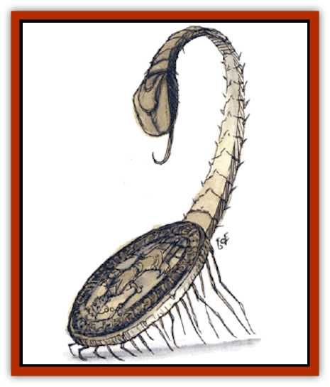

# Lock Lurker

| Statistic | **Lock Lurker** |
| --- | --- |
| **Activity Cycle:** | Any |
| **Alignment:** | Neutral |
| **Armor Class:** | 3 |
| **Climate/Terrain:** | Any land |
| **Damage/Attack:** | 1 (bite) or 1d4+5 (sting) |
| **Diet:** | Carnivore |
| **Frequency:** | Rare |
| **Hit Dice:** | 1+3 |
| **Intelligence:** | Low (5-7) |
| **Magic Resistance:** | Nil |
| **Morale:** | Elite (13-14) |
| **Movement:** | 9 |
| **No. Appearing:** | 1 |
| **No. of Attacks:** | 1 |
| **Organization:** | Solitary |
| **Size:** | T (1&rdquo; diameter, 1&rdquo;-long tail) |
| **Special Attacks:** | Paralyzing venom |
| **Special Defenses:** | Partial etherealness |
| **THAC0:** | 19 |
| **Treasure:** | Nil |
| **XP Value:** | 175 |

The tiny lock lurker is the bane of thieves and is often placed as a guard against such infiltrators. It looks like a coin - a cold, hard, coppery or bronze disk (25% are silver or golden). It has two rows of tiny, retractable legs on its underside, surrounding a razor-sharp iris of teeth, and a lightning-fast stinger that can be up to a foot long, but this stinger is usually on the Ethereal Plane, invisible to observers on the Prime Material.

A human handling a lurker often thinks he has picked up a smooth, heavy coin until its sting advises him otherwise. Lurkers have been known to be carried with other coins until reaching a place where easy targets will come near. Unless it strikes metal, the lurker's bite and sting are silent.

**Combat:** A lurker's teeth can bite through hide, hair, or leather armor, but not metal. The stinger can attack creatures in the Ethereal Plane and materializes on the Prime Material Plane only when the lurker launches an attack; that strike is powerful enough to pierce any armor and stun opponents of less than man size for 1-2 rounds. It inflicts damage and injects a venom into the victim's bloodstream which *slows* him (per the wizard spell) on the round following the strike. During that round, the victim's body reacts to the poison, prompting a saving throw. If the save is successful, the victim is slowed for a second round, then recovers fully. If the save fails, the victim is immediately paralyzed for 1d6 hours, passes into a 1d2-round slowed state, then recovers. This paralysis is a rigid muscle lock affecting all extremeties. A victim cannot be easily manipulated and can easily be hurt if moved. The lurker can sting 40+2d4 times per day without exhausting its poison. Venom and any food ingested by a lurker are both held in expandable body sacks on the Ethereal Plane, transferred to and from the Prime Material in a way not fully understood.

The stinger can be attacked on the Prime Material only if materialized there. On the Ethereal, all parts of a lurker can be attacked unless it fully enters the Prime Material (requires one round, allowing an ethereal creature an unchallenged attack).

A lurker can transfer body material between the two planes despite any physical or magical restraints placed on it, but can never fully withdraw into the Ethereal Plane. Lurker attacks and venom have the same effects on both planes, and lurkers have 60-foot-range normal and infravision on both planes. Lurkers can slowly regenerate lost or damaged body parts.

**Habitat/Society:** Lock lurkers are so named because they are often placed as guards on chests and doors, to strike unwary interlopers through keyholes. Assassins have placed them under inkwells and pillows, in boots, and in other places convenient to a strike (usually so the paralyzed target can be slain easily, with no alarm being raised).

Lurkers are hermaphroditic; whenever two adults meet, they mate and go their separate ways. One to four months later, each lurker lays an egg sack of 1d12x10 tiny eggs, 60% of which are fertile. Untended, these hatch in 1d6 weeks, typically producing 3d6 offspring. These eat the unhatched eggs (and sometimes each other) until they are fully mobile, then wander off in search of food. They never fight other lurkers, and they mature within seven years.

**Ecology:** Lurkers are usually placed as guards, but when one escapes into the wild, it does not so much hunt as lurk. Like some [[Spider|spiders]], lurkers seem to prefer to lair in civilized areas, preying on insects, rodents, and other small pests.

Lurker venom is valued as an ingredient in inks, potions, and processes concerned with *slow* effects. Their bodies are a preferred ingredient in *oil of etherealness*, too, and a largely intact body is worth 2 gp (6 gp if the stinger is intact). Lock lurker venom (a clear, gummy fluid that smells like seaweed) brings about 10 gp per flask. Lurker egg sacks bring about 25 gp on the open market.

---
## Discovery & Documentation

**Source Publication:** Monstrous Compendium, 1994 Annual, Volume 1 (1995)
**Campaign Setting:** Advanced Dungeons & Dragons 2nd Edition
**Author(s):** David Wise

### Other Creatures Found in This Source Book
   * [[Abyss_Ant|Abyss Ant]]
   * [[Achaierai|Achaierai]]
   * [[Afanc|Afanc]]
   * [[Al-Jahar|Al-Jahar]]
   * [[Baelnorn|Baelnorn]]
   * [[Baneguard|Baneguard]]
   * [[Banelar|Banelar]]
   * [[Bird_Talking|Bird, Talking]]
   * [[Blazing_Bones|Blazing Bones]]
   * [[Campestri|Campestri]]
   * [[Caniquine|Caniquine]]
   * [[Cat_Winged|Cat, Winged]]
   * [[Crypt_Servant|Crypt Servant]]
   * [[Death's_Head_Tree|Death's Head Tree]]
   * [[Dog_Saluqi|Dog, Saluqi]]
   * [[Dragon_Electrum|Dragon, Electrum]]
   * [[Dragon_Fang|Dragon, Fang]]
   * [[Dragon_Linnorm_Corpse_Tearer|Dragon, Linnorm, Corpse Tearer]]
   * [[Dragon_Linnorm_Dread|Dragon, Linnorm, Dread]]
   * [[Dragon_Linnorm_Flame|Dragon, Linnorm, Flame]]
   * [[Dragon_Linnorm_Forest|Dragon, Linnorm, Forest]]
   * [[Dragon_Linnorm_Frost|Dragon, Linnorm, Frost]]
   * [[Dragon_Linnorm_Gray|Dragon, Linnorm, Gray]]
   * [[Dragon_Linnorm_Land|Dragon, Linnorm, Land]]
   * [[Dragon_Linnorm_Midgard|Dragon, Linnorm, Midgard]]
   * [[Dragon_Linnorm_Rain|Dragon, Linnorm, Rain]]
   * [[Dragon_Linnorm_Sea|Dragon, Linnorm, Sea]]
   * [[Dragon_Neutral_Jacinth|Dragon, Neutral, Jacinth]]
   * [[Dragon_Neutral_Jade|Dragon, Neutral, Jade]]
   * [[Dragon_Neutral_Pearl|Dragon, Neutral, Pearl]]
   * [[Dread|Dread]]
   * [[Dragon-kin|Dragon-kin]]
   * [[Elemental_Earth_Kin_Chrysmal|Elemental, Earth Kin, Chrysmal]]
   * [[Elemental_Earth_Kin_Earth_Weird|Elemental, Earth Kin, Earth Weird]]
   * [[Elemental_Fire_Kin_Azer|Elemental, Fire Kin, Azer]]
   * [[Elemental_Sandman|Elemental, Sandman]]
   * [[Elemental_Wind_Walker|Elemental, Wind Walker]]
   * [[Elemental_Vermin|Elemental Vermin]]
   * [[Feystag|Feystag]]
   * [[Flame_Skull|Flame Skull]]
   * [[Foulwing|Foulwing]]
   * [[Gambado|Gambado]]
   * [[Garbug|Garbug]]
   * [[Genie_Tasked_Administrator|Genie, Tasked, Administrator]]
   * [[Genie_Tasked_Deceiver|Genie, Tasked, Deceiver]]
   * [[Genie_Tasked_Harim_Servant|Genie, Tasked, Harim Servant]]
   * [[Genie_Tasked_Messenger|Genie, Tasked, Messenger]]
   * [[Genie_Tasked_Miner|Genie, Tasked, Miner]]
   * [[Genie_Tasked_Oathbinder|Genie, Tasked, Oathbinder]]
   * [[Gibbering_Mouther|Gibbering Mouther]]
   * [[Gnasher|Gnasher]]
   * [[Gnasher_Winged|Gnasher, Winged]]
   * [[Golem_Brain|Golem, Brain]]
   * [[Golem_Hammer|Golem, Hammer]]
   * [[Golem_Metagolem|Golem, Metagolem]]
   * [[Golem_Spiderstone|Golem, Spiderstone]]
   * [[Gorynych|Gorynych]]
   * [[Greelox|Greelox]]
   * [[Helmed_Horror|Helmed Horror]]
   * [[Jarbo|Jarbo]]
   * [[Laraken|Laraken]]
   * [[Lich_Psionic|Lich, Psionic]]
   * [[Living_Steel|Living Steel]]
   * [[Loxo|Loxo]]
   * [[Lycanthrope_Loup_de_Noir|Lycanthrope, Loup de Noir]]
   * [[Lycanthrope_Werebadger|Lycanthrope, Werebadger]]
   * [[Lycanthrope_Werejaguar|Lycanthrope, Werejaguar]]
   * [[Lythlyx|Lythlyx]]
   * [[Magebane|Magebane]]
   * [[Marrashi|Marrashi]]
   * [[Metalmaster|Metalmaster]]
   * [[Mimic_House_Hunter|Mimic, House Hunter]]
   * [[Naga_Bone|Naga, Bone]]
   * [[Nautilus_Giant|Nautilus, Giant]]
   * [[Nightshade_Toril|Nightshade (Toril)]]
   * [[Nishruu|Nishruu]]
   * [[Noran|Noran]]
   * [[Opinicus|Opinicus]]
   * [[Ormyrr|Ormyrr]]
   * [[Parasite|Parasite]]
   * [[Pasari-Niml|Pasari-Niml]]
   * [[Plant_Vampire_Moss|Plant, Vampire Moss]]
   * [[Pteraman|Pteraman]]
   * [[Rautym|Rautym]]
   * [[Shadeling|Shadeling]]
   * [[Skum|Skum]]
   * [[Snake_Giant_Cobra|Snake, Giant Cobra]]
   * [[Snake_Stone|Snake, Stone]]
   * [[Spectral_Wizard|Spectral Wizard]]
   * [[Spell_Weaver|Spell Weaver]]
   * [[Spider_Brain|Spider, Brain]]
   * [[Suwyze|Suwyze]]
   * [[Tatalla|Tatalla]]
   * [[Tick_Heart|Tick, Heart]]
   * [[Tree_Dark|Tree, Dark]]
   * [[Tree_Singing|Tree, Singing]]
   * [[Tressym|Tressym]]
   * [[Troll_Snow|Troll, Snow]]
   * [[Tuyewera|Tuyewera]]
   * [[Ulitharid|Ulitharid]]
   * [[Undead_Dwarf|Undead Dwarf]]
   * [[Undead_Lake_Monster|Undead Lake Monster]]
   * [[Whipsting|Whipsting]]
   * [[Windghost|Windghost]]
   * [[Wolf_Dread|Wolf, Dread]]
   * [[Wolf_Stone|Wolf, Stone]]
   * [[Wolf_Vampiric|Wolf, Vampiric]]
   * [[Wraith_Shimmering|Wraith, Shimmering]]
   * [[Xantravar|Xantravar]]
   * [[Xaver|Xaver]]
