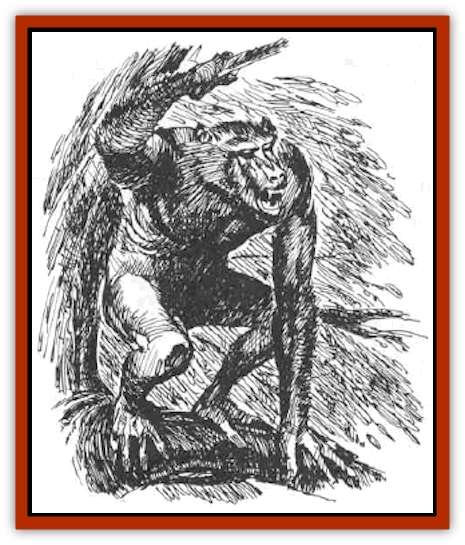
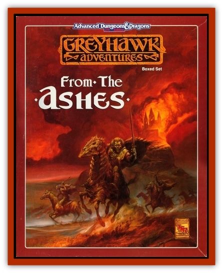

# Losel

| Statistic | **Losel** |
| --- | --- |
| **Activity Cycle:** | Nocturnal |
| **Alignment:** | Lawful (neutral) evil |
| **Armor Class:** | 7 |
| **Climate/Terrain:** | Non-tropical forest |
| **Damage/Attack:** | 1-3/1-3/1-4 |
| **Diet:** | Omnivore |
| **Frequency:** | Rare |
| **Hit Dice:** | 2 |
| **Intelligence:** | Low (5-7) |
| **Magic Resistance:** | Nil |
| **Morale:** | Unsteady (5) |
| **Movement:** | 6, 9 in trees |
| **No. Appearing:** | 3-30 |
| **No. of Attacks:** | 3 |
| **Organization:** | Tribe/troupe |
| **Size:** | M (6') |
| **Special Attacks:** | Nil |
| **Special Defenses:** | Climbing |
| **THAC0:** | 19 |
| **Treasure:** | Nil (O&times;10) |
| **XP Value:** | 35 / Leader: 120 |

Losels are an arboreal [[Orc|orc]]/[[Baboon|baboon]] cross. They resemble a primitive human in some respects, most obviously in torso shape and size, and are strong-shouldered. They can walk upright, although they typically have stooped posture, and prefer traveling in trees on all fours. They have a low, jutting forehead; their faces are somewhat orclike, with thrust-out jaws and very prominent canine teeth. Losels possess fairly sparse dark brown fur and somewhat elongated limbs. Their tails are invariably short and stubby. Their eyes are large, but are set well back into the face; they possess infravision to IO yard range. Losels do not naturally wear clothing.

**Combat:** Losels are primitive and cowardly fighters, attacking with their clawed paws and a bite attack. Losels that have been trained (see below) can throw small rocks up to 20 yards for 1-4 points of damage, and are also capable of using simple hand weapons such as clubs (but not swords or axes, for example).

 In nature, losels will normally fight only to defend their territory against an invading losel tribe, to ward off some dangerous predator, or to attack a sick or wounded creature that they can eat. They are fairly cowardly creatures, except toward beastmen, for whom they have a great antipathy. Tribes or troupes of losels are 75% likely to have a dominant male leader, with 3+3 HD, and rarely, a leader of unusual size or strength will lead a larger or combined tribe of 6-60 losels that will show unusual aggressiveness toward other species.

**Habitat/Society:** Losels are tribal creatures that keep largely to themselves. They can speak a crude form of orcish that is difficult even for speakers of that tongue to comprehend. Tribes are always male-dominated, and males typically hunt small mammals and like prey, while females collect fruits, nuts and tubers, and guard the young. Losels have no recorded religion and their tribes have no shamans or witch doctors.

Tribes are loosely territorial and use scent marking and scratchmarks on the bark of large trees to demarcate their territories. Competing tribes may fight each other, but more often, a ritual confrontation between tribal leaders, with much feigned aggression and exchange of insults, will lead to resolution of competing claims to territory.

Some tribes of losels have been captured and trained by humanoids, especially in the Vesve Forest, and by servitors of Iuz. Losels make poor troops because of their weak morale, but they can make useful guards due to their infravision and acute sense of smell.

**Ecology:** Losels have a natural lifespan of some 20-25 years. They have a gestation period of 6 months and produce 2-5 offspring per birth. Infant mortality is very high, with only one young typically surviving to maturity (three years of age). Losels are omnivores, but they will not eat carrion.

Losels hate [[Beastman|beastmen]] and plan attacks on any they encounter. They also hate and fear [[Elf|elves]], for wood elves frequently attempt to eliminate the orc-apes from their woodlands. Losels are also hunted and eaten by [[Kech|kech]].

The origins of this ape-orc cross are uncertain. They were not reported in the Flanaess until ca. CY 500, and some claim that Iuz is responsible for creating them. This remains a matter of conjecture.

---
## Discovery & Documentation

**Source Publication:** From the Ashes (1992)
**Campaign Setting:** Greyhawk
**Author(s):** Carl Sargent

### Other Creatures Found in This Source Book
   * [[Animus|Animus]]
   * [[Dwarf_Derro|Dwarf, Derro]]
   * [[Lyrannikin|Lyrannikin]]
   * [[Thassaloss|Thassaloss]]
   * [[Varrangoin|Varrangoin]]
