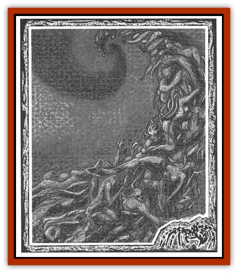

# Lost Souls

| Statistic | **Lost Souls** |
| --- | --- |
| **Activity Cycle:** | Any |
| **Alignment:** | Chaotic evil |
| **Armor Class:** | 7 |
| **Climate/Terrain:** | The Nightmare Lands |
| **Damage/Attack:** | 1d4&times;4 |
| **Diet:** | Special |
| **Frequency:** | Uncommon |
| **Hit Dice:** | 4+4 |
| **Intelligence:** | Low (5) |
| **Magic Resistance:** | Nil |
| **Morale:** | Steady (12) |
| **Movement:** | 6 |
| **No. Appearing:** | 1 |
| **No. of Attacks:** | 4 |
| **Organization:** | Solitary |
| **Size:** | M (6' tall) |
| **Special Attacks:** | Bite, fear |
| **Special Defenses:** | Regeneration |
| **THAC0:** | 17 |
| **Treasure:** | O |
| **XP Value:** | 975 |

Lost souls are the animated mortal remains of wanderers who die in the Nightmare Lands. Different types of lost souls can be encountered in both the Terrain Between and in the dreamscapes.

When a wanderer dies in the Terrain Between, there is a chance (40%) that the innate power of the land will cause the remains to rise as a [[Zombie|zombie]]-like being called a lost soul. Once a lost soul is created, it immediately searches for others of its undead kind. When it finds them, it merges with them to become a single entity made up of the tangled, rotting bodies of many dead wanderers. The faces of the dead wanderers peer out from the central mass, looking wretched and as pained as the moans they emit. Once merged, the individual wanderers are subsumed into the newly created lost soul. Physical lost souls cannot enter dreamscapes.

A wanderer who dies in a dreamscape has a chance (60%) to become a somewhat different type of lost soul. A lost soul animated in a dreamscape is more insubstantial, more [[Ghost|ghost]]like. Like the zombie lost soul, the dream lost soul seeks out others of its kind and merges to form a mass of writhing, moaning spirits. Insubstantial lost souls can move from one dreamscape to another, but they cannot survive in the Terrain Between. For every hour that an insubstantial lost soul remains in the Terrain Between, it must make a save vs. death magic to keep from waning away. Each hour beyond the first, a cumulative -2 penalty is applied to the save. Thus, after three hours the save would be made at -4.

These are the only differences between physical and insubstantial lost souls. They are the same in all other respects.

Lost souls do not communicate. A lost soul does produce an eerie groan that constists of many voices merged into one. These groans induce fear in those who hear them.

**Combat:** A lost soul fights with two claw attacks. If both claw attacks hit the same target in the same round, it makes a third attack roll to try to bite (1d6 damage). Physical lost souls cannot harm dreamers, and insubstantial lost souls cannot harm wanderers.

A lost soul regenerates hit points every round; 1 hit point is regained for every undead wanderer the lost soul consists of. As few as 2 or as many as 8 undead can merge to form a single lost soul (2d4).

For each undead wanderer inside a lost soul, increase the Hit Dice by 1+1, damage by +1. AC by 1, THAC0 by 1, and number of attacks by 1. Therefore, the most powerful lost soul has 8+8 HD, inflicts 1d4+8 damage per attack, has an AC of 3, a THAC0 of 13, and makes 8 attacks.

**Habitat/Society:** Lost souls roam the Nightmare Lands, seeking living wanderers to add to their tangled masses until they reach their maximum expansion (8 wanderers). While each tortured member of a lost soul has a fleeting memory of its previous existence, the undead creature has a single mind full of chaotic images and hatred of the living.

**Ecology:** Lost souls have no place in the ecology. They go into a frenzy when they see living beings, seeking to reclaim the warm spark of life that they have lost. Physical lost souls are hunted by [[Arcane_Head|arcane heads]], who require flesh to sustain themselves.

---
## Discovery & Documentation

**Source Publication:** The Nightmare Lands (1995)
**Campaign Setting:** Ravenloft
**Author(s):** Shane Lacy Hensley

### Other Creatures Found in This Source Book
   * [[Arcane_Head|Arcane Head]]
   * [[Dreamweaver|Dreamweaver]]
   * [[Dream_Spawn_General_Information|Dream Spawn, General Information]]
   * [[Dream_Spawn_Greater_Ennui|Dream Spawn, Greater, Ennui]]
   * [[Dream_Spawn_Lesser_Morph|Dream Spawn, Lesser, Morph]]
   * [[Ghost_Dancer_The|Ghost Dancer, The]]
   * [[Human_Abber_Shaman|Human, Abber Shaman]]
   * [[Hypnos|Hypnos]]
   * [[Morpheus|Morpheus]]
   * [[Mullonga|Mullonga]]
   * [[Nightmare_Court_The|Nightmare Court, The]]
   * [[Nightmare_Man_The|Nightmare Man, The]]
   * [[Night_Terror_Mandalain|Night Terror, Mandalain]]
   * [[Rainbow_Serpent_The|Rainbow Serpent, The]]
