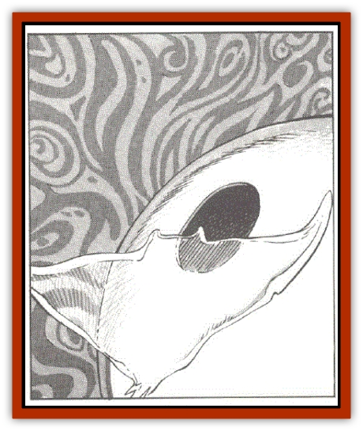

# Lumineaux

| Statistic | **Lumineaux** |
| --- | --- |
| **Activity Cycle:** | Any |
| **Alignment:** | Unknown |
| **Armor Class:** | 2 |
| **Climate/Terrain:** | Phlogiston |
| **Damage/Attack:** | See below |
| **Diet:** | Special |
| **Frequency:** | Very rare |
| **Hit Dice:** | 20 |
| **Intelligence:** | Exceptional (15-16) |
| **Magic Resistance:** | 50% |
| **Morale:** | Fanatic (17) |
| **Movement:** | 18 |
| **No. Appearing:** | 1-2 |
| **No. of Attacks:** | � |
| **Organization:** | Solitary |
| **Size:** | G |
| **Special Attacks:** | See below |
| **Special Defenses:** | See below |
| **THAC0:** | � |
| **Treasure:** | Nil |
| **XP Value:** | 9,000 |

The lumineaux are vast, diaphanous cretures that inhabit the flow. Some sages liken them to the giant [[Ray|mantas]] of earthly seas. To others, they are like white cells gliding through the lifeblood of the cosmos, filtering potential impurities.

Lumineaux seek out portals to the crystal sphere, and then wrap themselves over the shell like a patch on a ball. They are virtually invisible to spacefarers. Phlogiston within their cells creates a rainbow-colored camouflage for their semitransparent body.

**Combat:** Lumineaux feed on memories. They actively channel life forms through a convoluted series of permeable membranes, slowly draining away levels of experience. The drain is only temporary, but among the uninitiated, it can prompt hasty and foolish responses.

To extract memories, a lumineaux appears to create a kind of telepathic link with any intelligent life form passing through its body. When fixed on an intriguing memory, the lumineaux deadens that portion of the mind and "copies" the information. As a result, the victim loses 1 experience level per turn of drain. The victim may sense some confusion, but it must roll a successful Wisdom check to realize that memories and experience are waning. Of course, spellcasters whose levels are dropping may notice more immediate results when they find their available spells reduced in accordance with their loss in level. Other penalties to abilities that are based on experience level also apply. The lumineaux usually does not intend to kill its captives, and it drains them to a minimum of 1 level.

Lumineaux can absorb travelers who are entering or leaving a crystal sphere. Normal passage through the creature lasts 2d4+2 turns. The speed or size of the ship is not a factor. The ship is reduced to combat speed and can perform combat maneuvers, but such maneuvers have little effect on the duration of the trip through the creature's strange digestive tract. Only one maneuver alters the trip: in full reverse, a ship with an SR above 6 can effectively stall itself. As the ship nears the lumineaux's outer membrane, the creature forcefully expels it.

Just as humans are mostly water, lumineaux consist mainly at the phlogiston's mysterious, flammable ether. As a result, any incendiary attack, magical or otherwise, has the same fiery effect as such assaults have in the phlogiston itself.

Attempts to form a spiritual link with the creature are also dangerous. Any attempt to read the creature's mind or detect its alignment calls for a saving throw vs. paralyzation (at the character's current level). A failed saving throw means the character is overwhelmed by the barrage of thoughts, and he suffers 2d10 points of damage.

Other spells and attacks work normally against the lumineaux. The best defense, however, may be no defense. The drain in experience level is only temporary; levels return at the rate of 1 per day as soon as the ship leaves the lumineaux.

More dangerous than the lumineaux itself are the scavengers that may lie in waiting in the phlogiston, hoping for easy, low-level prey. A crew with [[Scavver|scavvers]] traveling in its air pocket has similar cause for worry. Scavvers are not intelligent enough to be weakened by the lumineaux's attention. Lager scavvers, which are aggressive, may attack the ship when its crew is most vulnerable.

If viciously attacked, a lumineaux tries to consume its attacker repeatadly, draining experience levels until its attacker no longer poses a threat. If that means killing its opponent, so be it.

**Habitat/Society:** Not much is known about the lumineaux. They are even rarer than the portals they guard. Sages who believe that greater divine forces govern the known gods offer the most plausible concept. They propose that the ultimate celestial powers may use the lumineaux as sentries, whose purpose is to monitor the activities within a crystal sphere.

Nearly every encounter with a lumineaux to date has involved a solitary creature. Occasionally, however, two have been known to guard a portal. Sages suggest that such junctions indicate a definite mating cycle.

**Ecology:** Because their cells are filled with phlogiston, lumineaux are found only in the flow.

---
## Discovery & Documentation

**Source Publication:** MC7 Spelljammer Appendix I (1990)
**Campaign Setting:** Advanced Dungeons & Dragons 2nd Edition
**Author(s):** various

### Other Creatures Found in This Source Book
   * [[Aartuk|Aartuk]]
   * [[Albari|Albari]]
   * [[Ancient_Mariner|Ancient Mariner]]
   * [[Argos|Argos]]
   * [[Beholder_Abomination_Astereater|Beholder (Abomination), Astereater]]
   * [[Blazozoid|Blazozoid]]
   * [[Chattur|Chattur]]
   * [[Chevall|Chevall]]
   * [[Clockwork_Horror|Clockwork Horror]]
   * [[Colossus|Colossus]]
   * [[Delphinid|Delphinid]]
   * [[Dizantar|Dizantar]]
   * [[Dog|Dog]]
   * [[Dog_Bog_Hound|Dog, Bog Hound]]
   * [[Esthetic|Esthetic]]
   * [[Focoid|Focoid]]
   * [[Fractine|Fractine]]
   * [[Giant_Spacesea|Giant, Spacesea]]
   * [[Golem_Furnace|Golem, Furnace]]
   * [[Golem_Radiant|Golem, Radiant]]
   * [[Gravislayer|Gravislayer]]
   * [[Grommam|Grommam]]
   * [[Hadozee|Hadozee]]
   * [[Hamster_Giant_Space|Hamster, Giant Space]]
   * [[Jammer_Leech|Jammer Leech]]
   * [[Lakshu|Lakshu]]
   * [[Lutum|Lutum]]
   * [[Mimic_Space|Mimic, Space]]
   * [[Misi|Misi]]
   * [[Moon_Rogue|Moon, Rogue]]
   * [[Mortiss|Mortiss]]
   * [[Murderoid|Murderoid]]
   * [[Nay-Churr|Nay-Churr]]
   * [[Phlog-Crawler|Phlog-Crawler]]
   * [[Plasman|Plasman]]
   * [[Plasmoid_DeGleash|Plasmoid, DeGleash]]
   * [[Plasmoid_DelNoric|Plasmoid, DelNoric]]
   * [[Plasmoid_General_Information|Plasmoid, General Information]]
   * [[Plasmoid_Ontalak|Plasmoid, Ontalak]]
   * [[Puffer|Puffer]]
   * [[Q'nidar|Q'nidar]]
   * [[Rastipede|Rastipede]]
   * [[Reigar|Reigar]]
   * [[Rock_Hopper|Rock Hopper]]
   * [[Slinker|Slinker]]
   * [[Spider_Asteroid|Spider, Asteroid]]
   * [[Spiritjam|Spiritjam]]
   * [[Survivor|Survivor]]
   * [[Syllix|Syllix]]
   * [[Symbiont_Power|Symbiont, Power]]
   * [[Vine_Infinity|Vine, Infinity]]
   * [[Wiggle|Wiggle]]
   * [[Wizshade|Wizshade]]
   * [[Wryback|Wryback]]
   * [[Zard|Zard]]
   * [[Zodar|Zodar]]
